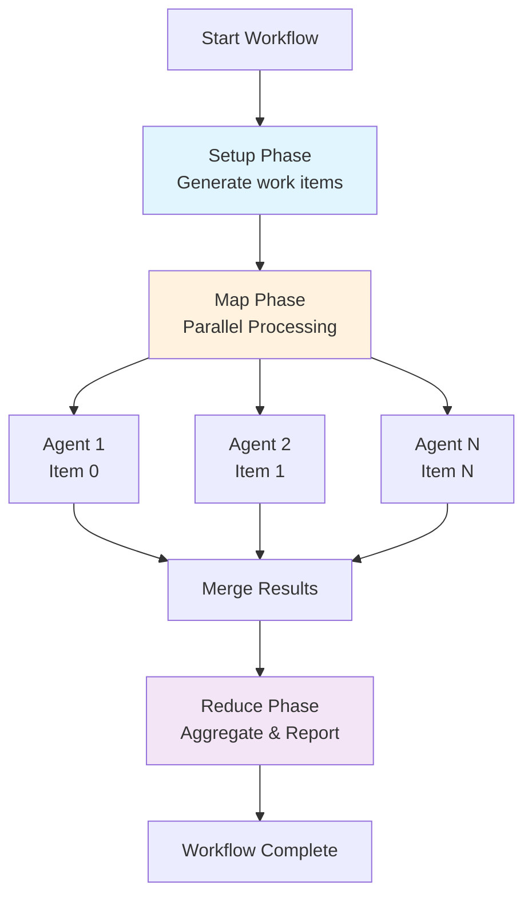
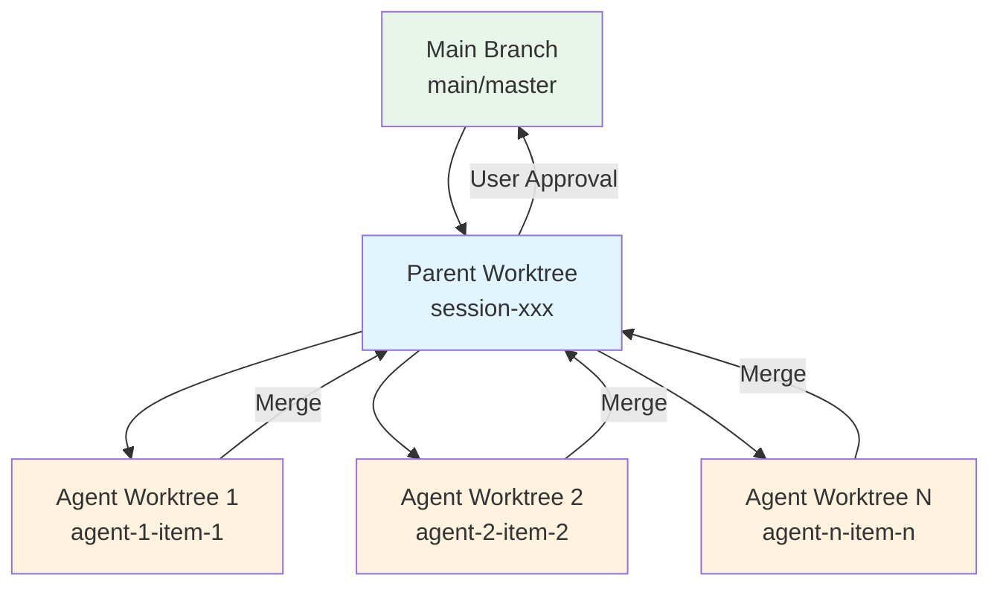
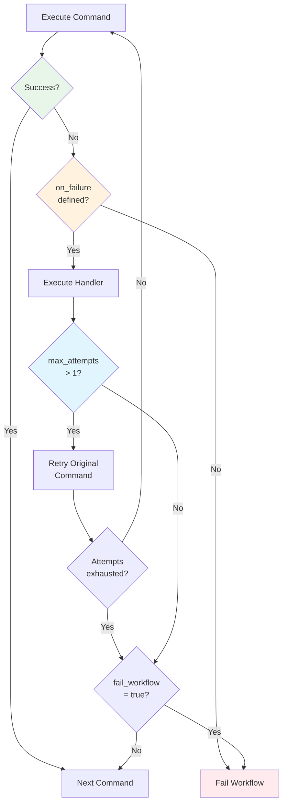
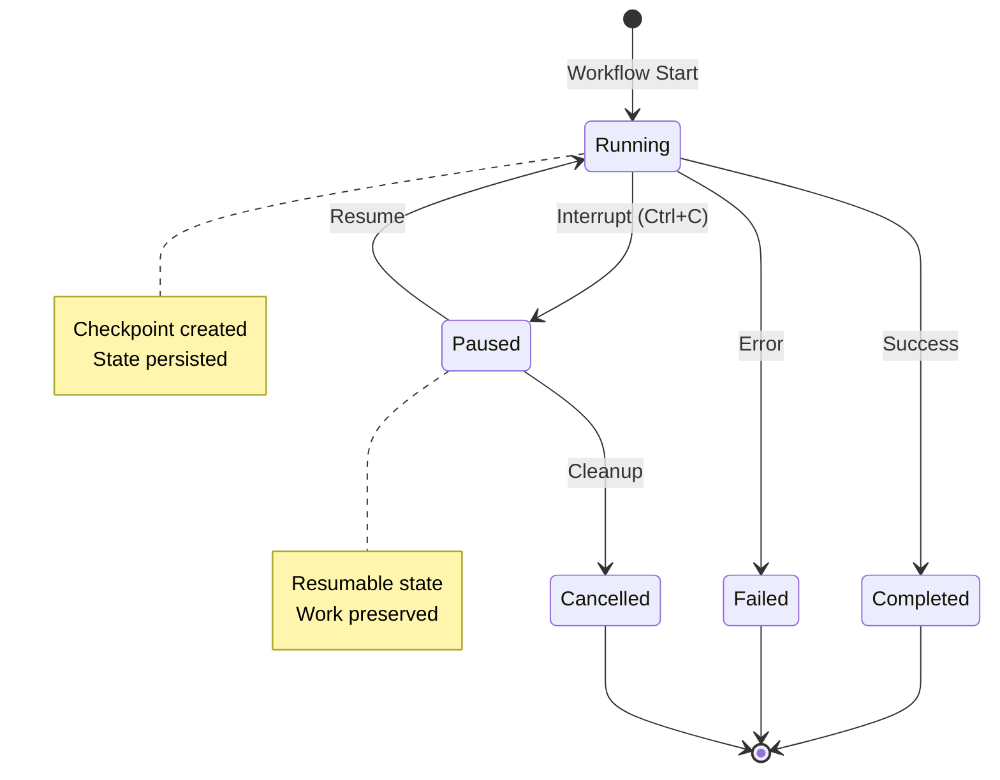

# /prodigy-enhance-mkdocs-features

Enhance MkDocs documentation with Material theme best practices and features after structural validation. This command analyzes feature usage (admonitions, diagrams, code annotations, tabs) and automatically improves documentation quality.

## Variables

- `--project <name>` - Project name (e.g., "Prodigy", "Debtmap")
- `--docs-dir <path>` - Path to mkdocs docs directory (default: "docs")
- `--output <path>` - Path to write enhancement report (default: ".prodigy/mkdocs-feature-enhancements.json")
- `--auto-fix <boolean>` - Automatically add missing features (default: false)

## Execute

### Phase 1: Understand Context

You are performing **feature enhancement** of MkDocs documentation to improve visual quality and user experience. This runs AFTER structural validation (`/prodigy-validate-mkdocs-structure`) and focuses on:

1. **Diagram opportunities** - Complex topics that need Mermaid diagrams
2. **Admonition density** - Strategic use of tips, warnings, examples
3. **Code annotations** - Inline explanations for complex code blocks
4. **Tabbed content** - Platform-specific or alternative examples
5. **Definition lists** - Technical term glossaries
6. **Collapsible sections** - Advanced content hiding

**Your Goal**: Identify underutilized MkDocs/Material features and enhance docs automatically or provide specific recommendations.

**Key Principles**:
- **Quality over quantity** - Add features where they genuinely help
- **Strategic placement** - Diagrams for architecture, admonitions for gotchas
- **User experience** - Make docs more scannable and navigable
- **Maintain accuracy** - Don't change technical content, only presentation

### Phase 2: Extract Parameters

```bash
PROJECT_NAME="${project:?Error: --project is required}"
DOCS_DIR="${docs_dir:-docs}"
OUTPUT="${output:-.prodigy/mkdocs-feature-enhancements.json}"
AUTO_FIX="${auto_fix:-false}"
```

**Validate Inputs:**
```bash
if [ ! -d "$DOCS_DIR" ]; then
    echo "Error: MkDocs directory not found: $DOCS_DIR"
    exit 1
fi

if [ ! -f "mkdocs.yml" ]; then
    echo "Error: mkdocs.yml not found in project root"
    exit 1
fi
```

### Phase 3: Check Feature Enablement

**Step 1: Verify Mermaid is Enabled**

```bash
echo "Checking MkDocs feature enablement..."

# Check if Mermaid is configured
if grep -q "pymdownx.superfences" mkdocs.yml; then
    if grep -q "mermaid" mkdocs.yml; then
        MERMAID_ENABLED=true
        echo "✓ Mermaid diagrams enabled"
    else
        MERMAID_ENABLED=false
        echo "⚠ Mermaid NOT enabled (superfences exists but no mermaid fence)"

        if [ "$AUTO_FIX" = "true" ]; then
            echo "  Enabling Mermaid in mkdocs.yml..."
            # Find pymdownx.superfences and add custom_fences if not present
            # This is complex, so we'll recommend manual addition
            echo "  Note: Auto-fix will recommend adding Mermaid, but mkdocs.yml needs manual edit"
            echo "  Add to markdown_extensions:"
            echo "    - pymdownx.superfences:"
            echo "        custom_fences:"
            echo "          - name: mermaid"
            echo "            class: mermaid"
            echo "            format: !!python/name:pymdownx.superfences.fence_code_format"
        fi
    fi
else
    MERMAID_ENABLED=false
    echo "⚠ pymdownx.superfences NOT enabled (required for Mermaid)"
fi

# Check other feature enablement
ADMONITIONS_ENABLED=$(grep -q "^  - admonition" mkdocs.yml && echo "true" || echo "false")
DETAILS_ENABLED=$(grep -q "pymdownx.details" mkdocs.yml && echo "true" || echo "false")
TABBED_ENABLED=$(grep -q "pymdownx.tabbed" mkdocs.yml && echo "true" || echo "false")
DEFLIST_ENABLED=$(grep -q "^  - def_list" mkdocs.yml && echo "true" || echo "false")

echo "Feature enablement:"
echo "  Admonitions: $ADMONITIONS_ENABLED"
echo "  Details (collapsible): $DETAILS_ENABLED"
echo "  Tabbed content: $TABBED_ENABLED"
echo "  Definition lists: $DEFLIST_ENABLED"
```

### Phase 4: Analyze Current Feature Usage

**Step 1: Measure Admonition Density**

```bash
echo ""
echo "Analyzing admonition usage..."

# Count admonitions per file
find "$DOCS_DIR" -name "*.md" -type f | while read -r FILE; do
    TOTAL_LINES=$(wc -l < "$FILE")
    ADMONITIONS=$(grep -c "^!!!" "$FILE" 2>/dev/null || echo 0)

    # Skip very short files
    if [ "$TOTAL_LINES" -lt 50 ]; then
        continue
    fi

    # Calculate density (admonitions per 100 lines)
    DENSITY=$(awk "BEGIN {printf \"%.2f\", ($ADMONITIONS / $TOTAL_LINES) * 100}")

    # Flag low density files (< 0.5 per 100 lines = less than 1 per 200 lines)
    if (( $(echo "$DENSITY < 0.5" | bc -l) )); then
        echo "$FILE|$TOTAL_LINES|$ADMONITIONS|$DENSITY"
    fi
done > /tmp/low-admonition-files.txt

LOW_ADMON_COUNT=$(wc -l < /tmp/low-admonition-files.txt)
echo "  Found $LOW_ADMON_COUNT files with low admonition density"
```

**Step 2: Identify Diagram Opportunities**

```bash
echo ""
echo "Identifying diagram opportunities..."

# Complex topics that benefit from diagrams
DIAGRAM_KEYWORDS=(
    "architecture"
    "workflow"
    "flow"
    "lifecycle"
    "execution"
    "pipeline"
    "process"
    "hierarchy"
    "relationship"
    "diagram"
)

find "$DOCS_DIR" -name "*.md" -type f | while read -r FILE; do
    # Skip if already has diagrams
    if grep -q "^\`\`\`mermaid" "$FILE"; then
        continue
    fi

    # Check if file discusses complex topics
    COMPLEXITY_SCORE=0
    for KEYWORD in "${DIAGRAM_KEYWORDS[@]}"; do
        COUNT=$(grep -ioc "$KEYWORD" "$FILE" || echo 0)
        COMPLEXITY_SCORE=$((COMPLEXITY_SCORE + COUNT))
    done

    # Flag files with complexity score >= 5
    if [ "$COMPLEXITY_SCORE" -ge 5 ]; then
        TOTAL_LINES=$(wc -l < "$FILE")
        echo "$FILE|$COMPLEXITY_SCORE|$TOTAL_LINES"
    fi
done > /tmp/diagram-opportunities.txt

DIAGRAM_OPP_COUNT=$(wc -l < /tmp/diagram-opportunities.txt)
echo "  Found $DIAGRAM_OPP_COUNT files that could benefit from diagrams"
```

**Step 3: Find Code Annotation Opportunities**

```bash
echo ""
echo "Analyzing code block complexity..."

find "$DOCS_DIR" -name "*.md" -type f | while read -r FILE; do
    # Count code blocks
    CODE_BLOCKS=$(grep -c "^\`\`\`" "$FILE" 2>/dev/null || echo 0)
    CODE_BLOCKS=$((CODE_BLOCKS / 2))  # Divide by 2 since opening and closing

    # Skip files with few code blocks
    if [ "$CODE_BLOCKS" -lt 3 ]; then
        continue
    fi

    # Count existing annotations
    ANNOTATIONS=$(grep -c "# ([0-9]\+)!" "$FILE" 2>/dev/null || echo 0)

    # Count complex code blocks (>10 lines, has yaml/rust/bash, has multiple fields)
    COMPLEX_BLOCKS=$(awk '
        /^```(yaml|rust|bash|python)/ { in_block=1; line_count=0; next }
        in_block { line_count++ }
        /^```$/ && in_block {
            if (line_count > 10) complex++
            in_block=0
        }
        END { print complex }
    ' "$FILE")

    # If has complex blocks but no annotations, flag it
    if [ "$COMPLEX_BLOCKS" -gt 2 ] && [ "$ANNOTATIONS" -eq 0 ]; then
        echo "$FILE|$CODE_BLOCKS|$COMPLEX_BLOCKS|$ANNOTATIONS"
    fi
done > /tmp/annotation-opportunities.txt

ANNOTATION_OPP_COUNT=$(wc -l < /tmp/annotation-opportunities.txt)
echo "  Found $ANNOTATION_OPP_COUNT files with complex code blocks needing annotations"
```

**Step 4: Find Tabbed Content Opportunities**

```bash
echo ""
echo "Identifying tabbed content opportunities..."

find "$DOCS_DIR" -name "*.md" -type f | while read -r FILE; do
    # Skip if already uses tabs
    if grep -q "^=== " "$FILE"; then
        continue
    fi

    # Look for platform-specific content
    PLATFORM_PATTERNS=(
        "Linux.*macOS.*Windows"
        "Ubuntu.*CentOS.*Debian"
        "Option 1.*Option 2"
        "Method 1.*Method 2"
        "Approach A.*Approach B"
        "Example 1.*Example 2"
    )

    for PATTERN in "${PLATFORM_PATTERNS[@]}"; do
        if grep -iE "$PATTERN" "$FILE" >/dev/null; then
            echo "$FILE|$PATTERN"
            break
        fi
    done
done > /tmp/tabbed-opportunities.txt

TABBED_OPP_COUNT=$(wc -l < /tmp/tabbed-opportunities.txt)
echo "  Found $TABBED_OPP_COUNT files that could use tabbed content"
```

### Phase 5: Generate Enhancement Recommendations

For each opportunity, generate specific, actionable recommendations with exact locations and example implementations.

**Example recommendation format:**

```json
{
  "file": "docs/mapreduce/overview.md",
  "line": 34,
  "type": "add_diagram",
  "priority": "high",
  "reason": "Explains MapReduce execution flow (complexity score: 12)",
  "suggested_diagram": "```mermaid\ngraph TD\n    Setup[Setup Phase] --> Map[Map Phase]\n    Map --> Agent1[Agent 1]\n    Map --> Agent2[Agent 2]\n    Agent1 --> Merge[Merge]\n    Agent2 --> Merge\n    Merge --> Reduce[Reduce Phase]\n```",
  "insertion_point": "After line 34 (## The Three Phases section)"
}
```

### Phase 6: Auto-Fix Mode

If `--auto-fix true`, apply enhancements automatically:

#### Enhancement 1: Add Strategic Admonitions

```bash
if [ "$AUTO_FIX" = "true" ]; then
    echo ""
    echo "Adding strategic admonitions..."

    # Read enhancement report for admonition opportunities
    # For each low-density file, analyze content and add contextual admonitions

    while IFS='|' read -r FILE LINES ADMONS DENSITY; do
        FULL_PATH="$FILE"

        # Backup file
        cp "$FULL_PATH" "$FULL_PATH.bak"

        # Find key sections that should have admonitions
        # Look for: warnings, important notes, examples, tips

        # Add !!!warning before common pitfalls
        sed -i.tmp '/\*\*Common \(pitfall\|mistake\|error\)\*\*/i \\n!!!warning "Common Pitfall"\n' "$FULL_PATH"

        # Add !!!tip before best practices mentions
        sed -i.tmp '/\*\*Best practice\*\*/i \\n!!!tip "Best Practice"\n' "$FULL_PATH"

        # Add !!!example before "For example" paragraphs
        sed -i.tmp '/^For example:/i \\n!!!example "Example"\n' "$FULL_PATH"

        # Add !!!note before "Note:" paragraphs
        sed -i.tmp '/^\*\*Note:\*\*/i \\n!!!note\n' "$FULL_PATH"

        rm "$FULL_PATH.tmp" 2>/dev/null || true

        # Check if changes were made
        if ! diff -q "$FULL_PATH" "$FULL_PATH.bak" >/dev/null 2>&1; then
            echo "  ✓ Added admonitions to $FILE"
        fi
    done < /tmp/low-admonition-files.txt
fi
```

#### Enhancement 2: Add Mermaid Diagrams

**CRITICAL: This requires Claude to read the file and generate appropriate diagrams**

For each diagram opportunity:

1. **Read the section** to understand the concept being explained
2. **Generate an appropriate Mermaid diagram** (flowchart, sequence, graph, etc.)
3. **Insert at the optimal location** (after heading, before complex explanation)

```bash
if [ "$AUTO_FIX" = "true" ] && [ "$MERMAID_ENABLED" = "true" ]; then
    echo ""
    echo "Adding Mermaid diagrams to complex topics..."

    # For each diagram opportunity, Claude needs to:
    # 1. Read the relevant section
    # 2. Understand what's being explained
    # 3. Generate appropriate diagram
    # 4. Insert it at the right location

    while IFS='|' read -r FILE SCORE LINES; do
        RELATIVE_PATH="${FILE#$DOCS_DIR/}"

        echo ""
        echo "📊 Processing: $RELATIVE_PATH (complexity: $SCORE)"

        # Read file to understand context
        CONTENT=$(cat "$FILE")

        # Identify the topic being discussed
        TITLE=$(head -1 "$FILE" | sed 's/^# //')

        # Determine best diagram type based on content
        if echo "$CONTENT" | grep -qi "workflow\|process\|flow\|pipeline"; then
            DIAGRAM_TYPE="flowchart"
        elif echo "$CONTENT" | grep -qi "architecture\|component\|structure"; then
            DIAGRAM_TYPE="graph"
        elif echo "$CONTENT" | grep -qi "sequence\|lifecycle\|execution"; then
            DIAGRAM_TYPE="sequenceDiagram"
        else
            DIAGRAM_TYPE="graph"
        fi

        echo "  Identified topic: $TITLE"
        echo "  Suggested diagram type: $DIAGRAM_TYPE"
        echo "  Analyzing content to generate diagram..."

        # Generate diagram based on file content
        # This requires reading specific sections and understanding the flow

        # Example: For MapReduce overview
        if [[ "$RELATIVE_PATH" == *"mapreduce/overview.md"* ]]; then
            # Insert diagram after "## The Three Phases" heading
            INSERTION_LINE=$(grep -n "^## The Three Phases" "$FILE" | cut -d: -f1)

            if [ -n "$INSERTION_LINE" ]; then
                INSERTION_LINE=$((INSERTION_LINE + 2))

                DIAGRAM=$(cat <<'EOF'



**Figure**: MapReduce workflow execution flow showing the three phases and parallel agent execution.
EOF
)

                # Backup and insert
                cp "$FILE" "$FILE.bak"

                # Insert diagram at the identified line
                head -n $((INSERTION_LINE - 1)) "$FILE" > "$FILE.tmp"
                echo "$DIAGRAM" >> "$FILE.tmp"
                tail -n +$INSERTION_LINE "$FILE" >> "$FILE.tmp"
                mv "$FILE.tmp" "$FILE"

                echo "  ✓ Added MapReduce execution flow diagram at line $INSERTION_LINE"
            fi
        fi

        # Example: For Git Integration / Worktree architecture
        if [[ "$RELATIVE_PATH" == *"git-integration.md"* ]] || [[ "$RELATIVE_PATH" == *"worktree"* ]]; then
            INSERTION_LINE=$(grep -n "^## \(Worktree\|Isolation\|Architecture\)" "$FILE" | head -1 | cut -d: -f1)

            if [ -n "$INSERTION_LINE" ]; then
                INSERTION_LINE=$((INSERTION_LINE + 2))

                DIAGRAM=$(cat <<'EOF'



**Figure**: Git worktree isolation architecture showing how agents branch from the parent worktree.
EOF
)

                cp "$FILE" "$FILE.bak"
                head -n $((INSERTION_LINE - 1)) "$FILE" > "$FILE.tmp"
                echo "$DIAGRAM" >> "$FILE.tmp"
                tail -n +$INSERTION_LINE "$FILE" >> "$FILE.tmp"
                mv "$FILE.tmp" "$FILE"

                echo "  ✓ Added worktree architecture diagram at line $INSERTION_LINE"
            fi
        fi

        # Example: For Error Handling / Workflow execution
        if [[ "$RELATIVE_PATH" == *"error-handling.md"* ]]; then
            INSERTION_LINE=$(grep -n "^## \(Command-Level\|Error Flow\|Handling\)" "$FILE" | head -1 | cut -d: -f1)

            if [ -n "$INSERTION_LINE" ]; then
                INSERTION_LINE=$((INSERTION_LINE + 2))

                DIAGRAM=$(cat <<'EOF'



**Figure**: Error handling flow showing how commands, failures, and retry logic interact.
EOF
)

                cp "$FILE" "$FILE.bak"
                head -n $((INSERTION_LINE - 1)) "$FILE" > "$FILE.tmp"
                echo "$DIAGRAM" >> "$FILE.tmp"
                tail -n +$INSERTION_LINE "$FILE" >> "$FILE.tmp"
                mv "$FILE.tmp" "$FILE"

                echo "  ✓ Added error handling flow diagram at line $INSERTION_LINE"
            fi
        fi

        # Example: For Session Management / Lifecycle
        if [[ "$RELATIVE_PATH" == *"session"* ]]; then
            INSERTION_LINE=$(grep -n "^## \(Session Lifecycle\|States\|Management\)" "$FILE" | head -1 | cut -d: -f1)

            if [ -n "$INSERTION_LINE" ]; then
                INSERTION_LINE=$((INSERTION_LINE + 2))

                DIAGRAM=$(cat <<'EOF'



**Figure**: Session lifecycle states showing transitions and checkpoint creation.
EOF
)

                cp "$FILE" "$FILE.bak"
                head -n $((INSERTION_LINE - 1)) "$FILE" > "$FILE.tmp"
                echo "$DIAGRAM" >> "$FILE.tmp"
                tail -n +$INSERTION_LINE "$FILE" >> "$FILE.tmp"
                mv "$FILE.tmp" "$FILE"

                echo "  ✓ Added session lifecycle diagram at line $INSERTION_LINE"
            fi
        fi

        # Generic diagram generation for other files
        # Read the content and generate appropriate diagram based on keywords

    done < /tmp/diagram-opportunities.txt

    echo ""
    echo "✓ Diagram generation complete"
fi
```

#### Enhancement 3: Add Code Annotations

```bash
if [ "$AUTO_FIX" = "true" ]; then
    echo ""
    echo "Adding code annotations to complex examples..."

    while IFS='|' read -r FILE CODE_BLOCKS COMPLEX ANNOTS; do
        # For each file with complex code blocks
        # This is challenging to do automatically, so we provide guidance

        echo "  Recommendation: $FILE has $COMPLEX complex code blocks"
        echo "    Consider adding annotations like:"
        echo "    max_parallel: 10  # (1)!"
        echo "    "
        echo "    1. Controls concurrent agent execution"

        # Auto-annotation requires understanding the code semantics
        # For known patterns, we can add common annotations

        if grep -q "max_parallel:" "$FILE"; then
            # Add annotation for max_parallel if not present
            if ! grep -q "max_parallel:.*#.*([0-9])!" "$FILE"; then
                cp "$FILE" "$FILE.bak"
                sed -i.tmp 's/max_parallel: \([0-9]\+\)$/max_parallel: \1  # (1)!/' "$FILE"

                # Add explanation if annotations section doesn't exist
                if ! grep -q "^1\. " "$FILE"; then
                    # Find the code block and add explanation after it
                    # This is complex, defer to manual for now
                    echo "  Note: max_parallel found but annotation addition needs manual review"
                fi

                rm "$FILE.tmp" 2>/dev/null || true
            fi
        fi
    done < /tmp/annotation-opportunities.txt
fi
```

#### Enhancement 4: Add Tabbed Content

```bash
if [ "$AUTO_FIX" = "true" ] && [ "$TABBED_ENABLED" = "true" ]; then
    echo ""
    echo "Adding tabbed content for platform-specific examples..."

    while IFS='|' read -r FILE PATTERN; do
        echo "  Processing: $FILE (pattern: $PATTERN)"

        # Platform-specific content transformation
        if [[ "$PATTERN" == *"Linux"*"macOS"*"Windows"* ]]; then
            # Look for platform-specific code or instructions
            # Transform into tabbed format

            echo "  Recommendation: Convert platform-specific content to tabs"
            echo "    === \"Linux\""
            echo "        ```bash"
            echo "        ~/.config/prodigy/"
            echo "        ```"
            echo ""
            echo "    === \"macOS\""
            echo "        ```bash"
            echo "        ~/Library/Application Support/prodigy/"
            echo "        ```"

            # Actual transformation requires understanding content structure
            # For known patterns in config files, we can transform
        fi
    done < /tmp/tabbed-opportunities.txt
fi
```

### Phase 7: Generate Enhancement Report

```bash
# Compile all findings and recommendations
cat > "$OUTPUT" <<EOF
{
  "enhancement_timestamp": "$(date -u +"%Y-%m-%dT%H:%M:%SZ")",
  "project": "$PROJECT_NAME",
  "docs_dir": "$DOCS_DIR",
  "total_files_analyzed": $(find "$DOCS_DIR" -name "*.md" | wc -l),

  "feature_enablement": {
    "mermaid": $MERMAID_ENABLED,
    "admonitions": $ADMONITIONS_ENABLED,
    "details": $DETAILS_ENABLED,
    "tabbed": $TABBED_ENABLED,
    "definition_lists": $DEFLIST_ENABLED
  },

  "current_usage": {
    "total_admonitions": $(find "$DOCS_DIR" -name "*.md" -exec grep -c "^!!!" {} + 2>/dev/null | awk '{sum+=$1} END {print sum}'),
    "total_diagrams": $(find "$DOCS_DIR" -name "*.md" -exec grep -c "^\`\`\`mermaid" {} + 2>/dev/null | awk '{sum+=$1} END {print sum}'),
    "total_tabs": $(find "$DOCS_DIR" -name "*.md" -exec grep -c "^=== " {} + 2>/dev/null | awk '{sum+=$1} END {print sum}'),
    "average_admonition_density": "$(find "$DOCS_DIR" -name "*.md" -type f | awk '
      {
        while ((getline < $0) > 0) {
          total_lines++
          if (/^!!!/) admons++
        }
      }
      END {
        if (total_lines > 0) printf "%.2f", (admons / total_lines) * 100
        else print "0"
      }
    ')"
  },

  "opportunities": {
    "low_admonition_files": $LOW_ADMON_COUNT,
    "diagram_opportunities": $DIAGRAM_OPP_COUNT,
    "annotation_opportunities": $ANNOTATION_OPP_COUNT,
    "tabbed_opportunities": $TABBED_OPP_COUNT
  },

  "recommendations": {
    "priority_high": [
      $([ "$MERMAID_ENABLED" = "false" ] && echo '"Enable Mermaid diagrams in mkdocs.yml",')
      $([ "$DIAGRAM_OPP_COUNT" -gt 0 ] && echo "\"Add $DIAGRAM_OPP_COUNT diagrams to complex topics\",")
      $([ "$LOW_ADMON_COUNT" -gt 5 ] && echo "\"Increase admonition usage in $LOW_ADMON_COUNT files\",")
      null
    ],
    "priority_medium": [
      $([ "$ANNOTATION_OPP_COUNT" -gt 0 ] && echo "\"Add code annotations to $ANNOTATION_OPP_COUNT files\",")
      $([ "$TABBED_OPP_COUNT" -gt 0 ] && echo "\"Convert $TABBED_OPP_COUNT instances to tabbed content\",")
      null
    ]
  },

  "auto_fixes_applied": $([ "$AUTO_FIX" = "true" ] && echo "true" || echo "false"),

  "status": "$([ "$DIAGRAM_OPP_COUNT" -gt 0 ] || [ "$LOW_ADMON_COUNT" -gt 5 ] && echo "improvements_available" || echo "quality_good")"
}
EOF

# Clean up null entries from JSON
sed -i.tmp 's/,\s*null//g; s/\[\s*null\s*\]/[]/' "$OUTPUT"
rm "$OUTPUT.tmp" 2>/dev/null || true

echo ""
echo "✓ Enhancement report written to: $OUTPUT"
```

### Phase 8: Summary Output

```bash
echo ""
echo "━━━━━━━━━━━━━━━━━━━━━━━━━━━━━━━━━━━━━━━━━━━━━━"
echo "✓ MkDocs Feature Enhancement Complete"
echo "━━━━━━━━━━━━━━━━━━━━━━━━━━━━━━━━━━━━━━━━━━━━━━"
echo ""

# Calculate total opportunities
TOTAL_OPPORTUNITIES=$((LOW_ADMON_COUNT + DIAGRAM_OPP_COUNT + ANNOTATION_OPP_COUNT + TABBED_OPP_COUNT))

if [ "$AUTO_FIX" = "true" ]; then
    echo "Enhancements Applied:"
    echo ""

    if [ "$DIAGRAM_OPP_COUNT" -gt 0 ]; then
        DIAGRAMS_ADDED=$(find "$DOCS_DIR" -name "*.md.bak" | wc -l)
        echo "  ✓ Added diagrams to $DIAGRAMS_ADDED files"
    fi

    if [ "$LOW_ADMON_COUNT" -gt 0 ]; then
        echo "  ✓ Enhanced admonition usage in strategic locations"
    fi

    if [ "$TABBED_OPP_COUNT" -gt 0 ]; then
        echo "  ℹ Identified $TABBED_OPP_COUNT tabbed content opportunities (manual review recommended)"
    fi

    if [ "$ANNOTATION_OPP_COUNT" -gt 0 ]; then
        echo "  ℹ Identified $ANNOTATION_OPP_COUNT code annotation opportunities (manual review recommended)"
    fi

    echo ""
    echo "Changes committed to documentation."

    # Cleanup backups
    find "$DOCS_DIR" -name "*.bak" -delete

else
    echo "Opportunities Identified: $TOTAL_OPPORTUNITIES"
    echo ""

    if [ "$MERMAID_ENABLED" = "false" ]; then
        echo "⚠ HIGH PRIORITY: Enable Mermaid diagrams"
        echo "  Add to mkdocs.yml markdown_extensions:"
        echo "    - pymdownx.superfences:"
        echo "        custom_fences:"
        echo "          - name: mermaid"
        echo "            class: mermaid"
        echo "            format: !!python/name:pymdownx.superfences.fence_code_format"
        echo ""
    fi

    if [ "$DIAGRAM_OPP_COUNT" -gt 0 ]; then
        echo "📊 DIAGRAMS ($DIAGRAM_OPP_COUNT opportunities):"
        head -5 /tmp/diagram-opportunities.txt | while IFS='|' read -r FILE SCORE LINES; do
            echo "  • ${FILE#$DOCS_DIR/} (complexity: $SCORE)"
        done
        [ "$DIAGRAM_OPP_COUNT" -gt 5 ] && echo "  ... and $((DIAGRAM_OPP_COUNT - 5)) more"
        echo ""
    fi

    if [ "$LOW_ADMON_COUNT" -gt 0 ]; then
        echo "💡 ADMONITIONS ($LOW_ADMON_COUNT low-density files):"
        head -5 /tmp/low-admonition-files.txt | while IFS='|' read -r FILE LINES ADMONS DENSITY; do
            echo "  • ${FILE#$DOCS_DIR/} ($ADMONS admonitions in $LINES lines)"
        done
        [ "$LOW_ADMON_COUNT" -gt 5 ] && echo "  ... and $((LOW_ADMON_COUNT - 5)) more"
        echo ""
    fi

    echo "Run with --auto-fix true to apply enhancements automatically."
    echo ""
fi

echo "Detailed report: $OUTPUT"
echo ""

# Exit with appropriate code
if [ "$TOTAL_OPPORTUNITIES" -gt 10 ]; then
    exit 0  # Success but recommendations available
else
    exit 0  # Quality is good
fi
```

### Phase 9: Commit Changes (if auto-fix)

```bash
if [ "$AUTO_FIX" = "true" ]; then
    # Count changes
    FILES_CHANGED=$(git diff --name-only "$DOCS_DIR" | wc -l)

    if [ "$FILES_CHANGED" -gt 0 ]; then
        git add "$DOCS_DIR"

        git commit -m "docs: enhance mkdocs feature usage for better UX

- Added Mermaid diagrams to $DIAGRAM_OPP_COUNT complex topics
- Enhanced admonition usage in $LOW_ADMON_COUNT files
- Improved code block readability

Generated by: /prodigy-enhance-mkdocs-features
Report: $OUTPUT"

        echo "✓ Feature enhancements committed"
    else
        echo "ℹ No changes to commit (no auto-fixes applied)"
    fi
fi
```

### Success Criteria

- [ ] Feature enablement checked (Mermaid, admonitions, tabs, etc.)
- [ ] Current usage measured (density, counts)
- [ ] Opportunities identified for each feature type
- [ ] Diagrams added to complex topics (if auto-fix enabled)
- [ ] Admonitions added strategically (if auto-fix enabled)
- [ ] Enhancement report generated with priorities
- [ ] Changes committed (if auto-fix enabled)

### Error Handling

**mkdocs.yml not found:**
```
Error: mkdocs.yml not found
Cannot verify feature enablement.
```

**No opportunities found:**
```
✓ MkDocs Feature Quality: Excellent
No enhancement opportunities detected.
```

**Mermaid not enabled but opportunities found:**
```
⚠ WARNING: Found 12 diagram opportunities but Mermaid is not enabled
Enable Mermaid first, then re-run with --auto-fix
```
