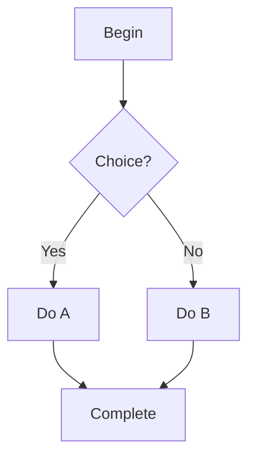
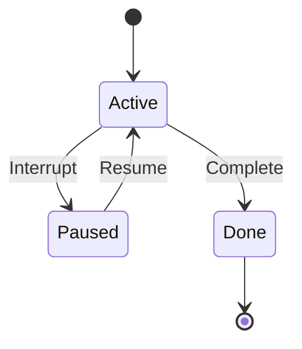
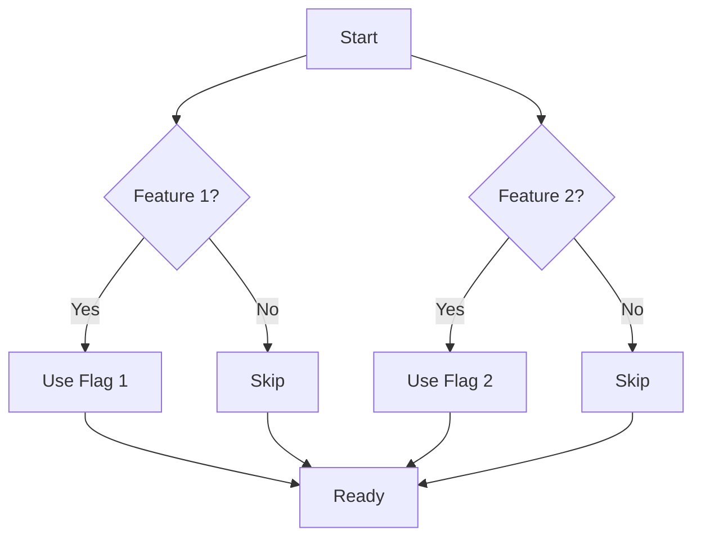
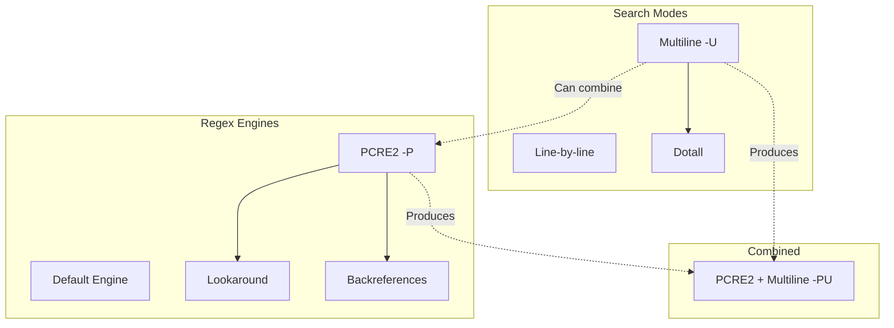

# /prodigy-fix-mermaid-diagrams

Find and fix all invalid Mermaid diagrams in the documentation.

## Execute

### Phase 1: Validate All Diagrams

Run the validation script to find invalid diagrams:

```bash
python3 .prodigy/scripts/validate-mermaid.py
# Or use the wrapper script:
bash .prodigy/scripts/validate-mermaid.sh
```

This will check all Mermaid diagrams in the docs directory for:
- Missing diagram type declarations (graph, flowchart, etc.)
- Unmatched brackets, braces, or quotes
- HTML entities (e.g., `&#40;` for parentheses)
- HTML tags (e.g., `<br/>` for line breaks)
- Disconnected nodes or invalid syntax

### Phase 2: Extract Invalid Diagram Locations

If the validation script finds invalid diagrams, it will list their locations.

Parse the output to get file:line references for each invalid diagram.

### Phase 3: Fix Each Invalid Diagram

For each invalid diagram found:

1. **Read the file** containing the broken diagram
2. **Identify the issue**:
   - If HTML entities: Replace `&#40;` with `(`, `&#41;` with `)`, etc.
   - If HTML tags: Replace `<br/>` with proper quoted multi-line syntax
   - If unmatched brackets: Balance the brackets
   - If disconnected nodes: Connect all paths properly or add terminal nodes
   - If missing type: Add proper diagram type (flowchart TD, graph LR, etc.)

3. **Common Mermaid Syntax Issues**:

   **HTML Entities:**
   ```
   Bad:  Node[O&#40;n&#41; complexity]
   Good: Node["O(n) complexity"]
   ```

   **HTML Line Breaks:**
   ```
   Bad:  Node[First line<br/>Second line]
   Good: Node["First line
   Second line"]
   ```

   **Disconnected Nodes:**
   ```
   Bad:  A --> B
         A --> C
         # C has no outgoing edge - dead end!

   Good: A --> B
         A --> C
         B --> D[End]
         C --> D[End]
   ```

   **Subgraph Cycles:**
   ```
   Bad:  subgraph Combined
           Combined[Node]
         end
         # Creates cycle: Combined as parent of Combined!

   Good: subgraph CombinedGroup
           Combined[Node]
         end
         # Or just don't put single nodes in their own subgraph
   ```

   **Unmatched Brackets:**
   ```
   Bad:  A["Text with quote] --> B
   Good: A["Text with quote"] --> B
   ```

4. **Apply the fix** using the Edit tool
5. **Verify the fix** by checking the corrected syntax

### Phase 4: Common Diagram Patterns

**Flowchart Decision Tree:**
All paths should connect to terminal nodes or loop back. No dead ends.



**State Diagram:**
All states should have transitions or be terminal states.



**Graph with Multiple Branches:**
When branching from one node to multiple paths, ensure all paths eventually connect.



**Using Subgraphs for Complex Diagrams:**
When a node has many branches (>4) or mixing orthogonal concepts, use subgraphs:



### Phase 5: Validation

After fixing all diagrams:

1. Run the validation script again to confirm all issues are resolved:
   ```bash
   python3 .prodigy/scripts/validate-mermaid.py
   ```

2. If any diagrams still fail validation, review and fix them manually

### Phase 6: Commit Changes

After all diagrams are fixed:

```bash
git add docs/
git commit -m "fix: correct invalid Mermaid diagram syntax

Fixed Mermaid syntax errors found by validation:
- Removed HTML entities and tags
- Balanced brackets and braces
- Connected disconnected nodes
- Added missing terminal nodes

All diagrams now pass validation."
```

## Quality Guidelines

**Mermaid Best Practices:**
- ✅ Use proper diagram types (flowchart TD, graph LR, stateDiagram-v2, etc.)
- ✅ Quote labels with special characters or line breaks
- ✅ Connect all non-terminal nodes to other nodes
- ✅ Use actual newlines in quoted strings, not `<br/>` tags
- ✅ Use literal characters `()` not HTML entities `&#40;&#41;`
- ✅ Balance all brackets, braces, and quotes
- ✅ Add styling for visual clarity

**Common Mistakes to Avoid:**
- ❌ Dead-end nodes in decision trees
- ❌ HTML tags or entities in node labels
- ❌ Unmatched brackets, braces, or quotes
- ❌ Missing diagram type declaration
- ❌ Spaces in node IDs (use underscores or camelCase)
- ❌ Too many branches from one node (>4) - use subgraphs for clarity
- ❌ Mixing orthogonal concepts in one flow - separate into subgraphs

## Error Handling

**If validation continues to fail after fixes:**
1. Check the Mermaid live editor: https://mermaid.live/
2. Paste the diagram content to see specific syntax errors
3. Review the Mermaid documentation: https://mermaid.js.org/
4. Consider simplifying complex diagrams

**If a diagram is too complex to fix:**
1. Break it into multiple smaller diagrams
2. Document each part separately
3. Link between diagrams with references

## Success Criteria

- [ ] All Mermaid diagrams pass validation script
- [ ] No HTML entities or tags in diagrams
- [ ] All brackets and braces are balanced
- [ ] All non-terminal nodes connect to other nodes
- [ ] Diagrams render correctly in MkDocs
- [ ] Changes committed with clear message
