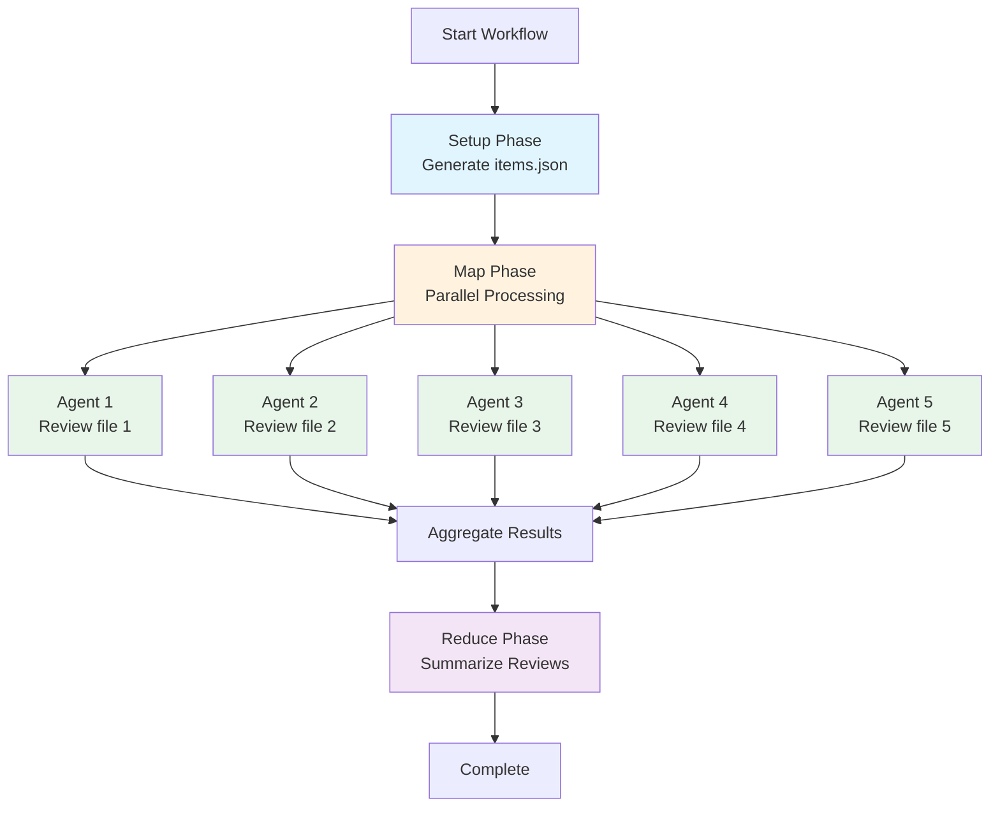
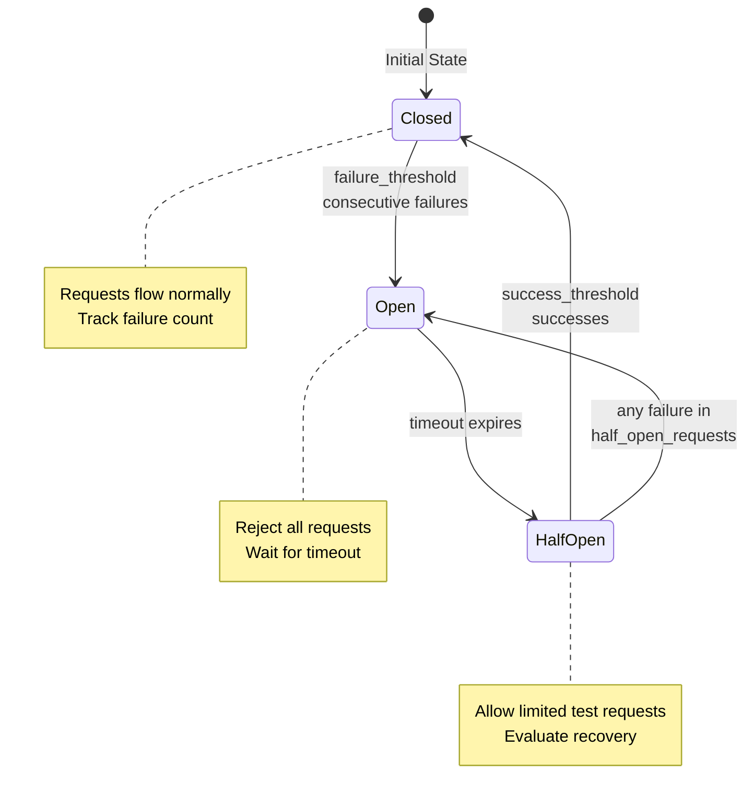

# Examples

> **Last Verified**: 2025-01-11 against codebase commit 753f90e0
>
> All examples in this chapter have been validated against the current implementation. Field names, syntax, and configuration options are verified against source code definitions.

This chapter demonstrates practical Prodigy workflows with real-world examples. Examples progress from simple to advanced, covering standard workflows, MapReduce parallel processing, error handling, and advanced features.

## Quick Reference

Find the right example for your use case:

| Use Case | Example | Key Features |
|----------|---------|--------------|
| Simple build/test pipeline | Example 1 | Basic commands, error handling |
| Loop over configurations | Example 2 | Foreach iteration, parallel processing |
| Parallel code processing | Example 3, 7 | MapReduce, distributed work |
| Conditional logic | Example 4 | Capture output, when clauses |
| Multi-step validation | Example 5 | Validation with gap filling |
| Environment configuration | Example 6 | Env vars, secrets, profiles |
| Dead Letter Queue (DLQ) | Example 7 | Error handling, retry failed items |
| Generate config files | Example 8 | write_file with JSON/YAML/text |
| Advanced git tracking | Example 9 | Git context variables, working_dir |
| External service resilience | Example 10 | Circuit breakers, fail fast |
| Retry with backoff | Example 11 | Exponential/linear/custom backoff |
| Reusable workflows | Example 12 | Composition (preview feature) |
| Custom merge process | Example 13 | Merge workflows, pre-merge validation |

## Example 1: Simple Build and Test

!!! example "Basic Workflow"
    This example shows a simple linear workflow with error handling. The `on_failure` handler automatically invokes Claude to fix failing tests.

```yaml
- shell: "cargo build"
- shell: "cargo test"
  on_failure:
    claude: "/fix-failing-tests"
- shell: "cargo clippy"
```

---

## Example 2: Foreach Iteration

```yaml
# Test multiple configurations in sequence
- foreach:
    - rust-version: "1.70"
      profile: debug
    - rust-version: "1.71"
      profile: release
    - rust-version: "stable"
      profile: release
  do:
    - shell: "rustup install ${foreach.item.rust-version}"
    - shell: "cargo +${foreach.item.rust-version} build --profile ${foreach.item.profile}"
    - shell: "cargo +${foreach.item.rust-version} test"

# Parallel foreach with error handling
- foreach:
    - "web-service"
    - "api-gateway"
    - "worker-service"
  parallel: 3  # Options: false (sequential), true (default parallelism), or number (specific count)
  continue_on_error: true
  do:
    - shell: "cd services/${foreach.item} && cargo build"
    - shell: "cd services/${foreach.item} && cargo test"
      on_failure:
        claude: "/fix-service-tests ${foreach.item}"
```

---

## Example 3: Parallel Code Review

!!! example "MapReduce Pattern"
    This example demonstrates parallel processing using the MapReduce pattern: setup generates work items, map processes them in parallel agents, and reduce aggregates results.

```yaml
# Source: Based on examples/mapreduce-json-input.yml and examples/mapreduce-command-input.yml
name: parallel-code-review
mode: mapreduce

setup:
  - shell: "find src -name '*.rs' > files.txt"
  - shell: "jq -R -s -c 'split(\"\n\") | map(select(length > 0) | {path: .})' files.txt > items.json"

map:
  input: items.json            # (1)!
  json_path: "$[*]"            # (2)!
  agent_template:
    - claude: "/review-file ${item.path}"
      id: "review"
      capture_output: "review_result"
      capture_format: "json"
    - shell: "cargo check ${item.path}"
  max_parallel: 5              # (3)!

reduce:
  - claude: "/summarize-reviews ${map.results}"

1. JSON file produced by setup phase containing work items
2. JSONPath expression to extract items from the JSON structure
3. Number of concurrent agents processing work items in parallel
```



**Figure**: MapReduce execution flow showing setup, parallel map agents, and reduce aggregation.

**Note:** JSONPath `"$[*]"` matches all items in the root array. Since the setup phase creates an array of `{path: ...}` objects, each map agent receives an `item` object with `item.path` available for use in commands.

**Advanced JSONPath Patterns:**
- `$.items[*]` - Extract items from nested object
- `$.items[*].files[*]` - Extract from nested arrays (flattens results)
- `$.items[?(@.priority > 5)]` - Filter items by condition
- `$[?(@.severity == 'critical')]` - Filter array by field value

---

## Example 4: Conditional Deployment

```yaml
- shell: "cargo test --quiet && echo true || echo false"
  id: "test"
  capture_output: "test_result"  # Canonical field name (alias: 'capture')
  capture_format: "boolean"  # Supported formats explained below
  timeout: 300  # Timeout in seconds (5 minutes)

- shell: "cargo build --release"
  when: "${test_result} == true"

- shell: "docker build -t myapp ."
  when: "${test_result} == true"
  on_success:
    shell: "docker push myapp:latest"
```

**Note:** `capture_format` options:
- `string` - Raw text output (default)
- `json` - Parse output as JSON object
- `lines` - Split output into array of lines
- `number` - Parse output as numeric value
- `boolean` - Parse as true/false based on exit code or output text

**Advanced capture options:**
```yaml
# Capture specific streams (stdout, stderr, exit_code, success, duration)
- shell: "cargo build 2>&1"
  capture_output: "build_output"
  capture_streams: "stdout,stderr,exit_code"  # Capture multiple streams

# Access captured values
- shell: "echo 'Exit code was ${build_output.exit_code}'"
```

---

## Example 5: Multi-Step Validation

!!! note "Iterative Validation"
    Use `validate` for completion checks with targeted gap filling. The `threshold` setting and `on_incomplete` handlers provide iterative refinement.

```yaml
# Source: Validation pattern from src/cook/goal_seek/mod.rs and features.json
- claude: "/implement-feature auth"
  commit_required: true
  validate:
    commands:
      - shell: "cargo test auth"
      - shell: "cargo clippy -- -D warnings"
      - claude: "/validate-implementation --output validation.json"
    result_file: "validation.json"
    threshold: 90
    on_incomplete:
      claude: "/complete-gaps ${validation.gaps}"
      commit_required: true
      max_attempts: 2
```

**Validation Lifecycle Explanation:**

The validation system follows this flow:
1. **Execute validation commands** - Run tests, linting, and custom validation scripts
2. **Parse result file** - Read `validation.json` to extract score and gaps
3. **Check threshold** - Compare score against threshold (90 in this example)
4. **Populate `validation.gaps`** - If score < threshold, extract gaps from result file
5. **Execute `on_incomplete`** - Pass gaps to Claude for targeted fixes

**Result File Format:**

The validation result file (`validation.json`) should contain:
```json
{
  "score": 75,
  "gaps": [
    "Missing tests for login endpoint",
    "No error handling for invalid tokens",
    "Documentation incomplete for auth module"
  ]
}
```

The `${validation.gaps}` variable is populated from the `gaps` array in the result file. If the result file doesn't contain a `gaps` field, validation will fail with an error.

**Alternative: Shell Script Validation**

You can also use shell scripts that output structured data:
```yaml
validate:
  commands:
    - shell: |
        # Run tests and extract missing coverage
        cargo tarpaulin --output-format json > coverage.json
        # Parse coverage and create validation result
        jq '{score: .coverage, gaps: .uncovered_files}' coverage.json > validation.json
  result_file: "validation.json"
  threshold: 80
```

**Note:** Validation provides iterative completion checking with gap filling. Use it when you want to verify completeness and have Claude fill specific gaps.

---

## Example 6: Environment-Aware Workflow

```yaml
# Global environment variables (including secrets with masking)
env:
  # Regular variables
  NODE_ENV: production
  API_URL: https://api.production.com

  # Secrets (automatically masked in logs)
  # Use secret: true and value fields for sensitive data
  API_KEY:
    secret: true
    value: "${SECRET_API_KEY}"

  # Secret with external provider
  DB_PASSWORD:
    secret: true
    value: "${DB_PASSWORD}"
    # provider: "vault"  # Optional: external secret store (not yet implemented)

# Environment profiles for different contexts
profiles:
  production:
    env:
      API_URL: https://api.production.com
      LOG_LEVEL: error
    description: "Production environment with error-level logging"

  staging:
    env:
      API_URL: https://api.staging.com
      LOG_LEVEL: warn
    description: "Staging environment with warning-level logging"

# Load additional variables from .env files
# Note: Paths are relative to workflow file location
env_files:
  - .env
  - .env.production

# Workflow steps
- shell: "cargo build --release"

# Use environment variables in commands
- shell: "echo 'Deploying to ${NODE_ENV} at ${API_URL}'"

# Override environment for specific step using env field
- shell: "./deploy.sh"
  env:
    LOG_LEVEL: debug
```

**Source**: Environment configuration from src/cook/environment/config.rs:12-36, secret masking from src/cook/environment/config.rs:84-96

**Note:** Profiles are activated using the `--profile <name>` CLI flag when running workflows. For example:
```bash
# Use production profile
prodigy run workflow.yml --profile production

# Use staging profile
prodigy run workflow.yml --profile staging
```

**Secrets Masking**: Variables with `secret: true` are automatically masked in:
- Command output logs
- Error messages
- Event logs
- Checkpoint files

Example masked output:
```
$ echo 'API key is ***'
```

**Alternative Secrets Syntax (Legacy)**:

Both modern and legacy secret syntaxes are supported:

```yaml
# Modern approach (recommended)
env:
  API_KEY:
    secret: true
    value: "${SECRET_KEY}"

# Legacy approach (still supported)
secrets:
  API_KEY:
    provider: env
    key: "SECRET_KEY"
```

The modern `env`-based approach is recommended for consistency, but legacy workflows using the top-level `secrets:` field continue to work.

**Source**: Environment configuration from src/cook/environment/config.rs:12-36, secret support from src/cook/environment/config.rs:84-96, example workflow from workflows/mapreduce-env-example.yml:7-25, profile structure from tests/environment_workflow_test.rs:68-88

---

## Example 7: Complex MapReduce with Error Handling

!!! warning "Resource Management"
    Setting `max_parallel` too high can exhaust system resources (CPU, memory, file handles). Start with 5-10 concurrent agents and monitor resource usage before increasing.

```yaml
# Source: Combines patterns from src/config/mapreduce.rs and workflows/debtmap-reduce.yml
name: tech-debt-elimination
mode: mapreduce

setup:
  - shell: "debtmap analyze . --output debt.json"

map:
  input: debt.json                          # (1)!
  json_path: "$.items[*]"                   # (2)!
  filter: "item.severity == 'critical'"     # (3)!
  sort_by: "item.priority DESC"             # (4)!
  max_items: 20                             # (5)!
  max_parallel: 5                           # (6)!
  distinct: "item.id"                       # (7)!

  # Timeout configuration (optional - default is 600 seconds / 10 minutes)
  timeout_config:
    agent_timeout_secs: 600                 # (8)!
    cleanup_grace_period_secs: 30           # (9)!

  agent_template:
    - claude: "/fix-debt-item '${item.description}'"
      commit_required: true
    - shell: "cargo test"
      on_failure:
        claude: "/debug-and-fix"

reduce:
  - shell: "debtmap analyze . --output debt-after.json"
  - claude: "/compare-debt-reports --before debt.json --after debt-after.json"

error_policy:
  on_item_failure: dlq                      # (10)!
  continue_on_failure: true                 # (11)!
  max_failures: 5                           # (12)!
  failure_threshold: 0.3                    # (13)!
  error_collection: aggregate               # (14)!

1. JSON file containing work items from setup phase
2. JSONPath to extract work items from the JSON structure
3. Only process items matching this condition (severity == 'critical')
4. Process high-priority items first
5. Limit to first 20 items (after filtering and sorting)
6. Run up to 5 agents concurrently
7. Prevent duplicate processing based on item.id field
8. Maximum time per agent (10 minutes default)
9. Extra time allowed for cleanup operations after timeout
10. Send failed items to Dead Letter Queue for retry
11. Continue processing remaining items when one fails
12. Stop workflow after 5 total failures
13. Stop workflow if >30% of items fail
14. Aggregate errors and report at end
```

**on_failure Syntax Note**: The `on_failure` field accepts a **single command** (either `shell:` or `claude:`), not an array of commands. The command structure is:
```yaml
on_failure:
  claude: "/fix-command"
  # or
  shell: "echo 'Fixing...'"
  max_attempts: 3       # Optional: retry the on_failure handler
  commit_required: true # Optional: require commit after fixing
```

For multiple failure recovery steps, nest handlers:
```yaml
# Source: Pattern from workflows/implement-with-tests.yml:36-39
- shell: "cargo test"
  on_failure:
    claude: "/fix-tests"
    commit_required: true
    on_failure:
      # Nested handler for second-level failure
      claude: "/fix-tests --deep-analysis"
      commit_required: true
```

**Note:** The entire `error_policy` block is optional with sensible defaults. If not specified, failed items go to the Dead Letter Queue (`on_item_failure: dlq`), workflow continues despite failures (`continue_on_failure: true`), and errors are aggregated at the end (`error_collection: aggregate`). Use `max_failures` or `failure_threshold` to fail fast if too many items fail.

**Deduplication with `distinct`**: The `distinct` field enables idempotent processing by preventing duplicate work items. When specified, Prodigy extracts the value of the given field (e.g., `item.id`) from each work item and ensures only unique values are processed. This is useful when:
- Input data may contain duplicates
- Resuming a workflow after adding new items
- Preventing wasted work on identical items
- Ensuring exactly-once processing semantics

Example: With `distinct: "item.id"`, if your input contains `[{id: "1", ...}, {id: "2", ...}, {id: "1", ...}]`, only items with IDs "1" and "2" will be processed (the duplicate "1" is skipped).

**Resuming MapReduce Workflows:**
MapReduce jobs can be resumed using either the session ID or job ID:
```bash
# Resume using session ID
prodigy resume session-mapreduce-1234567890

# Resume using job ID
prodigy resume-job mapreduce-1234567890

# Unified resume command (auto-detects ID type)
prodigy resume mapreduce-1234567890
```

**Session-Job ID Mapping**: The bidirectional mapping between session IDs and job IDs is stored in `~/.prodigy/state/{repo_name}/mappings/` and created automatically when the MapReduce workflow starts. This allows you to resume using either the session ID (e.g., `session-mapreduce-1234567890`) or the job ID (e.g., `mapreduce-1234567890`), and Prodigy will automatically find the correct checkpoint data.

**Source**: Session-job mapping implementation from MapReduce checkpoint and resume (Spec 134)

!!! tip "Dead Letter Queue (DLQ) for Failed Items"
    Failed work items are automatically sent to the DLQ for retry. Use `prodigy dlq retry <job_id>` to reprocess failed items with the same agent configuration, or `prodigy dlq show <job_id>` to inspect failure details.

**Debugging Failed Agents:**
When agents fail, DLQ entries include a `json_log_location` field pointing to the Claude JSON log file for debugging:
```bash
# View failed items and their log locations
prodigy dlq show <job_id> | jq '.items[].failure_history[].json_log_location'

# Inspect the Claude interaction for a failed agent
cat <json_log_location> | jq
```
This allows you to see exactly what tools Claude invoked and why the agent failed.

---

## Example 8: Generating Configuration Files

```yaml
# Generate a JSON configuration file
- write_file:
    path: "config/deployment.json"
    format: json  # Options: text, json, yaml
    create_dirs: true  # Create parent directories if they don't exist
    content:
      environment: production
      api_url: "${API_URL}"
      features:
        - auth
        - analytics
        - notifications
      timeout: 30

# Generate a YAML configuration file
- write_file:
    path: "config/services.yml"
    format: yaml
    content:
      services:
        web:
          image: "myapp:latest"
          ports:
            - "8080:8080"
        database:
          image: "postgres:15"
          environment:
            POSTGRES_DB: "${DB_NAME}"

# Generate a plain text report
- write_file:
    path: "reports/summary.txt"
    format: text
    mode: "0644"  # File permissions (optional)
    content: |
      Deployment Summary
      ==================
      Environment: ${NODE_ENV}
      API URL: ${API_URL}
      Timestamp: $(date)
```

---

## Example 9: Advanced Features

```yaml
# Nested error handling with retry configuration
- shell: "cargo build --release"
  on_failure:
    shell: "cargo clean"
    on_success:
      shell: "cargo build --release"
      max_attempts: 2
  on_success:
    shell: "cargo test --release"

# Complex conditional execution with max_attempts
- shell: "cargo test"
  id: "test"
  capture_output: "test_output"

- claude: "/fix-tests"
  when: "${test_output} contains 'FAILED'"
  max_attempts: 3

# Conditional deployment based on test results
- shell: "cargo build --release"
  when: "${test.exit_code} == 0"

# Multi-condition logic
- shell: "./deploy.sh"
  when: "${test_output} contains 'passed' and ${build_output} contains 'Finished'"
```

**Note:** Advanced features currently supported:
- **Nested handlers**: Chain `on_failure` and `on_success` handlers for complex error recovery
- **Max attempts**: Combine with conditional execution for automatic retry logic
- **Conditional execution**: Use `when` clauses with captured output or variables
- **Complex conditionals**: Combine multiple conditions with `and`/`or` operators
- **Working directory**: Per-command directory control using `working_dir` field
- **Git context variables**: Automatic tracking of file changes during workflow execution

**Example of working_dir usage:**

**Source**: Field definition from src/commands/handlers/shell.rs:40, examples from workflows/environment-example.yml:52-64

```yaml
# Run command in specific directory
- name: "Build frontend"
  shell: "npm run build"
  working_dir: ./frontend      # Execute in frontend/ directory

# Combine with environment variables
- name: "Run backend tests"
  shell: "pytest"
  env:
    PYTHONPATH: "./src:./tests"
  working_dir: ./backend

# Use variable interpolation for dynamic paths
- name: "Deploy to environment"
  shell: "echo 'Deploying...'"
  working_dir: "${env.DEPLOY_DIR}"  # Path from environment variable
```

**Note:** The `working_dir` field is fully implemented and production-ready:
- Accepts relative or absolute paths
- Supports variable interpolation (e.g., `"${env.PROJECT_DIR}"`)
- Falls back to current execution context if not specified
- Paths are resolved to absolute paths automatically
- Relative paths are resolved via the workflow execution context

**Git Context Variables (Spec 122):**
Prodigy automatically tracks file changes during workflow execution and exposes them as variables:

```yaml
# Access files changed in current step
- shell: "echo 'Modified files: ${step.files_modified}'"
- shell: "echo 'Added files: ${step.files_added}'"
- shell: "echo 'Deleted files: ${step.files_deleted}'"

# Format as JSON array
- shell: "echo '${step.files_modified:json}'"

# Filter by glob pattern (only Rust files)
- shell: "echo 'Rust files changed: ${step.files_modified:*.rs}'"

# Access workflow-level aggregations
- shell: "echo 'Total commits: ${workflow.commit_count}'"
- shell: "echo 'All modified files: ${workflow.files_modified}'"

# Access uncommitted changes
- shell: "echo 'Staged files: ${git.staged_files}'"
- shell: "echo 'Unstaged files: ${git.unstaged_files}'"

# Pattern filtering for git context
- claude: "/review-changes ${git.modified_files|pattern:**/*.rs}"
- shell: "echo 'Changed Rust files: ${git.staged_files|pattern:**/*.rs}'"

# Basename-only output (no paths)
- shell: "echo 'File names: ${git.modified_files|basename}'"
```

**Available Git Context Variables:**
- `${step.files_added}` - Files added in current step
- `${step.files_modified}` - Files modified in current step
- `${step.files_deleted}` - Files deleted in current step
- `${step.commits}` - Commit SHAs created in this step
- `${step.insertions}` - Lines inserted in this step
- `${step.deletions}` - Lines deleted in this step
- `${workflow.commit_count}` - Total commits in workflow
- `${workflow.files_modified}` - All files modified across workflow
- `${git.staged_files}` - Currently staged files (uncommitted)
- `${git.unstaged_files}` - Modified but unstaged files
- `${git.modified_files}` - All uncommitted modifications

**Supported Formats and Filters:**
- `:json` - Format as JSON array
- `:*.rs` - Filter by glob pattern (e.g., `*.rs`, `src/**/*.py`)
- `|pattern:**/*.rs` - Alternative syntax for glob pattern filtering (equivalent to `:pattern`)
- `|basename` - Extract just file names without paths

**Note:** Both `:pattern` and `|pattern:` syntaxes are valid and equivalent. Use whichever is more readable in your context:
- `${git.modified_files:*.rs}` - Colon syntax (more concise)
- `${git.modified_files|pattern:**/*.rs}` - Pipe syntax (more explicit)

**Source**: Git context tracking from src/cook/workflow/git_context.rs:1-120, variable resolution from src/cook/workflow/git_context.rs:36-42

**Troubleshooting MapReduce Cleanup:**
If agent worktree cleanup fails (due to disk full, permission errors, etc.), use the orphaned worktree cleanup command:
```bash
# List and clean orphaned worktrees for a specific job
prodigy worktree clean-orphaned <job_id>

# Dry run to preview what would be cleaned
prodigy worktree clean-orphaned <job_id> --dry-run

# Force cleanup without confirmation
prodigy worktree clean-orphaned <job_id> --force
```
Note: Agent execution status is independent of cleanup status. If an agent completes successfully but cleanup fails, the agent is still marked as successful and results are preserved.

**Source**: Orphaned worktree cleanup from MapReduce cleanup failure handling (Spec 136)

---

## Example 10: Circuit Breaker for Resilient Error Handling

```yaml
name: api-processing-with-circuit-breaker
mode: mapreduce

setup:
  - shell: "curl https://api.example.com/items > items.json"

map:
  input: items.json
  json_path: "$[*]"
  max_parallel: 10

  agent_template:
    - shell: "curl -X POST https://api.example.com/process -d '${item}'"
      max_attempts: 3
    - claude: "/validate-processing ${item.id}"

  # Circuit breaker prevents cascading failures from external service issues
  error_policy:
    on_item_failure: dlq
    continue_on_failure: true
    circuit_breaker:
      failure_threshold: 5      # Open circuit after 5 consecutive failures
      success_threshold: 3      # Close circuit after 3 consecutive successes
      timeout: 30s             # Wait 30s before testing recovery (half-open state)
      half_open_requests: 3    # Allow 3 test requests in half-open state

reduce:
  - claude: "/summarize-results ${map.results}"
```

**Source**: CircuitBreakerConfig from src/cook/workflow/error_policy.rs:46-88, state machine from error_policy.rs:251-343

**Circuit Breaker State Transitions:**



**Figure**: Circuit breaker state machine showing transitions based on failure and success thresholds.

**When to Use Circuit Breakers:**
- External API calls that may become unavailable
- Database operations during maintenance windows
- Network-dependent operations with potential outages
- Any operation where cascading failures should be prevented

**Circuit Breaker Benefits:**
- **Fail Fast**: Stop wasting resources on doomed requests
- **Self-Healing**: Automatically test recovery after timeout
- **Prevent Overload**: Give external services time to recover
- **Clear Signals**: Circuit state indicates system health

**Default Values** (from error_policy.rs:63-76):
- `failure_threshold: 5` - Balance between sensitivity and stability
- `success_threshold: 3` - Require consistent success before full recovery
- `timeout: 30s` - Typical recovery time for transient issues
- `half_open_requests: 3` - Minimal testing before full recovery

**See Also**: [Error Handling Guide](workflow-basics/error-handling.md) for comprehensive error handling patterns

---

## Example 11: Retry Configuration with Backoff Strategies

```yaml
name: resilient-deployment
mode: standard

# Global retry defaults for all commands
error_policy:
  retry_config:
    max_attempts: 3          # Maximum retry attempts
    backoff: exponential      # Backoff strategy (see variants below)

# Workflow steps
- shell: "curl https://api.example.com/deploy"
  # Inherits global retry_config

- shell: "docker push myapp:latest"
  # Override with custom retry config
  retry_config:
    max_attempts: 5
    backoff:
      exponential:
        initial: 2s          # Start with 2 second delay
        multiplier: 2.0      # Double delay each retry (2s, 4s, 8s, 16s, 32s)
```

**Source**: BackoffStrategy enum from src/cook/retry_v2.rs:70-98, RetryConfig from retry_v2.rs:14-52

**Backoff Strategy Variants:**

=== "Exponential (Default)"
    Delay doubles each retry - best for most scenarios:
    ```yaml
    backoff:
      exponential:
        initial: 1s         # First retry after 1s
        multiplier: 2.0     # Second after 2s, third after 4s, fourth after 8s
    ```
    **Use when**: Fast backoff needed, transient errors expected

=== "Linear"
    Delay increases by fixed increment - steady load reduction:
    ```yaml
    backoff:
      linear:
        initial: 1s         # First retry after 1s
        increment: 2s       # Second after 3s, third after 5s, fourth after 7s
    ```
    **Use when**: Gradual backoff preferred, predictable retry timing

=== "Fibonacci"
    Delay follows Fibonacci sequence - gradual then aggressive:
    ```yaml
    backoff:
      fibonacci:
        initial: 1s         # Delays: 1s, 1s, 2s, 3s, 5s, 8s, 13s...
    ```
    **Use when**: Balance between exponential and linear

=== "Fixed"
    Same delay for all retries - consistent timing:
    ```yaml
    backoff:
      fixed:
        delay: 5s           # All retries wait exactly 5s
    ```
    **Use when**: Rate limiting, polling operations

=== "Custom"
    Specify exact delays - full control:
    ```yaml
    backoff:
      custom:
        delays: [1s, 5s, 15s, 30s, 60s]
    ```
    **Use when**: Complex SLA requirements, specific retry patterns

**Advanced Retry Configuration:**

```yaml
- shell: "curl https://api.example.com/data"
  retry_config:
    max_attempts: 5                         # (1)!
    backoff:
      exponential:
        initial: 1s                         # (2)!
        multiplier: 2.0                     # (3)!
    initial_delay: 1s                       # (4)!
    max_delay: 60s                          # (5)!
    jitter: true                            # (6)!
    jitter_factor: 0.3                      # (7)!
    retry_budget: 300s                      # (8)!
    retry_on:                               # (9)!
      - network
      - timeout
      - server_error
      - rate_limit
    on_failure: continue                    # (10)!

1. Maximum number of retry attempts before giving up
2. Starting delay for exponential backoff (1s, 2s, 4s, 8s, ...)
3. Multiplier for exponential growth (2.0 = double each retry)
4. Base delay added before backoff calculation
5. Maximum delay cap to prevent excessive waiting
6. Add randomness to prevent thundering herd problem
7. Random variance range (0.3 = ±30% of calculated delay)
8. Total time budget for all retries (5 minutes)
9. Only retry on specific error types (fail fast on others)
10. Action after all retries exhausted (continue, fail, dlq)
```

**Source**: Test examples from src/cook/retry_v2.rs:582-659, backoff calculation from retry_v2.rs:283-305

**Backoff Strategy Comparison:**

| Strategy | Use Case | Delay Pattern | Example |
|----------|----------|---------------|---------|
| **Exponential** | Most scenarios, fast backoff | 2^n × initial | 1s, 2s, 4s, 8s |
| **Linear** | Steady load reduction | initial + (n × increment) | 1s, 3s, 5s, 7s |
| **Fibonacci** | Gradual backoff | Fibonacci(n) × initial | 1s, 1s, 2s, 3s, 5s |
| **Fixed** | Rate limiting, polling | constant | 5s, 5s, 5s, 5s |
| **Custom** | Complex SLA requirements | user-defined | 1s, 5s, 15s, 60s |

**Jitter Benefits** (from retry_v2.rs:644-659):
- Prevents thundering herd when multiple agents retry simultaneously
- Adds ±30% random variance by default (configurable via `jitter_factor`)
- Example: 10s delay becomes 7-13s with 0.3 jitter factor

**See Also**: [Retry State Tracking](mapreduce/backoff-strategies.md) for persistence and recovery

---

## Example 12: Workflow Composition (Preview Feature)

> **Note**: Workflow composition features are partially implemented. Core composition logic exists but CLI integration is pending (Spec 131-133). This example shows the planned syntax.

```yaml
# Import reusable workflow fragments
imports:
  - "./workflows/common/test-suite.yml"
  - "./workflows/common/deploy.yml"

# Extend base workflow
extends: "./workflows/base-ci.yml"

name: extended-ci-workflow
mode: standard

# Template for reusable command sets
templates:
  rust_test:
    - shell: "cargo build"
    - shell: "cargo test"
    - shell: "cargo clippy"

  deploy_to_env:
    parameters:
      - env_name
      - target_url
    commands:
      - shell: "echo 'Deploying to ${env_name}'"
      - shell: "curl -X POST ${target_url}/deploy"

# Use templates in workflow
steps:
  - template: rust_test
  - template: deploy_to_env
    with:
      env_name: "production"
      target_url: "${API_URL}"
```

**Source**: Composition architecture from features.json:workflow_composition, implementation status note from drift analysis

**Planned Composition Features:**
- **Imports**: Reuse workflow fragments across projects
- **Extends**: Inherit from base workflows with overrides
- **Templates**: Parameterized command sets for DRY workflows
- **Parameters**: Type-safe template parameterization

**Current Status:**
- Core composition logic: ✓ Implemented
- Configuration parsing: ✓ Implemented
- CLI integration: ⏳ Pending (Spec 131-133)
- Template rendering: ⏳ Pending

**Workaround Until CLI Integration:**
Use YAML anchors and aliases for basic composition:

```yaml
# Define reusable blocks with anchors
.rust_test: &rust_test
  - shell: "cargo build"
  - shell: "cargo test"

.deploy: &deploy
  - shell: "echo 'Deploying...'"

# Reference with aliases
workflow:
  - *rust_test
  - *deploy
```

---

## Example 13: Custom Merge Workflows

MapReduce workflows execute in isolated git worktrees. When the workflow completes, you can define a custom merge workflow to control how changes are merged back to your original branch.

```yaml
name: code-review-with-merge
mode: mapreduce

# Environment variables available to merge commands
env:
  PROJECT_NAME: "my-project"
  NOTIFICATION_URL: "https://api.slack.com/webhooks/..."

setup:
  - shell: "find src -name '*.rs' > files.json"
  - shell: "jq -R -s -c 'split(\"\n\") | map(select(length > 0) | {path: .})' files.json > items.json"

map:
  input: "items.json"
  json_path: "$[*]"
  agent_template:
    - claude: "/review-code ${item.path}"
      commit_required: true
  max_parallel: 5

reduce:
  - claude: "/summarize-reviews ${map.results}"

# Custom merge workflow (executed when merging worktree back to original branch)
merge:
  commands:
    # Merge-specific variables are available:
    # ${merge.worktree} - Worktree name (e.g., "session-abc123")
    # ${merge.source_branch} - Source branch in worktree
    # ${merge.target_branch} - Target branch (where you started workflow)
    # ${merge.session_id} - Session ID for correlation

    # Pre-merge validation
    - shell: "echo 'Preparing to merge ${merge.worktree}'"
    - shell: "echo 'Source: ${merge.source_branch} → Target: ${merge.target_branch}'"

    # Run tests before merging
    - shell: "cargo test --all"
      on_failure:
        claude: "/fix-failing-tests before merge"
        commit_required: true
        max_attempts: 2

    # Run linting
    - shell: "cargo clippy -- -D warnings"
      on_failure:
        claude: "/fix-clippy-warnings"
        commit_required: true

    # Optional: Custom validation via Claude
    - claude: "/validate-merge-readiness ${merge.source_branch} ${merge.target_branch}"

    # Actually perform the merge using prodigy-merge-worktree
    # IMPORTANT: Always pass both source and target branches
    - claude: "/prodigy-merge-worktree ${merge.source_branch} ${merge.target_branch}"

    # Post-merge notifications (using env vars)
    - shell: "echo 'Successfully merged ${PROJECT_NAME} changes from ${merge.worktree}'"
    # - shell: "curl -X POST ${NOTIFICATION_URL} -d 'Merge completed for ${PROJECT_NAME}'"

  # Optional: Timeout for entire merge phase (seconds)
  timeout: 600  # 10 minutes
```

**Source**: Merge workflow configuration from src/config/mapreduce.rs:84-94, merge variables from worktree merge orchestrator, example from workflows/mapreduce-env-example.yml:83-94, test from tests/merge_workflow_integration.rs:64-121

**Merge Workflow Features:**

1. **Merge-Specific Variables** (automatically provided):
   - `${merge.worktree}` - Name of the worktree being merged
   - `${merge.source_branch}` - Branch in worktree (usually `prodigy-mapreduce-...`)
   - `${merge.target_branch}` - Your original branch (main, master, feature-xyz, etc.)
   - `${merge.session_id}` - Session ID for tracking

2. **Pre-Merge Validation**:
   - Run tests, linting, or custom checks before merging
   - Use Claude commands for intelligent validation
   - Use `on_failure` handlers to fix issues automatically

3. **Environment Variables**:
   - Global `env` variables are available in merge commands
   - Useful for notifications, project-specific settings
   - Secrets are masked in merge command output

4. **Timeout Control**:
   - Optional `timeout` field (in seconds) for the merge phase
   - Prevents merge workflows from hanging indefinitely

**Important Notes:**
- Always pass **both** `${merge.source_branch}` and `${merge.target_branch}` to `/prodigy-merge-worktree`
- This ensures the merge targets your original branch, not a hardcoded main/master
- Without a custom merge workflow, you'll be prompted interactively to merge

**Handling Merge Failures:**
If merge validation fails (e.g., tests fail, linting fails), the `on_failure` handlers will attempt to fix the issues. If fixes cannot be applied automatically, the merge workflow will fail, and changes remain in the worktree for manual review:

```yaml
# Source: Pattern from workflows/mapreduce-env-example.yml:83-94
- shell: "cargo test --all"
  on_failure:
    claude: "/fix-failing-tests before merge"
    commit_required: true
    max_attempts: 2
    # If tests still fail after 2 attempts, workflow stops
    # Changes remain in worktree at ~/.prodigy/worktrees/{repo_name}/{session_id}/
```

**Recovery from Failed Merge:**
1. Navigate to the worktree: `cd ~/.prodigy/worktrees/{repo_name}/{session_id}/`
2. Fix issues manually and commit changes
3. Resume the merge workflow: `prodigy resume {session_id}`
4. Or manually merge: `git checkout {target_branch} && git merge {source_branch}`

**Simplified Format:**
If you don't need timeout configuration, you can use the simplified format:

```yaml
merge:
  - shell: "cargo test"
  - claude: "/prodigy-merge-worktree ${merge.source_branch} ${merge.target_branch}"
```

This is equivalent to `merge.commands` but more concise.
