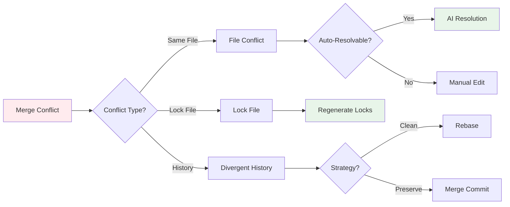

# Git Integration

Prodigy provides deep git integration with worktree isolation, automatic commit tracking, and customizable merge workflows.

## Overview

Git integration features:
- **Worktree isolation**: Each session runs in isolated git worktree
- **Automatic commits**: Track all changes with automatic git commits
- **Commit tracking**: Full audit trail of modifications
- **Smart merging**: Customizable merge workflows with validation
- **Branch tracking**: Intelligent merge target detection

**Related documentation:**

- [Checkpoint and Resume](../mapreduce/checkpoint-and-resume.md) - How worktree state is preserved during resume
- [Storage Architecture](storage.md) - Where worktree metadata and state files are stored

## Worktree Management

Every Prodigy session executes in an isolated git worktree:

```
~/.prodigy/worktrees/{repo_name}/
└── session-{session_id}/   # Isolated worktree for this session
```

### Benefits

- **Isolation**: Main repository remains untouched during execution
- **Parallelism**: Multiple sessions can run concurrently
- **Safety**: Failed workflows don't pollute main repo
- **Debugging**: Worktrees preserve full execution history

### Worktree Lifecycle


**Figure**: Worktree lifecycle showing creation, execution, merge decision, and cleanup states.

1. **Creation**: Prodigy creates worktree when workflow starts
2. **Execution**: All commands run in worktree context
3. **Changes**: Modifications committed automatically
4. **Completion**: User prompted to merge back to original branch
5. **Cleanup**: Worktree removed after successful merge

### Manual Worktree Management

```bash
# List worktrees
prodigy worktree ls

# Clean completed worktrees
prodigy worktree clean

# Force cleanup
prodigy worktree clean -f

# Clean orphaned worktrees (failed cleanup)
prodigy worktree clean-orphaned <job_id>
```

??? example "Example: `prodigy worktree ls` Output"
    ```
    Worktrees for prodigy:
    ┌──────────────────────────────────────┬────────────┬──────────────────────────┬─────────────────────┐
    │ Session ID                           │ Status     │ Original Branch          │ Created             │
    ├──────────────────────────────────────┼────────────┼──────────────────────────┼─────────────────────┤
    │ session-abc123-def456                │ InProgress │ feature/auth-refactor    │ 2025-01-15 10:30:00 │
    │ session-789xyz-123abc                │ Completed  │ main                     │ 2025-01-15 09:00:00 │
    │ session-old-session                  │ Merged     │ feature/ui-improvements  │ 2025-01-14 14:00:00 │
    └──────────────────────────────────────┴────────────┴──────────────────────────┴─────────────────────┘
    ```

### Worktree Status Values

Worktrees track their lifecycle state with these status values:

```rust
// Source: src/worktree/state.rs:38-46
pub enum WorktreeStatus {
    InProgress,   // Workflow currently executing
    Completed,    // Workflow finished, awaiting merge decision
    Merged,       // Changes merged back to original branch
    CleanedUp,    // Worktree successfully removed
    Failed,       // Workflow failed with error
    Abandoned,    // User declined merge, worktree preserved
    Interrupted,  // Execution interrupted (signal, power loss)
}
```

| Status | Description | Next Actions |
|--------|-------------|--------------|
| `InProgress` | Workflow actively running | Wait for completion |
| `Completed` | Workflow done, pending merge | Approve or decline merge |
| `Merged` | Changes integrated to original branch | Clean up worktree |
| `CleanedUp` | Worktree removed from disk | None (terminal state) |
| `Failed` | Error during execution | Check logs, retry or clean |
| `Abandoned` | User declined to merge | Access worktree manually if needed |
| `Interrupted` | Unexpected termination | Resume with `prodigy resume` |

!!! tip "Worktree Hygiene"
    Regularly clean up completed worktrees with `prodigy worktree clean` to free disk space. Each worktree is a full copy of your repository, so they can accumulate quickly during development.

## Commit Tracking

Prodigy automatically creates commits for trackable changes:

### Automatic Commits

```yaml
# Source: workflows/implement.yml
- claude: "/implement-feature"
  commit_required: true  # Expect git commit from Claude

- shell: "cargo fmt"
  commit_required: true  # Create commit for formatting changes
```

When `commit_required: true` is set, Prodigy validates that a commit was created:

- **Before execution**: Captures HEAD commit SHA
- **After execution**: Compares HEAD to detect new commits
- **Validation failure**: Workflow fails with error "No changes were committed by [command]"
- **Skip validation**: Set `PRODIGY_NO_COMMIT_VALIDATION=true` to bypass (test mode only)

!!! warning "Commit Validation"
    If a command with `commit_required: true` doesn't create a commit, the workflow will fail. This prevents silent failures where expected changes weren't made. Use this for commands that should always modify files (implementations, formatting, etc.).

```rust
// Source: src/cook/workflow/executor.rs:819-824
// Get HEAD before command execution if we need to verify commits
let head_before = if !execution_flags.skip_validation
    && step.commit_required
    && !execution_flags.test_mode
{
    Some(self.get_current_head(&env.working_dir).await?)
} else {
    None
};
```

### Commit Messages

Generated commit messages include:
- Command that created the change
- Workflow context
- Session ID for traceability

## Branch Tracking

Prodigy tracks the original branch for intelligent merging:

### Original Branch Detection


**Figure**: Branch tracking logic showing how Prodigy determines merge target based on workflow start context.

When creating a worktree:
- Captures current branch name (e.g., `feature/ui-improvements`)
- Falls back to default branch for detached HEAD
- Stores in worktree state for session lifetime

### Merge Target Logic

Merge back to the tracked original branch:
```yaml
# User on feature/auth-refactor when starting workflow
# Worktree merges back to feature/auth-refactor (not main!)
```

!!! note "Smart Merge Targeting"
    Prodigy always merges back to the branch you were on when you started the workflow, not to a hardcoded main/master branch. This makes it safe to use on feature branches, release branches, or any development branch.

### Special Cases

- **Feature branches**: Merge back to exact feature branch
- **Detached HEAD**: Falls back to default branch (main/master)
- **Deleted branch**: Falls back to default branch if original deleted
- **Branch rename**: Uses branch name from worktree creation time

## Merge Workflows

Customize the merge process with validation and testing:

```yaml
# Source: workflows/implement.yml
merge:
  commands:
    - shell: "git fetch origin"
    - shell: "git merge origin/main"  # (1)!
    - shell: "cargo test"             # (2)!
    - shell: "cargo clippy"           # (3)!
    - claude: "/prodigy-merge-worktree ${merge.source_branch} ${merge.target_branch}"  # (4)!
  timeout: 600  # (5)!

1. Sync worktree with latest main branch changes before merging
2. Run full test suite to ensure nothing breaks
3. Verify code quality and catch linting issues
4. Execute the actual merge back to original branch
5. Allow 10 minutes for merge operations (adjust for large test suites)
```

!!! tip "Always Pass Both Branch Variables"
    Always use `${merge.source_branch}` and `${merge.target_branch}` when calling `/prodigy-merge-worktree`. This ensures merges go to the branch you started from, not a hardcoded main/master.

### Merge Variables

Available in merge workflows:
- `${merge.worktree}` - Worktree name being merged
- `${merge.source_branch}` - Source branch (worktree branch)
- `${merge.target_branch}` - Target branch (original branch)
- `${merge.session_id}` - Session ID for correlation

### Debugging Merge Operations

Control Claude output visibility during merge operations:

```bash
# Default: Clean output, no Claude streaming
prodigy run workflow.yml

# Verbose: Show Claude JSON streaming output
prodigy run workflow.yml -v

# Force streaming output via environment variable
PRODIGY_CLAUDE_CONSOLE_OUTPUT=true prodigy run workflow.yml
```

!!! tip "Debug Merge Failures"
    Use `-v` flag to see real-time Claude interactions during merge operations. This shows tool invocations, decision-making, and helps diagnose merge conflicts or validation failures.

### Example: Pre-Merge Validation

```yaml
merge:
  commands:
    - shell: "cargo build --release"
    - shell: "cargo test --all"
    - shell: "cargo fmt --check"
    - shell: "cargo clippy -- -D warnings"
    - claude: "/prodigy-merge-worktree ${merge.source_branch} ${merge.target_branch}"
```

### Example: Conflict Resolution

```yaml
merge:
  commands:
    - shell: "git fetch origin"
    - shell: "git merge origin/main --no-commit"
    - claude: "/resolve-conflicts"
      on_failure:
        shell: "git merge --abort"
    - shell: "git add -A"
    - shell: "git commit -m 'Merge main and resolve conflicts'"
    - claude: "/prodigy-merge-worktree ${merge.source_branch} ${merge.target_branch}"
```

## MapReduce Worktree Isolation

In MapReduce workflows, all phases execute in isolated worktrees:


**Figure**: MapReduce worktree hierarchy showing parent worktree for setup/reduce and child worktrees for parallel map agents.

### Isolation Guarantees

1. **Setup phase**: Executes in parent worktree
2. **Map phase**: Each agent runs in child worktree
3. **Reduce phase**: Executes in parent worktree
4. **Final merge**: Parent worktree merges back to original branch

!!! note "Complete Isolation"
    Your main repository remains completely untouched during MapReduce execution. All setup, map, and reduce operations happen in isolated worktrees. Changes only return to your original branch when you explicitly approve the merge.

### Verification

Verify main repository is clean after MapReduce:

```bash
# Check main repo (should be clean)
git status

# Check worktree has changes
cd ~/.prodigy/worktrees/{repo}/session-xxx/
git status
git log
```

## Orphaned Worktree Recovery

Handle cleanup failures gracefully:

### Orphaned Worktree Registry

When cleanup fails, worktree path is registered:
```
~/.prodigy/orphaned_worktrees/{repo_name}/{job_id}.json
```

### Cleanup Command

```bash
# List orphaned worktrees
prodigy worktree clean-orphaned <job_id>

# Dry run
prodigy worktree clean-orphaned <job_id> --dry-run

# Force cleanup
prodigy worktree clean-orphaned <job_id> --force
```

### Common Cleanup Issues

- **Permission denied**: Check directory permissions
- **Disk full**: Free up space before retry
- **Directory busy**: Close editors/processes using worktree
- **Git locks**: Wait for concurrent git operations to complete

!!! warning "Orphaned Worktrees"
    If cleanup fails, worktrees become "orphaned" but agent work is still preserved. Use `prodigy worktree clean-orphaned <job_id>` to safely remove them after resolving the underlying issue (permissions, disk space, etc.).

## Examples

### Feature Branch Workflow

```yaml
# User on feature/authentication
name: implement-auth

- claude: "/implement-auth-module"
  commit_required: true

- shell: "cargo test"
  on_failure:
    claude: "/fix-auth-tests"

# Merge back to feature/authentication (not main!)
merge:
  commands:
    - shell: "cargo test --all"
    - claude: "/prodigy-merge-worktree ${merge.source_branch} ${merge.target_branch}"
```

### Multi-Stage CI with Merge Validation

```yaml
name: comprehensive-ci

- shell: "cargo build"
  commit_required: true

- shell: "cargo test"
  on_failure:
    claude: "/debug-test-failure"
    commit_required: true

- shell: "cargo clippy"
  commit_required: true

merge:
  commands:
    - shell: "git fetch origin"
    - shell: "git merge origin/${merge.target_branch}"
      on_failure:
        claude: "/resolve-merge-conflicts"
    - shell: "cargo test --release"
    - shell: "cargo doc --no-deps"
    - claude: "/prodigy-merge-worktree ${merge.source_branch} ${merge.target_branch}"
  timeout: 900
```

## Troubleshooting

### Common Merge Conflict Scenarios

Understanding when and how conflicts occur helps you choose the right resolution strategy:



**Figure**: Decision flow for resolving different types of merge conflicts.

#### Conflicting File Changes

When multiple agents modify the same file:

```bash
# Check conflict status in worktree
cd ~/.prodigy/worktrees/{repo}/session-xxx/
git status

# View conflict markers
git diff --name-only --diff-filter=U
```

**Resolution strategies:**

=== "AI-Assisted Resolution"

    Let Claude resolve conflicts automatically in your merge workflow:

    ```yaml
    merge:
      commands:
        - shell: "git merge origin/main --no-commit"
        - claude: "/resolve-conflicts"  # AI-assisted resolution
        - shell: "git add -A && git commit -m 'Merge with conflict resolution'"
    ```

    !!! tip "When to Use AI Resolution"
        AI resolution works best for semantic conflicts (different features touching same code) rather than binary/lock file conflicts.

=== "Manual Resolution"

    Resolve conflicts yourself in the worktree:

    ```bash
    # Navigate to worktree
    cd ~/.prodigy/worktrees/{repo}/session-xxx/

    # Open in your editor, resolve conflicts
    code .

    # Mark resolved and commit
    git add -A
    git commit -m "Resolve merge conflicts"
    ```

    !!! note "Editor Integration"
        Your worktree is a full git repository. Use your preferred editor's git conflict resolution tools.

#### Divergent Branch History

When the original branch has advanced significantly:

```bash
# Check how far behind
git log ${merge.target_branch}..HEAD --oneline
```

Choose your integration strategy:

=== "Merge (Recommended)"

    Preserves complete history and is safer for shared branches:

    ```bash
    git merge origin/${merge.target_branch}
    ```

    **Pros:** Safe for shared branches, preserves history, easy to revert
    **Cons:** Creates merge commits, non-linear history

=== "Rebase"

    Creates linear history but rewrites commits:

    ```bash
    git rebase origin/${merge.target_branch}
    ```

    **Pros:** Clean linear history, easier to follow
    **Cons:** Rewrites commits, dangerous for shared branches

!!! warning "Rebase vs Merge"
    Rebasing creates cleaner history but rewrites commits. Use merge for shared branches or when preserving original commit history is important.

#### Lock Files and Generated Files

Conflicts in lock files (Cargo.lock, package-lock.json):

```yaml
merge:
  commands:
    - shell: "git fetch origin"
    - shell: "git merge origin/main -X theirs -- '*.lock'"  # (1)!
    - shell: "cargo update"  # (2)!
    - shell: "cargo test"  # (3)!
```

1. Accept upstream lock file version to avoid manual merge
2. Regenerate lock file with combined dependencies from both branches
3. Verify the regenerated dependencies work correctly

!!! tip "Lock File Strategy"
    Never manually merge lock files. Accept one version and regenerate to ensure dependency consistency.

#### Stale Worktree State

When worktree state doesn't match reality:

!!! warning "Backup First"
    Before force-cleaning worktrees, check if they contain uncommitted work you want to preserve.

```bash
# Check for uncommitted work first
cd ~/.prodigy/worktrees/{repo}/session-xxx/
git status
git stash list

# Reset worktree tracking
prodigy worktree clean -f

# Or manually remove git worktree
git worktree remove ~/.prodigy/worktrees/{repo}/session-xxx --force

# Clear orphaned registry if needed
rm ~/.prodigy/orphaned_worktrees/{repo}/{job_id}.json
```

### Debugging Merge Failures

```bash
# View detailed merge output
prodigy run workflow.yml -vv

# Check Claude's decision-making
prodigy logs --latest | jq 'select(.type == "tool_use")'

# Inspect worktree state after failure
cd ~/.prodigy/worktrees/{repo}/session-xxx/
git log --oneline -10
git status
```
