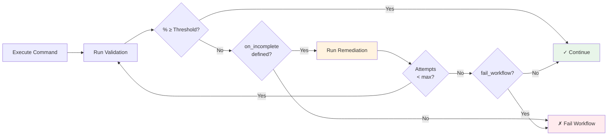

## Implementation Validation

Validate that implementations meet requirements using the `validate` field.



**Figure**: Validation flow showing threshold checking, remediation loop, and failure handling.

### Basic Validation

Run validation commands after a step completes:

```yaml title="Basic validation example"
- claude: "/implement-feature"
  validate:
    shell: "cargo test"
    threshold: 100  # Require 100% completion (default)
```

!!! note "Default Threshold"
    The `threshold` field defaults to **100** if not specified, requiring full implementation completion.

<!-- Source: src/cook/workflow/validation.rs:280-282 -->

### Validation with Claude

Use Claude to validate implementation quality:

```yaml title="Claude-based validation"
- shell: "generate-code.sh"
  validate:
    claude: "/verify-implementation"
    threshold: 95
```

### Multi-Step Validation

Run multiple validation commands in sequence using the `commands` array:

=== "Commands Array"

    ```yaml title="Multi-step validation"
    - claude: "/refactor"
      validate:
        commands:
          - shell: "cargo test"
          - shell: "cargo clippy"
          - shell: "cargo fmt --check"
        threshold: 100
    ```

=== "Convenience Array Syntax"

    ```yaml title="Simplified syntax"
    - claude: "/refactor"
      validate:
        - shell: "cargo test"
        - shell: "cargo clippy"
        - shell: "cargo fmt --check"
    ```

    !!! tip "When to Use"
        The convenience array syntax is ideal for simple validation pipelines without additional configuration like `threshold` or `timeout`.

### Validation with Result Files

Read validation results from a file instead of stdout:

```yaml title="File-based validation results"
- claude: "/implement-feature"
  validate:
    shell: "run-validator.sh"
    result_file: "validation-results.json"
    threshold: 95
```

!!! info "When to Use result_file"
    The `result_file` option is useful when you need to separate validation output from command logs:

    - **Complex JSON Output**: Validation produces structured JSON that shouldn't be mixed with logs
    - **Separate Concerns**: Keep validation results separate from command stdout/stderr
    - **Additional Logging**: Validation command produces diagnostic output alongside results
    - **Debugging**: Preserve validation output in a file for later inspection

The file must contain valid JSON matching the ValidationResult schema. When the validation command completes, Prodigy reads the specified file and parses it as JSON. If the file doesn't exist or contains invalid JSON, the validation fails.

<!-- Source: src/cook/workflow/executor/validation.rs:700-715 -->

#### Advanced: Result Files with Commands Array

You can use `result_file` with the `commands` array for multi-step validation where the final result is written to a file:

```yaml title="Multi-step with result file"
# Source: workflows/implement.yml:6-16
- claude: "/implement-spec $ARG"
  validate:
    commands:
      - claude: "/prodigy-validate-spec $ARG --output .prodigy/validation-result.json"
    result_file: ".prodigy/validation-result.json"  # (1)!
    threshold: 100
    on_incomplete:
      claude: "/prodigy-complete-spec $ARG --gaps ${validation.gaps}"
      max_attempts: 5
      commit_required: true
```

1. Prodigy reads this file after all commands complete to determine validation status.

### Handling Incomplete Implementations

Automatically remediate when validation fails to meet the threshold.

=== "Convenience Array Syntax"

    For simple remediation workflows:

    ```yaml title="Simple remediation"
    - claude: "/implement-spec"
      validate:
        shell: "check-completeness.sh"
        threshold: 100
        on_incomplete:
          - claude: "/fill-gaps"
          - shell: "cargo fmt"
    ```

=== "Verbose Configuration"

    For complex cases requiring additional control:

    ```yaml title="Verbose remediation config"
    - claude: "/implement-spec"
      validate:
        shell: "check-completeness.sh"
        threshold: 100
        on_incomplete:
          claude: "/fill-gaps"
          max_attempts: 2          # Default: 2 (not 3)
          fail_workflow: true      # Default: true
          commit_required: false   # Default: false
    ```

!!! warning "Default Values"
    Pay attention to the defaults:

    - `max_attempts`: **2** (maximum remediation attempts before giving up)
    - `fail_workflow`: **true** (workflow fails if remediation doesn't reach threshold)
    - `commit_required`: **false** (remediation command doesn't need to create a commit)

<!-- Source: src/cook/workflow/validation.rs:284-289 -->

The `on_incomplete` configuration supports:

| Field | Type | Default | Description |
|-------|------|---------|-------------|
| `claude` | String | None | Claude command to execute for gap-filling |
| `shell` | String | None | Shell command to execute for gap-filling |
| `commands` | Array | None | Array of commands to execute in sequence |
| `max_attempts` | Number | **2** | Maximum remediation attempts |
| `fail_workflow` | Boolean | **true** | Whether to fail workflow if remediation fails |
| `commit_required` | Boolean | **false** | Whether remediation command should create a commit |

<!-- Source: src/cook/workflow/validation.rs:123-152 -->

### Timeout Configuration

Set a timeout for validation commands to prevent hanging:

```yaml title="Validation with timeout"
- claude: "/implement-feature"
  validate:
    shell: "long-running-test.sh"
    threshold: 100
    timeout: 300  # 5 minutes timeout
```

!!! tip "Timeout Best Practices"
    The `timeout` field specifies the maximum number of seconds the validation command can run. If the command exceeds this time, it's terminated and the validation fails. Set timeouts generously for CI pipelines but tight enough to catch infinite loops.

<!-- Source: src/cook/workflow/validation.rs:37-39 -->

### ValidationResult Schema

When using `result_file`, the JSON file must match this structure:

```json title="ValidationResult schema"
{
  "completion_percentage": 95.5,
  "status": "incomplete",
  "implemented": [
    "Feature A is fully implemented",
    "Feature B includes unit tests"
  ],
  "missing": [
    "Feature C lacks error handling",
    "Feature D needs integration tests"
  ],
  "gaps": {
    "error_handling": {
      "description": "Missing error handling in parser",
      "location": "src/parser.rs:45",
      "severity": "high",
      "suggested_fix": "Add Result<T, E> return type and handle parse errors"
    }
  }
}
```

| Field | Type | Description |
|-------|------|-------------|
| `completion_percentage` | Float | 0-100 indicating implementation completeness |
| `status` | Enum | `"complete"`, `"incomplete"`, `"failed"`, or `"skipped"` |
| `implemented` | Array | Strings describing completed requirements |
| `missing` | Array | Strings describing incomplete requirements |
| `gaps` | Object | Map of gap IDs to GapDetail objects with description, location, severity, and suggested_fix |

<!-- Source: src/cook/workflow/validation.rs:216-239 -->

### Validation Patterns

#### Progressive Validation

Validate in stages, from fast checks to comprehensive tests:

```yaml title="Progressive validation pattern"
- claude: "/implement-feature"
  validate:
    commands:
      - shell: "cargo check"     # (1)!
      - shell: "cargo test"      # (2)!
      - shell: "cargo bench"     # (3)!
    threshold: 100
    timeout: 600  # 10 minute timeout for all commands
    on_incomplete:
      - claude: "/analyze-failures"
      - claude: "/fix-issues"
```

1. Fast syntax check runs first - fails quickly on compile errors
2. Unit tests run after syntax check passes
3. Benchmarks run last - only after tests pass

#### Conditional Validation

Validate based on previous results:

```yaml title="Conditional validation"
- claude: "/optimize-code"
  id: "optimization"
  validate:
    shell: "benchmark.sh"
    threshold: 90

- shell: "verify-performance.sh"
  when: "${optimization.success}"
  validate:
    shell: "stress-test.sh"
    threshold: 100
```

#### Complex Multi-Step Validation

Real-world pattern from Prodigy's debtmap workflow:

```yaml title="Complex validation with result files"
# Source: workflows/debtmap.yml:26-42
- claude: "/implement-changes"
  commit_required: true
  validate:
    commands:
      - shell: "just coverage-lcov"                                              # (1)!
      - shell: "debtmap analyze . --lcov target/coverage/lcov.info --output .prodigy/debtmap-after.json"
      - shell: "debtmap compare --before .prodigy/debtmap-before.json --after .prodigy/debtmap-after.json --output .prodigy/comparison.json"
      - claude: "/validate-improvement --comparison .prodigy/comparison.json --output .prodigy/validation.json"
    result_file: ".prodigy/validation.json"                                      # (2)!
    threshold: 75
    on_incomplete:
      commands:
        - claude: "/fix-remaining-gaps --validation .prodigy/validation.json"
          commit_required: true
        - shell: "just coverage-lcov"
        - shell: "debtmap analyze . --lcov target/coverage/lcov.info --output .prodigy/debtmap-after.json"
      max_attempts: 5                                                            # (3)!
      fail_workflow: true
```

1. Generate coverage data for debtmap analysis
2. Final validation result read from this JSON file
3. Allow up to 5 remediation attempts for complex debt fixes

!!! example "Pattern Highlights"
    This pattern demonstrates:

    - Multiple validation commands executed in sequence
    - Reading results from a file after all commands complete
    - Multi-command remediation with commit requirements
    - Iterative validation and fixing

### Configuration Reference

Complete list of validation configuration fields:

| Field | Type | Default | Description |
|-------|------|---------|-------------|
| `shell` | String | None | Shell command to run for validation |
| `claude` | String | None | Claude command to run for validation |
| `commands` | Array | None | Array of commands for multi-step validation |
| `threshold` | Number | **100** | Completion percentage required (0-100) |
| `timeout` | Number | None | Timeout in seconds for validation commands |
| `result_file` | String | None | File path to read validation results from |
| `on_incomplete` | Object | None | Configuration for handling validation failures |

<!-- Source: src/cook/workflow/validation.rs:11-49 -->
