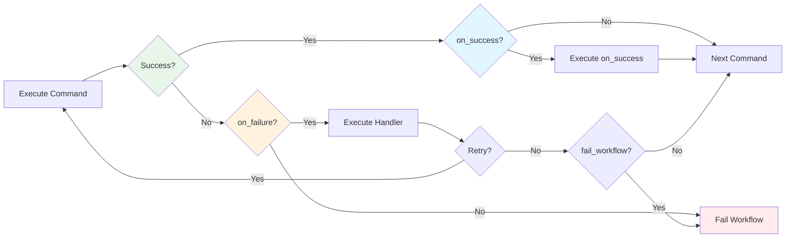
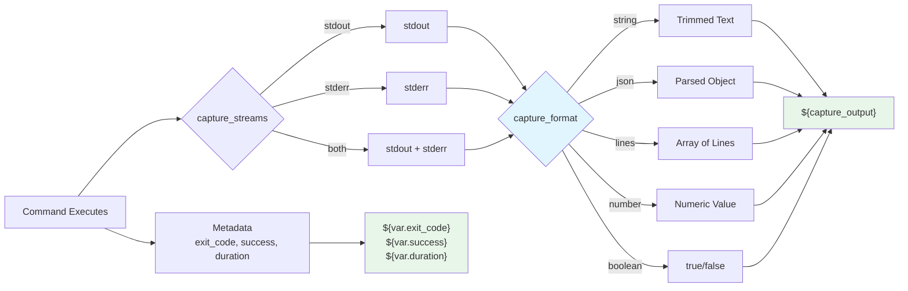

# Advanced Features

This chapter covers advanced workflow features for building sophisticated automation pipelines. These features enable conditional execution, parallel processing, validation, and complex control flow.

<div class="grid cards" markdown>

-   :material-state-machine:{ .lg .middle } **Sessions**

    ---

    Unified session tracking and lifecycle management for workflows

    [:octicons-arrow-right-24: Session Management](sessions.md)

-   :material-folder-multiple:{ .lg .middle } **Storage**

    ---

    Global storage architecture with cross-repository organization

    [:octicons-arrow-right-24: Storage Architecture](storage.md)

-   :material-git:{ .lg .middle } **Git Integration**

    ---

    Deep git integration with worktree isolation and smart merging

    [:octicons-arrow-right-24: Git Integration](git-integration.md)

-   :material-puzzle:{ .lg .middle } **Composition**

    ---

    Build complex workflows from reusable components and templates

    [:octicons-arrow-right-24: Workflow Composition](composition.md)

-   :material-chart-timeline:{ .lg .middle } **Observability**

    ---

    Comprehensive execution monitoring, logging, and debugging

    [:octicons-arrow-right-24: Observability](observability.md)

-   :material-check-decagram:{ .lg .middle } **Validation**

    ---

    Implementation completeness checking and quality gates

    [:octicons-arrow-right-24: Implementation Validation](implementation-validation.md)

</div>

---

## Conditional Execution

Control when commands execute based on expressions or previous command results.



**Figure**: Conditional execution flow showing how on_success and on_failure handlers are evaluated.

### Expression-Based Conditions

Use the `when` field to conditionally execute commands based on variable values:

```yaml
# Execute only when variable is true
- shell: "cargo build --release"
  when: "${tests_passed}"

# Execute based on complex expression
- shell: "deploy.sh"
  when: "${environment == 'production' && tests_passed}"
```

!!! tip "Variable Scoping"
    Variables used in `when` clauses must be defined earlier in the workflow, either from `capture_output`, environment variables, or workflow parameters.

#### Expression Syntax for When Clauses

The `when` clause supports a flexible expression syntax for conditional logic:

**Variable Interpolation:**
- Use `${variable}` to reference captured outputs or environment variables
- Variables are evaluated in the context of previous command results
- Boolean variables are evaluated as truthy/falsy values

**Comparison Operators:**
- `==` - Equality comparison (e.g., `${status == 'success'}`)
- `!=` - Inequality comparison (e.g., `${exit_code != 0}`)
- `>` - Greater than (e.g., `${score > 80}`)
- `<` - Less than (e.g., `${errors < 5}`)
- `>=` - Greater than or equal to (e.g., `${coverage >= 90}`)
- `<=` - Less than or equal to (e.g., `${warnings <= 10}`)
- `contains` - String matching (e.g., `${output contains 'success'}`)

**Logical Operators:**
- `&&` - Logical AND (e.g., `${tests_passed && build_succeeded}`)
- `||` - Logical OR (e.g., `${is_dev || is_staging}`)

**Type Coercion:**
- String values: Non-empty strings are truthy, empty strings are falsy
- Numeric values: Non-zero numbers are truthy, zero is falsy
- Boolean values: `true` is truthy, `false` is falsy

**Complex Expressions:**
```yaml
# Multiple conditions with logical operators
- shell: "deploy.sh"
  when: "${environment == 'production' && tests_passed && coverage >= 80}"

# Nested logic with parentheses
- shell: "run-checks.sh"
  when: "${(is_pr || is_main) && tests_passed}"

# Comparing captured outputs
- shell: "notify-team.sh"
  when: "${test-step.exit_code == 0 && build-step.success}"
```

### On Success Handlers

Execute follow-up commands when a command succeeds:

```yaml
- shell: "cargo test"
  on_success:
    shell: "cargo bench"
```

**Note**: The `on_success` field supports any workflow step command with all its features, including nested conditionals, output capture, validation, and error handlers. You can create complex success workflows by combining multiple handlers or using `when` clauses for sophisticated control flow.

**Complex On Success Example:**

The `on_success` field accepts a complete workflow step command with all its features:

```yaml
- shell: "cargo build --release"
  on_success:
    shell: "check-binary-size.sh"
    validate:
      threshold: 100
    on_failure:
      claude: "/optimize-binary-size"
      max_attempts: 2
```

**Source**: Based on WorkflowStepCommand structure (src/config/command.rs:321)

### On Failure Handlers

Handle failures with automatic remediation:

```yaml
- shell: "cargo clippy"
  on_failure:
    claude: "/fix-warnings"
    max_attempts: 3
    fail_workflow: false
    commit_required: true
```

The `on_failure` configuration supports:
- `max_attempts`: Maximum retry attempts (default: 3)
- `fail_workflow`: Whether to fail entire workflow on final failure (default: false)
- `commit_required`: Whether the remediation command should create a git commit (default: true)

!!! info "Default Values"
    These defaults come from the `TestDebugConfig` which provides sensible defaults for error recovery workflows.

**Source**: TestDebugConfig struct definition (src/config/command.rs:168-183)

### Nested Conditionals

Chain multiple levels of conditional execution:

```yaml
- shell: "cargo check"
  on_success:
    shell: "cargo build --release"
    on_success:
      shell: "cargo test --release"
      on_failure:
        claude: "/debug-failures '${shell.output}'"
```

!!! warning "Single Command Handlers"
    For multi-step error recovery, nest individual `on_failure` handlers at each step rather than using a commands array. The `TestDebugConfig` supports only a single `claude` command per handler.

---

## Output Capture and Variable Management

Capture command output in different formats for use in subsequent steps.



**Figure**: Output capture pipeline showing stream selection, format parsing, and variable binding.

### Capture Variable

Capture output to a named variable using the `capture_output` field:

```yaml
# Capture as string (backward compatible)
- shell: "git rev-parse HEAD"
  capture_output: "commit_hash"

# Reference in later steps
- shell: "echo 'Commit: ${commit_hash}'"
```

### Command-Agnostic Capture

The `last.*` variables capture output from any command type without needing explicit `capture_output`:

```yaml
# Shell command output
- shell: "cargo test"
  # Output automatically available as ${last.output} and ${last.exit_code}

# Use in next command (any type)
- claude: "/analyze ${last.output}"

# Or reference in conditional
- shell: "notify-failure.sh"
  when: "${last.exit_code != 0}"
```

**Available Variables:**
- `${last.output}` - Output from the last command of any type (shell, claude, etc.)
- `${last.exit_code}` - Exit code from the last command

!!! tip "Generic Workflows"
    These variables work across all command types, making them ideal for generic workflows where you don't want to hard-code command-specific variables like `${shell.output}` or `${claude.output}`.

**Source**: Variable constants defined in src/cook/workflow/variables.rs:35-36

### Capture Formats

Control how output is parsed with `capture_format`:

```yaml
# String (default) - trimmed output as single string
- shell: "git rev-parse HEAD"
  capture_output: "commit_hash"
  capture_format: "string"

# Number - parse output as number
- shell: "wc -l < file.txt"
  capture_output: "line_count"
  capture_format: "number"

# JSON - parse output as JSON object
- shell: "cargo metadata --format-version 1"
  capture_output: "metadata"
  capture_format: "json"

# Lines - split output into array of lines
- shell: "find . -name '*.rs'"
  capture_output: "rust_files"
  capture_format: "lines"

# Boolean - parse "true"/"false" as boolean
- shell: "test -f README.md && echo true || echo false"
  capture_output: "has_readme"
  capture_format: "boolean"
```

!!! warning "Parse Failure Behavior"
    If parsing fails (e.g., non-numeric output with `capture_format: number`), the command will fail with a descriptive error. Use `capture_format: string` (default) when output format is unreliable.

**Source**: CaptureFormat enum (src/cook/workflow/variables.rs:251-265)

### Stream Capture Control

The `capture_streams` field supports two formats for flexible output capture.

**Simple String Format** - For basic stream selection:

```yaml
# Capture only stdout (default)
- shell: "cargo build"
  capture_output: "build_log"
  capture_streams: "stdout"

# Capture only stderr
- shell: "cargo test"
  capture_output: "error_log"
  capture_streams: "stderr"

# Capture both streams merged
- shell: "npm install"
  capture_output: "install_log"
  capture_streams: "both"
```

!!! note "Automatic Metadata Capture"
    When using `capture_output`, Prodigy automatically captures execution metadata including exit code, success status, and duration. You don't need special configuration to access these fields.

**Captured Metadata Fields:**

When you capture output with `capture_output: "result"`, the following fields are automatically available:

```yaml
# Capture command output
- shell: "cargo test"
  capture_output: "test_result"

# Access captured fields
- shell: "echo 'Exit code: ${test_result.exit_code}'"
- shell: "echo 'Passed: ${test_result.success}'"
- shell: "echo 'Duration: ${test_result.duration}s'"
```

| Field | Type | Description |
|-------|------|-------------|
| `output` | string | The captured stdout/stderr content |
| `exit_code` | number | Command exit code (0 = success) |
| `success` | boolean | Whether command succeeded |
| `duration` | number | Execution time in seconds |

**Source**: CaptureStreams struct definition (src/cook/workflow/variables.rs:268-291)

**Stream Selection:**

The `capture_streams` field controls which output streams are captured. Use simple string values:

```yaml
# Capture stdout only (default)
- shell: "cargo build"
  capture_output: "build_log"
  capture_streams: "stdout"

# Capture stderr only (for error logs)
- shell: "cargo test"
  capture_output: "error_log"
  capture_streams: "stderr"

# Capture both streams merged
- shell: "npm install"
  capture_output: "install_log"
  capture_streams: "both"
```

**Source**: WorkflowStepCommand.capture_streams field (src/config/command.rs:392)

### Output File Redirection

Write output directly to a file instead of capturing it:

```yaml
# Redirect stdout to file
- shell: "cargo doc --no-deps"
  output_file: "docs/build.log"

# Combine with capture for dual output
- shell: "cargo test"
  capture_output: "test_status"
  output_file: "test-results.log"
```

### Execution Context

Configure where and how commands execute in your workflow.

!!! info "Environment Configuration"
    Step-level environment variable configuration (`env`, `clear_env`, `inherit`) and working directory (`working_dir`, `cwd`) are internal features available in the execution layer but not currently exposed in the YAML configuration layer.

    For workflow-level environment configuration, see the [Environment Variables](../workflow-basics/environment-configuration.md) section in Workflow Basics.

---

## Additional Topics

### Command Configuration

- [Step Identification](step-identification.md) - Name and reference workflow steps
- [Timeout Configuration](timeout-configuration.md) - Control command execution timeouts
- [Parallel Iteration with Foreach](parallel-iteration-with-foreach.md) - Simple parallel iteration patterns

### Advanced Capabilities

- [Sessions](sessions.md) - Unified session tracking and lifecycle management
- [Storage Architecture](storage.md) - Global storage with cross-repository organization
- [Git Integration](git-integration.md) - Worktree isolation and smart merging
- [Workflow Composition](composition.md) - Build workflows from reusable components
- [Observability](observability.md) - Execution monitoring and debugging
- [Implementation Validation](implementation-validation.md) - Completeness checking and quality gates
