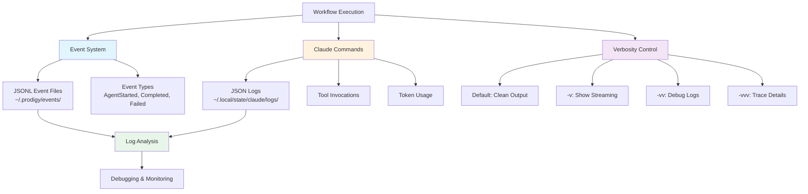
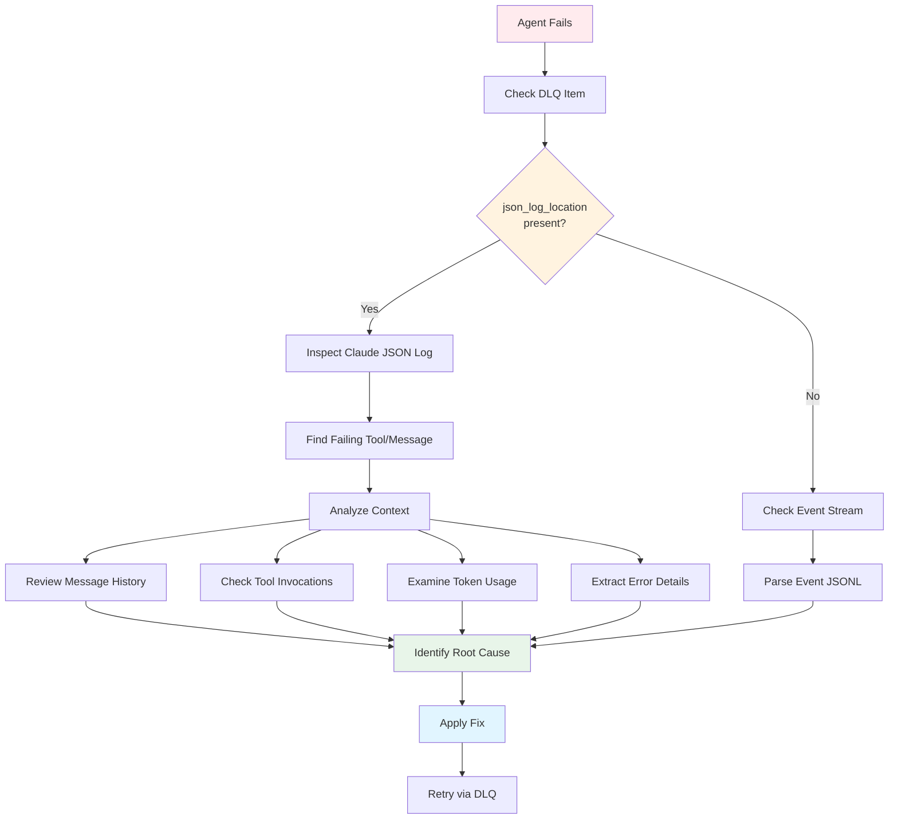

# Observability and Logging

Prodigy provides comprehensive execution monitoring and debugging through event tracking, Claude execution logs, and configurable verbosity levels.

## Overview

Observability features:
- **Event tracking**: JSONL event streams for all operations
- **Claude observability**: Detailed Claude execution logs with tool invocations
- **Verbosity control**: Granular output control from clean to trace-level
- **Log analysis**: Tools for inspecting execution history
- **Performance metrics**: Token usage and timing information



**Figure**: Prodigy's observability architecture showing event tracking, Claude logs, and verbosity control.

## Event Tracking

All workflow operations are logged to JSONL event files:

```
~/.prodigy/events/{repo_name}/{job_id}/
└── events-{timestamp}.jsonl
```

!!! tip "Event Storage Best Practice"
    Events are stored globally in `~/.prodigy/events/` to enable cross-worktree aggregation. Multiple worktrees working on the same job share the same event log, making it easy to monitor parallel execution.

### Event Types

**AgentStarted** - Agent execution begins:
```json
// Source: src/cook/execution/events/event_types.rs:41-47
{
  "type": "AgentStarted",
  "job_id": "mapreduce-123",
  "agent_id": "agent-1",
  "item_id": "item-1",
  "worktree": "agent-1-worktree",  // (1)!
  "attempt": 1  // (2)!
}
```

1. Git worktree where this agent executes
2. Attempt number (increments on retry)

**AgentCompleted** - Agent finishes successfully:
```json
// Source: src/cook/execution/events/event_types.rs:54-60
{
  "type": "AgentCompleted",  // (1)!
  "job_id": "mapreduce-123",  // (2)!
  "agent_id": "agent-1",  // (3)!
  "duration": {"secs": 30, "nanos": 0},  // (4)!
  "commits": ["abc123", "def456"],  // (5)!
  "json_log_location": "/path/to/logs/session-xyz.json"  // (6)!
}
```

1. Event type indicating successful completion
2. MapReduce job identifier
3. Unique agent identifier for this work item
4. Total execution time for the agent
5. Git commits created during execution
6. Path to Claude's detailed JSON log for debugging

**AgentFailed** - Agent encounters errors:
```json
// Source: src/cook/execution/events/event_types.rs:61-66
{
  "type": "AgentFailed",
  "job_id": "mapreduce-123",
  "agent_id": "agent-1",
  "error": "Timeout after 300 seconds",  // (1)!
  "retry_eligible": true  // (2)!
}
```

1. Error message describing the failure
2. Whether the agent can be retried via DLQ

!!! tip "Getting Full Error Context"
    For detailed error context including Claude conversation history and tool invocations, check the `json_log_location` field in `AgentCompleted` events or query the DLQ directly with `prodigy dlq show <job_id>`.

**AgentProgress** - Agent execution progress:
```json
// Source: src/cook/execution/events/event_types.rs:48-53
{
  "type": "AgentProgress",
  "job_id": "mapreduce-123",
  "agent_id": "agent-1",
  "step": "Analyzing files",
  "progress_pct": 45.0
}
```

**CheckpointCreated** - State persistence:
```json
// Source: src/cook/execution/events/event_types.rs:75-79
{
  "type": "CheckpointCreated",
  "job_id": "mapreduce-123",
  "version": 3,  // (1)!
  "agents_completed": 15  // (2)!
}
```

1. Checkpoint version number (increments with each checkpoint)
2. Number of agents that have completed at checkpoint time

**ClaudeMessage** - Claude interaction messages:
```json
// Source: src/cook/execution/events/event_types.rs:164-169
{
  "type": "ClaudeMessage",
  "agent_id": "agent-1",
  "content": "Analyzing file structure...",
  "message_type": "assistant",
  "json_log_location": "/path/to/logs/session-xyz.json"
}
```

### Event Organization

Events are organized by repository and job:
```
~/.prodigy/events/
└── prodigy/                    # (1)!
    ├── mapreduce-123/          # (2)!
    │   └── events-20250111.jsonl  # (3)!
    └── mapreduce-456/
        └── events-20250111.jsonl
```

1. Repository name for multi-repo support
2. Job ID groups all events for this MapReduce run
3. JSONL file with one event per line (append-only)

## Claude Observability

Detailed Claude execution logs capture complete interactions:

### JSON Log Location

Every Claude command creates a JSON log file:
```
~/.local/state/claude/logs/session-{session_id}.json
```

### Log Contents

Complete conversation history:
- User messages and prompts
- Claude responses
- Tool invocations with parameters
- Tool results
- Token usage statistics
- Error details and stack traces

### Accessing JSON Logs

**Via Verbose Output (-v flag)**:
```bash
prodigy run workflow.yml -v
```

Output includes log location:
```
Executing: claude /my-command
Claude JSON log: /Users/user/.local/state/claude/logs/session-abc123.json
✓ Command completed
```

**In MapReduce Events**:
```json
{
  "type": "AgentCompleted",
  "agent_id": "agent-1",
  "json_log_location": "/path/to/logs/session-xyz.json"
}
```

**In DLQ Items**:
```json
{
  "item_id": "item-1",
  "failure_history": [{
    "error": "Command failed",
    "json_log_location": "/path/to/logs/session-xyz.json"
  }]
}
```

### Analyzing JSON Logs

!!! example "Common Log Analysis Tasks"
    The examples below show how to extract specific information from Claude JSON logs using `jq`. These patterns are useful for debugging agent failures, tracking token usage, and understanding Claude's decision-making process.

**View complete conversation**:
```bash
cat ~/.local/state/claude/logs/session-abc123.json | jq '.messages'
```

**Check tool invocations**:
```bash
cat ~/.local/state/claude/logs/session-abc123.json | \
  jq '.messages[].content[] | select(.type == "tool_use")'
```

**Analyze token usage**:
```bash
cat ~/.local/state/claude/logs/session-abc123.json | jq '.usage'
```

**Extract errors**:
```bash
cat ~/.local/state/claude/logs/session-abc123.json | \
  jq '.messages[] | select(.role == "assistant") | .content[] | select(.type == "error")'
```

## Verbosity Control

Granular output control with verbosity flags:

!!! tip "Choosing the Right Verbosity Level"
    Start with default output for production workflows. Use `-v` when debugging Claude interactions or when you need to see streaming output. Reserve `-vv` and `-vvv` for deep troubleshooting of Prodigy internals.

### Levels

**Default (verbosity = 0)**:
- Clean, minimal output
- Progress indicators
- Results only

**Verbose (-v, verbosity = 1)**:
- Claude streaming JSON output
- Command execution details
- Log file locations

**Debug (-vv, verbosity = 2)**:
- Internal debug logs
- Execution traces
- State transitions

**Trace (-vvv, verbosity = 3)**:
- Trace-level internal logging
- Full execution details
- Performance metrics

### Usage

```bash
# Default: clean output
prodigy run workflow.yml

# Verbose: show Claude streaming
prodigy run workflow.yml -v

# Debug: internal logs
prodigy run workflow.yml -vv

# Trace: maximum detail
prodigy run workflow.yml -vvv
```

### Environment Override

Force streaming output regardless of verbosity:
```bash
export PRODIGY_CLAUDE_CONSOLE_OUTPUT=true
prodigy run workflow.yml
```

## Debugging MapReduce Failures

### Using JSON Logs

When a MapReduce agent fails, use this debugging workflow:



**Figure**: MapReduce debugging workflow showing how to trace failures using JSON logs and events.

When a MapReduce agent fails:

1. **Check DLQ for json_log_location**:
```bash
prodigy dlq show <job_id> | jq '.items[].failure_history[].json_log_location'
```

2. **Inspect the Claude JSON log**:
```bash
cat /path/from/step1/session-xyz.json | jq
```

3. **Identify failing tool**:
```bash
cat /path/from/step1/session-xyz.json | jq '.messages[-3:]'
```

4. **Understand context**:
- Review full conversation history
- Check tool invocations and results
- Examine token usage for context issues
- Look for error messages

## Performance Metrics

### Token Usage

Track token consumption:
```json
{
  "usage": {
    "input_tokens": 1234,
    "output_tokens": 567,
    "cache_read_tokens": 89,
    "cache_creation_tokens": 0
  }
}
```

### Execution Timing

Monitor performance:
```json
{
  "timings": {
    "step1": {"secs": 10, "nanos": 500000000},
    "step2": {"secs": 25, "nanos": 0},
    "total": {"secs": 35, "nanos": 500000000}
  }
}
```

## Event Query Examples

### Correlation IDs

Events include optional correlation IDs for tracing related operations across multiple agents:

```json
// Source: src/storage/types.rs:75
{
  "type": "AgentStarted",
  "job_id": "mapreduce-123",  // (1)!
  "agent_id": "agent-1",  // (2)!
  "correlation_id": "trace-abc-123",  // (3)!
  "timestamp": "2025-01-11T12:00:00Z"
}
```

1. Job identifier - groups all agents in this MapReduce run
2. Agent identifier - unique to this work item
3. Correlation ID - traces related operations across agents (optional)

**Filter events by correlation ID**:
```bash
# Source: src/cook/execution/events/filter.rs:63
# Find all events related to a specific workflow trace
cat ~/.prodigy/events/prodigy/mapreduce-123/events-*.jsonl | \
  jq -c 'select(.correlation_id == "trace-abc-123")'
```

**Track an agent workflow end-to-end**:
```bash
# Get correlation ID from initial event
CORRELATION_ID=$(cat events.jsonl | jq -r 'select(.type == "AgentStarted") | .correlation_id' | head -1)

# Find all related events
cat events.jsonl | jq -c "select(.correlation_id == \"$CORRELATION_ID\")"
```

### Find Failed Agents

```bash
cat ~/.prodigy/events/prodigy/mapreduce-123/events-*.jsonl | \
  jq -c 'select(.type == "AgentFailed")'
```

### Calculate Success Rate

```bash
# Count completed
completed=$(cat events.jsonl | jq 'select(.type == "AgentCompleted")' | wc -l)

# Count failed
failed=$(cat events.jsonl | jq 'select(.type == "AgentFailed")' | wc -l)

# Calculate rate
echo "Success rate: $(($completed * 100 / ($completed + $failed)))%"
```

### Find Slowest Agents

```bash
cat events.jsonl | \
  jq -c 'select(.type == "AgentCompleted") | {agent_id, duration: .duration.secs}' | \
  sort -k2 -n -r | \
  head -10
```

## Log Management

### Log Locations

=== "Linux"
    ```bash
    # Prodigy events
    ~/.prodigy/events/{repo_name}/{job_id}/

    # Claude logs
    ~/.local/state/claude/logs/

    # Session state
    ~/.prodigy/sessions/

    # Checkpoints
    ~/.prodigy/state/{repo_name}/
    ```

=== "macOS"
    ```bash
    # Prodigy events
    ~/.prodigy/events/{repo_name}/{job_id}/

    # Claude logs
    ~/.local/state/claude/logs/

    # Session state
    ~/.prodigy/sessions/

    # Checkpoints
    ~/.prodigy/state/{repo_name}/
    ```

=== "Windows"
    ```powershell
    # Prodigy events
    %USERPROFILE%\.prodigy\events\{repo_name}\{job_id}\

    # Claude logs
    %USERPROFILE%\.local\state\claude\logs\

    # Session state
    %USERPROFILE%\.prodigy\sessions\

    # Checkpoints
    %USERPROFILE%\.prodigy\state\{repo_name}\
    ```

!!! warning "Log Storage Considerations"
    Claude JSON logs can grow large with extensive tool usage. Monitor disk space when running many MapReduce agents. Consider setting up automated cleanup for logs older than 30 days in production environments.

### Cleanup

```bash
# Clean old event logs (older than 30 days)
find ~/.prodigy/events -name "*.jsonl" -mtime +30 -delete

# Clean old Claude logs
find ~/.local/state/claude/logs -name "*.json" -mtime +30 -delete

# Clean completed sessions
prodigy sessions clean --completed
```

## Examples

### Debug Workflow Failure

```bash
# Run with verbose output
prodigy run workflow.yml -v

# Check event log for errors
cat ~/.prodigy/events/prodigy/latest/events-*.jsonl | \
  jq -c 'select(.type == "AgentFailed")'

# Inspect Claude log
cat $(jq -r '.json_log_location' dlq-item.json) | jq '.messages[-5:]'
```

### Monitor MapReduce Progress

```bash
# Run in verbose mode
prodigy run mapreduce.yml -v &

# Watch event stream
tail -f ~/.prodigy/events/prodigy/mapreduce-123/events-*.jsonl | \
  jq -c 'select(.type == "AgentCompleted")'
```

### Analyze Token Usage

```bash
# Extract token usage from all agents
for log in ~/.local/state/claude/logs/session-*.json; do
  echo "$log:"
  jq '.usage' "$log"
done
```
