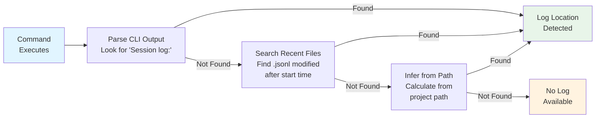
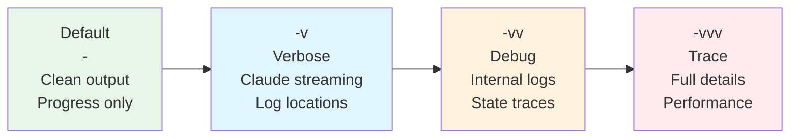

# Claude Observability

Detailed Claude execution logs capture complete interactions.

## JSON Log Location

Every Claude command creates a JSONL (newline-delimited JSON) log file in the project-based storage:

```
~/.claude/projects/{sanitized-project-path}/{session-id}.jsonl
```

!!! note "Path Sanitization"
    Claude sanitizes project paths by replacing `/` with `-` and removing leading slashes.
    For example, a project at `/Users/glen/prodigy` creates logs in:
    ```
    ~/.claude/projects/Users-glen-prodigy/{session-id}.jsonl
    ```

## Log Detection Strategies

Prodigy uses multiple strategies to detect Claude log locations, trying each in sequence until successful:



1. **Parse CLI output** - Look for log location in Claude's output (e.g., "Session log: /path/to/log.jsonl")
2. **Search recent files** - Find `.jsonl` files modified after command execution start
3. **Infer from project path** - Calculate expected location based on sanitized project path

```rust
// Source: src/cook/execution/claude_log_detection.rs:25-57
pub async fn detect_json_log_location(
    project_path: &Path,
    cli_output: &str,
    execution_start: SystemTime,
) -> Option<PathBuf>
```

## Log Contents

Complete conversation history:

- User messages and prompts
- Claude responses
- Tool invocations with parameters
- Tool results
- Token usage statistics
- Error details and stack traces

!!! warning "Log Storage Considerations"
    Claude logs can grow large for long-running sessions, especially with verbose tool outputs. For MapReduce workflows with many agents, monitor disk usage in `~/.claude/projects/`. Consider periodic cleanup of old log files.

## Accessing JSON Logs

**Via Prodigy Logs Command (Recommended)**:
```bash
# View the most recent Claude log
prodigy logs --latest

# Follow live execution
prodigy logs --latest --tail
```

**Via Verbose Output (-v flag)**:
```bash
prodigy run workflow.yml -v
```

Output includes log location:
```
Executing: claude /my-command
Claude JSON log: /Users/user/.claude/projects/Users-user-myproject/abc123.jsonl
✓ Command completed
```

**In MapReduce Events**:
```json
{
  "type": "AgentCompleted",
  "agent_id": "agent-1",
  "json_log_location": "/Users/user/.claude/projects/.../session-xyz.jsonl"
}
```

**In DLQ Items**:
```json
{
  "item_id": "item-1",
  "failure_history": [{
    "error": "Command failed",
    "json_log_location": "/Users/user/.claude/projects/.../session-xyz.jsonl"
  }]
}
```

## Analyzing JSON Logs

!!! example "Common Log Analysis Tasks"
    The examples below show how to extract specific information from Claude JSONL logs using `jq`. Note that `.jsonl` files contain newline-delimited JSON (one JSON object per line), so you need to process each line separately.

**View assistant messages**:
```bash
# Source: Each line is a separate JSON object
cat ~/.claude/projects/{project-path}/{session-id}.jsonl | \
  jq -c 'select(.type == "assistant")'
```

**Check tool invocations**:
```bash
cat ~/.claude/projects/{project-path}/{session-id}.jsonl | \
  jq -c 'select(.type == "tool_use")'
```

**Analyze token usage**:
```bash
cat ~/.claude/projects/{project-path}/{session-id}.jsonl | \
  jq -c 'select(.usage != null) | .usage'
```

**Extract errors**:
```bash
cat ~/.claude/projects/{project-path}/{session-id}.jsonl | \
  jq -c 'select(.type == "error" or .error != null)'
```

**View last 3 messages**:
```bash
cat ~/.claude/projects/{project-path}/{session-id}.jsonl | \
  jq -c 'select(.type == "assistant" or .type == "user")' | tail -3
```

!!! tip "Finding Log Paths"
    Use `prodigy logs --latest` to quickly find the most recent log file path, or check the DLQ for failed agent log locations:
    ```bash
    prodigy dlq show <job_id> | jq '.items[].failure_history[].json_log_location'
    ```

## Verbosity Control

Granular output control with verbosity flags:



!!! tip "Choosing the Right Verbosity Level"
    Start with default output for production workflows. Use `-v` when debugging Claude interactions or when you need to see streaming output. Reserve `-vv` and `-vvv` for deep troubleshooting of Prodigy internals.

### Levels

**Default (verbosity = 0)**:

- Clean, minimal output
- Progress indicators
- Results only

**Verbose (-v, verbosity = 1)**:

- Claude streaming JSON output
- Command execution details
- Log file locations

**Debug (-vv, verbosity = 2)**:

- Internal debug logs
- Execution traces
- State transitions

**Trace (-vvv, verbosity = 3)**:

- Trace-level internal logging
- Full execution details
- Performance metrics

### Usage

```bash
# Default: clean output
prodigy run workflow.yml

# Verbose: show Claude streaming
prodigy run workflow.yml -v

# Debug: internal logs
prodigy run workflow.yml -vv

# Trace: maximum detail
prodigy run workflow.yml -vvv
```

### Environment Overrides

**Force streaming output** regardless of verbosity:
```bash
export PRODIGY_CLAUDE_CONSOLE_OUTPUT=true
prodigy run workflow.yml
```

**Disable JSON streaming** (useful for CI/automated environments):
```bash
export PRODIGY_CLAUDE_STREAMING=false
prodigy run workflow.yml
```
