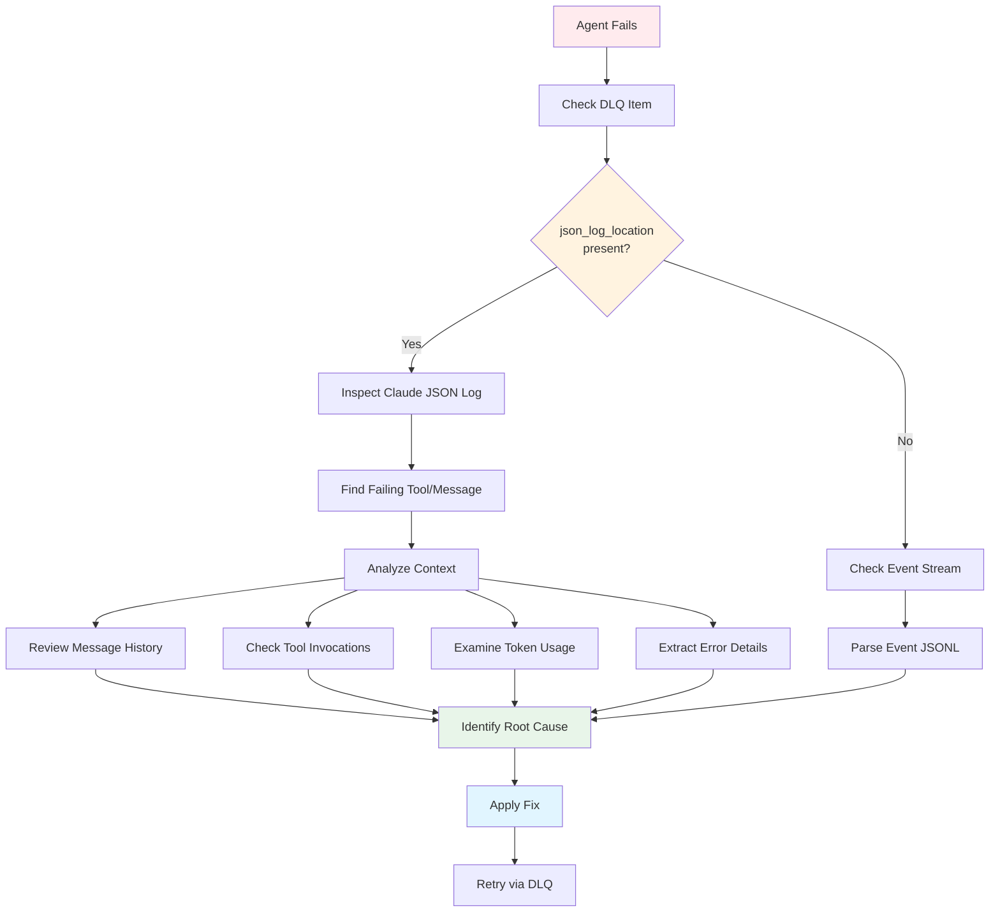
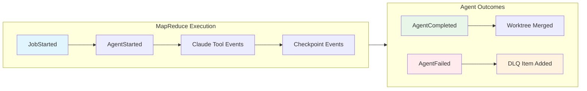

# Debugging MapReduce Failures

## Using JSON Logs

When a MapReduce agent fails, use this debugging workflow:



**Figure**: MapReduce debugging workflow showing how to trace failures using JSON logs and events.

When a MapReduce agent fails:

1. **Check DLQ for json_log_location**:
```bash
prodigy dlq show <job_id> | jq '.items[].failure_history[].json_log_location'
```

2. **Inspect the Claude JSON log**:

=== "Pretty Print"
    ```bash
    cat /path/from/step1/session-xyz.json | jq
    ```

=== "Raw Output"
    ```bash
    cat /path/from/step1/session-xyz.json
    ```

=== "Last Messages Only"
    ```bash
    cat /path/from/step1/session-xyz.json | jq '.messages[-5:]'
    ```

3. **Identify failing tool**:

=== "Recent Context"
    ```bash
    cat /path/from/step1/session-xyz.json | jq '.messages[-3:]'
    ```

=== "Tool Calls Only"
    ```bash
    cat /path/from/step1/session-xyz.json | jq '[.messages[] | select(.type == "tool_use")]'
    ```

=== "Errors Only"
    ```bash
    cat /path/from/step1/session-xyz.json | jq '[.messages[] | select(.content | test("error"; "i"))]'
    ```

4. **Understand context**:
- Review full conversation history
- Check tool invocations and results
- Examine token usage for context issues
- Look for error messages

## Performance Metrics

### Token Usage

!!! tip "Key Metrics to Monitor"
    - **input_tokens**: Prompt size - watch for context overflow
    - **output_tokens**: Response size - may indicate verbosity issues
    - **cache_read_tokens**: Cache hits - higher is better for performance
    - **cache_creation_tokens**: Cache misses - high values may slow execution

Track token consumption:
```json
{
  "usage": {
    "input_tokens": 1234,
    "output_tokens": 567,
    "cache_read_tokens": 89,
    "cache_creation_tokens": 0
  }
}
```

### Execution Timing

!!! warning "Performance Thresholds"
    - Steps taking >60s may indicate tool timeouts
    - High variance between agents suggests uneven workload distribution
    - Total time >5min per agent warrants investigation

Monitor performance:
```json
{
  "timings": {
    "step1": {"secs": 10, "nanos": 500000000},
    "step2": {"secs": 25, "nanos": 0},
    "total": {"secs": 35, "nanos": 500000000}
  }
}
```

## Event Query Examples

### Correlation IDs

!!! note "When to Use Correlation IDs"
    Correlation IDs are essential when debugging issues that span multiple agents or phases. Use them to trace a request through the entire MapReduce pipeline, from setup through agent execution to reduce.

Events include optional correlation IDs for tracing related operations across multiple agents:

```json
// Source: src/storage/types.rs:75
{
  "type": "AgentStarted",
  "job_id": "mapreduce-123",  // (1)!
  "agent_id": "agent-1",  // (2)!
  "correlation_id": "trace-abc-123",  // (3)!
  "timestamp": "2025-01-11T12:00:00Z"
}
```

1. Job identifier - groups all agents in this MapReduce run
2. Agent identifier - unique to this work item
3. Correlation ID - traces related operations across agents (optional)

**Filter events by correlation ID**:
```bash
# Source: src/cook/execution/events/filter.rs:63
# Find all events related to a specific workflow trace
cat ~/.prodigy/events/prodigy/mapreduce-123/events-*.jsonl | \
  jq -c 'select(.correlation_id == "trace-abc-123")'
```

**Track an agent workflow end-to-end**:
```bash
# Get correlation ID from initial event
CORRELATION_ID=$(cat events.jsonl | jq -r 'select(.type == "AgentStarted") | .correlation_id' | head -1)

# Find all related events
cat events.jsonl | jq -c "select(.correlation_id == \"$CORRELATION_ID\")"
```

### Find Failed Agents

```bash
cat ~/.prodigy/events/prodigy/mapreduce-123/events-*.jsonl | \
  jq -c 'select(.type == "AgentFailed")'
```

### Calculate Success Rate

```bash
# Count completed
completed=$(cat events.jsonl | jq 'select(.type == "AgentCompleted")' | wc -l)

# Count failed
failed=$(cat events.jsonl | jq 'select(.type == "AgentFailed")' | wc -l)

# Calculate rate
echo "Success rate: $(($completed * 100 / ($completed + $failed)))%"
```

### Find Slowest Agents

```bash
cat events.jsonl | \
  jq -c 'select(.type == "AgentCompleted") | {agent_id, duration: .duration.secs}' | \
  sort -k2 -n -r | \
  head -10
```

### Filter by Time Range

```bash
# Source: src/cook/execution/events/filter.rs:14-21
# Filter events within a specific time window
cat events.jsonl | \
  jq -c 'select(.timestamp >= "2025-01-11T12:00:00Z" and .timestamp <= "2025-01-11T13:00:00Z")'
```

### Filter by Event Type

```bash
# Source: src/cook/execution/events/filter.rs:46-53
# Filter for specific event types
cat events.jsonl | \
  jq -c 'select(.event_type == "checkpoint_created" or .event_type == "agent_completed")'
```

## Additional Event Types

The event system tracks many events useful for debugging specific scenarios:



**Figure**: Event flow during MapReduce execution showing the progression from job start through agent outcomes.

### Claude-Specific Events

!!! example "Debugging Tool Failures"
    When an agent fails during a tool invocation, use `claude_tool_invoked` events to identify the exact tool and parameters that caused the failure. Cross-reference with the JSON log for full context.

Debug Claude interactions by tracking tool invocations and token usage:

```json
// Source: src/cook/execution/events/event_types.rs:145-157
{
  "event_type": "claude_tool_invoked",
  "agent_id": "agent-1",
  "tool_name": "Edit",
  "tool_id": "tool_xyz",
  "parameters": {"file_path": "/src/main.rs"},
  "timestamp": "2025-01-11T12:05:00Z"
}
```

```bash
# Find all tool invocations for an agent
cat events.jsonl | jq -c 'select(.event_type == "claude_tool_invoked" and .agent_id == "agent-1")'

# Track token consumption across agents
cat events.jsonl | jq -c 'select(.event_type == "claude_token_usage") | {agent_id, input_tokens, output_tokens}'
```

### Checkpoint Events

Track checkpoint creation for debugging state issues:

```json
// Source: src/cook/execution/events/event_types.rs:74-87
{
  "event_type": "checkpoint_created",
  "job_id": "mapreduce-123",
  "version": 5,
  "agents_completed": 42
}
```

```bash
# Monitor checkpoint progress
cat events.jsonl | jq -c 'select(.event_type | startswith("checkpoint"))'
```

### DLQ Events

!!! warning "Repeated DLQ Entries"
    If you see the same `item_id` with increasing `failure_count`, the retry mechanism is struggling. Check the `error_signature` pattern to identify systematic issues before retrying again.

Track items entering the Dead Letter Queue:

```json
// Source: src/cook/execution/events/event_types.rs:121-126
{
  "event_type": "dlq_item_added",
  "job_id": "mapreduce-123",
  "item_id": "work-item-99",
  "error_signature": "timeout_exceeded",
  "failure_count": 3
}
```

```bash
# Find all DLQ additions with error patterns
cat events.jsonl | jq -c 'select(.event_type == "dlq_item_added") | {item_id, error_signature, failure_count}'
```

### Worktree Events

Debug worktree lifecycle issues:

```bash
# Track worktree creation and cleanup
cat events.jsonl | jq -c 'select(.event_type | startswith("worktree"))'

# Find agents whose worktrees failed to merge
cat events.jsonl | jq -c 'select(.event_type == "worktree_created" and .agent_id == "agent-X")'
# Then check if corresponding worktree_merged event exists
```
