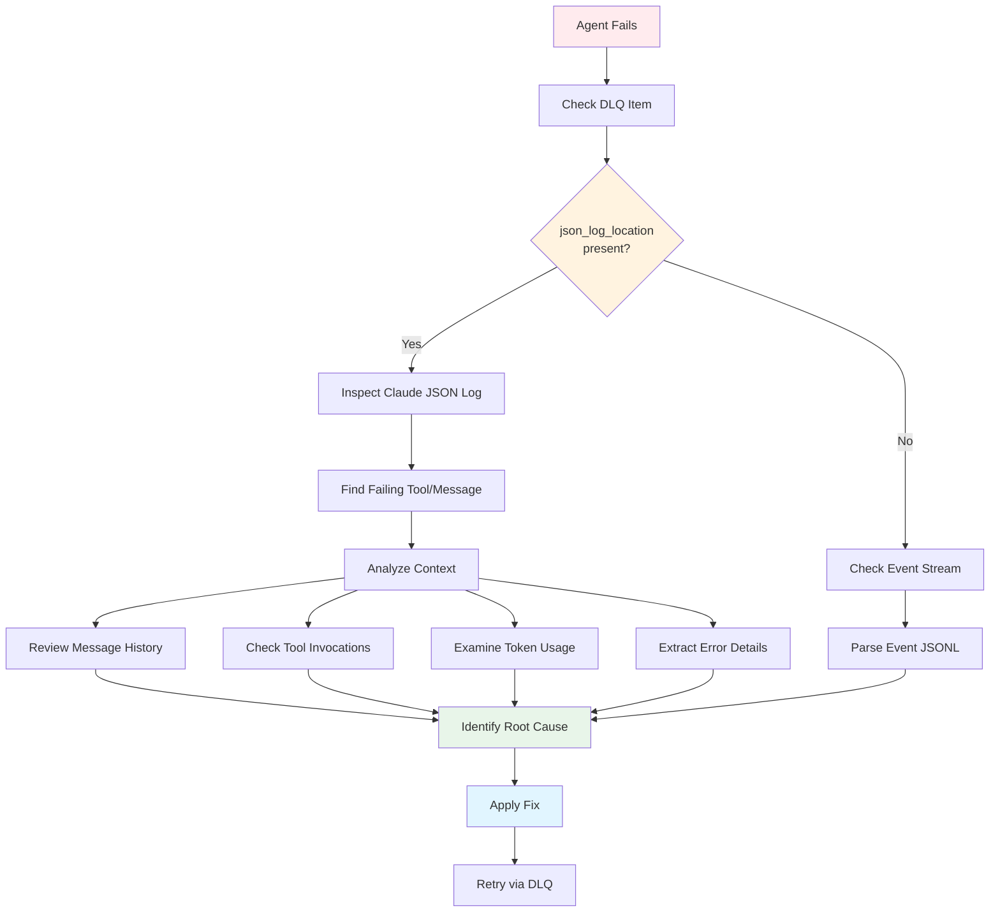

# Debugging MapReduce Failures

## Using JSON Logs

When a MapReduce agent fails, use this debugging workflow:



**Figure**: MapReduce debugging workflow showing how to trace failures using JSON logs and events.

When a MapReduce agent fails:

1. **Check DLQ for json_log_location**:
```bash
prodigy dlq show <job_id> | jq '.items[].failure_history[].json_log_location'
```

2. **Inspect the Claude JSON log**:
```bash
cat /path/from/step1/session-xyz.json | jq
```

3. **Identify failing tool**:
```bash
cat /path/from/step1/session-xyz.json | jq '.messages[-3:]'
```

4. **Understand context**:
- Review full conversation history
- Check tool invocations and results
- Examine token usage for context issues
- Look for error messages

## Performance Metrics

### Token Usage

Track token consumption:
```json
{
  "usage": {
    "input_tokens": 1234,
    "output_tokens": 567,
    "cache_read_tokens": 89,
    "cache_creation_tokens": 0
  }
}
```

### Execution Timing

Monitor performance:
```json
{
  "timings": {
    "step1": {"secs": 10, "nanos": 500000000},
    "step2": {"secs": 25, "nanos": 0},
    "total": {"secs": 35, "nanos": 500000000}
  }
}
```

## Event Query Examples

### Correlation IDs

Events include optional correlation IDs for tracing related operations across multiple agents:

```json
// Source: src/storage/types.rs:75
{
  "type": "AgentStarted",
  "job_id": "mapreduce-123",  // (1)!
  "agent_id": "agent-1",  // (2)!
  "correlation_id": "trace-abc-123",  // (3)!
  "timestamp": "2025-01-11T12:00:00Z"
}
```

1. Job identifier - groups all agents in this MapReduce run
2. Agent identifier - unique to this work item
3. Correlation ID - traces related operations across agents (optional)

**Filter events by correlation ID**:
```bash
# Source: src/cook/execution/events/filter.rs:63
# Find all events related to a specific workflow trace
cat ~/.prodigy/events/prodigy/mapreduce-123/events-*.jsonl | \
  jq -c 'select(.correlation_id == "trace-abc-123")'
```

**Track an agent workflow end-to-end**:
```bash
# Get correlation ID from initial event
CORRELATION_ID=$(cat events.jsonl | jq -r 'select(.type == "AgentStarted") | .correlation_id' | head -1)

# Find all related events
cat events.jsonl | jq -c "select(.correlation_id == \"$CORRELATION_ID\")"
```

### Find Failed Agents

```bash
cat ~/.prodigy/events/prodigy/mapreduce-123/events-*.jsonl | \
  jq -c 'select(.type == "AgentFailed")'
```

### Calculate Success Rate

```bash
# Count completed
completed=$(cat events.jsonl | jq 'select(.type == "AgentCompleted")' | wc -l)

# Count failed
failed=$(cat events.jsonl | jq 'select(.type == "AgentFailed")' | wc -l)

# Calculate rate
echo "Success rate: $(($completed * 100 / ($completed + $failed)))%"
```

### Find Slowest Agents

```bash
cat events.jsonl | \
  jq -c 'select(.type == "AgentCompleted") | {agent_id, duration: .duration.secs}' | \
  sort -k2 -n -r | \
  head -10
```
