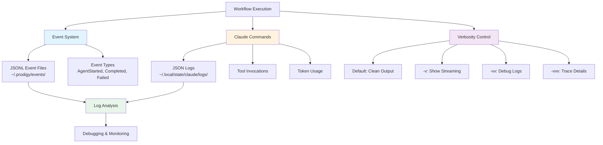

# Observability and Logging

Prodigy provides comprehensive execution monitoring and debugging through event tracking, Claude execution logs, and configurable verbosity levels.

## Overview

Observability features:
- **Event tracking**: JSONL event streams for all operations
- **Claude observability**: Detailed Claude execution logs with tool invocations
- **Verbosity control**: Granular output control from clean to trace-level
- **Log analysis**: Tools for inspecting execution history
- **Performance metrics**: Token usage and timing information

**Figure**: Prodigy's observability architecture showing event tracking, Claude logs, and verbosity control.

## Subpages

- [Event Tracking](event-tracking.md) - JSONL event streams and event types
- [Claude Observability](claude-observability.md) - Claude execution logs and verbosity control
- [Debugging](debugging.md) - Debugging MapReduce failures, performance metrics, and event queries
- [Log Management](log-management.md) - Log locations, cleanup, and practical examples
