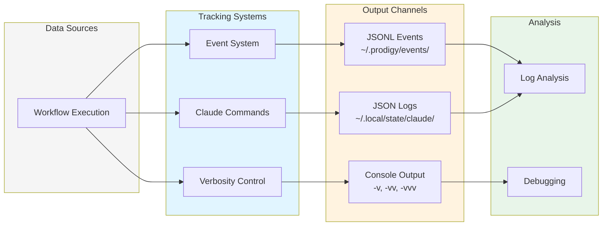

# Observability and Logging

Prodigy provides comprehensive execution monitoring and debugging through event tracking, Claude execution logs, and configurable verbosity levels.

## Overview

Observability features:
- **Event tracking**: JSONL event streams for all operations
- **Claude observability**: Detailed Claude execution logs with tool invocations
- **Verbosity control**: Granular output control from clean to trace-level
- **Log analysis**: Tools for inspecting execution history
- **Performance metrics**: Token usage and timing information



**Figure**: Prodigy's observability architecture showing event tracking, Claude logs, and verbosity control.

!!! tip "Quick Access"
    View the latest Claude execution log:
    ```bash
    prodigy logs --latest
    ```
    Follow live execution output:
    ```bash
    prodigy logs --latest --tail
    ```

!!! note "Log Storage"
    Prodigy stores observability data in two locations:

    - **Prodigy events**: `~/.prodigy/events/{repo}/{job_id}/`
    - **Claude logs**: `~/.local/state/claude/logs/`

    Both locations grow over time. See [Log Management](log-management.md) for cleanup strategies.

## When to Use Each Feature

| Situation | Feature | Command/Location |
|-----------|---------|------------------|
| Understanding workflow execution flow | Event Tracking | `~/.prodigy/events/{repo}/{job_id}/` |
| Debugging Claude command failures | Claude Observability | `prodigy logs --latest` |
| Increasing output detail for troubleshooting | Verbosity Control | `-v`, `-vv`, or `-vvv` flags |
| Investigating MapReduce agent failures | Debugging | DLQ + JSON logs |
| Cleaning up old logs | Log Management | `prodigy logs clean` |

## Subpages

<div class="grid cards" markdown>

-   :material-format-list-bulleted-type: **[Event Tracking](event-tracking.md)**

    ---

    JSONL event streams capturing workflow lifecycle: AgentStarted, AgentCompleted, AgentFailed, and more. Query events with `jq` for custom analysis.

-   :material-robot: **[Claude Observability](claude-observability.md)**

    ---

    Detailed Claude execution logs with complete message history, tool invocations, and token usage. Access via `prodigy logs` command.

-   :material-bug: **[Debugging](debugging.md)**

    ---

    Debug MapReduce failures using DLQ integration, analyze performance metrics, and query events for monitoring.

-   :material-folder-cog: **[Log Management](log-management.md)**

    ---

    Log storage locations, cleanup strategies, retention policies, and practical examples for log analysis.

</div>
