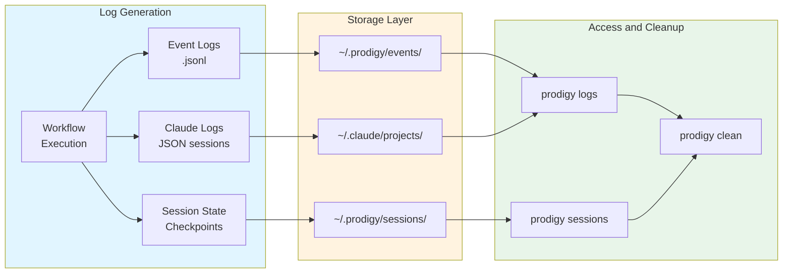

# Log Management

Prodigy generates logs at multiple layers to support debugging, monitoring, and auditing. Understanding log flow helps you diagnose issues and maintain storage efficiently.



## Log Locations

=== "Linux"
    ```bash
    # Prodigy events
    ~/.prodigy/events/{repo_name}/{job_id}/

    # Claude logs
    ~/.claude/projects/

    # Session state
    ~/.prodigy/sessions/

    # Checkpoints
    ~/.prodigy/state/{repo_name}/
    ```

=== "macOS"
    ```bash
    # Prodigy events
    ~/.prodigy/events/{repo_name}/{job_id}/

    # Claude logs
    ~/.claude/projects/

    # Session state
    ~/.prodigy/sessions/

    # Checkpoints
    ~/.prodigy/state/{repo_name}/
    ```

=== "Windows"
    ```powershell
    # Prodigy events
    %USERPROFILE%\.prodigy\events\{repo_name}\{job_id}\

    # Claude logs
    %USERPROFILE%\.claude\projects\

    # Session state
    %USERPROFILE%\.prodigy\sessions\

    # Checkpoints
    %USERPROFILE%\.prodigy\state\{repo_name}\
    ```

!!! warning "Log Storage Considerations"
    Claude JSON logs can grow large with extensive tool usage. Monitor disk space when running many MapReduce agents. Consider setting up automated cleanup for logs older than 30 days in production environments.

## Viewing Logs

!!! tip "Real-time Monitoring"
    For live debugging during workflow execution, use the `-v` flag with your workflow command (`prodigy run workflow.yml -v`) to see Claude output in real-time, rather than inspecting logs after the fact.

Use the `prodigy logs` command to view and analyze Claude execution logs:

```bash
# List recent Claude logs
prodigy logs                        # (1)!

# View the latest log
prodigy logs --latest               # (2)!

# Follow latest log in real-time (useful during execution)
prodigy logs --latest --tail        # (3)!

# Show summary of latest log
prodigy logs --latest --summary     # (4)!

# View logs for a specific session
prodigy logs <session-id>           # (5)!
```

1. Lists all available Claude logs sorted by recency
2. Opens the most recent log file for inspection
3. Continuously streams new log entries as they're written
4. Displays token usage, duration, and key events
5. Filters logs to a specific workflow session

## Cleanup

!!! note "Dry Run First"
    Always use `--dry-run` before cleanup operations to preview what will be deleted. This prevents accidental removal of logs you may still need for debugging.

### Using Prodigy Commands

```bash
# Clean Claude logs older than 30 days (preview first)
prodigy clean logs --older-than 30d --dry-run

# Clean Claude logs older than 30 days
prodigy clean logs --older-than 30d

# Force cleanup without confirmation
prodigy clean logs --older-than 30d -f
```

```bash
# Clean all old sessions
prodigy sessions clean --all

# Force cleanup without confirmation
prodigy sessions clean --all -f
```

### Manual Cleanup

```bash
# Clean old event logs (older than 30 days)
find ~/.prodigy/events -name "*.jsonl" -mtime +30 -delete

# Clean old Claude logs (.jsonl is the primary format)
find ~/.claude/projects -name "*.jsonl" -mtime +30 -delete
```

## Examples

The following examples demonstrate common log management scenarios.

!!! example "Quick Debugging Workflow"
    When a workflow fails: (1) check the event log for `AgentFailed` events, (2) extract the `json_log_location` from the failure, (3) inspect the Claude log for tool calls and error context.

### Debug Workflow Failure

```bash
# Run with verbose output
prodigy run workflow.yml -v

# Check event log for errors
cat ~/.prodigy/events/prodigy/latest/events-*.jsonl | \
  jq -c 'select(.type == "AgentFailed")'

# Inspect Claude log
cat $(jq -r '.json_log_location' dlq-item.json) | jq '.messages[-5:]'
```

### Monitor MapReduce Progress

```bash
# Run in verbose mode
prodigy run mapreduce.yml -v &

# Watch event stream
tail -f ~/.prodigy/events/prodigy/mapreduce-123/events-*.jsonl | \
  jq -c 'select(.type == "AgentCompleted")'
```

### Analyze Token Usage

```bash
# Extract token usage from all agents
for log in ~/.claude/projects/**/*.jsonl; do
  echo "$log:"
  jq '.usage' "$log" 2>/dev/null || true
done
```
