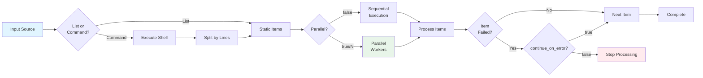

## Parallel Iteration with Foreach

Process multiple items in parallel using the `foreach` command.



**Source**: Configuration defined in src/config/command.rs:191-211

### Basic Foreach

The `foreach` command uses a nested object structure where the `foreach` field specifies the input source:

```yaml
- foreach:
    foreach: ["a", "b", "c"]  # (1)!
    do:
      - shell: "process ${item}"  # (2)!
```

1. Input source - can be a list or a shell command string
2. `${item}` is replaced with the current item value

**Input Formats** (src/config/command.rs:193-194):
- **List**: Static array of items: `["item1", "item2"]`
- **Command**: Shell command that outputs items: `"find . -name '*.rs'"`

**Source**: Example from src/cook/execution/foreach_tests.rs:16-21

### Dynamic Item Lists

Generate items dynamically from command output. Commands are executed via shell, and output is parsed line-by-line:

```yaml
- foreach:
    foreach: "find . -name '*.rs'"
    do:
      - shell: "rustfmt ${item}"
```

**Command Output Parsing** (src/cook/execution/foreach.rs:201-206):
- Output is split into lines
- Empty lines are automatically filtered out
- Each non-empty line becomes one item

**Source**: Example from src/cook/execution/foreach_tests.rs:59-64

### Variables Available in Foreach

The following variables are automatically available in `do` block commands (src/cook/execution/foreach.rs:223-225):

- `${item}` - Current item value
- `${index}` - Zero-based index of current item (0, 1, 2, ...)
- `${total}` - Total number of items being processed

**Example with Variables:**
```yaml
- foreach:
    foreach: ["test1.rs", "test2.rs", "test3.rs"]
    do:
      - shell: "echo Processing ${item} (${index}/${total})"
```

This would output:
```
Processing test1.rs (0/3)
Processing test2.rs (1/3)
Processing test3.rs (2/3)
```

### Parallel Execution

Control parallelism with the `parallel` field (src/config/command.rs:196-198). It accepts both boolean and numeric values:

**Boolean - Default Parallelism:**

```yaml
- foreach:
    foreach: "ls *.txt"
    parallel: true  # (1)!
    do:
      - shell: "analyze ${item}"
```

1. Uses default of 10 concurrent workers

!!! note "Default Parallelism"
    `parallel: true` uses a fixed default of 10 concurrent workers, not "all available cores" (src/cook/execution/foreach.rs:81).

**Number - Explicit Concurrency Limit:**

```yaml
- foreach:
    foreach: "ls *.txt"
    parallel: 5  # (1)!
    do:
      - shell: "analyze ${item}"
```

1. Explicitly limit to 5 concurrent workers

**Source**: Example from src/cook/execution/foreach_tests.rs:102-114

**Choosing Parallelism:**
- Use `parallel: false` (default) for sequential processing
- Use `parallel: true` for moderate parallelism (10 workers)
- Use `parallel: N` to specify exact concurrency level
- Consider I/O limits, CPU cores, and rate limits when choosing N

### Error Handling

Continue processing remaining items on failure:

```yaml
- foreach:
    foreach: ["test1", "test2", "test3"]
    continue_on_error: true
    do:
      - shell: "run-test ${item}"
```

!!! tip "Error Handling Behavior"
    **Source**: src/config/command.rs:205-206

    - `continue_on_error: true` - Process all items even if some fail
    - `continue_on_error: false` (default) - Stop on first failure
    - Failed items are tracked and reported in results

### Limiting Items

Process only a subset of items:

```yaml
- foreach:
    foreach: "find . -name '*.log'"
    max_items: 10  # Process first 10 items only
    do:
      - shell: "compress ${item}"
```

**Source**: Field definition in src/config/command.rs:209-210

Useful for:
- Testing workflows on a small subset
- Rate-limiting batch operations
- Processing most recent items only

### Nested Commands

Each item can execute multiple commands. Both `shell` and `claude` commands are supported in `do` blocks:

```yaml
- foreach:
    foreach: "cargo metadata --format-version 1 | jq -r '.packages[].name'"
    do:
      - shell: "cargo build -p ${item}"
      - shell: "cargo test -p ${item}"
      - shell: "cargo doc -p ${item}"
```

**Command Types Supported** (src/cook/execution/foreach.rs:286-375):

- `shell` - Execute shell commands
- `claude` - Execute Claude commands

!!! warning "Deprecated Command Type"
    The `test` command type is deprecated and will emit a warning in logs. Use `shell` with explicit test commands instead.

Each command in the `do` block has access to the same variables (`${item}`, `${index}`, `${total}`).

### Practical Use Cases

**Process Multiple Directories:**
```yaml
- foreach:
    foreach: ["frontend", "backend", "shared"]
    parallel: 3
    do:
      - shell: "cd ${item} && npm install"
      - shell: "cd ${item} && npm test"
```

**Batch File Processing:**
```yaml
- foreach:
    foreach: "find src -name '*.rs'"
    parallel: 10
    continue_on_error: true
    do:
      - shell: "rustfmt ${item}"
      - shell: "cargo clippy --manifest-path=${item}"
```

### When to Use Foreach vs MapReduce

!!! tip "Choosing the Right Approach"
    **Use Foreach when:**

    - Simple iteration over items (< 100 items)
    - All items processed in the same worktree
    - No need for checkpoint/resume
    - Lightweight operations

    **Use MapReduce when:**

    - Processing many items (100+)
    - Need checkpoint and resume capability
    - Need isolated worktrees per item
    - Complex failure handling and retry logic
    - Dead letter queue for failed items

See [MapReduce](../mapreduce/index.md) for large-scale parallel processing.

### Progress Tracking

During execution, a progress bar displays (src/cook/execution/foreach.rs:88):
- Current item number
- Total items
- Processing rate
- Estimated time remaining
