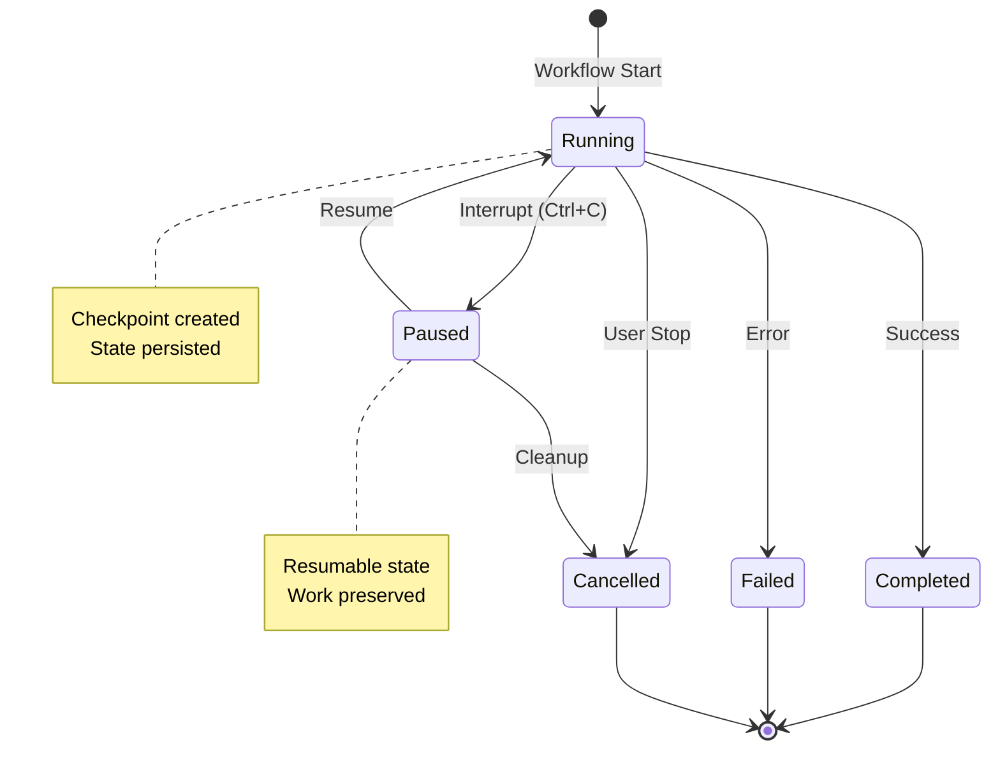
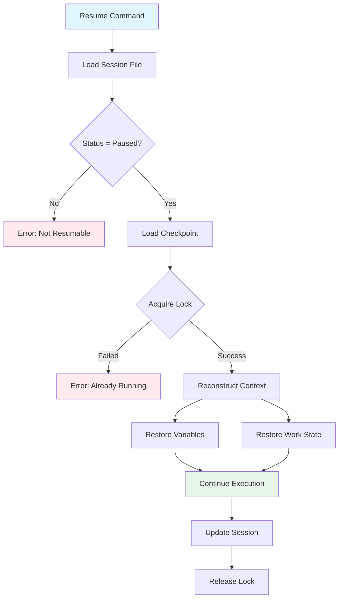

# Session Management

Prodigy provides unified session tracking and lifecycle management for both standard workflows and MapReduce jobs.

## Overview

Session management features:
- **Unified tracking**: Single system for workflows and MapReduce
- **Lifecycle states**: Running, Paused, Completed, Failed, Cancelled
- **State persistence**: Sessions stored in `~/.prodigy/sessions/`
- **Resume capabilities**: Resume from checkpoints with session or job IDs
- **Concurrent protection**: Lock-based prevention of simultaneous resumes

## Session Types

### Workflow Sessions

Standard workflow execution tracking:

```json
{
  "id": "session-abc123",
  "session_type": "Workflow",
  "status": "Running",
  "started_at": "2025-01-11T12:00:00Z",
  "workflow_data": {
    "workflow_name": "my-workflow",
    "current_step": 2,
    "total_steps": 5,
    "completed_steps": [0, 1],
    "variables": {},
    "files_changed": 3,
    "worktree_name": "session-abc123"
  }
}
```

### MapReduce Sessions

MapReduce job state management:

```json
// Source: src/unified_session/state.rs:117-125
{
  "id": "session-mapreduce-xyz",
  "session_type": "MapReduce",
  "status": "Running",
  "started_at": "2025-01-11T12:00:00Z",
  "mapreduce_data": {
    "job_id": "mapreduce-xyz",
    "phase": "map",
    "total_items": 100,
    "processed_items": 45,
    "failed_items": 2,
    "agent_count": 0,
    "reduce_results": null
  }
}
```

## Session Lifecycle

### States

1. **Running**: Active execution in progress
2. **Paused**: Interrupted, ready to resume from checkpoint
3. **Completed**: Successfully finished
4. **Failed**: Terminated with errors
5. **Cancelled**: User-initiated stop

### State Transitions



**Figure**: Session lifecycle showing state transitions and checkpoint behavior.

## Session Storage

Sessions are stored globally for easy access:

```
~/.prodigy/sessions/
├── session-abc123.json
├── session-mapreduce-xyz.json
└── session-def456.json
```

### Session File Structure

```json
{
  "id": "session-abc123",                    // (1)!
  "session_type": "Workflow",                // (2)!
  "status": "Paused",                        // (3)!
  "started_at": "2025-01-11T12:00:00Z",
  "updated_at": "2025-01-11T12:05:00Z",
  "completed_at": null,
  "metadata": {
    "execution_start_time": "2025-01-11T12:00:00Z",
    "workflow_type": "standard",
    "total_steps": 5,
    "current_step": 2
  },
  "checkpoints": [                            // (4)!
    "checkpoint-1-2025-01-11T12:02:00Z"
  ],
  "timings": {                                // (5)!
    "step1": {"secs": 10, "nanos": 0},
    "step2": {"secs": 15, "nanos": 0}
  },
  "error": null
}
```

1. Unique session identifier used for resume commands
2. Session type: `Workflow` or `MapReduce`
3. Current lifecycle state: `Running`, `Paused`, `Completed`, `Failed`, `Cancelled`
4. List of checkpoint identifiers for resume operations
5. Execution timing for performance analysis

## Resume Capabilities

### Resume Command

Resume sessions using session ID or job ID:

```bash
# Resume with session ID
prodigy resume session-abc123

# Resume with job ID (MapReduce)
prodigy resume-job mapreduce-xyz

# Unified resume (auto-detects ID type)
prodigy resume mapreduce-xyz
```

!!! tip "Resume ID Types"
    You can use either session IDs or job IDs to resume. Prodigy automatically detects the ID type and loads the correct session.

### Session-Job Mapping

Bidirectional mapping enables resume with either ID:

```
~/.prodigy/state/{repo_name}/mappings/
├── session-to-job.json
└── job-to-session.json
```

Each mapping contains:

```json
// Source: src/storage/session_job_mapping.rs:14-26
{
  "session_id": "session-mapreduce-xyz",
  "job_id": "mapreduce-xyz",
  "workflow_name": "my-workflow",
  "created_at": "2025-01-11T12:00:00Z"
}
```

### Checkpoint-Based Resume

Resume reconstructs state from checkpoints:

1. Load session from `~/.prodigy/sessions/`
2. Verify session is in Paused state
3. Load checkpoint from `~/.prodigy/state/`
4. Reconstruct execution context
5. Continue from last completed step



**Figure**: Resume flow showing checkpoint loading, lock acquisition, and state reconstruction.

## State Preservation

### Variables and Context

Preserved across resume:
- Workflow variables
- Captured command outputs
- Environment variables
- Map results (in MapReduce)

### Work Item State

In MapReduce workflows:
- **Completed items**: Preserved with full results
- **In-progress items**: Moved back to pending on resume
- **Failed items**: Tracked in DLQ with retry counts
- **Pending items**: Continue processing from where left off

!!! note "In-Progress Items on Resume"
    When a MapReduce workflow is interrupted, any items that were being processed by agents are moved back to the pending queue. This ensures they are reprocessed on resume and prevents partial results.

## Concurrent Resume Protection

Prodigy prevents multiple resumes of the same session:

### RAII-Based Locking

```
~/.prodigy/resume_locks/
├── session-abc123.lock
└── mapreduce-xyz.lock
```

### Lock Metadata

Lock files contain:
```json
{
  "pid": 12345,
  "hostname": "machine.local",
  "acquired_at": "2025-01-11T12:00:00Z",
  "session_id": "session-abc123"
}
```

### Stale Lock Detection

- Platform-specific process checks (Unix: `kill -0`, Windows: `tasklist`)
- Automatic cleanup of locks from crashed processes
- New resume succeeds after stale lock removal

!!! tip "Automatic Stale Lock Cleanup"
    If a resume process crashes or is killed, the lock file may remain. Prodigy automatically detects when the holding process is no longer running and removes stale locks, allowing new resume attempts to succeed.

### Lock Errors

If resume blocked by active lock:

```
Error: Resume already in progress for job mapreduce-xyz
Lock held by: PID 12345 on hostname (acquired 2025-01-11 10:30:00 UTC)
Please wait for the other process to complete.
```

!!! warning "Concurrent Resume Prevention"
    Attempting to resume a session that is already being resumed will fail with a lock error. Wait for the other process to complete, or verify the process is still running before manually removing the lock file.

## Session Management Commands

### List Sessions

```bash
# List all sessions
prodigy sessions list

# Filter by status
prodigy sessions list --status paused

# Show details
prodigy sessions show session-abc123
```

### Clean Sessions

```bash
# Clean completed sessions
prodigy sessions clean

# Clean specific session
prodigy sessions clean session-abc123

# Force cleanup
prodigy sessions clean -f
```

## Session Metadata

### Execution Timing

Track performance metrics:
```json
{
  "timings": {
    "step1": {"secs": 10, "nanos": 0},
    "step2": {"secs": 15, "nanos": 0},
    "total": {"secs": 25, "nanos": 0}
  }
}
```

### Progress Tracking

Monitor execution progress:
```json
{
  "metadata": {
    "total_steps": 10,
    "current_step": 5,
    "completion_percentage": 50.0
  }
}
```

## Examples

### Resume Interrupted Workflow

!!! example "Workflow Resume"
    ```bash
    # Workflow interrupted during step 3
    ^C

    # List paused sessions
    prodigy sessions list --status paused

    # Resume from checkpoint
    prodigy resume session-abc123
    ```

### Resume MapReduce Job

!!! example "MapReduce Resume"
    ```bash
    # MapReduce job interrupted during map phase
    ^C

    # Check job status
    prodigy sessions show session-mapreduce-xyz

    # Resume using session ID
    prodigy resume session-mapreduce-xyz

    # OR resume using job ID
    prodigy resume-job mapreduce-xyz
    ```

### Prevent Concurrent Resume

!!! example "Concurrent Resume Protection"
    ```bash
    # Terminal 1: Resume in progress
    $ prodigy resume session-abc123
    # ... executing ...

    # Terminal 2: Attempt concurrent resume
    $ prodigy resume session-abc123
    Error: Resume already in progress for session-abc123
    Lock held by: PID 12345 on machine.local (acquired 2025-01-11 10:30:00 UTC)
    ```
