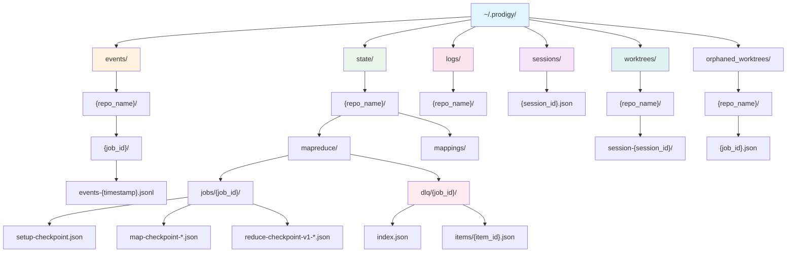
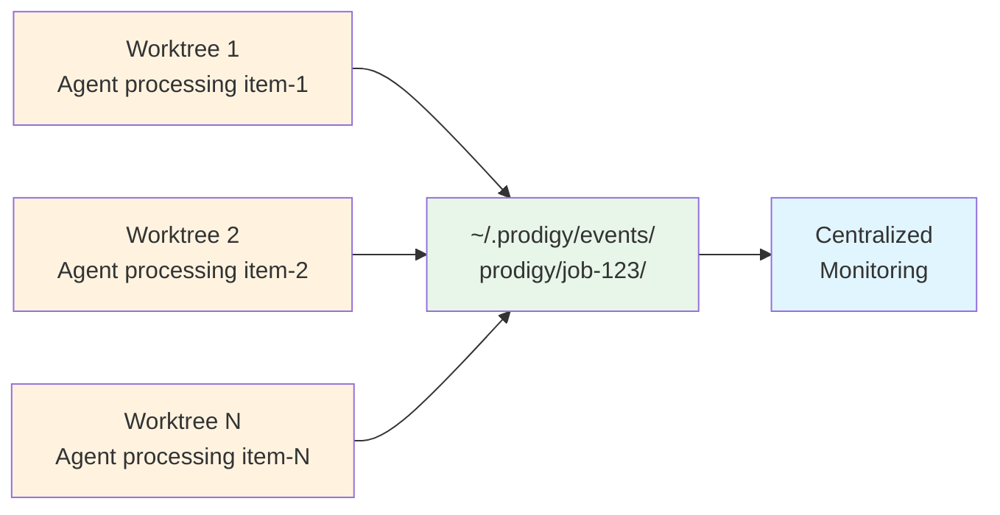

# Storage Architecture

Prodigy uses a global storage architecture for persistent state, events, and failure tracking across all workflows and sessions.

## Overview

Global storage features:
- **Centralized storage**: All data in `~/.prodigy/`
- **Repository organization**: Data grouped by repository name
- **Cross-worktree sharing**: Multiple worktrees access shared state
- **Persistent state**: Job checkpoints survive worktree cleanup
- **Efficient deduplication**: Minimize storage overhead

## Storage Structure



**Figure**: Global storage hierarchy showing repository-organized structure.

```
~/.prodigy/
├── events/                     # Event logs
│   └── {repo_name}/
│       └── {job_id}/
│           └── events-{timestamp}.jsonl
├── state/                      # State, checkpoints, and DLQ
│   └── {repo_name}/
│       ├── mapreduce/
│       │   ├── jobs/{job_id}/
│       │   │   ├── setup-checkpoint.json
│       │   │   ├── map-checkpoint-{timestamp}.json
│       │   │   └── reduce-checkpoint-v1-{timestamp}.json
│       │   └── dlq/{job_id}/
│       │       ├── index.json
│       │       └── items/
│       │           └── {item_id}.json
│       └── mappings/
│           ├── {session_id}.json   # Contains bidirectional mapping
│           └── {job_id}.json       # Duplicate for reverse lookup
├── logs/                       # Workflow logs
│   └── {repo_name}/
├── sessions/                   # Session tracking
│   └── {session_id}.json
├── worktrees/                  # Git worktrees
│   └── {repo_name}/
│       └── session-{session_id}/
└── orphaned_worktrees/         # Cleanup failure tracking
    └── {repo_name}/
        └── {job_id}.json
```

## Event Storage

Event logs are stored as JSONL files for efficient streaming:

```
~/.prodigy/events/{repo_name}/{job_id}/events-{timestamp}.jsonl
```

!!! note "Auto-Generated Paths"
    Event file paths include auto-generated timestamp suffixes (e.g., `events-20250111120000.jsonl`). This enables log rotation and prevents conflicts when multiple processes write events simultaneously.

### Event Organization

- **By repository**: Events grouped by repo for easy filtering
- **By job**: Each job has dedicated event directory
- **JSONL format**: One JSON event per line for streaming
- **Timestamped files**: Rotate logs by timestamp

### Event Persistence

Events are persisted immediately:
- Agent lifecycle events (started, completed, failed)
- Work item status changes
- Checkpoint saves
- Error details with correlation IDs

### Cross-Worktree Aggregation

Multiple worktrees working on same job share event logs:



**Figure**: Cross-worktree event aggregation enabling centralized monitoring.

## State Storage

Job state and checkpoints are stored globally:

```
~/.prodigy/state/{repo_name}/mapreduce/jobs/{job_id}/
├── job-state.json              # Overall job state
├── setup-checkpoint.json       # Setup phase results
├── map-checkpoint-*.json       # Map phase progress
└── reduce-checkpoint-v1-*.json # Reduce phase progress
```

### Checkpoint Types

**Setup Phase**:
```json
// Source: src/cook/execution/mapreduce/checkpoint/types.rs
{
  "phase": "setup",
  "completed": true,
  "outputs": {...},
  "timestamp": "2025-01-11T12:00:00Z"
}
```

**Map Phase**:
```json
// Source: src/cook/execution/mapreduce/checkpoint/types.rs
{
  "phase": "map",
  "completed_items": ["item-1", "item-2"],      // (1)!
  "in_progress_items": ["item-3"],              // (2)!
  "pending_items": ["item-4", "item-5"],        // (3)!
  "agent_results": {...},                       // (4)!
  "timestamp": "2025-01-11T12:05:00Z"
}
```

1. Work items successfully processed by agents
2. Items currently being processed (moved back to pending on resume)
3. Items waiting to be processed
4. Full results from completed agents (commits, outputs, timings)

**Reduce Phase**:
```json
// Source: src/cook/execution/mapreduce/checkpoint/types.rs
{
  "phase": "reduce",
  "completed_steps": [0, 1],     // (1)!
  "current_step": 2,              // (2)!
  "step_results": {...},          // (3)!
  "map_results": {...},           // (4)!
  "timestamp": "2025-01-11T12:10:00Z"
}
```

1. Indices of reduce commands that have completed
2. Index of the currently executing reduce command
3. Output captured from completed reduce steps
4. Aggregated results from all map agents (available to reduce commands)

!!! note "Checkpoint File Naming"
    Checkpoint files include auto-generated timestamp suffixes:
    - Setup: `setup-checkpoint.json` (no timestamp, only one per job)
    - Map: `map-checkpoint-{timestamp}.json` (multiple checkpoints during map phase)
    - Reduce: `reduce-checkpoint-v1-{timestamp}.json` (versioned with timestamp)

## Session Storage

Sessions are stored in a flat directory:

```
~/.prodigy/sessions/
├── session-abc123.json
├── session-mapreduce-xyz.json
└── session-def456.json
```

### Session File Format

```json
// Source: src/storage/types.rs
{
  "id": "session-abc123",
  "session_type": "Workflow",
  "status": "Running",
  "started_at": "2025-01-11T12:00:00Z",
  "metadata": {...},
  "checkpoints": [...],
  "timings": {...}
}
```

## Dead Letter Queue Storage

Failed work items are stored per job within the state directory:

```
~/.prodigy/state/{repo_name}/mapreduce/dlq/{job_id}/
├── index.json                  # Index of all item IDs
└── items/
    ├── {item_id_1}.json        # Individual item files
    └── {item_id_2}.json
```

!!! note "Per-Item Storage"
    Each failed item is stored as a separate file under `items/`. This enables efficient updates without reading/rewriting all items and supports concurrent access from parallel worktrees.

### DLQ Item Format

```json
// Source: src/cook/execution/dlq.rs:32-43 (DeadLetteredItem struct)
{
  "item_id": "item-1",
  "item_data": {...},
  "first_attempt": "2025-01-11T12:00:00Z",
  "last_attempt": "2025-01-11T12:05:00Z",
  "failure_count": 2,
  "failure_history": [
    {
      "attempt_number": 1,
      "timestamp": "2025-01-11T12:00:00Z",
      "error_type": "Timeout",
      "error_message": "Timeout after 300 seconds",
      "error_context": ["Processing work item", "Executing agent"],
      "stack_trace": null,
      "agent_id": "agent-1",
      "step_failed": "shell: npm test"
    }
  ],
  "error_signature": "timeout_agent-1_shell",
  "worktree_artifacts": {
    "worktree_path": "/path/to/worktree",
    "branch_name": "agent-1-branch",
    "last_commit": "abc123"
  },
  "reprocess_eligible": true,
  "manual_review_required": false
}
```

### DLQ Index Format

The `index.json` file tracks all item IDs for quick enumeration:

```json
// Source: src/cook/execution/dlq.rs:615-630 (update_index)
{
  "item_ids": ["item-1", "item-2", "item-3"]
}
```

### DLQ Features

- **Cross-worktree tracking**: Shared across parallel worktrees
- **Failure history**: Track all retry attempts with full context
- **Log linkage**: JSON log location for debugging
- **Retry support**: Command to reprocess failed items
- **Error signatures**: Group similar failures for pattern analysis
- **Worktree artifacts**: Preserve debugging context from failed agents
- **Eligibility flags**: Distinguish retriable failures from permanent errors

## Worktree Storage

Git worktrees are created per session:

```
~/.prodigy/worktrees/{repo_name}/
├── session-abc123/             # Workflow session
└── session-mapreduce-xyz/      # MapReduce parent worktree
    ├── agent-1/                # MapReduce agent worktree
    └── agent-2/                # MapReduce agent worktree
```

### Worktree Lifecycle

1. **Creation**: Worktree created when workflow starts
2. **Execution**: All commands run in worktree context
3. **Persistence**: Worktree remains until merge or cleanup
4. **Cleanup**: Removed after successful merge

## Orphaned Worktree Tracking

When cleanup fails, worktree paths are registered:

```
~/.prodigy/orphaned_worktrees/{repo_name}/{job_id}.json
```

### Registry Format

```json
{
  "job_id": "mapreduce-123",
  "orphaned_worktrees": [
    {
      "agent_id": "agent-1",
      "item_id": "item-1",
      "worktree_path": "/Users/user/.prodigy/worktrees/prodigy/agent-1",
      "timestamp": "2025-01-11T12:00:00Z",
      "error": "Permission denied"
    }
  ]
}
```

## Session-Job Mapping

Bidirectional mapping enables resume with session or job IDs:

```
~/.prodigy/state/{repo_name}/mappings/
├── {session_id}.json       # Lookup by session ID
└── {job_id}.json           # Lookup by job ID
```

!!! note "Duplicate Files for Fast Lookup"
    Each mapping is stored twice: once keyed by session ID and once by job ID. Both files contain the same bidirectional mapping data, enabling O(1) lookup regardless of which ID you have.

### Mapping Format

```json
// Source: src/storage/session_job_mapping.rs:40-51 (store)
{
  "session_id": "session-mapreduce-xyz",
  "job_id": "mapreduce-123",
  "created_at": "2025-01-11T12:00:00Z"
}
```

This file is stored as both `session-mapreduce-xyz.json` and `mapreduce-123.json` in the mappings directory.

## Performance Characteristics

### JSONL Streaming vs Batch Operations

Prodigy uses JSONL (JSON Lines) format for event storage to enable efficient streaming:

**JSONL Streaming Benefits**:
- **Incremental writes**: Events append without reading entire file
- **Memory efficient**: Process one event at a time
- **Concurrent safe**: Multiple processes can append simultaneously
- **Resumable**: Stream from any position in the file

**Usage Patterns**:

```bash
# Streaming read (memory efficient for large logs)
cat ~/.prodigy/events/prodigy/job-123/events-*.jsonl | \
  while IFS= read -r line; do
    echo "$line" | jq -c .
  done

# Batch read (faster for small logs)
cat ~/.prodigy/events/prodigy/job-123/events-*.jsonl | jq -s '.'
```

**Performance Comparison**:
| Operation | JSONL Streaming | Batch JSON |
|-----------|----------------|------------|
| Memory usage | O(1) per event | O(n) all events |
| Write speed | Fast (append) | Slow (rewrite) |
| Read speed | Slower (parse per line) | Faster (parse once) |
| Concurrent writes | Safe | Requires locking |
| Resume support | Built-in | Complex |

!!! tip "Choose the Right Pattern"
    - **Use streaming for**: Large event logs (>10K events), real-time monitoring, concurrent writers
    - **Use batch for**: Small logs (<1K events), one-time analysis, reporting

!!! example "Streaming Example"
    ```bash
    # Memory-efficient processing of large event logs
    cat ~/.prodigy/events/prodigy/job-123/events-*.jsonl | \
      jq -c 'select(.type == "AgentCompleted")' | \
      while read event; do
        echo "$event" | jq -r '.agent_id'
      done
    ```

### Storage Access Patterns

**Event Log Access**:
- Write: Append-only, lock-free
- Read: Sequential streaming or batch analysis
- Typical size: 1KB-10KB per event, 100-10000 events per job

**Checkpoint Access**:
- Write: Atomic file replacement
- Read: Full file load into memory
- Typical size: 10KB-1MB per checkpoint

**Session Access**:
- Write: Atomic update (read-modify-write with lock)
- Read: Direct file access
- Typical size: 1KB-10KB per session

!!! warning "Storage Access Considerations"
    **Event logs** grow linearly with job execution time. For long-running MapReduce jobs (>1000 work items), event logs can reach 10MB+. Use streaming reads to avoid memory exhaustion.

!!! tip "Checkpoint Strategy"
    Checkpoints use atomic file replacement to prevent corruption from interrupted writes. The system writes to a temp file, then renames it—ensuring checkpoint integrity even during crashes.

## Storage Benefits

### Cross-Worktree Data Sharing

Multiple worktrees working on same job share:
- Event logs
- DLQ items
- Checkpoints
- Job state

This enables:
- Parallel execution visibility
- Centralized failure tracking
- Consistent state management

### Persistent State Management

State survives worktree cleanup:
- Resume after worktree deleted
- Access job data without worktree
- Historical analysis of completed jobs

### Centralized Monitoring

All job data accessible from single location:
- View events across all worktrees
- Monitor job progress globally
- Analyze performance metrics

### Efficient Storage

Deduplication across worktrees:
- Single event log per job (not per worktree)
- Shared checkpoint files
- Reduced storage overhead

## Storage Maintenance

### Cleanup Commands

```bash
# Clean old events (30+ days)
find ~/.prodigy/events -name "*.jsonl" -mtime +30 -delete  # (1)!

# Clean completed sessions
prodigy sessions clean --completed  # (2)!

# Clean orphaned worktrees
prodigy worktree clean-orphaned <job_id>  # (3)!

# Clean DLQ after successful retry
prodigy dlq clear <job_id>  # (4)!
```

1. Removes event logs older than 30 days to prevent unbounded growth
2. Removes session files for completed workflows (preserves failed/paused)
3. Cleans up worktrees that failed to cleanup during agent execution
4. Removes DLQ items after successful retry (only use after verifying retry succeeded)

!!! warning "Data Loss Prevention"
    Always verify jobs are complete before cleaning:
    ```bash
    # Check if job is truly complete
    prodigy events show <job_id> | tail -1 | jq '.type'
    # Should show "JobCompleted" or "JobFailed"
    ```

### Storage Usage

Check storage consumption:
```bash
# Total storage
du -sh ~/.prodigy/

# By category
du -sh ~/.prodigy/events
du -sh ~/.prodigy/state
du -sh ~/.prodigy/sessions
du -sh ~/.prodigy/worktrees
```

## Migration from Local Storage

Legacy local storage (deprecated):
```
.prodigy/
├── session_state.json          # Deprecated
├── events/                     # Moved to ~/.prodigy/events
└── dlq/                        # Moved to ~/.prodigy/dlq
```

Global storage benefits:
- Cross-repository visibility
- Persistent state across worktrees
- Centralized monitoring and debugging

## Examples

### Access Job Data

```bash
# View events
cat ~/.prodigy/events/prodigy/mapreduce-123/events-*.jsonl | jq

# Check checkpoint
cat ~/.prodigy/state/prodigy/mapreduce/jobs/mapreduce-123/map-checkpoint-*.json | jq

# List DLQ items
cat ~/.prodigy/state/prodigy/mapreduce/dlq/mapreduce-123/index.json | jq

# Inspect specific DLQ item
cat ~/.prodigy/state/prodigy/mapreduce/dlq/mapreduce-123/items/item-1.json | jq
```

### Find Session by Job ID

```bash
# Look up session ID (mapping file is named after job ID)
job_id="mapreduce-123"
session_id=$(jq -r '.session_id' ~/.prodigy/state/prodigy/mappings/$job_id.json)

# View session
cat ~/.prodigy/sessions/$session_id.json | jq
```

### Analyze Storage Growth

```bash
# Event log size over time
find ~/.prodigy/events -name "*.jsonl" -printf '%TY-%Tm-%Td %s %p\n' | \
  sort | \
  awk '{size+=$2} END {print "Total events:", size/1024/1024, "MB"}'

# Checkpoint size
du -sh ~/.prodigy/state/*/mapreduce/jobs/*/
```
