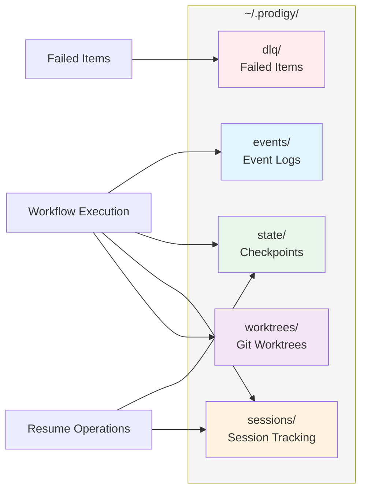

# Storage Architecture

Prodigy uses a global storage architecture for persistent state, events, and failure tracking across all workflows and sessions.

## Overview

Global storage features:
- **Centralized storage**: All data in `~/.prodigy/`
- **Repository organization**: Data grouped by repository name
- **Cross-worktree sharing**: Multiple worktrees access shared state
- **Persistent state**: Job checkpoints survive worktree cleanup
- **Efficient deduplication**: Minimize storage overhead



**Figure**: Storage architecture showing how workflow execution interacts with different storage components.

!!! note "Repository-Based Organization"
    Most storage directories (events, dlq, state, worktrees) organize data by repository name. This allows multiple projects to share the same Prodigy installation without conflicts.

## Documentation

This section covers the complete storage architecture:

- [**Storage Structure**](structure.md) - Directory layout, event storage, and checkpoint types
- [**Session & DLQ Storage**](session-dlq.md) - Session tracking and dead letter queue management
- [**Worktree Storage**](worktree-storage.md) - Git worktree organization and session-job mapping
- [**Maintenance**](maintenance.md) - Performance characteristics, cleanup, and migration

## Quick Reference

```
~/.prodigy/
├── events/                     # Event logs
├── dlq/                        # Dead Letter Queue
├── state/                      # State and checkpoints
├── sessions/                   # Session tracking
├── logs/                       # Per-repository logs
├── worktrees/                  # Git worktrees
├── resume_locks/               # Concurrent resume protection
└── orphaned_worktrees/         # Cleanup failure tracking
```

!!! tip "Custom Storage Location"
    Override the default storage location by setting `PRODIGY_HOME` environment variable.
