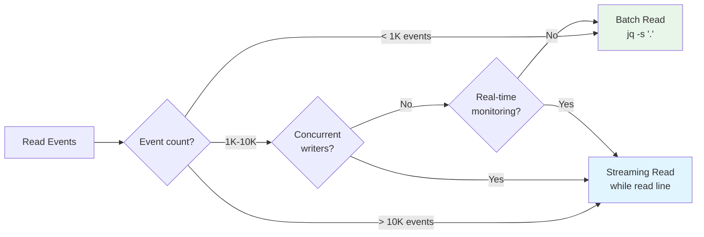
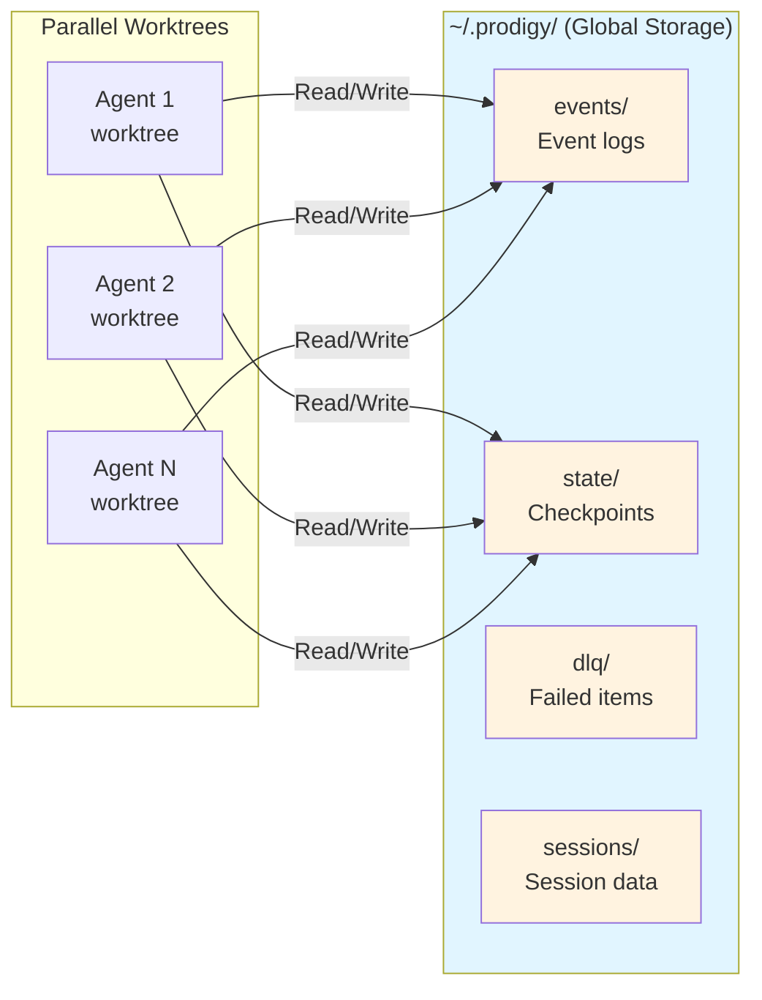

# Storage Maintenance

This page covers performance characteristics, storage benefits, maintenance procedures, and migration from local storage.

## Performance Characteristics

### JSONL Streaming vs Batch Operations

Prodigy uses JSONL (JSON Lines) format for event storage to enable efficient streaming:



**Figure**: Decision flow for choosing between streaming and batch event processing.

**JSONL Streaming Benefits**:
- **Incremental writes**: Events append without reading entire file
- **Memory efficient**: Process one event at a time
- **Concurrent safe**: Multiple processes can append simultaneously
- **Resumable**: Stream from any position in the file

**Usage Patterns**:

```bash
# Streaming read (memory efficient for large logs)
cat ~/.prodigy/events/prodigy/job-123/events-*.jsonl | \
  while IFS= read -r line; do
    echo "$line" | jq -c .
  done

# Batch read (faster for small logs)
cat ~/.prodigy/events/prodigy/job-123/events-*.jsonl | jq -s '.'
```

**Performance Comparison**:
| Operation | JSONL Streaming | Batch JSON |
|-----------|----------------|------------|
| Memory usage | O(1) per event | O(n) all events |
| Write speed | Fast (append) | Slow (rewrite) |
| Read speed | Slower (parse per line) | Faster (parse once) |
| Concurrent writes | Safe | Requires locking |
| Resume support | Built-in | Complex |

!!! tip "Choose the Right Pattern"
    - **Use streaming for**: Large event logs (>10K events), real-time monitoring, concurrent writers
    - **Use batch for**: Small logs (<1K events), one-time analysis, reporting

!!! example "Streaming Example"
    ```bash
    # Memory-efficient processing of large event logs
    cat ~/.prodigy/events/prodigy/job-123/events-*.jsonl | \
      jq -c 'select(.type == "AgentCompleted")' | \
      while read event; do
        echo "$event" | jq -r '.agent_id'
      done
    ```

### Storage Access Patterns

**Event Log Access**:
- Write: Append-only, lock-free
- Read: Sequential streaming or batch analysis
- Typical size: 1KB-10KB per event, 100-10000 events per job

**Checkpoint Access**:
- Write: Atomic file replacement
- Read: Full file load into memory
- Typical size: 10KB-1MB per checkpoint

**Session Access**:
- Write: Atomic update (read-modify-write with lock)
- Read: Direct file access
- Typical size: 1KB-10KB per session

!!! warning "Storage Access Considerations"
    **Event logs** grow linearly with job execution time. For long-running MapReduce jobs (>1000 work items), event logs can reach 10MB+. Use streaming reads to avoid memory exhaustion.

!!! tip "Checkpoint Strategy"
    Checkpoints use atomic file replacement to prevent corruption from interrupted writes. The system writes to a temp file, then renames it—ensuring checkpoint integrity even during crashes.

## Storage Benefits

### Cross-Worktree Data Sharing



**Figure**: Multiple worktrees share centralized storage, enabling parallel execution visibility and consistent state management.

Multiple worktrees working on same job share:
- Event logs
- DLQ items
- Checkpoints
- Job state

This enables:
- Parallel execution visibility
- Centralized failure tracking
- Consistent state management

### Persistent State Management

State survives worktree cleanup:
- Resume after worktree deleted
- Access job data without worktree
- Historical analysis of completed jobs

### Centralized Monitoring

All job data accessible from single location:
- View events across all worktrees
- Monitor job progress globally
- Analyze performance metrics

### Efficient Storage

Deduplication across worktrees:
- Single event log per job (not per worktree)
- Shared checkpoint files
- Reduced storage overhead

## Storage Maintenance

### Cleanup Commands

```bash
# Clean old events (30+ days)
find ~/.prodigy/events -name "*.jsonl" -mtime +30 -delete  # (1)!

# Clean all sessions
prodigy sessions clean --all  # (2)!

# Clean orphaned worktrees
prodigy worktree clean-orphaned <job_id>  # (3)!

# Clean DLQ after successful retry
prodigy dlq clear <workflow_id> --yes  # (4)!
```

1. Removes event logs older than 30 days to prevent unbounded growth
2. Removes all session files. Add `--force` to skip confirmation prompt
3. Cleans up worktrees that failed to cleanup during agent execution
4. Removes DLQ items for the specified workflow. Use `--yes` to skip confirmation

!!! warning "Data Loss Prevention"
    Always verify jobs are complete before cleaning:
    ```bash
    # Check if job is truly complete
    prodigy events ls --job_id <job_id> --limit 1 | jq '.type'
    # Should show "JobCompleted" or "JobFailed"
    ```

### Storage Usage

Check storage consumption:
```bash
# Total storage
du -sh ~/.prodigy/

# By category
du -sh ~/.prodigy/events
du -sh ~/.prodigy/state
du -sh ~/.prodigy/sessions
du -sh ~/.prodigy/worktrees
```

## Migration from Local Storage

!!! note "Migration Status"
    Local storage is deprecated. New installations automatically use global storage at `~/.prodigy/`. Existing local storage is preserved but no longer updated.

Legacy local storage (deprecated):
```
.prodigy/
├── session_state.json          # Deprecated
├── events/                     # Moved to ~/.prodigy/events
└── dlq/                        # Moved to ~/.prodigy/dlq
```

Global storage benefits:
- Cross-repository visibility
- Persistent state across worktrees
- Centralized monitoring and debugging

## Examples

### Access Job Data

```bash
# View events
cat ~/.prodigy/events/prodigy/mapreduce-123/events-*.jsonl | jq

# Check checkpoint
cat ~/.prodigy/state/prodigy/mapreduce/jobs/mapreduce-123/map-checkpoint-*.json | jq

# Inspect DLQ
cat ~/.prodigy/dlq/prodigy/mapreduce-123/dlq-items.json | jq
```

### Find Session by Job ID

```bash
# Look up session ID
job_id="mapreduce-123"
session_id=$(jq -r ".\"$job_id\"" ~/.prodigy/state/prodigy/mappings/job-to-session.json)

# View session
cat ~/.prodigy/sessions/$session_id.json | jq
```

### Analyze Storage Growth

```bash
# Event log size over time
find ~/.prodigy/events -name "*.jsonl" -printf '%TY-%Tm-%Td %s %p\n' | \
  sort | \
  awk '{size+=$2} END {print "Total events:", size/1024/1024, "MB"}'

# Checkpoint size
du -sh ~/.prodigy/state/*/mapreduce/jobs/*/
```
