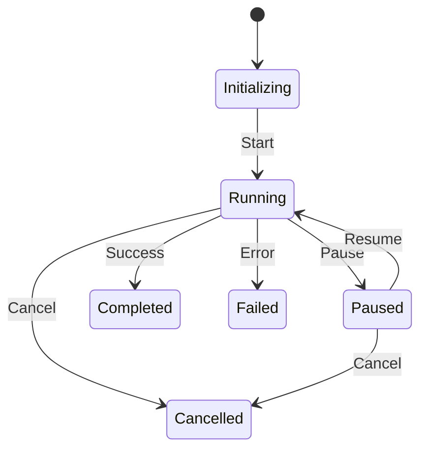
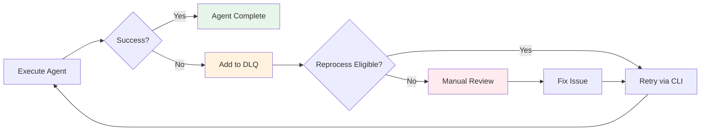

# Session & DLQ Storage

This page covers session tracking and dead letter queue storage for failed work items.

## Session Storage

Sessions are stored in a flat directory:

```
~/.prodigy/sessions/
├── session-abc123.json
├── session-mapreduce-xyz.json
└── session-def456.json
```

### Session File Format

```json
// Source: src/unified_session/state.rs:66-81
{
  "id": "session-abc123",
  "session_type": "Workflow",
  "status": "Running",
  "started_at": "2025-01-11T12:00:00Z",
  "updated_at": "2025-01-11T12:05:00Z",
  "completed_at": null,
  "metadata": {},
  "checkpoints": [],
  "timings": {},
  "error": null,
  "workflow_data": {
    "workflow_id": "wf-123",
    "workflow_name": "example-workflow",
    "current_step": 2,
    "total_steps": 5,
    "completed_steps": [0, 1],
    "variables": {},
    "iterations_completed": 0,
    "files_changed": 3,
    "worktree_name": "session-abc123"
  },
  "mapreduce_data": null
}
```

### Session Status Values



| Status | Description |
|--------|-------------|
| `Initializing` | Session created, not yet started |
| `Running` | Actively executing |
| `Paused` | Temporarily suspended |
| `Completed` | Successfully finished |
| `Failed` | Terminated with error |
| `Cancelled` | User cancelled |

### MapReduce Session Data

For MapReduce sessions, `mapreduce_data` contains:

```json
// Source: src/unified_session/state.rs:117-125
{
  "job_id": "job-xyz789",
  "total_items": 100,
  "processed_items": 75,
  "failed_items": 5,
  "agent_count": 10,
  "phase": "Map",
  "reduce_results": null
}
```

## Dead Letter Queue Storage

Failed work items are stored as individual files per item:

```
~/.prodigy/state/{base}/mapreduce/dlq/{job_id}/
├── items/
│   ├── item-1.json
│   ├── item-2.json
│   └── item-3.json
└── index.json
```

!!! note "Storage Path"
    The DLQ uses `{base_path}/mapreduce/dlq/{job_id}/items/` structure, storing each failed item as a separate JSON file for efficient access and partial updates.

### DLQ Item Format

```json
// Source: src/cook/execution/dlq.rs:31-43
{
  "item_id": "item-1", // (1)!
  "item_data": {"type": "process", "path": "/src/main.rs"},
  "first_attempt": "2025-01-11T12:00:00Z",
  "last_attempt": "2025-01-11T12:15:00Z",
  "failure_count": 3, // (2)!
  "failure_history": [
    {
      "attempt_number": 1,
      "timestamp": "2025-01-11T12:00:00Z",
      "error_type": "Timeout",
      "error_message": "Command exceeded 300 second timeout",
      "error_context": [ // (3)!
        "Executing agent for item-1",
        "Running command: cargo test",
        "Waiting for completion"
      ],
      "stack_trace": null,
      "agent_id": "agent-0",
      "step_failed": "test-step",
      "duration_ms": 300000,
      "json_log_location": "~/.local/state/claude/logs/session-xyz.json" // (4)!
    }
  ],
  "error_signature": "Timeout::Command exceeded timeout", // (5)!
  "worktree_artifacts": {
    "worktree_path": "~/.prodigy/worktrees/project/agent-0",
    "branch_name": "agent-0-item-1",
    "uncommitted_changes": "Modified: src/main.rs",
    "error_logs": null
  },
  "reprocess_eligible": true, // (6)!
  "manual_review_required": false
}
```

1. Unique identifier for the work item from the input
2. Total number of times this item has failed processing
3. Context trail showing the call stack when failure occurred
4. Path to Claude's detailed JSON log for debugging
5. Signature for grouping similar failures in pattern analysis
6. Whether this item can be retried via `prodigy dlq retry`

### Error Types

The DLQ categorizes failures by error type:

```rust
// Source: src/cook/execution/dlq.rs:65-78
pub enum ErrorType {
    Timeout,
    CommandFailed { exit_code: i32 },
    CommitValidationFailed,
    WorktreeError,
    MergeConflict,
    ValidationFailed,
    ResourceExhausted,
    Unknown,
}
```

| Error Type | Description |
|-----------|-------------|
| `Timeout` | Command exceeded configured timeout |
| `CommandFailed` | Command exited with non-zero code |
| `CommitValidationFailed` | Required commit was not created |
| `WorktreeError` | Git worktree operation failed |
| `MergeConflict` | Merge to parent branch had conflicts |
| `ValidationFailed` | Work item validation failed |
| `ResourceExhausted` | System resources exhausted |
| `Unknown` | Unclassified error |

### DLQ Item Lifecycle



### DLQ Features

- **Cross-worktree tracking**: Shared across parallel worktrees
- **Failure history**: Track all retry attempts with full context
- **Log linkage**: JSON log location for debugging
- **Retry support**: Command to reprocess failed items
- **Pattern analysis**: Group failures by error signature
- **Capacity management**: Automatic eviction of oldest items

### DLQ Statistics

Get statistics about DLQ contents:

```bash
prodigy dlq show <job_id>
```

Statistics include:

```json
// Source: src/cook/execution/dlq.rs:516-523
{
  "total_items": 5,
  "eligible_for_reprocess": 3,
  "requiring_manual_review": 2,
  "oldest_item": "2025-01-11T10:00:00Z",
  "newest_item": "2025-01-11T12:00:00Z",
  "error_categories": {
    "Timeout::Command exceeded": 2,
    "CommandFailed::exit code 1": 3
  }
}
```

### Retry Failed Items

```bash
# Retry all eligible items
prodigy dlq retry <job_id>

# Retry with options
prodigy dlq retry <job_id> --max-parallel 5 --dry-run
```

!!! tip "Debugging Failures"
    Use the `json_log_location` field in failure history to access Claude's detailed JSON logs for debugging:
    ```bash
    cat ~/.local/state/claude/logs/session-xyz.json | jq '.messages[-3:]'
    ```

## Related Pages

- [Storage Structure](structure.md) - Overall storage layout
- [Maintenance](maintenance.md) - Cleanup and maintenance operations
