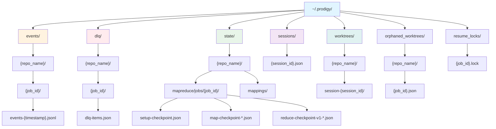
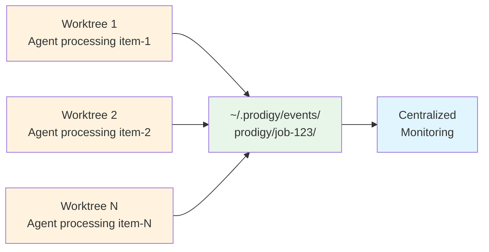

# Storage Structure

This page covers the directory layout and organization of Prodigy's global storage system.

## Storage Structure



**Figure**: Global storage hierarchy showing repository-organized structure.

```
~/.prodigy/
├── events/                     # Event logs
│   └── {repo_name}/
│       └── {job_id}/
│           └── events-{timestamp}.jsonl
├── dlq/                        # Dead Letter Queue
│   └── {repo_name}/
│       └── {job_id}/
│           └── dlq-items.json
├── state/                      # State and checkpoints
│   └── {repo_name}/
│       ├── mapreduce/
│       │   └── jobs/{job_id}/
│       │       ├── setup-checkpoint.json
│       │       ├── map-checkpoint-{timestamp}.json
│       │       └── reduce-checkpoint-v1-{timestamp}.json
│       └── mappings/
│           ├── {session_id}.json  # Session-to-job mapping
│           └── {job_id}.json      # Job-to-session mapping
├── resume_locks/               # Concurrent resume protection
│   └── {job_id}.lock
├── sessions/                   # Session tracking
│   └── {session_id}.json
├── worktrees/                  # Git worktrees
│   └── {repo_name}/
│       └── session-{session_id}/
└── orphaned_worktrees/         # Cleanup failure tracking
    └── {repo_name}/
        └── {job_id}.json
```

## Event Storage

Event logs are stored as JSONL files for efficient streaming:

```
~/.prodigy/events/{repo_name}/{job_id}/events-{timestamp}.jsonl
```

!!! note "Auto-Generated Paths"
    Event file paths include auto-generated timestamp suffixes (e.g., `events-20250111120000.jsonl`). This enables log rotation and prevents conflicts when multiple processes write events simultaneously.

### Event Organization

- **By repository**: Events grouped by repo for easy filtering
- **By job**: Each job has dedicated event directory
- **JSONL format**: One JSON event per line for streaming
- **Timestamped files**: Rotate logs by timestamp

### Event Persistence

Events are persisted immediately:
- Agent lifecycle events (started, completed, failed)
- Work item status changes
- Checkpoint saves
- Error details with correlation IDs

### Cross-Worktree Aggregation

Multiple worktrees working on same job share event logs:



**Figure**: Cross-worktree event aggregation enabling centralized monitoring.

## State Storage

Job state and checkpoints are stored globally:

```
~/.prodigy/state/{repo_name}/mapreduce/jobs/{job_id}/
├── setup-checkpoint.json       # Setup phase results
├── map-checkpoint-*.json       # Map phase progress
└── reduce-checkpoint-v1-*.json # Reduce phase progress
```

!!! info "Comprehensive Checkpoint Structure"
    The actual `MapReduceCheckpoint` type contains multiple state components for full recovery:

    - **metadata**: Job ID, version, phase, progress counts, integrity hash
    - **execution_state**: Current phase, timing, workflow variables
    - **work_item_state**: Pending, in-progress, completed, and failed items
    - **agent_state**: Active agents, assignments, results
    - **variable_state**: Variable and context data
    - **resource_state**: Resource allocation tracking
    - **error_state**: Error and DLQ information

    See `src/cook/execution/mapreduce/checkpoint/types.rs` for full type definitions.

### Checkpoint Types

**Setup Phase**:
```json
// Source: src/cook/execution/mapreduce/checkpoint/types.rs
{
  "phase": "setup",
  "completed": true,
  "outputs": {...},
  "timestamp": "2025-01-11T12:00:00Z"
}
```

**Map Phase**:
```json
// Source: src/cook/execution/mapreduce/checkpoint/types.rs
{
  "phase": "map",
  "completed_items": [...],      // (1)!
  "in_progress_items": {...},    // (2)!
  "pending_items": [...],        // (3)!
  "failed_items": [...],         // (4)!
  "agent_results": {...},        // (5)!
  "timestamp": "2025-01-11T12:05:00Z"
}
```

1. `CompletedWorkItem` objects with full `WorkItem`, `AgentResult`, and completion timestamp
2. Map of `WorkItemProgress` objects tracking agent ID, start time, and last update
3. `WorkItem` objects with ID and data payload waiting to be processed
4. `FailedWorkItem` objects including error details and retry count
5. Full results from completed agents (commits, outputs, timings)

!!! note "Work Item Structure"
    The simplified example above shows the field structure. Actual work items are stored as full objects:

    - `WorkItem`: Contains `id` (String) and `data` (JSON Value)
    - `CompletedWorkItem`: Contains `WorkItem`, `AgentResult`, and `completed_at` timestamp
    - `FailedWorkItem`: Contains `WorkItem`, `error`, `failed_at`, and `retry_count`
    - `WorkItemProgress`: Contains `WorkItem`, `agent_id`, `started_at`, and `last_update`

**Reduce Phase**:
```json
// Source: src/cook/execution/mapreduce/checkpoint/types.rs
{
  "phase": "reduce",
  "completed_steps": [0, 1],     // (1)!
  "current_step": 2,              // (2)!
  "step_results": {...},          // (3)!
  "map_results": {...},           // (4)!
  "timestamp": "2025-01-11T12:10:00Z"
}
```

1. Indices of reduce commands that have completed
2. Index of the currently executing reduce command
3. Output captured from completed reduce steps
4. Aggregated results from all map agents (available to reduce commands)

!!! note "Checkpoint File Naming"
    Checkpoint files include auto-generated timestamp suffixes:
    - Setup: `setup-checkpoint.json` (no timestamp, only one per job)
    - Map: `map-checkpoint-{timestamp}.json` (multiple checkpoints during map phase)
    - Reduce: `reduce-checkpoint-v1-{timestamp}.json` (versioned with timestamp)
