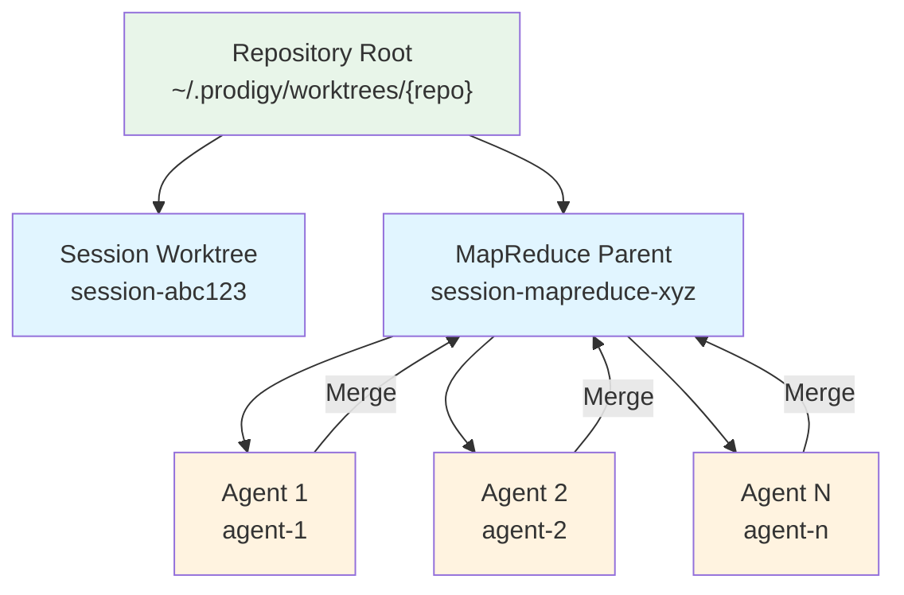
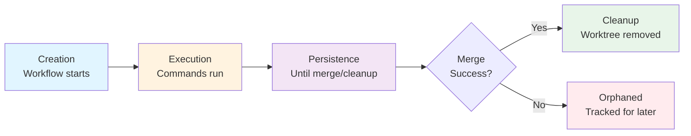
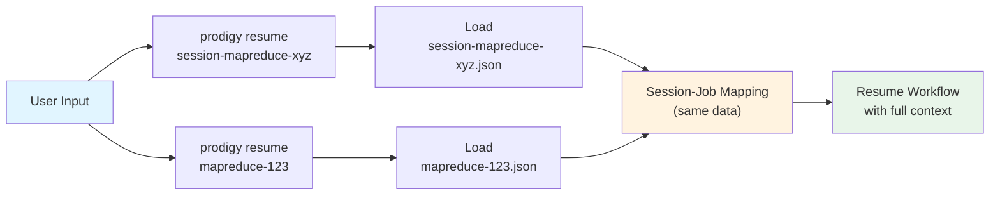

# Worktree Storage

This page covers Git worktree organization, orphaned worktree tracking, and session-job mapping.

## Worktree Storage

Git worktrees are created per session:

```
~/.prodigy/worktrees/{repo_name}/
├── session-abc123/             # Workflow session
└── session-mapreduce-xyz/      # MapReduce parent worktree
    ├── agent-1/                # MapReduce agent worktree
    └── agent-2/                # MapReduce agent worktree
```



**Figure**: Worktree hierarchy showing how MapReduce agents branch from the parent session worktree and merge changes back.

### Worktree Lifecycle



1. **Creation**: Worktree created when workflow starts
2. **Execution**: All commands run in worktree context
3. **Persistence**: Worktree remains until merge or cleanup
4. **Cleanup**: Removed after successful merge

!!! note "Isolation Guarantee"
    Each worktree provides complete isolation from the main repository. Changes made by agents cannot affect the original branch until explicitly merged.

## Orphaned Worktree Tracking

When cleanup fails, worktree paths are registered for later cleanup:

```
~/.prodigy/orphaned_worktrees/{repo_name}/{job_id}.json
```

!!! warning "Disk Space"
    Orphaned worktrees consume disk space. Use `prodigy worktree clean-orphaned <job_id>` to clean them up.

### Registry Format

The registry stores an array of orphaned worktree entries:

```json title="~/.prodigy/orphaned_worktrees/{repo_name}/{job_id}.json"
// Source: src/cook/execution/mapreduce/coordination/executor.rs:42-53
[
  {
    "path": "/Users/user/.prodigy/worktrees/prodigy/agent-1",
    "agent_id": "agent-1",
    "item_id": "item-1",
    "failed_at": "2025-01-11T12:00:00Z",
    "error": "Permission denied"
  }
]
```

| Field | Type | Description |
|-------|------|-------------|
| `path` | `PathBuf` | Absolute path to the orphaned worktree directory |
| `agent_id` | `String` | ID of the agent that created the worktree |
| `item_id` | `String` | ID of the work item being processed |
| `failed_at` | `DateTime<Utc>` | Timestamp when cleanup failure occurred |
| `error` | `String` | Error message from the cleanup failure |

### Cleaning Orphaned Worktrees

```bash
# List orphaned worktrees for a job
prodigy worktree clean-orphaned <job_id> --dry-run

# Clean orphaned worktrees
prodigy worktree clean-orphaned <job_id>
```

## Session-Job Mapping

Bidirectional mapping enables resume with session or job IDs. Each mapping creates two files in the mappings directory:

```
~/.prodigy/state/{repo_name}/mappings/
├── session-mapreduce-xyz.json    # Lookup by session ID
└── mapreduce-123.json            # Lookup by job ID
```

!!! tip "Resume Flexibility"
    Both files contain the same mapping data, enabling `prodigy resume` to work with either a session ID or a job ID.

### Mapping Format

Each mapping file contains the complete `SessionJobMapping` structure:

```json title="~/.prodigy/state/{repo_name}/mappings/{id}.json"
// Source: src/storage/session_job_mapping.rs:12-26
{
  "session_id": "session-mapreduce-xyz",
  "job_id": "mapreduce-123",
  "workflow_name": "my-workflow",
  "created_at": "2025-01-11T12:00:00Z"
}
```

| Field | Type | Description |
|-------|------|-------------|
| `session_id` | `String` | Workflow session identifier |
| `job_id` | `String` | MapReduce job identifier |
| `workflow_name` | `String` | Name of the workflow being executed |
| `created_at` | `DateTime<Utc>` | Timestamp when the mapping was created |

### How Mappings Are Used

When resuming a workflow:

1. User provides either session ID or job ID
2. Prodigy looks for `{id}.json` in the mappings directory
3. The full mapping is loaded to get both IDs
4. Resume proceeds with complete session context



```bash
# Resume using session ID
prodigy resume session-mapreduce-xyz

# Resume using job ID
prodigy resume mapreduce-123
```

Both commands resolve to the same workflow state via the bidirectional mapping.
