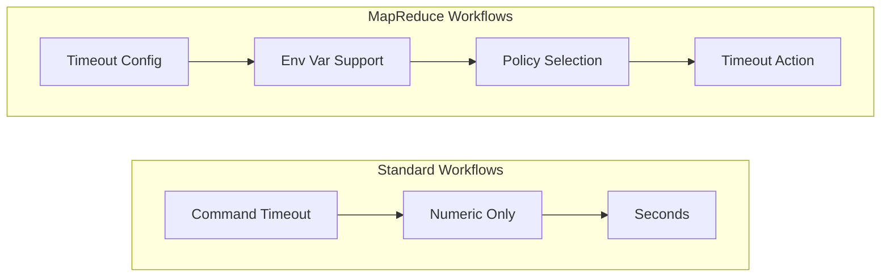
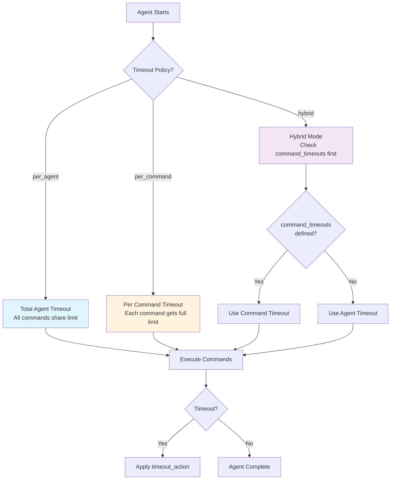

## Timeout Configuration

Set execution timeouts to prevent workflows from hanging indefinitely. Prodigy supports two distinct timeout mechanisms: command-level timeouts for standard workflows and MapReduce-specific timeouts with advanced configuration options.



**Figure**: Timeout configuration options - standard workflows use simple numeric timeouts while MapReduce supports advanced policies.

### Command-Level Timeouts

Command-level timeouts apply to individual commands in standard workflows. These accept numeric values only (in seconds).

**Source**: `src/config/command.rs:138` (CommandMetadata) and `src/config/command.rs:380` (WorkflowStepCommand) - `pub timeout: Option<u64>`

```yaml
commands:
  # Shell command with 10 minute timeout
  - shell: "cargo bench"
    timeout: 600

  # Claude command with 30 minute timeout
  - claude: "/analyze-codebase"
    timeout: 1800

  # No timeout specified = no limit
  - shell: "cargo build"
```

**Real-world examples from workflows:**

From `workflows/complex-build-pipeline.yml:22-24`:
```yaml
- shell: "cargo bench"
  timeout: 600  # 10 minutes
  capture_output: "benchmark_results"
```

From `workflows/documentation-drift.yml:47-51`:
```yaml
- shell: "cargo test --doc"
  timeout: 300  # 5 minutes
  on_failure:
    claude: "/prodigy-debug-test-failure --output ${shell.output}"
```

!!! warning "Numeric Values Only"
    Command-level timeouts only accept numeric values. For environment variable support, use MapReduce timeouts (see below).

### MapReduce Timeouts

MapReduce workflows support more sophisticated timeout configuration with environment variable support and advanced policies.

#### Setup Phase Timeout

Control how long the setup phase can run before timing out.

**Source**: `src/config/mapreduce.rs:146-148` - Uses `deserialize_optional_u64_or_string`

```yaml
mode: mapreduce

setup:
  timeout: 300  # 5 minutes for setup
  commands:
    - shell: "generate-work-items.sh"
```

**With environment variables:**
```yaml
setup:
  timeout: $SETUP_TIMEOUT  # References environment variable
  commands:
    - shell: "cargo build"
```

#### Map Phase Agent Timeout

Set a global timeout for all map agents or configure per-agent policies.

**Source**: `src/config/mapreduce.rs:269` - `pub agent_timeout_secs: Option<String>`

**Simple agent timeout:**
```yaml
map:
  agent_timeout_secs: 600  # 10 minutes per agent
  agent_template:
    - claude: "/process '${item}'"
```

**With environment variable:**
```yaml
map:
  agent_timeout_secs: $AGENT_TIMEOUT  # Configurable via environment
  agent_template:
    - claude: "/process '${item}'"
```

#### Advanced Timeout Configuration

For fine-grained control, use `timeout_config` to specify policies, per-command overrides, and timeout actions.

**Source**: `src/cook/execution/mapreduce/timeout.rs:38-63` - `TimeoutConfig` struct

```yaml
map:
  timeout_config:
    agent_timeout_secs: 600          # Global 10 minute timeout
    timeout_policy: hybrid           # Apply per-agent with overrides
    cleanup_grace_period_secs: 30    # 30s to clean up after timeout
    timeout_action: dlq              # Send timed-out items to DLQ
    enable_monitoring: true          # Track timeout metrics

    # Per-command timeout overrides
    command_timeouts:
      claude: 300                    # Claude commands: 5 minutes
      shell: 60                      # Shell commands: 1 minute
      claude_0: 600                  # First Claude command: 10 minutes

  agent_template:
    - claude: "/analyze '${item}'"   # Uses 300s from command_timeouts
    - shell: "test ${item.path}"     # Uses 60s from command_timeouts
```

**Comprehensive example:**
```yaml
agent_timeout_secs: 600
timeout_config:
  timeout_policy: hybrid
  cleanup_grace_period_secs: 30
  timeout_action: dlq
  enable_monitoring: true
  command_timeouts:
    claude: 300
    shell: 60
    claude_0: 600
```

#### Timeout Policies

**Source**: `src/cook/execution/mapreduce/timeout.rs:79-88` - `TimeoutPolicy` enum



**Figure**: Timeout policy decision flow showing how per_agent, per_command, and hybrid policies are applied.

- **`per_agent`** (default): Timeout applies to entire agent execution
  - Agent must complete all commands within timeout
  - Best for workflows where total time matters

- **`per_command`**: Timeout applies to each command individually
  - Each command gets full timeout duration
  - Best for workflows with highly variable command durations

- **`hybrid`**: Per-agent timeout with command-specific overrides
  - Commands use `command_timeouts` if specified, otherwise agent timeout
  - Most flexible option

!!! tip "Choosing a Policy"
    Use `per_agent` when total execution time matters. Use `per_command` when commands have unpredictable durations. Use `hybrid` when you need fine-grained control over specific command types.

**Example: Per-command policy**
```yaml
timeout_config:
  agent_timeout_secs: 100
  timeout_policy: per_command  # Each command gets 100 seconds
```

#### Timeout Actions

**Source**: `src/cook/execution/mapreduce/timeout.rs:91-102` - `TimeoutAction` enum

- **`dlq`** (default): Send item to Dead Letter Queue for retry
- **`skip`**: Skip the item and continue with other items
- **`fail`**: Fail the entire MapReduce job
- **`graceful_terminate`**: Attempt graceful shutdown before force kill

!!! note "DLQ Integration"
    When using `dlq` action (default), timed-out items are preserved with full context and can be retried later with `prodigy dlq retry <job_id>`.

```yaml
timeout_config:
  timeout_action: skip  # Skip timed-out items instead of retrying
```

#### Default Values

**Source**: `src/cook/execution/mapreduce/timeout.rs` - Default implementations

| Configuration | Default Value | Description |
|---------------|---------------|-------------|
| `agent_timeout_secs` | 600 (10 minutes) | Global agent timeout |
| `cleanup_grace_period_secs` | 30 seconds | Time for cleanup after timeout |
| `enable_monitoring` | true | Track timeout metrics |
| `timeout_policy` | `per_agent` | Apply timeout to entire agent |
| `timeout_action` | `dlq` | Send timed-out items to DLQ |
