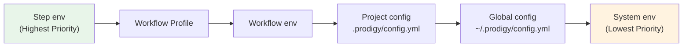
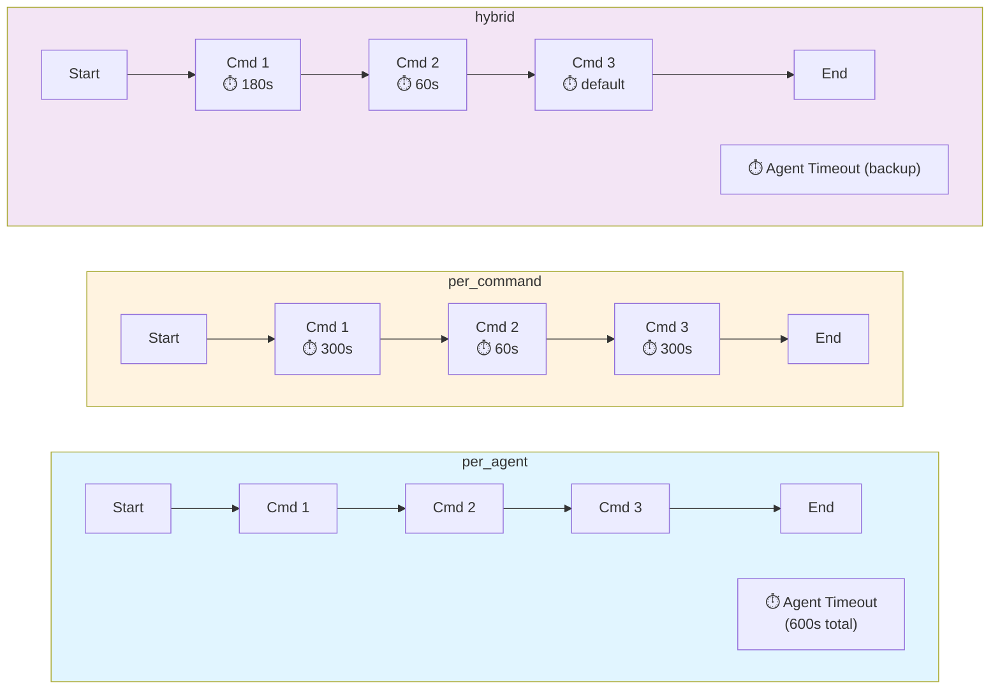
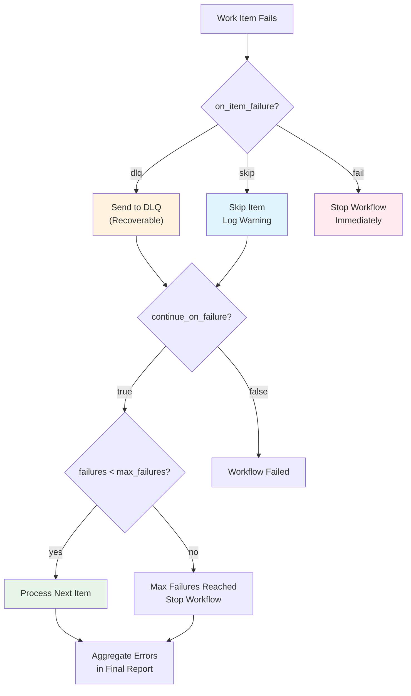

## Advanced Configuration

This subsection covers advanced configuration topics for optimizing and customizing your automated documentation workflows. These configurations enable fine-tuning of performance, security, and behavior for documentation generation at scale.

### Configuration Files and Locations

Prodigy supports configuration at multiple levels with a clear precedence chain:

**Configuration File Locations** (Source: src/config/prodigy_config.rs:363-374):

1. **Global Configuration**: `~/.prodigy/config.yml`
   - Applies across all projects
   - Contains defaults for editor, log level, API keys, and global settings

2. **Project Configuration**: `.prodigy/config.yml`
   - Project-specific overrides
   - Contains project name, description, spec directory, and custom variables

3. **Workflow Environment**: `env:` block in workflow YAML files
   - Workflow-specific configuration
   - Defines variables, secrets, and profiles for the workflow

**Configuration Precedence Chain**:



**Figure**: Configuration precedence from highest (Step env) to lowest (System env). Higher-priority configurations override lower-priority ones.

For example, a step-level environment variable will override the same variable defined in the workflow env block.

!!! info "Precedence in Practice"
    When debugging unexpected configuration values, trace through the precedence chain from highest to lowest. Use `-vv` verbosity to see resolved configuration values at runtime.

### Environment Variables

Environment variables parameterize workflows and can be defined in the `env:` block at the workflow root (Source: src/cook/environment/config.rs:12-36).

**Environment Configuration Structure** (Source: src/cook/environment/config.rs:12-36):

```yaml
env:
  # Plain variables
  PROJECT_NAME: "Prodigy"
  VERSION: "1.0.0"
  BOOK_DIR: "book"

  # Secret variables (masked in logs)
  API_KEY:
    secret: true
    value: "sk-abc123"

  # Profile-specific variables
  DATABASE_URL:
    default: "postgres://localhost/dev"
    prod: "postgres://prod-server/db"
```

**Variable Interpolation Syntax**:
- `$VAR` - Simple variable reference (shell-style)
- `${VAR}` - Bracketed reference for clarity

**Secret Masking** (Source: src/cook/environment/mod.rs:45-61):

Variables marked with `secret: true` are automatically masked in command output logs, error messages, event logs, and checkpoint files. The masking utility replaces secret values with `***MASKED***`.

**Profile Support**:

Activate different environment profiles using the `--profile` flag:
```bash
prodigy run workflow.yml --profile prod
```

**Real-World Example** (Source: workflows/book-docs-drift.yml:8-21):

```yaml
env:
  # Project configuration
  PROJECT_NAME: "Prodigy"
  PROJECT_CONFIG: ".prodigy/book-config.json"
  FEATURES_PATH: ".prodigy/book-analysis/features.json"

  # Book-specific settings
  BOOK_DIR: "book"
  ANALYSIS_DIR: ".prodigy/book-analysis"
  CHAPTERS_FILE: "workflows/data/prodigy-chapters.json"

  # Workflow settings
  MAX_PARALLEL: "3"
```

These variables are referenced throughout the workflow using `$VARIABLE_NAME` or `${VARIABLE_NAME}` syntax.

### Advanced Environment Types

Beyond static values, Prodigy supports dynamic computation, conditional evaluation, and multiple secret provider integrations (Source: src/cook/environment/config.rs:38-112).

#### Dynamic Environment Values

Use `DynamicEnv` for values computed at runtime from command output:

```yaml
env:
  # Dynamic value from command output
  CURRENT_BRANCH:
    command: "git branch --show-current"
    cache: true  # Cache result to avoid re-running

  # Git commit hash for versioning
  GIT_SHA:
    command: "git rev-parse --short HEAD"
    cache: true

  # Timestamp for unique identifiers
  BUILD_TIMESTAMP:
    command: "date +%Y%m%d_%H%M%S"
    cache: false  # Fresh value on each access
```

**DynamicEnv Fields** (Source: src/cook/environment/config.rs:63-70):

- `command`: Shell command to execute for the value
- `cache`: Whether to cache the result (default: `false`)

!!! tip "Caching Recommendation"
    Enable `cache: true` for values that don't change during workflow execution (like git branch or commit hash). This reduces command execution overhead.

#### Conditional Environment Values

Use `ConditionalEnv` for values that depend on runtime conditions:

```yaml
env:
  # Environment-dependent database URL
  DATABASE_URL:
    condition: "branch == 'main'"
    when_true: "postgres://prod-server/db"
    when_false: "postgres://localhost/dev"

  # Debug mode based on environment
  DEBUG_MODE:
    condition: "env.CI == 'true'"
    when_true: "false"
    when_false: "true"

  # API endpoint by context
  API_ENDPOINT:
    condition: "profile == 'prod'"
    when_true: "https://api.production.example.com"
    when_false: "https://api.staging.example.com"
```

**ConditionalEnv Fields** (Source: src/cook/environment/config.rs:73-81):

- `condition`: Expression to evaluate (supports variable references)
- `when_true`: Value when condition evaluates to true
- `when_false`: Value when condition evaluates to false

#### Secret Providers

Prodigy supports multiple secret provider backends for secure credential management (Source: src/cook/environment/config.rs:98-112):

=== "Environment Variable"
    ```yaml
    secrets:
      API_KEY:
        provider: env
        key: "MY_API_KEY"
    ```
    Reads from system environment variable.

=== "File-Based"
    ```yaml
    secrets:
      SSL_CERT:
        provider: file
        key: "/etc/secrets/cert.pem"
    ```
    Reads secret from file path.

=== "HashiCorp Vault"
    ```yaml
    secrets:
      DB_PASSWORD:
        provider: vault
        key: "secret/data/database"
        version: "2"  # Optional version
    ```
    Fetches from Vault at specified path.

=== "AWS Secrets Manager"
    ```yaml
    secrets:
      API_TOKEN:
        provider: aws
        key: "prod/api/token"
        version: "AWSCURRENT"  # Optional version stage
    ```
    Retrieves from AWS Secrets Manager.

=== "Custom Provider"
    ```yaml
    secrets:
      CUSTOM_SECRET:
        provider:
          custom: "my-secret-backend"
        key: "custom/path/to/secret"
    ```
    Uses a custom secret provider implementation.

**SecretProvider Types** (Source: src/cook/environment/config.rs:99-112):

| Provider | Description | Use Case |
|----------|-------------|----------|
| `env` | Environment variable | Local development, CI/CD |
| `file` | File-based secret | Kubernetes secrets, mounted volumes |
| `vault` | HashiCorp Vault | Enterprise secret management |
| `aws` | AWS Secrets Manager | AWS-native applications |
| `custom` | Custom implementation | Internal systems |

!!! warning "Secret Security"
    All values retrieved via secret providers are automatically masked in logs, error messages, and checkpoint files. Never commit secrets directly in workflow files.

### MapReduce Performance Tuning

For documentation workflows using MapReduce, several configuration options control parallelism and resource usage (Source: src/config/mapreduce.rs:238-241, 276-278).

**max_parallel Configuration** (Source: src/config/mapreduce.rs:238-241):

Controls the number of concurrent documentation agents processing chapters/subsections in parallel:

```yaml
map:
  input: "${ANALYSIS_DIR}/flattened-items.json"
  json_path: "$[*]"

  agent_template:
    - claude: "/prodigy-fix-subsection-drift --project $PROJECT_NAME --json '${item}'"

  max_parallel: ${MAX_PARALLEL}  # Default: 10
```

**Performance Trade-offs**:
- **Higher parallelism** (10+): Faster completion, higher resource usage (CPU, memory, disk I/O)
- **Lower parallelism** (3-5): More conservative resource usage, longer total execution time
- **Balanced approach** (5-7): Good for most documentation workflows

The `book-docs-drift.yml` workflow uses `MAX_PARALLEL: 3` for balanced performance and resource management.

**Timeout Configuration** (Source: src/cook/execution/mapreduce/timeout.rs:36-61):

Configure comprehensive timeout management for agents with the `TimeoutConfig` structure:

```yaml
map:
  input: "${ANALYSIS_DIR}/flattened-items.json"
  json_path: "$[*]"

  timeout_config:
    # Global timeout for entire agent execution (seconds)
    agent_timeout_secs: 600  # 10 minutes default

    # Per-command timeout overrides (seconds)
    command_timeouts:
      claude: 300    # 5 minutes for Claude commands
      shell: 60      # 1 minute for shell commands
      claude_0: 180  # Override for first Claude command specifically

    # Timeout enforcement policy
    timeout_policy: hybrid  # per_agent, per_command, or hybrid

    # Grace period for cleanup after timeout (seconds)
    cleanup_grace_period_secs: 30

    # Action on timeout
    timeout_action: dlq  # dlq, skip, fail, or graceful_terminate

    # Enable monitoring and metrics
    enable_monitoring: true

  agent_template:
    - claude: "/prodigy-fix-subsection-drift --project $PROJECT_NAME --json '${item}'"
```

**TimeoutConfig Fields** (Source: src/cook/execution/mapreduce/timeout.rs:38-61):

| Field | Type | Default | Description |
|-------|------|---------|-------------|
| `agent_timeout_secs` | `u64` | 600 | Global timeout for agent execution |
| `command_timeouts` | `HashMap` | `{}` | Per-command timeout overrides |
| `timeout_policy` | `enum` | `per_agent` | How timeouts are enforced |
| `cleanup_grace_period_secs` | `u64` | 30 | Grace period for cleanup |
| `timeout_action` | `enum` | `dlq` | Action on timeout |
| `enable_monitoring` | `bool` | `true` | Enable timeout metrics |

**Timeout Policies** (Source: src/cook/execution/mapreduce/timeout.rs:77-86):



**Figure**: Timeout policy comparison - per_agent uses a single global timeout, per_command uses individual timeouts per command, and hybrid combines both approaches.

- `per_agent`: Single timeout for entire agent execution
- `per_command`: Individual timeout for each command
- `hybrid`: Agent timeout with per-command overrides

**Timeout Actions** (Source: src/cook/execution/mapreduce/timeout.rs:89-100):

- `dlq`: Send work item to Dead Letter Queue (default)
- `skip`: Skip the item and continue
- `fail`: Fail the entire job
- `graceful_terminate`: Attempt graceful termination, then force kill

!!! tip "Timeout Strategy"
    For documentation workflows with variable complexity, use `timeout_policy: hybrid` with generous agent timeouts and specific overrides for known long-running commands.

### Book Configuration

The `.prodigy/book-config.json` file defines book-specific analysis and generation settings (Source: .prodigy/book-config.json:1-220).

**Book Configuration Structure** (Source: .prodigy/book-config.json):

```json
{
  "project_name": "Prodigy",
  "project_type": "cli_tool",
  "book_dir": "book",
  "book_src": "book/src",
  "book_build_dir": "book/book",
  "analysis_targets": [
    {
      "area": "configuration",
      "source_files": [
        "src/config/mod.rs",
        "src/config/settings.rs"
      ],
      "feature_categories": [
        "file_locations",
        "precedence",
        "claude_settings",
        "storage_settings"
      ]
    }
  ],
  "chapter_file": "workflows/data/prodigy-chapters.json",
  "custom_analysis": {
    "include_examples": true,
    "include_best_practices": true,
    "include_troubleshooting": true
  }
}
```

**Key Fields**:

- `analysis_targets`: Defines codebase areas to analyze for feature extraction
- `source_files`: Source code files to scan for each area
- `feature_categories`: Categories of features to document for each area
- `custom_analysis`: Options for controlling generated content sections

**Custom Analysis Options**:

| Option | Effect When `true` | Effect When `false` |
|--------|-------------------|---------------------|
| `include_examples` | Extracts code examples from tests and source files, adding practical usage samples to documentation | Documentation contains only conceptual explanations |
| `include_best_practices` | Adds best practices and recommended patterns based on codebase conventions | Omits prescriptive guidance sections |
| `include_troubleshooting` | Generates troubleshooting sections from error handling patterns and common failure modes | Omits troubleshooting content |

!!! example "Custom Analysis in Practice"
    When `include_examples: true`, the documentation generator searches test files for usage patterns and extracts realistic code samples that demonstrate actual API usage.

**Adapting for Different Project Types**:
- Rust: Use `src/**/*.rs` patterns
- Python: Use `src/**/*.py` or package structure
- JavaScript: Use `src/**/*.js`, `src/**/*.ts`

### Claude-Specific Configuration

Control Claude's behavior during documentation generation with environment variables and verbosity flags.

**Claude Streaming Configuration**:

- `PRODIGY_CLAUDE_STREAMING=false`: Disable JSON streaming output (useful in CI/CD)
- `PRODIGY_CLAUDE_CONSOLE_OUTPUT=true`: Force streaming output regardless of verbosity
- `-v` flag: Enable verbose mode to see Claude streaming output for debugging

**Claude Log Locations**:

Claude creates detailed JSON log files for each command execution at:
```
~/.local/state/claude/logs/session-{session_id}.json
```

**Analyzing Claude Logs for Debugging**:

```bash
# View complete Claude interaction
cat ~/.local/state/claude/logs/session-abc123.json | jq '.messages'

# Check tool invocations
cat ~/.local/state/claude/logs/session-abc123.json | jq '.messages[].content[] | select(.type == "tool_use")'

# Analyze token usage
cat ~/.local/state/claude/logs/session-abc123.json | jq '.usage'
```

Use `-v` flag during workflow execution to see real-time streaming output from Claude for troubleshooting failed documentation agents.

### Error Handling Configuration

Configure how documentation workflows handle failures and errors (Source: workflows/book-docs-drift.yml:85-90).

**Error Policy Configuration** (Source: workflows/book-docs-drift.yml:85-90):

```yaml
error_policy:
  on_item_failure: dlq            # Send failed items to Dead Letter Queue
  continue_on_failure: true       # Continue processing other items
  max_failures: 2                 # Stop workflow after 2 failures
  error_collection: aggregate     # Aggregate errors for reporting
```

**Error Policy Options**:



**Figure**: Error handling flow showing how `on_item_failure`, `continue_on_failure`, and `max_failures` interact.

- `on_item_failure`: `dlq` (Dead Letter Queue), `fail` (stop immediately), `skip` (continue)
- `continue_on_failure`: Whether to continue processing remaining items after a failure
- `max_failures`: Maximum number of failures before stopping the entire workflow
- `error_collection`: How to collect and report errors (`aggregate`, `individual`)

!!! warning "max_failures Consideration"
    Setting `max_failures` too low may cause workflows to stop prematurely on transient issues. For documentation workflows, a value of 2-5 provides a balance between catching systemic issues and tolerating occasional failures.

**Dead Letter Queue (DLQ) Usage**:

Failed documentation items are stored in `~/.prodigy/dlq/{repo_name}/{job_id}/` for review and retry:

```bash
# View failed items
prodigy dlq show <job_id>

# Retry all failed items
prodigy dlq retry <job_id>

# Retry with custom parallelism
prodigy dlq retry <job_id> --max-parallel 5
```

**Retry Strategies**:

While not shown in the example workflow, retry configuration can be added to commands:
- Backoff strategies: exponential, linear, fibonacci
- Max retry attempts
- Retry budget limits

### Storage and Worktree Configuration

Prodigy uses global storage for centralized state management and git worktrees for isolation.

**Global Storage Locations**:
- Events: `~/.prodigy/events/{repo_name}/{job_id}/`
- DLQ: `~/.prodigy/dlq/{repo_name}/{job_id}/`
- State: `~/.prodigy/state/{repo_name}/mapreduce/jobs/{job_id}/`
- Worktrees: `~/.prodigy/worktrees/{repo_name}/`

**Repository Grouping**:

All storage is grouped by repository name, enabling:
- Cross-worktree event aggregation
- Persistent state across worktree cleanup
- Centralized monitoring of all jobs for a repository

**Cleanup Policies**:
- **Automatic cleanup on success**: Worktrees are removed after successful agent completion
- **Orphan registry on failure**: Failed worktrees are registered in `~/.prodigy/orphaned_worktrees/{repo_name}/{job_id}.json`

**Cleaning Orphaned Worktrees**:

```bash
# List orphaned worktrees
prodigy worktree clean-orphaned <job_id>

# Clean with confirmation
prodigy worktree clean-orphaned <job_id> --force
```

### Validation Configuration

Configure quality gates and validation for documentation generation (Source: workflows/book-docs-drift.yml:64-72).

Validation is configured as a nested property within commands in the `agent_template`, not as a standalone top-level block. This structure allows validation to be tied to specific command outputs.

**Validation Configuration** (Source: workflows/book-docs-drift.yml:64-72):

```yaml
agent_template:
  # Command that produces output to validate
  - claude: "/prodigy-fix-subsection-drift --project $PROJECT_NAME --json '${item}'"
    commit_required: true
    validate:
      claude: "/prodigy-validate-doc-fix --project $PROJECT_NAME --json '${item}' --output .prodigy/validation-result.json"
      result_file: ".prodigy/validation-result.json"
      threshold: 100  # Documentation must meet 100% quality standards
      on_incomplete:
        claude: "/prodigy-complete-doc-fix --project $PROJECT_NAME --json '${item}' --gaps ${validation.gaps}"
        max_attempts: 3
        fail_workflow: false  # Continue even if we can't reach 100%
        commit_required: true  # Require commit to verify improvements were made
```

!!! note "Validation Nesting"
    The `validate` block is nested under a command step, not at the workflow root level. This allows the validation to reference command outputs and work item context.

**Validation Options**:
- `threshold`: Completion percentage required to pass (0-100)
- `result_file`: File where validation results are written
- `on_incomplete`: Handler to execute when validation threshold is not met
- `max_attempts`: Maximum attempts to complete validation
- `fail_workflow`: Whether to fail the entire workflow if validation never passes

**Quality Gates**:

The validation system ensures:
- All critical drift issues are addressed
- Documentation meets minimum content requirements
- Examples are grounded in actual codebase
- Links are valid and point to existing files

### Configuration Checklist for Optimizing Documentation Workflows

**Performance Optimization**:
- [ ] Set `MAX_PARALLEL` based on available CPU cores (recommend: cores / 2)
- [ ] Configure agent timeouts appropriate for documentation complexity
- [ ] Use global storage for centralized state management

**Security**:
- [ ] Mark API keys and sensitive data as secrets (`secret: true`)
- [ ] Use profiles to separate development and production credentials
- [ ] Enable secret masking for logs and error output

**Quality Control**:
- [ ] Set validation threshold to 100% for production documentation
- [ ] Configure `on_incomplete` handlers to automatically fix validation failures
- [ ] Enable `error_policy.on_item_failure: dlq` for failed item recovery

**Resource Management**:
- [ ] Configure cleanup policies for worktrees
- [ ] Set `max_failures` to prevent runaway workflows
- [ ] Use `continue_on_failure: true` to maximize successful documentation coverage

**Debugging**:
- [ ] Enable Claude streaming in development (`-v` flag or `PRODIGY_CLAUDE_CONSOLE_OUTPUT=true`)
- [ ] Configure verbose logging for troubleshooting
- [ ] Preserve Claude JSON logs for post-mortem analysis

### Troubleshooting Common Configuration Issues

**Issue: Documentation workflow is too slow**
- Solution: Increase `MAX_PARALLEL` value, but monitor resource usage
- Check: CPU and memory utilization during workflow execution

**Issue: Out of memory errors during MapReduce**
- Solution: Decrease `max_parallel` to reduce concurrent agent count
- Check: Each agent may load large amounts of documentation into context

**Issue: Secrets appearing in logs**
- Solution: Ensure secrets are marked with `secret: true` in environment config
- Check: Review event logs and Claude logs for masked values

**Issue: Validation always failing at 100% threshold**
- Solution: Review validation command output to identify quality gaps
- Check: Use `on_incomplete` handler with `max_attempts` to iteratively improve

**Issue: Orphaned worktrees consuming disk space**
- Solution: Run `prodigy worktree clean-orphaned <job_id>` regularly
- Check: Monitor `~/.prodigy/worktrees/` directory size
