## Automatic Gap Detection

Automatic gap detection is a critical component of Prodigy's documentation workflow that identifies undocumented features and automatically creates chapter definitions with stub markdown files. This ensures comprehensive documentation coverage and prevents features from being implemented without corresponding user guidance.

!!! info "Scope"
    This page documents **mdBook gap detection** for the `book/` directory using `/prodigy-detect-documentation-gaps`. For **MkDocs documentation** (like this site in `docs/`), see the MkDocs-specific commands: `/prodigy-detect-mkdocs-gaps`.

**Source**: `.claude/commands/prodigy-detect-documentation-gaps.md`

## Overview

Gap detection runs in the **setup phase** of the book workflow and performs several key functions:

1. **Analyzes** features.json (from feature analysis) against existing chapters
2. **Classifies** gaps by severity (high severity = missing chapter for major feature)
3. **Creates** missing chapter definitions and stub markdown files
4. **Updates** SUMMARY.md with proper hierarchy
5. **Generates** flattened-items.json for the map phase (mandatory)


**Figure**: Gap detection pipeline showing input analysis, gap classification, and output generation.

!!! warning "Focus on Feature Coverage"
    Gap detection focuses on **feature coverage** - ensuring all major features have documentation. It does NOT analyze chapter sizes or create subsections. For that, use `/prodigy-analyze-chapter-structure`.

The gap detection process ensures that:
- All major features have corresponding documentation chapters
- The map phase receives a complete, flat list of all chapters and subsections to process
- Documentation organization matches implementation reality

## Command Usage

**Command**: `/prodigy-detect-documentation-gaps`

**Parameters**:

| Parameter | Description | Example |
|-----------|-------------|---------|
| `--project` | Project name | `"Prodigy"` |
| `--config` | Path to book configuration JSON | `".prodigy/book-config.json"` |
| `--features` | Path to features.json from setup phase | `".prodigy/book-analysis/features.json"` |
| `--chapters` | Path to chapter definitions JSON | `"workflows/data/prodigy-chapters.json"` |
| `--book-dir` | Book directory path | `"book"` |

```bash title="Example invocation"
/prodigy-detect-documentation-gaps \
  --project "Prodigy" \
  --config ".prodigy/book-config.json" \
  --features ".prodigy/book-analysis/features.json" \
  --chapters "workflows/data/prodigy-chapters.json" \
  --book-dir "book"
```

**Workflow Integration**:

```yaml title="workflows/book-docs-drift.yml"
setup:
  # Step 1: Analyze features
  - claude: "/prodigy-analyze-features-for-book --project $PROJECT_NAME --config $PROJECT_CONFIG"

  # Step 2: Detect gaps and generate flattened-items.json
  - claude: "/prodigy-detect-documentation-gaps \
      --project $PROJECT_NAME \
      --config $PROJECT_CONFIG \
      --features $FEATURES_PATH \
      --chapters $CHAPTERS_FILE \
      --book-dir $BOOK_DIR"
```

## Gap Severity Classification

Gap detection classifies documentation gaps based on feature importance:

!!! tip "Simplified Classification"
    The current implementation focuses on **high severity gaps** - missing chapters for major features. Content drift within existing chapters is handled by the map phase.

### High Severity (Missing Chapter)

A high severity gap means a major feature exists in the codebase but has no corresponding documentation chapter.

**Criteria**:

- Feature area exists in features.json with `type: "major_feature"`
- NO corresponding chapter found (by ID, title, or topic matching)
- Major user-facing capability with no guidance

**Action**: Create new chapter definition with stub markdown file

```json title="Example gap report entry"
{
  "severity": "high",
  "type": "missing_chapter",
  "feature_category": "agent_merge",
  "feature_description": "Custom merge workflows for map agents",
  "recommended_chapter_id": "agent-merge-workflows",
  "recommended_title": "Agent Merge Workflows"
}
```

!!! note "Meta Features Skipped"
    Features with `type: "meta"` are automatically skipped - meta-content (like troubleshooting, best practices) should not have dedicated chapters.

## Chapter Definition Generation

When a high severity gap is detected (missing chapter for a major feature), the command generates a new chapter definition.

### Generation Process

=== "Step 1: Generate IDs"
    - Convert feature category to kebab-case
    - Example: `agent_merge` → `agent-merge-workflows`
    - Ensure uniqueness against existing chapter IDs

=== "Step 2: Generate Title"
    - Convert to title case with spaces
    - Example: `agent_merge` → "Agent Merge Workflows"

=== "Step 3: Determine File Path"
    - Format: `${book_src}/${chapter_id}.md`
    - Example: `book/src/agent-merge-workflows.md`

=== "Step 4: Extract Topics"
    - Read feature capabilities from features.json
    - Convert capabilities to topic names

### Chapter Definition Structure

```json title="Generated chapter definition"
{
  "id": "agent-merge-workflows",
  "title": "Agent Merge Workflows",
  "file": "book/src/agent-merge-workflows.md",
  "topics": ["Agent merge configuration", "Merge validation", "Error handling in merges"],
  "validation": "Check that agent_merge syntax and variables are documented",
  "auto_generated": true,
  "source_feature": "agent_merge"
}
```

## Stub File Creation

For each new chapter, a stub markdown file is created:

```markdown title="Generated stub structure"
# {Chapter Title}

{Brief introduction explaining the purpose of this feature/capability}

## Overview

{High-level description of what this feature enables}

## Configuration

{If applicable, configuration options and syntax}

## Usage

{Basic usage examples}

## See Also

- [Related documentation](link)
```

!!! warning "Stub Limitations"
    Stubs do NOT include Prerequisites, Installation, Best Practices, or Troubleshooting sections. These belong in dedicated root-level files.

## Flattened Items Generation

!!! danger "Mandatory Output"
    The `flattened-items.json` file **MUST** be generated regardless of whether gaps are found. The map phase depends on it for parallel processing.

### Purpose

Creates a flat array of all chapters and subsections for parallel processing in the map phase. This enables each map agent to work on a single chapter or subsection independently.

### Processing Logic

```
For each chapter in chapters.json:
  If type == "multi-subsection":
    For each subsection in chapter.subsections:
      Create item with parent metadata
      Add to flattened array

  If type == "single-file":
    Create item with type marker
    Add to flattened array
```

### Output Structure

**File**: `.prodigy/book-analysis/flattened-items.json`

**Example**:
```json
[
  {
    "id": "workflow-basics",
    "title": "Workflow Basics",
    "file": "book/src/workflow-basics.md",
    "topics": [
      "Setup phase",
      "Command types",
      "Variable interpolation"
    ],
    "validation": "Check that workflow syntax and variable documentation are complete",
    "type": "single-file"
  },
  {
    "id": "checkpoint-and-resume",
    "title": "Checkpoint and Resume",
    "file": "book/src/mapreduce/checkpoint-and-resume.md",
    "parent_chapter_id": "mapreduce",
    "parent_chapter_title": "MapReduce Workflows",
    "type": "subsection",
    "topics": [
      "Checkpoint creation",
      "Resume behavior",
      "State preservation"
    ],
    "validation": "Check that checkpoint mechanism and resume procedures are documented",
    "feature_mapping": [
      "mapreduce.checkpoint",
      "mapreduce.resume"
    ]
  },
  {
    "id": "performance-tuning",
    "title": "Performance Tuning",
    "file": "book/src/mapreduce/performance-tuning.md",
    "parent_chapter_id": "mapreduce",
    "parent_chapter_title": "MapReduce Workflows",
    "type": "subsection",
    "topics": [
      "Parallel execution",
      "Resource limits"
    ],
    "feature_mapping": [
      "mapreduce.performance",
      "mapreduce.resource_limits"
    ]
  }
]
```

### Map Phase Integration

The map phase consumes flattened-items.json:

```yaml title="Map phase workflow consumption"
map:
  input: "${ANALYSIS_DIR}/flattened-items.json"
  json_path: "$[*]"  # Each item is a chapter or subsection

  agent_template:
    # Analyze drift for this specific chapter/subsection
    - claude: "/prodigy-analyze-subsection-drift --project $PROJECT_NAME --json '${item}' --features $FEATURES_PATH"

    # Fix drift for this specific chapter/subsection
    - claude: "/prodigy-fix-subsection-drift --project $PROJECT_NAME --json '${item}'"
```

!!! tip "Parallel Processing Benefit"
    By flattening chapters and subsections into individual items, each map agent can work independently on a single documentation unit. This enables efficient parallel processing - 10 agents can process 10 chapters simultaneously.

!!! info "Why Required"
    Without flattened-items.json, the map phase cannot parallelize drift analysis and fixing across chapters/subsections.

## Topic Normalization

Gap detection uses normalization logic to accurately match feature categories against documented topics.

```mermaid
flowchart TD
    Feature["Feature Category
    e.g., 'MapReduce Workflows'"] --> Normalize["Normalize
    lowercase, no punctuation"]
    Normalize --> Terms["Extract Terms
    ['mapreduce', 'workflows']"]

    Terms --> Match{"Match Against
    Chapters?"}

    Match -->|"ID contains term"| Found["Chapter Found"]
    Match -->|"Title fuzzy match ≥0.7"| Found
    Match -->|"Topics include term"| Found
    Match -->|"No match found"| Gap["Gap Detected
    (High Severity)"]

    Gap --> Create["Create Chapter
    Definition + Stub"]

    style Feature fill:#e1f5ff
    style Match fill:#fff3e0
    style Found fill:#e8f5e9
    style Gap fill:#ffebee
```



**Figure**: Topic normalization and matching flow for gap detection.

### Normalization Steps

1. Convert to lowercase
2. Remove punctuation and special characters
3. Trim whitespace
4. Extract key terms from compound names

### Examples

| Input | Normalized Output |
|-------|-------------------|
| `"MapReduce Workflows"` | `["mapreduce", "workflows"]` |
| `"agent_merge"` | `"agent-merge"` |
| `"command-types"` | `"command-types"` |
| `"Validation Operations"` | `["validation", "operations"]` |

### Matching Logic

For each feature area in features.json, the command checks if any of these match:

1. Chapter ID contains normalized category
2. Normalized category contains chapter ID
3. Chapter title contains feature name (fuzzy match with 0.7 threshold)
4. Chapter topics include feature name

## Idempotence

Gap detection can be run multiple times safely without creating duplicate chapters.

!!! success "Idempotence Guarantees"
    - **Checks for existing chapters** before creating
    - **Uses normalized comparison** for matching
    - **Skips already-created chapters**
    - **Can run repeatedly** without side effects

## Gap Report Structure

**Output**: `.prodigy/book-analysis/gap-report.json`

```json title="Example gap-report.json"
{
  "analysis_date": "2025-11-09T12:34:56Z",
  "features_analyzed": 12,
  "documented_topics": 10,
  "gaps_found": 2,
  "gaps": [
    {
      "severity": "high",
      "type": "missing_chapter",
      "feature_category": "agent_merge",
      "feature_description": "Custom merge workflows for map agents",
      "recommended_chapter_id": "agent-merge-workflows",
      "recommended_title": "Agent Merge Workflows",
      "recommended_location": "book/src/agent-merge-workflows.md"
    },
    {
      "severity": "high",
      "type": "missing_chapter",
      "feature_category": "circuit_breaker",
      "feature_description": "Circuit breaker for error handling",
      "recommended_chapter_id": "circuit-breaker",
      "recommended_title": "Circuit Breaker",
      "recommended_location": "book/src/circuit-breaker.md"
    }
  ],
  "actions_taken": [
    {
      "action": "created_chapter_definition",
      "chapter_id": "agent-merge-workflows",
      "file_path": "workflows/data/prodigy-chapters.json"
    },
    {
      "action": "created_stub_file",
      "file_path": "book/src/agent-merge-workflows.md",
      "type": "chapter"
    },
    {
      "action": "updated_summary",
      "file_path": "book/src/SUMMARY.md",
      "items_added": [
        {"type": "chapter", "id": "agent-merge-workflows"}
      ]
    }
  ]
}
```

## Execution Progress

When gap detection runs, it displays progress through the analysis phases:

```title="Example execution output"
🔍 Analyzing documentation coverage...
   ✓ Loaded 12 feature areas from features.json
   ✓ Loaded 10 existing chapters
   ✓ Parsed SUMMARY.md structure

📊 Comparing features against documentation...
   ✓ Analyzed workflow_basics: documented ✓
   ✓ Analyzed mapreduce: documented ✓
   ⚠ Analyzed agent_merge: not documented (gap detected)
   ✓ Analyzed command_types: documented ✓
   ⚠ Analyzed circuit_breaker: not documented (gap detected)

📝 Creating missing chapters...
   ✓ Generated definition: agent-merge-workflows
   ✓ Created stub: book/src/agent-merge-workflows.md
   ✓ Generated definition: circuit-breaker
   ✓ Created stub: book/src/circuit-breaker.md
   ✓ Updated SUMMARY.md

💾 Generating flattened items for map phase...
   ✓ Processed 10 chapters/subsections
   ✓ Generated .prodigy/book-analysis/flattened-items.json

💾 Committing changes...
   ✓ Staged files
   ✓ Committed: docs: add missing chapters for agent-merge-workflows, circuit-breaker
```

### Final Summary

```title="Summary output"
📊 Documentation Gap Analysis
━━━━━━━━━━━━━━━━━━━━━━━━━━━━━━━━━━━━━━━━━━

Features Analyzed: 12
Documented Topics: 10
Gaps Found: 2

🔴 High Severity Gaps (Missing Chapters):
  • agent_merge - Custom merge workflows for map agents
  • circuit_breaker - Workflow error circuit breaking

✅ Actions Taken:
  ✓ Generated flattened-items.json for map phase (12 items)
  ✓ Created 2 chapter definitions
  ✓ Created 2 stub files
  ✓ Updated SUMMARY.md

📝 Next Steps:
  The map phase will process all 12 chapters to detect drift.
  Run /prodigy-analyze-chapter-structure to check for oversized chapters.
```

## Error Handling

### Common Errors

=== "Missing features.json"
    **Cause**: Feature analysis step hasn't run yet

    **Solution**: Ensure `/prodigy-analyze-features-for-book` runs before gap detection in setup phase

    **Error Message**: `"Error: features.json not found at {path}. Run feature analysis first."`

=== "Missing/Invalid chapters.json"
    **Cause**: Chapter definitions file doesn't exist or has invalid JSON

    **Solution**: Create valid chapters.json or fix JSON syntax errors

    **Recovery**: Gap detection can initialize empty chapters.json if needed

=== "File Write Failures"
    **Cause**: Permission issues or disk full

    **Solution**: Check directory permissions and disk space

    **Rollback**: Gap detection records partial state in gap report for manual cleanup

=== "Invalid JSON"
    **Cause**: Malformed JSON in input files

    **Solution**: Validate JSON with `jq` before running workflow

    **Error Recording**: Details added to gap report for debugging

## Related Commands

| Command | Purpose |
|---------|---------|
| `/prodigy-analyze-features-for-book` | Analyze codebase features (runs before gap detection) |
| `/prodigy-analyze-chapter-structure` | Analyze chapter sizes and recommend subsections |
| `/prodigy-create-chapter-subsections` | Migrate chapters to subsection format |
| `/prodigy-detect-mkdocs-gaps` | Gap detection for MkDocs documentation |
