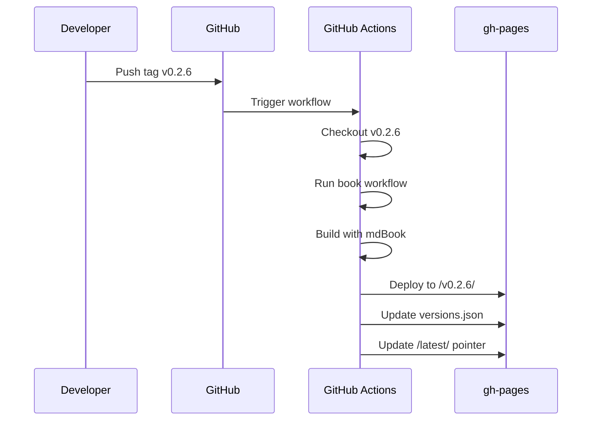

# Documentation Versioning

!!! info "Planned Feature"
    Documentation versioning is currently in the design phase. The specifications referenced below (154, 155, 156) represent conceptual designs that have not yet been formalized into the specs/ directory. This page documents the planned implementation for projects that need to serve multiple documentation versions.

For projects that need to serve multiple documentation versions (e.g., users on different software releases), Prodigy is designing a comprehensive versioned documentation system. This will allow users to select which version of the docs they want to view using a dropdown selector.

## Overview

The documentation versioning system consists of three integrated components:

| Component | Description | Design Reference |
|-----------|-------------|------------------|
| **Version Selector UI** | Dropdown component in mdBook navigation for switching versions | Conceptual Spec 154 |
| **Versioned Deployment** | GitHub Actions workflow deploying each version to its own subdirectory | Conceptual Spec 155 |
| **Version-Aware Workflows** | Enhanced book workflow accepting VERSION parameter | Conceptual Spec 156 |

### Planned Architecture

```mermaid
graph TB
    subgraph "GitHub Repository"
        M[main branch<br/>source + docs]
        T[Tags: v0.2.6, v0.2.5, ...]
    end

    subgraph "gh-pages branch"
        I[index.html<br/>redirects to /latest/]
        V[versions.json]
        L[/latest/<br/>copy of newest]
        V1[/v0.2.6/]
        V2[/v0.2.5/]
        V3[/v0.2.4/]
    end

    M --> T
    T -->|deploy| V1
    T -->|deploy| V2
    T -->|deploy| V3
    V1 -.->|if newest| L
```

**Directory Structure:**

```
gh-pages branch (deployed docs)
├── index.html → redirects to /latest/
├── versions.json
├── latest/ → copy of newest version
├── v0.2.6/ → built from v0.2.6 tag
├── v0.2.5/ → built from v0.2.5 tag
└── v0.2.4/ → built from v0.2.4 tag
```

## Version Selector UI Component

!!! note "Design Reference: Conceptual Spec 154"
    This component design is documented in a conceptual specification that will be formalized when implementation begins.

The version selector will be a lightweight JavaScript component that:

- Displays a dropdown in mdBook's navigation bar
- Fetches version metadata from `/versions.json` at the documentation root
- Preserves the current page path when switching versions
- Works across all mdBook themes with minimal configuration
- Gracefully degrades if `versions.json` is missing

### Integration Pattern

```toml title="book/book.toml"
[output.html]
additional-css = ["theme/version-selector.css"]
additional-js = ["theme/version-selector.js"]
```

### Key Features

=== "User Experience"

    - **Current Version Detection**: Automatically detects which version the user is viewing based on URL path pattern
    - **Visual Indicators**: Highlights current version and marks latest version with "(Latest)" label
    - **Fallback Handling**: If the current page doesn't exist in the target version, redirects to that version's index

=== "Accessibility"

    - Keyboard navigable (Tab, Enter, Arrow keys)
    - Screen reader compatible
    - Semantic HTML using `<select>` element

=== "Performance"

    - < 5KB combined JavaScript and CSS
    - No external dependencies
    - Async loading to not block page render

## versions.json Schema

The version selector fetches version metadata from a central `versions.json` file:

```json title="versions.json"
{
  "latest": "v0.2.6",
  "versions": [
    {
      "version": "v0.2.6",
      "path": "/v0.2.6/",
      "label": "v0.2.6 (Latest)",
      "released": "2025-01-15"
    },
    {
      "version": "v0.2.5",
      "path": "/v0.2.5/",
      "label": "v0.2.5",
      "released": "2025-01-10"
    }
  ]
}
```

| Field | Type | Description |
|-------|------|-------------|
| `latest` | string | Version string of the newest release |
| `version` | string | Semantic version tag (e.g., "v0.2.6") |
| `path` | string | URL path to that version's documentation root |
| `label` | string | Display text in dropdown (includes "(Latest)" for newest) |
| `released` | string | ISO 8601 date of release (optional) |

## Versioned Deployment Workflow

!!! note "Design Reference: Conceptual Spec 155"
    This deployment workflow design is documented in a conceptual specification that will be formalized when implementation begins.

The deployment system will automatically build and deploy documentation when version tags are pushed.

### Workflow Triggers

```yaml title=".github/workflows/deploy-docs-versioned.yml"
on:
  push:
    tags:
      - 'v*.*.*'  # Trigger on semver tags (e.g., v0.2.6)
  workflow_dispatch:
    inputs:
      version:
        description: 'Version to deploy (tag name, "all", or "latest")'
        required: true
        default: 'latest'
      rebuild_all:
        description: 'Rebuild all versions'
        type: boolean
        default: false
```

### Deployment Process



1. **Tag-Triggered Build**: When you push a tag like `v0.2.6`, GitHub Actions automatically:
    - Checks out that specific tag
    - Runs the book workflow for that version
    - Builds documentation with mdBook
    - Deploys to `gh-pages:/v0.2.6/` directory

2. **versions.json Generation**: After deploying a version, a script scans the `gh-pages` branch to generate `versions.json` with all deployed versions

3. **Latest Pointer Update**: If the deployed version is the newest (highest semver), the `/latest/` directory is updated to point to it

4. **Root Redirect**: An `index.html` at the root redirects visitors to `/latest/`

### Key Features

| Feature | Description |
|---------|-------------|
| **Preserves Existing Versions** | Using `keep_files: true` ensures deploying v0.2.6 doesn't delete v0.2.5 |
| **Parallel Builds** | Manual rebuild workflow can rebuild multiple versions concurrently |
| **Idempotent** | Rebuilding the same version produces identical output |
| **Fail-Safe** | Build failures don't corrupt existing deployed versions |

## Version-Aware Book Workflow

!!! note "Design Reference: Conceptual Spec 156"
    This workflow enhancement design is documented in a conceptual specification that will be formalized when implementation begins.

The current `book-docs-drift.yml` workflow will be enhanced to accept a `VERSION` parameter:

### Workflow Configuration

```yaml title="workflows/book-docs-drift.yml"
name: book-docs-drift-detection
mode: mapreduce

env:
  VERSION: "${VERSION:-latest}"  # Accept from caller or default to "latest"

  # Version-aware paths
  ANALYSIS_DIR: ".prodigy/book-analysis/${VERSION}"
  FEATURES_PATH: "${ANALYSIS_DIR}/features.json"
```

### Key Enhancements

1. **VERSION Parameter**: The workflow will accept a `VERSION` environment variable (e.g., "v0.2.6", "latest")

2. **Version-Scoped Analysis**: Drift analysis results will be stored in version-specific directories:
    - `.prodigy/book-analysis/v0.2.6/`
    - `.prodigy/book-analysis/v0.2.5/`
    - `.prodigy/book-analysis/latest/`

3. **Version Validation**: Before processing, the workflow will validate the VERSION format (semver `vX.Y.Z` or "latest") and verify the tag exists

4. **Version in Documentation**: Generated documentation will include version metadata in headers or footers

### Claude Command Integration

```yaml
setup:
  - claude: "/prodigy-analyze-features-for-book --project $PROJECT_NAME --version $VERSION"

map:
  agent_template:
    - claude: "/prodigy-analyze-book-chapter-drift --project $PROJECT_NAME --json '${item}' --version $VERSION"
```

!!! tip "Backward Compatibility"
    If `VERSION` is not provided, the workflow defaults to "latest" and maintains current behavior.

## Setup Instructions

!!! warning "Template Files Not Yet Available"
    The setup files referenced below (version-selector.js, version-selector.css, deploy-docs-versioned.yml) will be provided when this feature is implemented. This section documents the planned setup process.

When implemented, setting up versioned documentation will involve:

### 1. Add Version Selector Theme Files

```bash
# Copy version selector components to your mdBook theme
# (Files will be provided upon implementation)
cp version-selector.js book/theme/
cp version-selector.css book/theme/
```

### 2. Update book.toml Configuration

```toml title="book/book.toml"
[output.html]
additional-css = ["theme/version-selector.css"]
additional-js = ["theme/version-selector.js"]
```

### 3. Add Deployment Workflow

```bash
# Copy the versioned deployment workflow
# (Workflow file will be provided upon implementation)
cp templates/workflows/deploy-docs-versioned.yml .github/workflows/
```

### 4. Create Initial versions.json

```json title="versions.json"
{
  "latest": "v0.2.6",
  "versions": [
    {
      "version": "v0.2.6",
      "path": "/v0.2.6/",
      "label": "v0.2.6 (Latest)",
      "released": "2025-01-15"
    }
  ]
}
```

### 5. Deploy and Test

- Push a version tag to trigger deployment
- Verify version selector appears in navigation
- Test switching between versions

## Version Retention Strategy

!!! info "Storage Management"
    The design includes a version retention policy to manage storage on GitHub Pages. GitHub Pages has a 1GB soft limit, and each documentation version is typically 5-10MB. This retention policy allows ~50-100 versions before cleanup is needed.

### Retention Rules

| Rule | Versions Kept |
|------|---------------|
| **Major versions** | All (v1.0.0, v2.0.0, v3.0.0) |
| **Minor versions per major** | Last 3 (v2.3.0, v2.2.0, v2.1.0) |
| **Patch versions per minor** | Last 5 (v2.3.5, v2.3.4, v2.3.3, v2.3.2, v2.3.1) |

### Cleanup Process

A planned cleanup script will identify and remove old versions:

```bash title="scripts/cleanup-old-versions.sh (planned)"
# Removes versions not matching retention policy
# Regenerates versions.json after cleanup
```

## Manual Deployment

The deployment workflow will support manual triggering for specific use cases:

=== "Rebuild Specific Version"

    ```bash
    # Trigger workflow manually from GitHub UI
    # Set version: v0.2.5
    # Or use GitHub CLI:
    gh workflow run deploy-docs-versioned.yml -f version=v0.2.5
    ```

=== "Rebuild All Versions"

    ```bash
    # Useful after theme updates or global doc changes
    gh workflow run deploy-docs-versioned.yml -f rebuild_all=true
    ```

### Use Cases for Manual Deployment

- Updating documentation theme across all versions
- Fixing critical documentation errors in historical versions
- Regenerating `versions.json` after manual gh-pages branch cleanup
- Testing deployment workflow changes

## Integration with Automated Documentation

The versioning system will integrate with Prodigy's existing automated documentation workflow:

```yaml title=".github/workflows/deploy-docs-versioned.yml"
steps:
  - name: Run book workflow for version
    run: prodigy run workflows/book-docs-drift.yml
    env:
      VERSION: ${{ steps.version.outputs.version }}
```

When a version tag is pushed, the deployment workflow will:

1. Check out the tagged code
2. Run the version-aware book workflow to analyze features at that version
3. Build documentation matching that version's implementation
4. Deploy to the version-specific subdirectory

This ensures documentation always matches the code at each version.

## Testing Versioned Documentation Locally

### Build Multiple Versions

```bash
# Checkout and build v0.2.6
git checkout v0.2.6
prodigy run workflows/book-docs-drift.yml
mdbook build book
mv book/book build/v0.2.6

# Checkout and build v0.2.5
git checkout v0.2.5
prodigy run workflows/book-docs-drift.yml
mdbook build book
mv book/book build/v0.2.5
```

### Create Test versions.json

```bash
cat > build/versions.json <<EOF
{
  "latest": "v0.2.6",
  "versions": [
    {"version": "v0.2.6", "path": "/v0.2.6/", "label": "v0.2.6 (Latest)"},
    {"version": "v0.2.5", "path": "/v0.2.5/", "label": "v0.2.5"}
  ]
}
EOF
```

### Serve and Test Locally

```bash
cd build
python -m http.server 8000
# Visit http://localhost:8000/v0.2.6/
```

**Test Checklist:**

- [ ] Verify dropdown appears in navigation
- [ ] Switch between versions
- [ ] Confirm page paths are preserved
- [ ] Test fallback when page doesn't exist in older version

## Browser Compatibility

The version selector will be designed to work across modern browsers:

=== "Supported Browsers"

    - Chrome, Firefox, Safari, Edge (latest versions)
    - Mobile browsers (iOS Safari, Chrome Mobile)

=== "Technology Choices"

    - Uses `fetch()` API (ES6, widely supported)
    - Semantic HTML (`<select>` element)
    - CSS Grid/Flexbox for layout
    - No external dependencies (no jQuery)

=== "Graceful Degradation"

    - If `fetch()` unavailable (very old browsers), selector won't render but docs remain accessible
    - If `versions.json` missing, component silently skips rendering (no errors shown)

## Related Documentation

- [MkDocs Workflow](mkdocs-workflow.md) - Main documentation automation workflow
- [GitHub Actions Integration](github-actions-integration.md) - CI/CD integration details
- [Advanced Configuration](advanced-configuration.md) - Additional workflow configuration options
