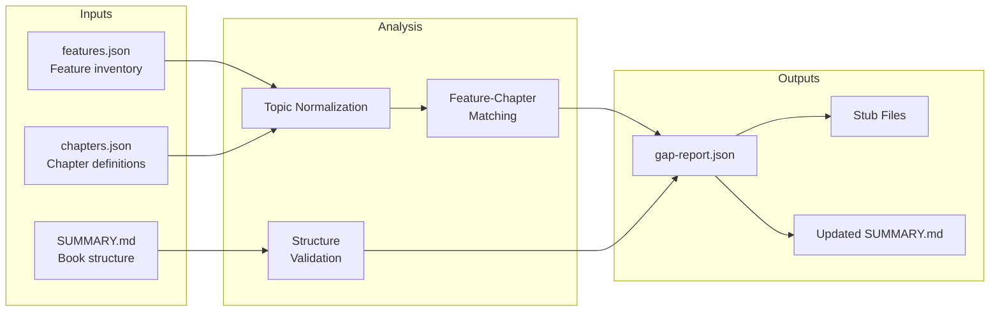
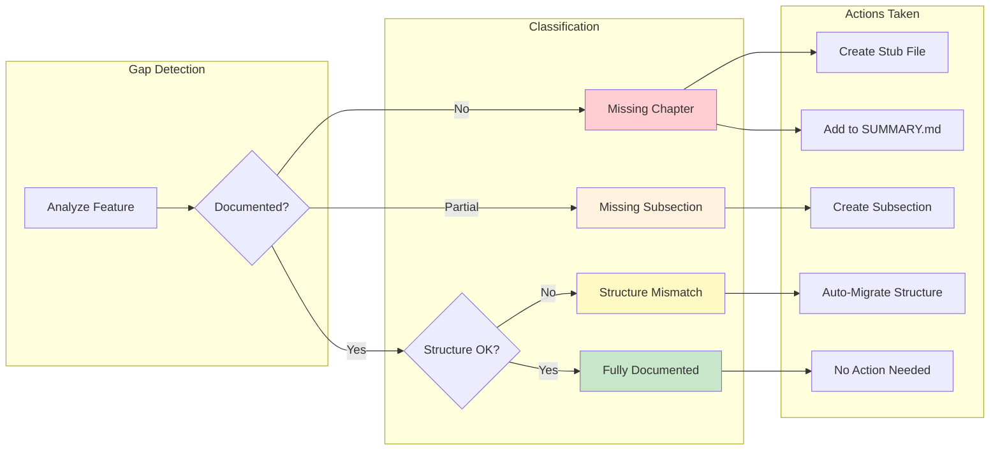

## Gap Report Structure

**Output**: `.prodigy/book-analysis/gap-report.json`

The gap report is generated by comparing the feature inventory against existing documentation chapters. This comparison identifies which features lack documentation coverage.



### Example Reports

Gap reports vary based on the analysis outcome. Below are examples for different scenarios:

=== "Gaps Found"

    When documentation gaps are detected:

    ```json
    {
      "analysis_date": "2025-11-09T12:34:56Z",
      "features_analyzed": 12,
      "documented_topics": 10,
      "gaps_found": 2,
      "gaps": [
        {
          "severity": "high",
          "type": "missing_chapter",
          "feature_category": "agent_merge",
          "feature_description": "Custom merge workflows for map agents",
          "recommended_chapter_id": "agent-merge-workflows",
          "recommended_title": "Agent Merge Workflows",
          "recommended_location": "book/src/agent-merge-workflows.md",
          "is_subsection": false
        },
        {
          "severity": "high",
          "type": "missing_chapter",
          "feature_category": "circuit_breaker",
          "feature_description": "Circuit breaker for error handling",
          "recommended_chapter_id": "circuit-breaker",
          "recommended_title": "Circuit Breaker",
          "recommended_location": "book/src/circuit-breaker.md",
          "is_subsection": false
        }
      ],
      "actions_taken": [
        {
          "action": "created_chapter_definition",
          "chapter_id": "agent-merge-workflows",
          "file_path": "workflows/data/prodigy-chapters.json"
        },
        {
          "action": "created_stub_file",
          "file_path": "book/src/agent-merge-workflows.md",
          "type": "chapter"
        },
        {
          "action": "updated_summary",
          "file_path": "book/src/SUMMARY.md",
          "items_added": [
            {"type": "chapter", "id": "agent-merge-workflows"}
          ]
        }
      ],
      "structure_validation": {
        "mismatches_found": 1,
        "mismatched_chapters": ["mapreduce"],
        "migrations_performed": [
          {
            "chapter_id": "mapreduce",
            "action": "migrated_to_multi_subsection",
            "subsections_discovered": 3
          }
        ],
        "validation_timestamp": "2025-11-09T12:34:56Z"
      }
    }
    ```

=== "No Gaps"

    When all features have documentation coverage:

    ```json
    {
      "analysis_date": "2025-11-09T12:34:56Z",
      "features_analyzed": 12,
      "documented_topics": 12,
      "gaps_found": 0,
      "gaps": [],
      "actions_taken": [],
      "structure_validation": {
        "mismatches_found": 0,
        "mismatched_chapters": [],
        "migrations_performed": [],
        "validation_timestamp": "2025-11-09T12:34:56Z"
      }
    }
    ```

=== "Structure Mismatch Only"

    When documentation exists but structure needs migration:

    ```json
    {
      "analysis_date": "2025-11-09T12:34:56Z",
      "features_analyzed": 12,
      "documented_topics": 12,
      "gaps_found": 0,
      "gaps": [],
      "actions_taken": [
        {
          "action": "updated_chapter_definition",
          "chapter_id": "mapreduce",
          "change": "single_file_to_multi_subsection"
        }
      ],
      "structure_validation": {
        "mismatches_found": 1,
        "mismatched_chapters": ["mapreduce"],
        "migrations_performed": [
          {
            "chapter_id": "mapreduce",
            "action": "migrated_to_multi_subsection",
            "subsections_discovered": 3
          }
        ],
        "validation_timestamp": "2025-11-09T12:34:56Z"
      }
    }
    ```

## Gap Severity and Actions

The gap detection system categorizes findings and takes appropriate actions based on severity:



!!! info "Severity Levels"
    - **High**: Missing chapter - feature has no documentation coverage
    - **Medium**: Missing subsection - feature partially documented but needs expansion
    - **Low**: Structure mismatch - documentation exists but needs reorganization

## Execution Progress

When gap detection runs, it displays progress through multiple phases:

```
Analyzing documentation coverage...
   Loaded 12 feature areas from features.json
   Loaded 10 existing chapters
   Parsed SUMMARY.md structure

Comparing features against documentation...
   Analyzed workflow_basics: documented
   Analyzed mapreduce: documented
   Warning: Analyzed agent_merge: not documented (gap detected)
   Analyzed command_types: documented
   Warning: Analyzed circuit_breaker: not documented (gap detected)

Validating chapter structure (Phase 7.5)...
   Scanning for multi-subsection directories
   Comparing against chapters.json definitions
   Warning: Found mismatch in mapreduce chapter (was single-file, now multi-subsection)
   Auto-migrated mapreduce chapter structure

Creating missing chapters...
   Generated definition: agent-merge-workflows
   Created stub: book/src/agent-merge-workflows.md
   Generated definition: circuit-breaker
   Created stub: book/src/circuit-breaker.md
   Updated SUMMARY.md

Generating flattened items for map phase...
   Processed 1 single-file chapter (workflow-basics)
   Processed 3 subsections from mapreduce chapter
   Processed 10 additional chapters/subsections
   Generated .prodigy/book-analysis/flattened-items.json

Committing changes...
   Staged 6 files
   Committed: docs: auto-discover missing chapters for agent-merge-workflows, circuit-breaker
   Committed: docs: sync chapters.json with actual file structure
```

### Final Summary

```
Documentation Gap Analysis Complete
-----------------------------------

Features Analyzed: 12
Documented Topics: 10
Gaps Found: 2

High Severity Gaps (Missing Chapters): 2
  - agent_merge - Custom merge workflows for map agents
  - circuit_breaker - Workflow error circuit breaking

Actions Taken:
  - Created 2 chapter definitions in workflows/data/prodigy-chapters.json
  - Created 2 stub files in book/src/
  - Updated book/src/SUMMARY.md
  - Generated flattened-items.json with 14 items
  - Auto-migrated 1 chapter structure
  - Committed changes (2 commits)

Next Steps:
  The map phase will now process 14 chapters/subsections to populate content.
  Review the generated stubs and customize as needed.
```

## Error Handling

<!-- Source: .claude/commands/prodigy-detect-documentation-gaps.md -->

### Common Errors

!!! failure "Missing features.json"

    **Cause**: Feature analysis step hasn't run yet

    **Error Message**: `Error: features.json not found at {path}. Run feature analysis first.`

    **Solution**: Ensure `/prodigy-analyze-features-for-book` runs before gap detection in the setup phase.

!!! warning "Missing/Invalid chapters.json"

    **Cause**: Chapter definitions file doesn't exist or has invalid JSON

    **Solution**: Create valid chapters.json or fix JSON syntax errors

    **Recovery**: Gap detection can initialize an empty chapters.json if needed.

!!! failure "File Write Failures"

    **Cause**: Permission issues or disk full

    **Solution**: Check directory permissions and disk space

    **Rollback**: Gap detection records partial state in the gap report for manual cleanup.

!!! tip "Validate JSON Before Running"

    Malformed JSON in input files can cause failures. Validate with `jq` before running:

    ```bash
    jq . .prodigy/book-analysis/features.json > /dev/null
    jq . workflows/data/prodigy-chapters.json > /dev/null
    ```

    Error details are added to the gap report for debugging.

!!! tip "Idempotent Operation"
    Gap detection is designed to be idempotent - running it multiple times produces the same result. Already-documented features are skipped, and existing stub files are preserved. This makes it safe to run as part of automated CI/CD pipelines.

## Testing

Gap detection has comprehensive test coverage in `tests/documentation_gap_detection_test.rs:1-677`:

### Test Coverage

**Core Functionality**:
- Identifying missing chapters (tests/documentation_gap_detection_test.rs:1-50)
- Idempotence behavior (tests/documentation_gap_detection_test.rs:236-274)
- Topic normalization logic (tests/documentation_gap_detection_test.rs:275-320)
- Chapter definition generation (tests/documentation_gap_detection_test.rs:321-370)

**Edge Cases**:
- False positive prevention via normalization
- Handling chapters with multiple topics
- Subsection discovery and validation
- Structure migration for multi-subsection chapters

**Quality Assurance**:
- Stub file structure validation
- SUMMARY.md update correctness
- Gap report JSON schema validation
