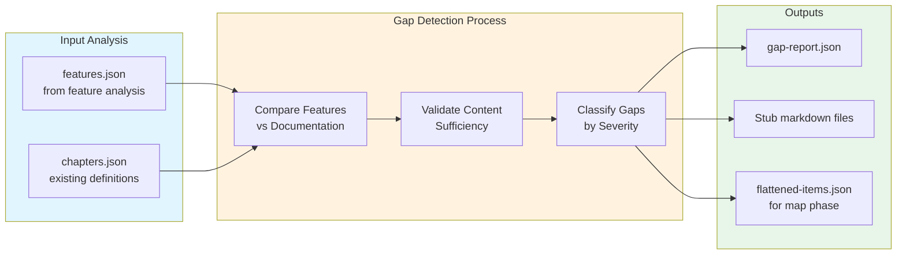

# Automatic Gap Detection

Automatic gap detection is a critical component of Prodigy's documentation workflow that identifies undocumented features and automatically creates chapter/subsection definitions with stub markdown files. This ensures comprehensive documentation coverage and prevents features from being implemented without corresponding user guidance.

!!! note "Why Gap Detection Matters"
    Without gap detection, new features can silently go undocumented. Gap detection acts as a safety net, automatically flagging when code features outpace their documentation.

**Source**: Implemented in `.claude/commands/prodigy-detect-documentation-gaps.md:1-509` and tested in `tests/documentation_gap_detection_test.rs:1-677`

## How Gap Detection Works

**Figure**: Gap detection analyzes features against existing documentation, validates content sufficiency, and generates outputs for the map phase.

## Subpages

-   :material-eye-outline: **[Overview](overview.md)**

    ---

    Command usage and gap severity classification

-   :material-check-decagram: **[Validation Phases](validation-phases.md)**

    ---

    Content sufficiency validation, structure validation, and flattened items generation

-   :material-format-list-checks: **[Topic Normalization](topic-normalization.md)**

    ---

    Topic normalization and idempotence guarantees

-   :material-file-document-alert-outline: **[Gap Report](gap-report.md)**

    ---

    Gap report structure, execution progress, error handling, and testing

