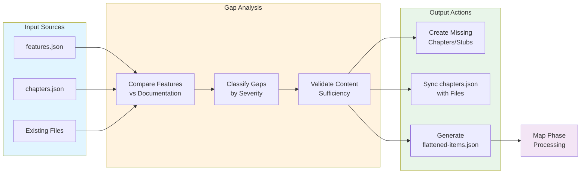

## Overview

Gap detection runs in the **setup phase** of the book workflow (workflows/book-docs-drift.yml:31-35) and performs several key functions:

1. **Analyzes** features.json (from feature analysis) against existing chapters/subsections
2. **Classifies** gaps by severity (high, medium, low)
3. **Validates** content sufficiency before creating subsections (Step 0)
4. **Syncs** chapters.json with actual file structure (Phase 7.5)
5. **Creates** missing chapter definitions and stub markdown files
6. **Updates** SUMMARY.md with proper hierarchy
7. **Generates** flattened-items.json for the map phase (mandatory)



**Figure**: Gap detection workflow showing input sources, analysis steps, and output actions.

!!! info "Purpose"
    The gap detection process ensures that:

    - Features aren't documented without sufficient codebase material (prevents stub subsections)
    - Multi-subsection chapter structures are accurately reflected in chapters.json
    - The map phase receives a complete, flat list of all chapters and subsections to process
    - Documentation organization matches implementation reality

## Command Usage

**Command**: `/prodigy-detect-documentation-gaps`

**Parameters** (.claude/commands/prodigy-detect-documentation-gaps.md:5-11):
```bash
/prodigy-detect-documentation-gaps \
  --project "Prodigy" \
  --config ".prodigy/book-config.json" \
  --features ".prodigy/book-analysis/features.json" \
  --chapters "workflows/data/prodigy-chapters.json" \
  --book-dir "book"
```

**Workflow Integration** (workflows/book-docs-drift.yml:31-35):
```yaml
setup:
  # Step 1: Analyze features
  - claude: "/prodigy-analyze-features-for-book --project $PROJECT_NAME --config $PROJECT_CONFIG"

  # Step 2: Detect gaps and generate flattened-items.json # (1)!
  - claude: "/prodigy-detect-documentation-gaps \
      --project $PROJECT_NAME \
      --config $PROJECT_CONFIG \
      --features $FEATURES_PATH \
      --chapters $CHAPTERS_FILE \
      --book-dir $BOOK_DIR"
```

1. This step generates `flattened-items.json` which is consumed by the map phase to process all documentation items.

## Gap Severity Classification

Gap detection classifies documentation gaps into three severity levels based on feature importance and documentation completeness (.claude/commands/prodigy-detect-documentation-gaps.md:57-97):

!!! tip "Severity Determines Action"
    The severity level determines what automatic action is taken:

    - **High**: Create new chapter with stub file
    - **Medium**: Create subsection within existing chapter
    - **Low**: Log warning only

=== "High Severity"

    ### Missing Chapter/Subsection

    **Criteria**:

    - Feature area exists in features.json
    - NO corresponding chapter OR subsection found
    - Major user-facing capability with no guidance

    **Example**:
    ```json
    {
      "severity": "high",
      "type": "missing_chapter",
      "feature_category": "agent_merge",
      "feature_description": "Custom merge workflows for map agents",
      "recommended_chapter_id": "agent-merge-workflows",
      "recommended_title": "Agent Merge Workflows"
    }
    ```

    !!! warning "Action Required"
        Create new chapter definition with stub markdown file

=== "Medium Severity"

    ### Incomplete Chapter/Subsection

    **Criteria**:

    - Chapter or multi-subsection structure exists for feature area
    - But specific sub-capabilities are missing
    - Could be addressed by adding subsection or expanding content

    **Example**:

    - "mapreduce" chapter exists but missing "performance_tuning" subsection

    !!! note "Action"
        Create subsection definition and add to existing multi-subsection chapter

=== "Low Severity"

    ### Minor Gap

    **Criteria**:

    - Edge cases or advanced features not documented
    - Internal APIs exposed to users
    - Less common use cases

    !!! note "Action"
        Log as warning but may not create new content
