# Topic Normalization

Gap detection uses normalization logic to accurately match feature categories against documented topics.

!!! info "Why Normalization Matters"
    Features in code use various naming conventions (`snake_case`, `kebab-case`, `Title Case`), while documentation may use different formats. Normalization ensures accurate matching regardless of formatting differences.

## Normalization Steps

The normalization process follows four sequential steps:


1. **Convert to lowercase** - Eliminates case sensitivity issues
2. **Remove punctuation and special characters** - Strips underscores, hyphens for comparison
3. **Trim whitespace** - Removes leading/trailing spaces
4. **Extract key terms from compound names** - Splits multi-word names into searchable terms

## Normalization Examples

=== "Single Terms"
    | Input | Output |
    |-------|--------|
    | `"agent_merge"` | `"agent-merge"` |
    | `"command-types"` | `"command-types"` |

=== "Compound Terms"
    | Input | Output |
    |-------|--------|
    | `"MapReduce Workflows"` | `["mapreduce", "workflows"]` |
    | `"Validation Operations"` | `["validation", "operations"]` |

!!! tip "Matching Flexibility"
    Both `command_types` (underscore) and `command-types` (hyphen) normalize to the same form, enabling flexible matching between code features and documentation chapters.

## Matching Logic

For each feature area in `features.json`, the command checks if any of these conditions match:

```mermaid
flowchart TD
    Start[Feature Category] --> Norm[Normalize Category]
    Norm --> C1{Chapter ID<br/>contains category?}
    C1 -->|Yes| Match[✓ Match Found]
    C1 -->|No| C2{Category contains<br/>chapter ID?}
    C2 -->|Yes| Match
    C2 -->|No| C3{Chapter title<br/>contains category?}
    C3 -->|Yes| Match
    C3 -->|No| C4{Chapter topics<br/>contain category?}
    C4 -->|Yes| Match
    C4 -->|No| C5{Section headings<br/>match category?}
    C5 -->|Yes| Match
    C5 -->|No| C6{Feature mapping<br/>array matches?}
    C6 -->|Yes| Match
    C6 -->|No| Gap[Gap Detected]

    style Match fill:#c8e6c9
    style Gap fill:#ffcdd2
    style Norm fill:#e3f2fd
```



1. Chapter ID contains the normalized category
2. Normalized category contains the chapter ID
3. Chapter title contains the normalized category
4. Chapter topics contain the normalized category
5. Section headings in markdown match the normalized category
6. Subsection `feature_mapping` arrays match

!!! note "About Feature Mapping"
    The `feature_mapping` array in page/subsection definitions maps documentation content to specific feature paths (e.g., `"mapreduce.checkpoint"`, `"error_handling.dlq"`). This enables precise matching between page content and codebase features. See the [Gap Report](gap-report.md) page for how these mappings are used.

**Test Case** (`test_gap_detection_normalizes_topic_names`):

```rust
// Source: tests/documentation_gap_detection_test.rs
#[test]
fn test_gap_detection_normalizes_topic_names() -> Result<()> {
    // Features with underscores
    let features = vec![
        MockFeature {
            category: "command_types".to_string(),
            // ...
        },
    ];

    // Chapters with normalized names (hyphens)
    let chapters = vec![
        MockChapter {
            id: "command-types".to_string(),  // Hyphen vs underscore
            // ...
        },
    ];

    let gaps = detect_gaps(&features, &chapters);

    // Result: No gaps because normalization matches them
    assert_eq!(gaps.len(), 0, "Normalization should match underscore and hyphen variations");

    Ok(())
}
```

## Idempotence

Gap detection can be run multiple times safely without creating duplicate chapters or subsections.

### Idempotence Guarantees

!!! success "Safe Re-runs"
    Running gap detection repeatedly produces consistent results without side effects.

1. **Checks for existing chapters** before creating new ones
2. **Uses normalized comparison** for accurate matching
3. **Skips already-created chapters** to prevent duplicates
4. **Can run repeatedly** as part of CI/CD workflows

### Test Case

**Test Function**: `test_gap_detection_idempotence`

```rust
// Source: tests/documentation_gap_detection_test.rs
#[test]
fn test_gap_detection_idempotence() -> Result<()> {
    let features = vec![MockFeature {
        category: "new_feature".to_string(),
        description: "A new feature".to_string(),
        capabilities: vec!["capability1".to_string()],
    }];

    // First run with no chapters
    let gaps_first = detect_gaps(&features, &vec![]);
    assert_eq!(gaps_first.len(), 1, "First run detects 1 gap");

    // Simulate creating the chapter
    let updated_chapters = vec![MockChapter {
        id: "new-feature".to_string(),
        title: "New Feature".to_string(),
        file: "new-feature.md".to_string(),
        topics: vec!["New feature overview".to_string()],
    }];

    // Second run with the new chapter
    let gaps_second = detect_gaps(&features, &updated_chapters);
    assert_eq!(gaps_second.len(), 0, "Second run detects no gaps");

    Ok(())
}
```

## Related Pages

- [Overview](overview.md) - Gap detection overview and workflow integration
- [Validation Phases](validation-phases.md) - Detailed validation phase information
- [Gap Report](gap-report.md) - Understanding gap detection output
