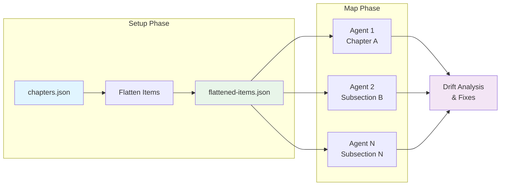
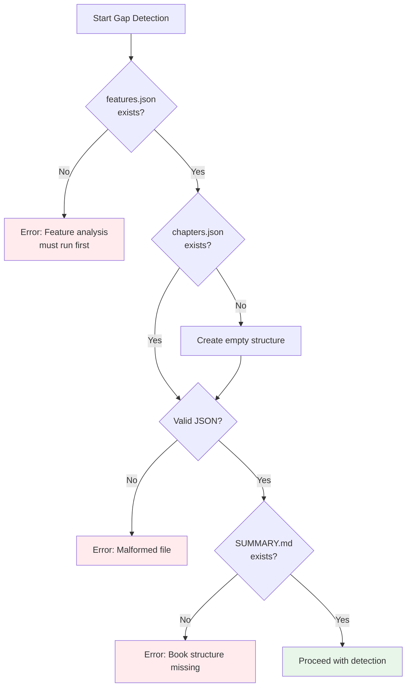

# Validation Phases

Gap detection includes validation phases to ensure generated artifacts are correct and complete before the map phase processes them.



## Flattened Items Generation (Phase 8)

**CRITICAL**: This file MUST be generated regardless of whether gaps are found. The map phase depends on it.

**Source**: `.claude/commands/prodigy-detect-documentation-gaps.md:281-356`

### Purpose

Creates a flat array of all chapters and subsections for parallel processing in the map phase. This enables each map agent to work on a single chapter or subsection independently.

### Processing Logic

!!! tip "Flattening Strategy"
    Multi-subsection chapters are expanded into individual items, while single-file chapters remain as single items. This enables parallel processing at the finest granularity.

```
For each chapter in chapters.json:
  If type == "multi-subsection":
    For each subsection in chapter.subsections:
      Create item with parent metadata
      Add to flattened array

  If type == "single-file":
    Create item with type marker
    Add to flattened array
```

### Output Structure

**File**: `.prodigy/book-analysis/flattened-items.json`

**Example**:
```json
[
  {
    "id": "workflow-basics",
    "title": "Workflow Basics",
    "file": "book/src/workflow-basics.md",
    "topics": [
      "Setup phase",
      "Command types",
      "Variable interpolation"
    ],
    "validation": "Check that workflow syntax and variable documentation are complete",
    "type": "single-file"
  },
  {
    "id": "checkpoint-and-resume",
    "title": "Checkpoint and Resume",
    "file": "book/src/mapreduce/checkpoint-and-resume.md",
    "parent_chapter_id": "mapreduce",
    "parent_chapter_title": "MapReduce Workflows",
    "type": "subsection",
    "topics": [
      "Checkpoint creation",
      "Resume behavior",
      "State preservation"
    ],
    "validation": "Check that checkpoint mechanism and resume procedures are documented",
    "feature_mapping": [
      "mapreduce.checkpoint",
      "mapreduce.resume"
    ]
  },
  {
    "id": "performance-tuning",
    "title": "Performance Tuning",
    "file": "book/src/mapreduce/performance-tuning.md",
    "parent_chapter_id": "mapreduce",
    "parent_chapter_title": "MapReduce Workflows",
    "type": "subsection",
    "topics": [
      "Parallel execution",
      "Resource limits"
    ],
    "feature_mapping": [
      "mapreduce.performance",
      "mapreduce.resource_limits"
    ]
  }
]
```

### Map Phase Integration

The map phase consumes flattened-items.json (workflows/book-docs-drift.yml:52-74):

```yaml
map:
  input: "${ANALYSIS_DIR}/flattened-items.json"
  json_path: "$[*]"  # Each item is a chapter or subsection

  agent_template:
    # Analyze drift for this specific chapter/subsection
    - claude: "/prodigy-analyze-subsection-drift --project $PROJECT_NAME --json '${item}' --features $FEATURES_PATH"

    # Fix drift for this specific chapter/subsection
    - claude: "/prodigy-fix-subsection-drift --project $PROJECT_NAME --json '${item}'"
```

**Why Required**: Without flattened-items.json, the map phase cannot parallelize drift analysis and fixing across chapters/subsections.

## Idempotence and Error Handling

Gap detection is designed to be idempotent and handles errors gracefully.

!!! note "Safe to Re-run"
    Gap detection can be run multiple times without side effects. It recognizes existing chapters and only creates new ones for truly missing features.

### Idempotence Check (Phase 10)

**Source**: `.claude/commands/prodigy-detect-documentation-gaps.md:406-427`

Gap detection should be idempotent:

- Running it multiple times should not create duplicates
- Already-created chapters should be recognized
- No unnecessary modifications

**Implementation:**

- Always check for existing chapters before creating new ones
- Use normalized comparison for topic matching
- Skip chapters that already exist with the same ID
- Only create chapters for truly missing features

**Validation:**

If gap detection runs and finds no gaps:

- Print message: "No documentation gaps found - all features are documented"
- Do not modify chapter definitions file
- **IMPORTANT**: Still generate flattened-items.json from existing chapters for map phase
- Exit successfully

!!! warning "Critical Requirement"
    The flattened-items.json file must ALWAYS be generated, even when no gaps are found. This file is required by the map phase to process all chapters for drift detection.

### Error Handling

**Source**: `.claude/commands/prodigy-detect-documentation-gaps.md:429-459`



**Handle Missing Files Gracefully:**

- If features.json doesn't exist → error: "Feature analysis must run first"
- If chapters.json doesn't exist → create empty structure
- If SUMMARY.md doesn't exist → error: "Book structure missing"
- If config file missing → use sensible defaults

**Handle Invalid JSON:**

- Validate JSON structure before parsing
- Provide clear error messages for malformed files
- Don't proceed with gap detection if data is invalid

**Handle File Write Failures:**

- Check if book/src directory exists and is writable
- Verify permissions before writing files
- Roll back changes if commits fail

**Record Failures:**

Include in gap report if any steps fail:

```json
{
  "errors": [
    {
      "phase": "stub_creation",
      "error": "Failed to write file: permission denied",
      "file_path": "book/src/agent-merge-workflows.md"
    }
  ]
}
```

## Quality Guidelines

**Source**: `.claude/commands/prodigy-detect-documentation-gaps.md:461-485`

### Accuracy

!!! tip "Fuzzy Matching Threshold"
    The default 0.7 threshold balances precision and recall. Lower values catch more variations but may create duplicates; higher values are stricter but may miss related topics.

- Minimize false positives (no duplicate chapters)
- Minimize false negatives (catch all undocumented features)
- Use fuzzy matching for topic comparison (0.7 threshold)
- Consider synonyms and variations

### User Experience

- Provide clear, actionable output
- Show progress during analysis
- Summarize actions taken
- Explain what will happen next

### Maintainability

- Use configurable thresholds for gap classification
- Support customization via book-config.json
- Make template structure configurable
- Keep logic modular and testable

### Performance

- Complete analysis in <30 seconds for typical projects
- Minimize file I/O operations
- Cache parsed markdown content
