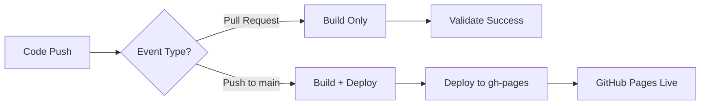
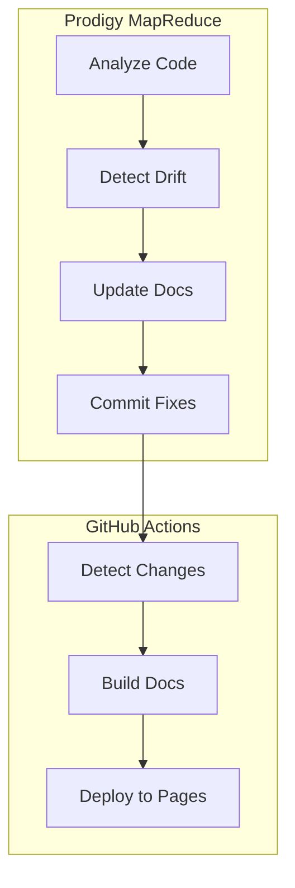

## GitHub Actions Integration

Automate your documentation deployment to GitHub Pages using a standardized workflow that supports both **MkDocs Material** and **mdBook** formats. The workflow validates documentation on pull requests and deploys on merges to your main branch.

!!! info "Source"
    This guide is based on Prodigy's production workflow (`.github/workflows/deploy-docs.yml`) and Spec 128 GitHub Workflow Documentation Standards.

### Quick Start

Deploy documentation to GitHub Pages in under 5 minutes:

=== "MkDocs Material (Recommended)"

    **Step 1: Copy the workflow file**

    ```bash
    curl -o .github/workflows/deploy-docs.yml \
      https://raw.githubusercontent.com/iepathos/prodigy/main/.github/workflows/deploy-docs.yml
    ```

    **Step 2: Ensure MkDocs configuration exists**

    Create `mkdocs.yml` in your repository root:

    ```yaml
    # Source: mkdocs.yml (example configuration)
    site_name: Your Project Documentation
    theme:
      name: material
    nav:
      - Home: index.md
      - Getting Started: getting-started.md
    ```

    **Step 3: Create docs directory**

    ```bash
    mkdir -p docs
    echo "# Welcome" > docs/index.md
    ```

    **Step 4: Commit and push**

    ```bash
    git add .github/workflows/deploy-docs.yml mkdocs.yml docs/
    git commit -m "Add MkDocs documentation workflow"
    git push
    ```

=== "mdBook"

    **Step 1: Copy the workflow file**

    ```bash
    curl -o .github/workflows/deploy-docs.yml \
      https://raw.githubusercontent.com/iepathos/prodigy/main/.github/workflows/deploy-docs.yml
    ```

    **Step 2: Configure for mdBook**

    Edit `.github/workflows/deploy-docs.yml` and change:

    ```yaml
    env:
      DEPLOY_FORMAT: mdbook  # Change from 'mkdocs' to 'mdbook'
    ```

    **Step 3: Commit and push**

    ```bash
    git add .github/workflows/deploy-docs.yml
    git commit -m "Add mdBook documentation workflow"
    git push
    ```

**Step 5: Enable GitHub Pages**

1. Go to your repository's **Settings → Pages**
2. Under "Source", select **Deploy from a branch**
3. Choose branch: **gh-pages** and directory: **/ (root)**
4. Click **Save**

!!! success "Done!"
    Your documentation will deploy automatically on the next push to main/master.

**Source**: Spec 128:136-142

### How It Works

The workflow executes in two contexts:

1. **Pull Requests**: Validates that documentation builds successfully (prevents merging broken docs)
2. **Push to main/master**: Builds and deploys to GitHub Pages (publishes the documentation)



**Key Components**:

| Component | Purpose |
|-----------|---------|
| **Triggers** | Runs only when documentation files change (`book/**`, `docs/**`, `mkdocs.yml`) |
| **Path Filters** | Prevents unnecessary workflow runs, saving CI/CD minutes |
| **Permissions** | `contents: write` allows pushing to the `gh-pages` branch |
| **Conditional Deploy** | `if: github.event_name == 'push'` ensures PRs only validate |
| **Format Toggle** | `DEPLOY_FORMAT` switches between MkDocs and mdBook |

**Source**: `.github/workflows/deploy-docs.yml:3-17`, `.github/workflows/deploy-docs.yml:28-29`, `.github/workflows/deploy-docs.yml:63`

### Documentation Format Configuration

The workflow supports two documentation formats controlled by the `DEPLOY_FORMAT` environment variable:

```yaml
# Source: .github/workflows/deploy-docs.yml:19-23
env:
  # Toggle documentation format: 'mdbook' or 'mkdocs'
  # mdbook uses book/src/, MkDocs uses docs/ (separate sources)
  # MkDocs can be enhanced with Material features (admonitions, tabs, diagrams)
  DEPLOY_FORMAT: mkdocs
```

=== "MkDocs Material"

    - **Source directory**: `docs/`
    - **Output directory**: `./site`
    - **Configuration**: `mkdocs.yml`
    - **Features**: Admonitions, tabs, diagrams, search, dark mode

=== "mdBook"

    - **Source directory**: `book/src/`
    - **Output directory**: `./book/book`
    - **Configuration**: `book/book.toml`
    - **Features**: Rust-style documentation, SUMMARY.md navigation

!!! tip "Choosing a Format"
    **MkDocs Material** is recommended for most projects due to its rich feature set, better search, and Material Design aesthetics. **mdBook** is ideal for Rust projects or when you prefer a simpler, Rust-style documentation experience.

### Workflow File Structure

#### Complete Workflow Example

```yaml
# Source: .github/workflows/deploy-docs.yml
name: Deploy Documentation

on:
  push:
    branches: [main, master]
    paths:
      - 'book/**'
      - 'docs/**'
      - 'mkdocs.yml'
      - '.github/workflows/deploy-docs.yml'
  pull_request:
    branches: [main, master]
    paths:
      - 'book/**'
      - 'docs/**'
      - 'mkdocs.yml'
      - '.github/workflows/deploy-docs.yml'

env:
  DEPLOY_FORMAT: mkdocs

jobs:
  build-deploy:
    runs-on: ubuntu-latest
    permissions:
      contents: write
    steps:
      - name: Checkout repository
        uses: actions/checkout@v6

      # MkDocs build steps
      - name: Setup Python
        if: env.DEPLOY_FORMAT == 'mkdocs'
        uses: actions/setup-python@v6
        with:
          python-version: '3.x'
          cache: 'pip'

      - name: Install MkDocs Material
        if: env.DEPLOY_FORMAT == 'mkdocs'
        run: pip install mkdocs-material

      - name: Build MkDocs
        if: env.DEPLOY_FORMAT == 'mkdocs'
        run: mkdocs build --strict

      # mdBook build steps
      - name: Setup mdBook
        if: env.DEPLOY_FORMAT == 'mdbook'
        uses: peaceiris/actions-mdbook@v2
        with:
          mdbook-version: 'latest'

      - name: Build mdbook
        if: env.DEPLOY_FORMAT == 'mdbook'
        run: mdbook build book

      # Deploy based on format
      - name: Deploy to GitHub Pages
        if: github.event_name == 'push' && (github.ref == 'refs/heads/main' || github.ref == 'refs/heads/master')
        uses: peaceiris/actions-gh-pages@v4
        with:
          github_token: ${{ secrets.GITHUB_TOKEN }}
          publish_dir: ${{ env.DEPLOY_FORMAT == 'mdbook' && './book/book' || './site' }}
```

#### Path Filters Explained

```yaml
# Source: .github/workflows/deploy-docs.yml:6-17
paths:
  - 'book/**'              # mdBook source files
  - 'docs/**'              # MkDocs source files
  - 'mkdocs.yml'           # MkDocs configuration
  - '.github/workflows/deploy-docs.yml'  # Workflow file itself
```

!!! note "Why path filters?"
    - Prevents workflow from running on code changes unrelated to documentation
    - Saves CI/CD minutes (workflow only runs when docs actually change)
    - Faster feedback for non-documentation PRs

**Source**: `.github/workflows/deploy-docs.yml:6-17`, Spec 128:235-255

#### Permissions

```yaml
# Source: .github/workflows/deploy-docs.yml:28-29
permissions:
  contents: write  # Required to push to gh-pages branch
```

!!! info "Why `contents: write`?"
    The `peaceiris/actions-gh-pages` action deploys by pushing to the `gh-pages` branch. This requires write access to repository contents.

    This differs from the newer `actions/deploy-pages` approach which uses `pages: write` and `id-token: write`. Prodigy standardizes on the `gh-pages` branch method for consistency and broader compatibility.

**Source**: `.github/workflows/deploy-docs.yml:28-29`, Spec 128:150-157

### MkDocs Material Setup

The MkDocs build process involves three steps:

#### Step 1: Python Setup

```yaml
# Source: .github/workflows/deploy-docs.yml:46-51
- name: Setup Python
  if: env.DEPLOY_FORMAT == 'mkdocs'
  uses: actions/setup-python@v6
  with:
    python-version: '3.x'
    cache: 'pip'
```

!!! tip "Pip Caching"
    The `cache: 'pip'` option caches Python dependencies between workflow runs, significantly speeding up builds after the first run.

#### Step 2: Install Dependencies

```yaml
# Source: .github/workflows/deploy-docs.yml:53-55
- name: Install MkDocs Material
  if: env.DEPLOY_FORMAT == 'mkdocs'
  run: pip install mkdocs-material
```

For additional plugins, create a `requirements.txt`:

```txt
mkdocs-material
mkdocs-mermaid2-plugin
mkdocs-minify-plugin
```

Then modify the install step:

```yaml
- name: Install MkDocs dependencies
  if: env.DEPLOY_FORMAT == 'mkdocs'
  run: pip install -r requirements.txt
```

#### Step 3: Build with Strict Mode

```yaml
# Source: .github/workflows/deploy-docs.yml:57-59
- name: Build MkDocs
  if: env.DEPLOY_FORMAT == 'mkdocs'
  run: mkdocs build --strict
```

!!! warning "Strict Mode"
    The `--strict` flag treats warnings as errors. This catches:

    - Broken internal links
    - Missing referenced files
    - Invalid configuration
    - Deprecated features

    Strict mode ensures documentation quality by failing the build on any issues.

### Deployment Configuration

The deploy step uses a conditional expression to select the correct output directory:

```yaml
# Source: .github/workflows/deploy-docs.yml:62-67
- name: Deploy to GitHub Pages
  if: github.event_name == 'push' && (github.ref == 'refs/heads/main' || github.ref == 'refs/heads/master')
  uses: peaceiris/actions-gh-pages@v4
  with:
    github_token: ${{ secrets.GITHUB_TOKEN }}
    publish_dir: ${{ env.DEPLOY_FORMAT == 'mdbook' && './book/book' || './site' }}
```

| Format | Output Directory |
|--------|-----------------|
| MkDocs | `./site` |
| mdBook | `./book/book` |

**Deployment Condition**: `if: github.event_name == 'push'`

This critical condition ensures:

- **Pull Requests**: Build and validate documentation (catches errors before merge)
- **Push to main/master**: Build, validate, AND deploy to GitHub Pages

### Recommended Action Versions

Use these specific action versions for stability and security:

| Action | Version | Purpose |
|--------|---------|---------|
| `actions/checkout` | `v6` | Fetches repository code |
| `actions/setup-python` | `v6` | Installs Python for MkDocs |
| `peaceiris/actions-mdbook` | `v2` | Installs mdBook |
| `peaceiris/actions-gh-pages` | `v4` | Deploys to gh-pages branch |

**Source**: `.github/workflows/deploy-docs.yml:32,48,37,64`, Spec 128:669-674

### Repository Settings

After adding the workflow file, configure GitHub Pages in your repository settings:

1. Navigate to **Settings → Pages**
2. Under **Source**, select **Deploy from a branch**
3. Choose **Branch: gh-pages** and **Directory: / (root)**
4. Click **Save**

!!! note
    The workflow will create the `gh-pages` branch automatically on the first deployment. You don't need to create it manually.

**Source**: Spec 128:136-141

### Integration with Prodigy Workflows

This GitHub Actions workflow **deploys** the documentation that Prodigy's book workflow **generates and maintains**.

**How they work together**:



1. **Prodigy MapReduce Workflow** (`book-docs-drift.yml`):
   - Analyzes code for features and changes
   - Detects documentation drift
   - Updates markdown files in `docs/` or `book/src/`
   - Commits fixes to your repository

2. **GitHub Actions Workflow** (`deploy-docs.yml`):
   - Detects changes to documentation files
   - Builds MkDocs or mdBook
   - Deploys to GitHub Pages

**In Practice**:

- Prodigy keeps your docs accurate and up-to-date
- GitHub Actions makes your docs publicly accessible
- Together, they create a fully automated documentation system

**Source**: `docs/automated-documentation/index.md`, Spec 128:518-562

### Common Mistakes and Solutions

#### Mistake 1: Wrong Filename

!!! failure "Wrong"
    ```
    .github/workflows/docs.yml
    .github/workflows/documentation.yml
    .github/workflows/mdbook.yml
    ```

!!! success "Correct"
    ```
    .github/workflows/deploy-docs.yml
    ```

**Why it matters**: Consistent naming across projects aids discovery and maintenance.

**Source**: Spec 128:296-312

#### Mistake 2: Wrong Deployment Action

!!! failure "Wrong"
    ```yaml
    - uses: actions/upload-pages-artifact@v3
    - uses: actions/deploy-pages@v4
    ```

!!! success "Correct"
    ```yaml
    - uses: peaceiris/actions-gh-pages@v4
      with:
        github_token: ${{ secrets.GITHUB_TOKEN }}
        publish_dir: ${{ env.DEPLOY_FORMAT == 'mdbook' && './book/book' || './site' }}
    ```

**Why it matters**: Different actions require different permissions and repository settings. Using `actions/deploy-pages` requires changing your GitHub Pages source to "GitHub Actions" and using different permissions (`pages: write`, `id-token: write`).

**Source**: Spec 128:314-330

#### Mistake 3: Missing Path Filters

!!! failure "Wrong"
    ```yaml
    on:
      push:
        branches: [main]
    ```

!!! success "Correct"
    ```yaml
    on:
      push:
        branches: [main, master]
        paths:
          - 'book/**'
          - 'docs/**'
          - 'mkdocs.yml'
          - '.github/workflows/deploy-docs.yml'
    ```

**Impact**: Workflow runs on every commit (even code-only changes), wasting CI resources and creating unnecessary deployments.

**Source**: Spec 128:332-351

#### Mistake 4: Wrong Permissions

!!! failure "Wrong"
    ```yaml
    permissions:
      pages: write
      id-token: write
    ```

!!! success "Correct"
    ```yaml
    permissions:
      contents: write
    ```

**Why it matters**: The `gh-pages` deployment method needs `contents: write` to push to the gh-pages branch. The permissions shown in "Wrong" are for the `actions/deploy-pages` approach.

**Source**: Spec 128:353-368

#### Mistake 5: Missing PR Validation

!!! failure "Wrong"
    ```yaml
    on:
      push:
        branches: [main]
    ```

!!! success "Correct"
    ```yaml
    on:
      push:
        branches: [main, master]
        paths: ['book/**', 'docs/**', 'mkdocs.yml']
      pull_request:
        branches: [main, master]
        paths: ['book/**', 'docs/**', 'mkdocs.yml']
    ```

**Why it matters**: Without PR validation, documentation build errors aren't caught until after merge, potentially breaking your deployed documentation.

**Source**: Spec 128:370-390

#### Mistake 6: Deploying on PR

!!! failure "Wrong"
    ```yaml
    - uses: peaceiris/actions-gh-pages@v4
      with:
        github_token: ${{ secrets.GITHUB_TOKEN }}
        publish_dir: ./site
    ```

!!! success "Correct"
    ```yaml
    - uses: peaceiris/actions-gh-pages@v4
      if: github.event_name == 'push' && (github.ref == 'refs/heads/main' || github.ref == 'refs/heads/master')
      with:
        github_token: ${{ secrets.GITHUB_TOKEN }}
        publish_dir: ${{ env.DEPLOY_FORMAT == 'mdbook' && './book/book' || './site' }}
    ```

**Why it matters**: PRs should validate documentation builds but not deploy them. Deploying on PR can cause conflicts and unnecessary deployments.

**Source**: Spec 128:392-410

### Troubleshooting

#### Issue: Workflow Runs on Every Commit

**Symptom**: Workflow executes even when documentation hasn't changed

**Cause**: Missing or incorrect path filters

**Solution**:
```yaml
on:
  push:
    paths:
      - 'book/**'
      - 'docs/**'
      - 'mkdocs.yml'
      - '.github/workflows/deploy-docs.yml'
```

**Source**: Spec 128:415-428

#### Issue: Permission Denied When Deploying

**Symptom**: Error like "failed to push some refs" or "permission denied"

**Cause**: Missing `contents: write` permission

**Solution**:
```yaml
permissions:
  contents: write
```

Also verify repository settings:

- Go to **Settings → Actions → General**
- Under **Workflow permissions**, select **Read and write permissions**
- Click **Save**

**Source**: Spec 128:430-445

#### Issue: Documentation Not Updating

**Symptom**: Workflow succeeds but GitHub Pages shows old content

**Causes and Solutions**:

1. **Verify gh-pages branch updated**:
   ```bash
   git fetch origin gh-pages
   git log origin/gh-pages
   ```
   Check if the latest commit matches your expectations.

2. **Check GitHub Pages settings**:
   - Go to **Settings → Pages**
   - Verify **Source: Deploy from branch**
   - Verify **Branch: gh-pages** and **Directory: / (root)**

3. **Force clear browser cache**:
   - Add query parameter to URL: `https://username.github.io/repo?v=2`
   - Hard refresh: Ctrl+Shift+R (Windows/Linux) or Cmd+Shift+R (Mac)

4. **Check publish_dir path**:
   ```yaml
   # For MkDocs
   publish_dir: ./site

   # For mdBook
   publish_dir: ./book/book

   # Or use the conditional expression
   publish_dir: ${{ env.DEPLOY_FORMAT == 'mdbook' && './book/book' || './site' }}
   ```

**Source**: Spec 128:447-471

#### Issue: 404 Error on GitHub Pages

**Symptom**: Page shows "404 There isn't a GitHub Pages site here"

**Causes and Solutions**:

1. **GitHub Pages not enabled**:
   - Go to **Settings → Pages**
   - Enable Pages if it shows as disabled

2. **Wrong source branch**:
   - Change source to **gh-pages** branch

3. **Wrong root directory**:
   - Ensure source is **/ (root)** not **/docs**

4. **Private repository without GitHub Pro**:
   - GitHub Pages on private repositories requires GitHub Pro, Team, or Enterprise
   - Make repository public or upgrade your GitHub plan

**Source**: Spec 128:473-489

#### Issue: Workflow Syntax Error

**Symptom**: Workflow doesn't appear in Actions tab

**Cause**: Invalid YAML syntax

**Solution**:
```bash
# Validate YAML locally
yamllint .github/workflows/deploy-docs.yml

# Or use GitHub's workflow validator
# (GitHub shows syntax errors when you navigate to the workflow file)
```

**Source**: Spec 128:491-503

#### Issue: Deployment Job Skipped on Push

**Symptom**: Build job runs but deploy step is skipped on push to main

**Cause**: Missing or incorrect condition

**Solution**:
```yaml
- name: Deploy to GitHub Pages
  if: github.event_name == 'push' && (github.ref == 'refs/heads/main' || github.ref == 'refs/heads/master')
  uses: peaceiris/actions-gh-pages@v4
```

Verify the condition matches exactly. Common mistakes:

- Typo in `github.event_name`
- Using single `=` instead of `==`
- Wrong event name (e.g., `if: github.event == 'push'`)

**Source**: Spec 128:505-516

#### Issue: MkDocs Strict Mode Failures

**Symptom**: Build fails with warnings treated as errors

**Cause**: Broken links, missing files, or invalid configuration

**Solution**:

1. **Check build output for specific warnings**:
   ```bash
   mkdocs build --strict 2>&1 | grep -i warning
   ```

2. **Fix broken internal links**:
   - Ensure all `[text](link.md)` references point to existing files
   - Use relative paths from the current file's location

3. **Temporarily disable strict mode for debugging**:
   ```yaml
   run: mkdocs build  # Remove --strict temporarily
   ```

4. **Common MkDocs issues**:
   - Missing `nav` entries in `mkdocs.yml`
   - Files in `docs/` not referenced in navigation
   - Invalid YAML in `mkdocs.yml`

**Source**: `.github/workflows/deploy-docs.yml:59`

#### Issue: Material Theme Not Loading

**Symptom**: Site deploys but appears unstyled

**Cause**: Missing theme configuration or installation failure

**Solution**:

1. **Verify mkdocs.yml configuration**:
   ```yaml
   theme:
     name: material
   ```

2. **Check pip install succeeded**:
   - Look for installation errors in workflow logs
   - Verify `mkdocs-material` is in requirements.txt if using one

3. **Clear GitHub Pages cache**:
   - Force a new deployment by making a small change
   - Hard refresh the browser
