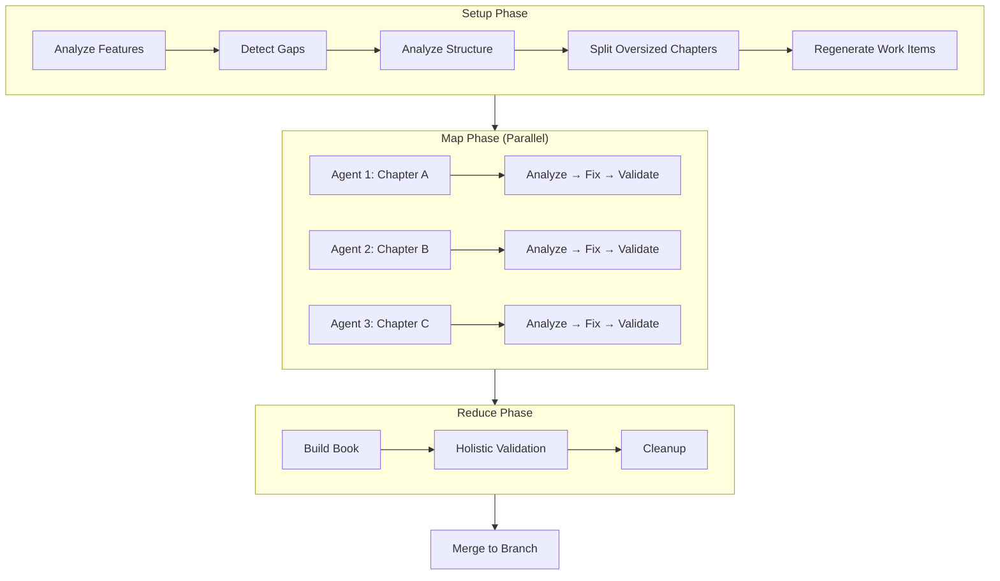

# Automated Documentation with mdBook

This guide shows you how to set up automated, always-up-to-date documentation for any project using Prodigy's book workflow system. This same system maintains the documentation you're reading right now.

## Overview

The book workflow system:
- **Analyzes your codebase** to build a feature inventory
- **Detects documentation drift** by comparing docs to implementation
- **Updates documentation** automatically using Claude
- **Maintains consistency** across all chapters
- **Runs on any project** - just configure and go

The generalized commands work for any codebase: Rust, Python, JavaScript, etc.

### Why Automated Documentation?

**The Problem**: Documentation drifts out of sync with code. New features get added, APIs change, examples break, and manually updating docs is time-consuming and error-prone.

**The Solution**: This workflow system solves documentation drift by:

- **Always up-to-date** - Automatically detects when docs don't match implementation
- **Code-grounded examples** - All examples extracted from actual source code with file references
- **Parallel processing** - MapReduce architecture processes chapters concurrently
- **Quality guaranteed** - Validation ensures 100% completeness before accepting updates
- **Version controlled** - All changes tracked via git commits with full audit trail
- **CI/CD ready** - Runs in GitHub Actions or any CI system

**Real Results**: This documentation you're reading right now is maintained by this system. Every code example references actual source files. When Prodigy's features change, the docs update automatically.

!!! warning "Prerequisites"
    Before using the book workflow, ensure you have an existing mdBook or MkDocs project. The workflow enhances existing documentation - it doesn't create documentation structure from scratch.

## Quick Start

Ready to get started? Here's the fastest path:

!!! tip "Choose Your Path"
    **Quick Start (15-20 min)**: Best if you want to get automated docs running quickly.
    **Tutorial (30 min)**: Best if you want to understand how the system works under the hood.

1. **[Install Prodigy](../installation.md)** - Prodigy, Claude Code CLI, Rust
2. **[Follow the Quick Start guide](quick-start.md)** - 15-20 minute setup for automated docs
3. **Or dive deeper with the [Tutorial](tutorial.md)** - 30 minute comprehensive walkthrough


## How It Works

The documentation workflow uses a **MapReduce pattern** to process your codebase in parallel:



### Workflow Phases

1. **Setup Phase** (Feature Analysis & Preparation):
   - Analyzes your codebase to build a complete feature inventory
   - Detects documentation gaps by comparing existing docs to implementation
   - Analyzes chapter sizes to identify oversized documentation
   - Automatically splits large chapters into subsections for optimal processing
   - Regenerates work items for the map phase after structure changes
   - Source: `workflows/book-docs-drift.yml:24-50`

2. **Map Phase** (Parallel Processing):
   - Processes each chapter/subsection in parallel using isolated git worktrees
   - For each documentation item:
     - Analyzes drift between documentation and implementation
     - Fixes identified issues with real code examples
     - Validates fixes against a 100% quality threshold
   - Runs up to 3 items concurrently (configurable via `MAX_PARALLEL`)
   - Failed items go to Dead Letter Queue (DLQ) for retry
   - Source: `workflows/book-docs-drift.yml:52-74`

3. **Reduce Phase** (Validation & Finalization):
   - Rebuilds the entire book to ensure chapters compile together
   - Runs holistic validation to detect cross-cutting issues
   - Fixes any build errors discovered during compilation
   - Cleans up temporary analysis files
   - Source: `workflows/book-docs-drift.yml:77-92`

!!! note "Automatic Merging"
    Merging happens automatically via the MapReduce framework's worktree system after successful completion of all phases. Each agent's changes merge into a parent worktree, which is then offered for merge back to your original branch.

### Quality Gates

The workflow enforces quality through multiple mechanisms:

=== "Validation Thresholds"

    Each fix is validated against a 100% quality threshold:

    ```yaml
    # Source: workflows/book-docs-drift.yml:64-72
    validate:
      claude: "/prodigy-validate-doc-fix ..."
      threshold: 100  # Documentation must meet 100% quality standards
      on_incomplete:
        claude: "/prodigy-complete-doc-fix ..."
        max_attempts: 3
    ```

    If validation fails, Claude automatically attempts gap-filling up to 3 times.

=== "Commit Verification"

    Key steps require commits to verify actual changes were made:

    ```yaml
    # Source: workflows/book-docs-drift.yml:45, 59, 63, 72, 83, 87
    - claude: "/prodigy-fix-subsection-drift ..."
      commit_required: true  # Prevents no-op runs
    ```

    This prevents agents from reporting success without making modifications.

=== "Error Policy"

    Failed items are handled gracefully:

    ```yaml
    # Source: workflows/book-docs-drift.yml:95-99
    error_policy:
      on_item_failure: dlq
      continue_on_failure: true
      max_failures: 2
      error_collection: aggregate
    ```

    Execution continues even after failures, with errors aggregated for analysis.

### Worktree Isolation

!!! info "Safe Experimentation"
    Your main repository is never modified during workflow execution. All changes happen in isolated worktrees and only merge back after successful completion.

All phases execute in an isolated git worktree:

- Your main repository remains untouched during execution
- Each map agent runs in its own child worktree
- Changes merge back only after successful completion
- Failed workflows don't pollute your working directory
- Learn more: [Understanding the Workflow](understanding-the-workflow.md)

### Quality Guarantees

The workflow ensures documentation quality through:
- **Code-grounded examples**: All examples extracted from actual implementation
- **Validation checkpoints**: Each fix validated before proceeding
- **Build verification**: Full book rebuild ensures no broken references
- **Source attribution**: Examples include file paths and line numbers
- **Automatic retry**: Failed items can be retried via `prodigy dlq retry`

For detailed information about each phase, see the subsections below.

## Additional Topics

### Getting Started
- [Quick Start](quick-start.md) - 15-20 minute guide
- [Tutorial](tutorial.md) - 30 minute comprehensive walkthrough

### Understanding the System
- [Understanding the Workflow](understanding-the-workflow.md) - How it works under the hood
- [Automatic Gap Detection](automatic-gap-detection.md) - Finding missing documentation

### Advanced Usage
- [Advanced Configuration](advanced-configuration.md) - Fine-tuning options
- [GitHub Actions Integration](github-actions-integration.md) - CI/CD automation
- [Documentation Versioning](documentation-versioning.md) - Managing versions

### Reference
- [Troubleshooting](troubleshooting.md) - Common issues and solutions
- [Real-World Example: Prodigy's Own Documentation](real-world-example-prodigys-own-documentation.md) - Case study
