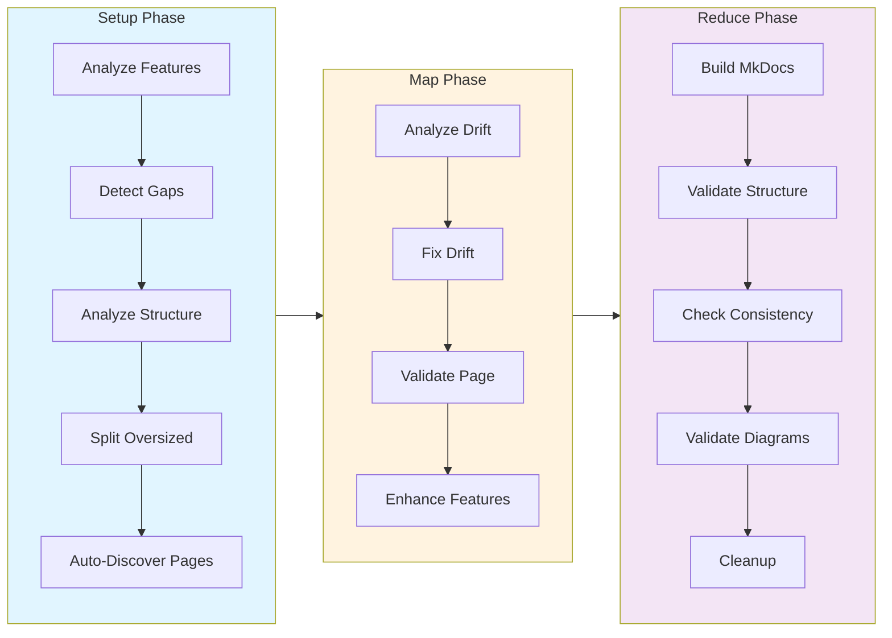

# MkDocs Documentation Workflow

The `mkdocs-drift.yml` workflow automatically generates and maintains MkDocs Material documentation by detecting gaps, analyzing drift, and fixing documentation to stay synchronized with your codebase.

## Overview

This workflow is designed for projects using **MkDocs Material** as their documentation system. It provides the same capabilities as the mdbook workflow but targets MkDocs-specific features and structure.



**Key Features:**
- Automatic gap detection for undocumented features
- Drift analysis comparing docs against source code
- Intelligent fixes with source attribution
- MkDocs build validation with `--strict` mode
- Navigation completeness checking
- Broken link detection

## Quick Start

### 1. Run the Workflow

```bash
prodigy run workflows/mkdocs-drift.yml
```

The workflow will:
1. Analyze your codebase for features
2. Detect documentation gaps
3. Create missing documentation pages
4. Analyze existing pages for drift
5. Fix drift with source references
6. Validate MkDocs build
7. Generate validation report

### 2. Review Generated Documentation

After completion, check:
- **Generated pages:** New markdown files in your docs directory
- **Structure report:** `.prodigy/mkdocs-analysis/structure-report.json`
- **Structure validation:** `.prodigy/mkdocs-analysis/structure-validation.json`
- **Feature consistency:** `.prodigy/mkdocs-analysis/feature-consistency.json`

### 3. Merge Changes

The workflow runs in an isolated git worktree. When complete, you'll be prompted:

```
Merge session-abc123 to mkdocs? [y/N]
```

Review the changes and merge when satisfied.

!!! tip "Review Before Merging"
    Always review generated changes before merging. Check `git diff master` in the worktree to see all modifications made by the workflow.

## Configuration Options

### Environment Variables

All configuration is done through environment variables in the workflow YAML:

```yaml
env:
  # Project Configuration
  PROJECT_NAME: "Prodigy"              # Your project name
  PROJECT_CONFIG: ".prodigy/mkdocs-config.json"  # MkDocs-specific config
  FEATURES_PATH: ".prodigy/mkdocs-analysis/features.json"  # Feature inventory

  # MkDocs-Specific Settings
  DOCS_DIR: "book/src"                 # Documentation source directory
  MKDOCS_CONFIG: "mkdocs.yml"          # MkDocs configuration file
  ANALYSIS_DIR: ".prodigy/mkdocs-analysis"  # Analysis output directory
  CHAPTERS_FILE: "workflows/data/prodigy-chapters.json"  # Chapter definitions

  # Workflow Settings
  MAX_PARALLEL: "3"                    # Number of parallel agents
```

### Configuring Documentation Directory

The workflow supports flexible documentation directory configuration through the `DOCS_DIR` variable:

#### Option 1: Separate MkDocs Directory (Default)

```yaml
env:
  DOCS_DIR: "docs"
  CHAPTERS_FILE: "workflows/data/mkdocs-chapters.json"
```

**Use this when:**
- You want MkDocs-specific documentation separate from mdbook
- You need a curated subset of documentation for MkDocs
- You're testing both documentation systems

**Structure:**
```
docs/
├── index.md
├── workflow-basics/
│   ├── variables.md
│   └── environment.md
└── mapreduce/
    └── overview.md
mkdocs.yml (docs_dir: docs)
```

#### Option 2: Shared Source with mdbook

```yaml
env:
  DOCS_DIR: "book/src"
  CHAPTERS_FILE: "workflows/data/prodigy-chapters.json"
```

**Use this when:**
- You want a single source of truth for both mdbook and MkDocs
- You're migrating from mdbook to MkDocs
- You want complete documentation in both formats

**Structure:**
```
book/src/
├── index.md
├── SUMMARY.md (for mdbook)
├── workflow-basics/
│   ├── index.md
│   └── *.md
└── mapreduce/
    ├── index.md
    └── *.md
mkdocs.yml (docs_dir: book/src, exclude: SUMMARY.md)
```

**Important:** When using `book/src`, update `mkdocs.yml`:

```yaml
docs_dir: book/src
exclude_docs: |
  SUMMARY.md
```

### Chapter Definitions

Chapter definitions are stored in JSON files that define the documentation structure:

**For separate MkDocs docs:**
```json
// workflows/data/mkdocs-chapters.json
[
  {
    "id": "workflow-basics",
    "title": "Workflow Basics",
    "pages": [
      {"id": "variables", "title": "Variables"},
      {"id": "environment", "title": "Environment"}
    ]
  }
]
```

**For shared book/src:**
```json
// workflows/data/prodigy-chapters.json
// (More comprehensive structure matching mdbook SUMMARY.md)
```

### Parallelism Configuration

Control how many documentation pages are processed simultaneously:

```yaml
env:
  MAX_PARALLEL: "3"  # Process 3 pages at once

map:
  max_parallel: ${MAX_PARALLEL}
```

!!! note "Parallelism Guidelines"
    - **1-3**: Conservative, good for development
    - **4-6**: Balanced, recommended for most projects
    - **7-10**: Aggressive, faster but higher resource usage

## Workflow Phases

### Setup Phase

The setup phase prepares documentation for processing by analyzing features, detecting gaps, optimizing page structure, and discovering all pages.

**Step 1: Analyze Features**
```yaml
# Source: workflows/mkdocs-drift.yml:30
- claude: "/prodigy-analyze-features-for-mkdocs --project $PROJECT_NAME --config $PROJECT_CONFIG"
```

Scans your codebase to build a feature inventory including:
- Command types and syntax
- Configuration options
- Workflow features
- MapReduce capabilities

**Output:** `.prodigy/mkdocs-analysis/features.json`

**Step 2: Detect Gaps**
```yaml
# Source: workflows/mkdocs-drift.yml:35-36
- claude: "/prodigy-detect-mkdocs-gaps --project $PROJECT_NAME --config $PROJECT_CONFIG --features $FEATURES_PATH --chapters $CHAPTERS_FILE --docs-dir $DOCS_DIR"
  commit_required: true
```

Compares feature inventory against existing documentation to find:
- Missing pages for undocumented features
- Incomplete pages missing key information
- Structural gaps in navigation

**Outputs:**
- New stub markdown files (if gaps found)
- Updates to chapter definitions

**Step 3: Analyze Structure**
```yaml
# Source: workflows/mkdocs-drift.yml:41
- claude: "/prodigy-analyze-mkdocs-structure --project $PROJECT_NAME --docs-dir $DOCS_DIR --pages $CHAPTERS_FILE --output $ANALYSIS_DIR/structure-report.json"
```

Analyzes page sizes and structural complexity to identify:
- Oversized pages that should be split
- Pages with too many sections
- Structural improvement opportunities

**Output:** `.prodigy/mkdocs-analysis/structure-report.json`

**Step 4: Split Oversized Pages**
```yaml
# Source: workflows/mkdocs-drift.yml:46-47
- claude: "/prodigy-split-oversized-mkdocs-pages --project $PROJECT_NAME --pages $CHAPTERS_FILE --docs-dir $DOCS_DIR --structure-report $ANALYSIS_DIR/structure-report.json"
  commit_required: false
```

Automatically splits oversized pages into focused subpages before the map phase. This ensures agents process optimally-sized pages for better quality fixes.

**Step 5: Auto-Discover Pages**
```yaml
# Source: workflows/mkdocs-drift.yml:51-64
- shell: |
    find $DOCS_DIR -name "*.md" -type f -not -path "*/.prodigy/*" | sort | jq -R -s '
      split("\n") |
      map(select(length > 0)) |
      map({
        id: (split("/")[-1] | split(".md")[0]),
        title: (split("/")[-1] | split(".md")[0] | gsub("-|_"; " ")),
        file: .,
        type: "auto-discovered",
        topics: [],
        validation: "Auto-discovered page - check for drift and enhance with visual features"
      })
    ' > $ANALYSIS_DIR/flattened-items.json
```

Discovers ALL documentation pages including newly created subpages from Step 4. This ensures the map phase processes every page, not just the curated list in chapters.json.

**Output:** `.prodigy/mkdocs-analysis/flattened-items.json` (for map phase)

### Map Phase

Processes each documentation page in parallel with three main steps: analyze drift, fix drift with validation, and enhance with visual features.

**Step 1: Analyze Drift**
```yaml
# Source: workflows/mkdocs-drift.yml:73-74
- claude: "/prodigy-analyze-mkdocs-drift --project $PROJECT_NAME --json '${item}' --features $FEATURES_PATH"
  commit_required: true
```

Analyzes each page for:
- Outdated information
- Missing features
- Incorrect examples
- Broken references

**Output:** Drift analysis JSON with severity ratings

**Step 2: Fix Drift with Validation**
```yaml
# Source: workflows/mkdocs-drift.yml:77-87
- claude: "/prodigy-fix-mkdocs-drift --project $PROJECT_NAME --json '${item}'"
  commit_required: true
  validate:
    claude: "/prodigy-validate-mkdocs-page --project $PROJECT_NAME --json '${item}' --output .prodigy/validation-result.json"
    result_file: ".prodigy/validation-result.json"
    threshold: 100
    on_incomplete:
      claude: "/prodigy-complete-mkdocs-fix --project $PROJECT_NAME --json '${item}' --gaps ${validation.gaps}"
      max_attempts: 3
      fail_workflow: false
      commit_required: true
```

Fixes detected drift by:
- Updating documentation to match current implementation
- Adding source code references
- Fixing broken links
- Adding missing examples

The validation step ensures the fix meets quality standards:
- All required topics covered
- Examples are accurate
- Links are valid
- Source attribution present

If validation fails, the `on_incomplete` handler iteratively improves the page up to 3 times.

**Step 3: Enhance with Visual Features**
```yaml
# Source: workflows/mkdocs-drift.yml:89-92
- claude: "/prodigy-enhance-mkdocs-page --project $PROJECT_NAME --json '${item}' --auto-fix true"
  commit_required: true
```

Enhances each page with MkDocs Material visual features:

=== "Admonitions"
    ```markdown
    !!! note "Important"
        Key information for users

    !!! warning
        Common pitfalls to avoid

    !!! tip "Best Practice"
        Recommended approaches
    ```

=== "Tabs"
    ```markdown
    === "YAML"
        ```yaml
        name: example
        ```

    === "JSON"
        ```json
        {"name": "example"}
        ```
    ```

=== "Annotations"
    ```markdown
    ```yaml
    name: example  # (1)!
    ```

    1. This annotation explains the field
    ```

This step runs per-page so Claude has full context about what the page discusses, enabling intelligent placement of visual enhancements.

### Reduce Phase

Aggregates results and performs cross-cutting validation across all documentation pages.

**Step 1: Build Documentation**
```yaml
# Source: workflows/mkdocs-drift.yml:99-103
- shell: "mkdocs build --strict"
  on_failure:
    claude: "/prodigy-fix-mkdocs-build-errors --project $PROJECT_NAME"
    commit_required: true
```

Runs `mkdocs build --strict` to catch:
- Broken internal links
- Missing files referenced in navigation
- Invalid markdown syntax
- Configuration errors

**Step 2: Structure Validation**
```yaml
# Source: workflows/mkdocs-drift.yml:106-107
- claude: "/prodigy-validate-mkdocs-structure --project $PROJECT_NAME --docs-dir $DOCS_DIR --output $ANALYSIS_DIR/structure-validation.json --auto-fix true"
  commit_required: true
```

Performs structural validation:
- **Missing index.md** - Creates landing page if missing
- **Orphaned files** - Detects files not in navigation
- **Navigation completeness** - Ensures all files are accessible
- **Content anti-patterns** - Detects redundant sections, circular references

**Output:** `.prodigy/mkdocs-analysis/structure-validation.json`

**Step 3: Feature Consistency Check**
```yaml
# Source: workflows/mkdocs-drift.yml:112
- claude: "/prodigy-validate-feature-consistency --project $PROJECT_NAME --docs-dir $DOCS_DIR --output $ANALYSIS_DIR/feature-consistency.json"
```

Verifies all pages have consistent feature usage:
- Checks for pages that may have slipped through map phase enhancements
- Validates consistent use of admonitions, tabs, and annotations
- Reports any inconsistencies for review

**Output:** `.prodigy/mkdocs-analysis/feature-consistency.json`

**Step 4: Mermaid Diagram Validation**
```yaml
# Source: workflows/mkdocs-drift.yml:115-120
- shell: "mermaid-sonar $DOCS_DIR --strict"
  on_failure:
    claude: "/prodigy-fix-mermaid-diagrams '${shell.stderr}'"
    commit_required: true
```

Validates all Mermaid diagrams have correct syntax using `mermaid-sonar`. If validation fails, Claude fixes the invalid diagrams based on the error output.

!!! tip "mermaid-sonar"
    The `mermaid-sonar` tool scans documentation for Mermaid diagram blocks and validates their syntax without requiring a browser renderer.

**Step 5: Cleanup**
```yaml
# Source: workflows/mkdocs-drift.yml:123-124
- shell: "rm -rf ${ANALYSIS_DIR}/features.json ${ANALYSIS_DIR}/flattened-items.json ${ANALYSIS_DIR}/drift-*.json ${ANALYSIS_DIR}/gap-report.json"
- shell: "git add -A && git commit -m 'chore: remove temporary mkdocs analysis files for ${PROJECT_NAME}' || true"
```

Removes temporary analysis files while preserving validation reports:
- `structure-report.json` - Kept for structure review
- `structure-validation.json` - Kept for validation results
- `feature-consistency.json` - Kept for consistency report

## Advanced Configuration

### Custom Project Configuration

Create a project-specific configuration file:

```json
// .prodigy/mkdocs-config.json
{
  "project_name": "Prodigy",
  "docs_dir": "book/src",
  "mkdocs_config": "mkdocs.yml",
  "theme": "material",
  "validation": {
    "require_source_attribution": true,
    "require_examples": true,
    "max_drift_severity": "medium"
  },
  "gap_detection": {
    "auto_create_stubs": true,
    "min_coverage_threshold": 0.8
  }
}
```

### Validation Thresholds

Configure validation strictness in the workflow:

```yaml
validate:
  threshold: 100  # 100% = strict, 80% = lenient
  on_incomplete:
    claude: "/prodigy-complete-mkdocs-fix --project $PROJECT_NAME --json '${item}' --gaps ${validation.gaps}"
    max_attempts: 3
    fail_workflow: false  # Continue even if can't reach 100%
```

!!! warning "Threshold Trade-offs"
    A 100% threshold ensures complete documentation but may cause repeated fix attempts. Use 80% for faster workflows that accept minor gaps.

### Error Handling

Configure how the workflow responds to failures:

```yaml
error_policy:
  on_item_failure: dlq       # Send failures to dead letter queue
  continue_on_failure: true  # Process remaining items
  max_failures: 2            # Stop after 2 failures
  error_collection: aggregate # Report all errors at end
```

## Workflow Commands Reference

### Setup Commands

**`/prodigy-analyze-features-for-mkdocs`**
- Scans codebase for features
- Outputs: `.prodigy/mkdocs-analysis/features.json`
- Reuses existing analysis if recent

**`/prodigy-detect-mkdocs-gaps`**
- Compares features against documentation
- Creates missing page stubs
- Outputs: gap report and flattened items for map phase

**`/prodigy-analyze-mkdocs-structure`**
- Analyzes page sizes and structural complexity
- Identifies oversized pages that should be split
- Outputs: `.prodigy/mkdocs-analysis/structure-report.json`

**`/prodigy-split-oversized-mkdocs-pages`**
- Automatically splits oversized pages into focused subpages
- Reads structure-report.json for splitting recommendations
- Runs before map phase for optimal page sizes

### Map Phase Commands

**`/prodigy-analyze-mkdocs-drift`**
- Analyzes single page for drift
- Compares against feature inventory
- Outputs: drift analysis JSON

**`/prodigy-fix-mkdocs-drift`**
- Fixes drift in single page
- Adds source attribution
- Updates examples and explanations

**`/prodigy-validate-mkdocs-page`**
- Validates page completeness
- Checks quality standards
- Returns quality score

**`/prodigy-complete-mkdocs-fix`**
- Iteratively improves page to meet threshold
- Addresses validation gaps
- Runs up to `max_attempts` times

**`/prodigy-enhance-mkdocs-page`**
- Adds MkDocs Material visual features
- Inserts admonitions, tabs, and annotations
- Uses `--auto-fix true` for automatic enhancement

### Reduce Phase Commands

**`/prodigy-fix-mkdocs-build-errors`**
- Fixes mkdocs build failures
- Repairs broken links
- Fixes navigation issues

**`/prodigy-validate-mkdocs-structure`**
- Structural validation across all pages
- Detects orphaned files and missing index.md
- Checks navigation completeness
- Auto-fixes with `--auto-fix true`

**`/prodigy-validate-feature-consistency`**
- Verifies consistent feature usage across pages
- Reports pages missing visual enhancements
- Outputs: `.prodigy/mkdocs-analysis/feature-consistency.json`

**`/prodigy-fix-mermaid-diagrams`**
- Fixes invalid Mermaid diagram syntax
- Takes validation errors as input
- Updates diagrams to correct syntax

## Using with Existing MkDocs Projects

### Migrating from Manual Documentation

1. **Initial Setup:**
   ```bash
   # Create chapter definitions
   prodigy run workflows/mkdocs-drift.yml
   ```

2. **Review Generated Content:**
   The workflow will detect your existing pages and only create stubs for missing ones.

3. **Iterative Improvement:**
   Run the workflow periodically to catch drift as your code evolves.

### Integrating with CI/CD

**GitHub Actions Example:**

```yaml
name: Update Documentation

on:
  schedule:
    - cron: '0 0 * * 0'  # Weekly on Sunday
  workflow_dispatch:

jobs:
  update-docs:
    runs-on: ubuntu-latest
    steps:
      - uses: actions/checkout@v4

      - name: Install Prodigy
        run: cargo install prodigy

      - name: Run MkDocs Drift Detection
        run: prodigy run workflows/mkdocs-drift.yml --auto-merge

      - name: Create Pull Request
        uses: peter-evans/create-pull-request@v5
        with:
          title: "docs: automated MkDocs drift fixes"
          branch: docs/mkdocs-drift
```

## Troubleshooting

### Issue: Missing index.md

**Symptom:** 404 error on homepage when running `mkdocs serve`

**Solution:** The holistic validation should catch this automatically:
```bash
# The validation command will create it if auto-fix is enabled
/prodigy-validate-mkdocs-holistically --auto-fix true
```

Or create manually:
```bash
cat > ${DOCS_DIR}/index.md <<EOF
# Project Documentation
Welcome to the documentation.
EOF
```

### Issue: Orphaned Files

**Symptom:** Files exist in docs directory but not accessible through navigation

**Solution:** Check validation report:
```bash
cat .prodigy/mkdocs-analysis/validation.json | jq '.mkdocs_specific.orphaned_files'
```

Add files to `mkdocs.yml`:
```yaml
nav:
  - New Section:
    - Title: path/to/orphaned-file.md
```

### Issue: mkdocs build --strict Failures

**Symptom:** Workflow fails in reduce phase with build errors

**Solution:** The workflow automatically calls `/prodigy-fix-mkdocs-build-errors`:
```yaml
- shell: "mkdocs build --strict"
  on_failure:
    claude: "/prodigy-fix-mkdocs-build-errors --project $PROJECT_NAME"
```

If issues persist, manually check:
```bash
mkdocs build --strict 2>&1 | less
```

### Issue: Parallel Agents Overwhelming System

**Symptom:** System slowdown during map phase

**Solution:** Reduce parallelism:
```yaml
env:
  MAX_PARALLEL: "2"  # Reduce from 3 to 2
```

### Issue: Validation Threshold Too Strict

**Symptom:** Pages keep failing validation at 100% threshold

**Solution:** Lower threshold or allow incomplete:
```yaml
validate:
  threshold: 80  # Lower to 80%
  on_incomplete:
    fail_workflow: false  # Don't fail, just warn
```

### Issue: Mermaid Diagram Validation Failures

**Symptom:** Reduce phase fails at `mermaid-sonar` step with syntax errors

**Solution:** The workflow automatically runs `/prodigy-fix-mermaid-diagrams` on failure. For manual fixes:

```bash
# Run mermaid-sonar to see errors
mermaid-sonar $DOCS_DIR --strict

# Common issues:
# - Missing semicolons in flowcharts
# - Invalid node names with special characters
# - Incorrect arrow syntax (use --> not ->)
```

If issues persist, check the specific diagram:
```bash
# Find files with mermaid blocks
grep -r "```mermaid" docs/ -l

# Validate specific file
mermaid-sonar docs/path/to/file.md --strict
```

## Best Practices

!!! example "Recommended Workflow Cadence"
    - **Weekly**: Active projects with frequent code changes
    - **Monthly**: Stable projects with occasional updates
    - **After releases**: Ensure docs match new features

### 1. Run Regularly

Schedule periodic runs to catch drift early:
- **Weekly:** For active projects
- **Monthly:** For stable projects
- **After major changes:** When adding new features

### 2. Review Before Merging

Always review generated documentation:
```bash
# Check what changed
cd ~/.prodigy/worktrees/prodigy/session-abc123/
git log --oneline
git diff master
```

### 3. Maintain Chapter Definitions

Keep your chapter definitions file updated:
```json
// Add new sections as your project grows
{
  "id": "new-feature",
  "title": "New Feature",
  "pages": [...]
}
```

### 4. Use Auto-Fix Judiciously

Enable auto-fix for clear-cut issues:
```yaml
- claude: "/prodigy-validate-mkdocs-holistically --auto-fix true"
```

But review auto-fixes before merging!

### 5. Version Your Validation Reports

Keep validation reports in git for tracking:
```bash
git add .prodigy/mkdocs-analysis/validation.json
git commit -m "docs: validation report for mkdocs drift run"
```

## Examples

### Example 1: Full Documentation from Scratch

```yaml
name: prodigy-mkdocs-full-build
mode: mapreduce

env:
  PROJECT_NAME: "MyProject"
  DOCS_DIR: "docs"
  CHAPTERS_FILE: "workflows/data/mkdocs-chapters.json"
  MAX_PARALLEL: "5"

setup:
  - shell: "mkdir -p .prodigy/mkdocs-analysis"
  - claude: "/prodigy-analyze-features-for-mkdocs --project $PROJECT_NAME"
  - claude: "/prodigy-detect-mkdocs-gaps --project $PROJECT_NAME --docs-dir $DOCS_DIR --chapters $CHAPTERS_FILE"

map:
  input: ".prodigy/mkdocs-analysis/flattened-items.json"
  json_path: "$[*]"
  agent_template:
    - claude: "/prodigy-analyze-mkdocs-drift --project $PROJECT_NAME --json '${item}'"
    - claude: "/prodigy-fix-mkdocs-drift --project $PROJECT_NAME --json '${item}'"
  max_parallel: ${MAX_PARALLEL}

reduce:
  - shell: "mkdocs build --strict"
  - claude: "/prodigy-validate-mkdocs-holistically --project $PROJECT_NAME --docs-dir $DOCS_DIR --auto-fix true"
```

### Example 2: Drift Detection Only (No Gaps)

```yaml
name: prodigy-mkdocs-drift-only
mode: mapreduce

env:
  PROJECT_NAME: "MyProject"
  DOCS_DIR: "book/src"
  MAX_PARALLEL: "3"

setup:
  - claude: "/prodigy-analyze-features-for-mkdocs --project $PROJECT_NAME"
  # Skip gap detection - just process existing pages

map:
  # Manually specify pages instead of using flattened-items.json
  input:
    list:
      - {file: "book/src/index.md", title: "Home"}
      - {file: "book/src/guide.md", title: "Guide"}

  agent_template:
    - claude: "/prodigy-analyze-mkdocs-drift --project $PROJECT_NAME --json '${item}'"
    - claude: "/prodigy-fix-mkdocs-drift --project $PROJECT_NAME --json '${item}'"
  max_parallel: ${MAX_PARALLEL}

reduce:
  - shell: "mkdocs build --strict"
  - claude: "/prodigy-validate-mkdocs-holistically --project $PROJECT_NAME --docs-dir $DOCS_DIR"
```

### Example 3: Shared Source with mdbook

```yaml
name: prodigy-mkdocs-shared-source
mode: mapreduce

env:
  PROJECT_NAME: "MyProject"
  DOCS_DIR: "book/src"  # Shared with mdbook
  CHAPTERS_FILE: "workflows/data/prodigy-chapters.json"  # Use mdbook chapters
  MAX_PARALLEL: "4"

setup:
  - claude: "/prodigy-analyze-features-for-mkdocs --project $PROJECT_NAME"
  - claude: "/prodigy-detect-mkdocs-gaps --project $PROJECT_NAME --docs-dir $DOCS_DIR --chapters $CHAPTERS_FILE"

map:
  input: ".prodigy/mkdocs-analysis/flattened-items.json"
  json_path: "$[*]"
  agent_template:
    - claude: "/prodigy-analyze-mkdocs-drift --project $PROJECT_NAME --json '${item}'"
    - claude: "/prodigy-fix-mkdocs-drift --project $PROJECT_NAME --json '${item}'"
  max_parallel: ${MAX_PARALLEL}

reduce:
  # Validate both mdbook and mkdocs builds
  - shell: "cd book && mdbook build"
  - shell: "mkdocs build --strict"
  - claude: "/prodigy-validate-mkdocs-holistically --project $PROJECT_NAME --docs-dir $DOCS_DIR --auto-fix true"
```
