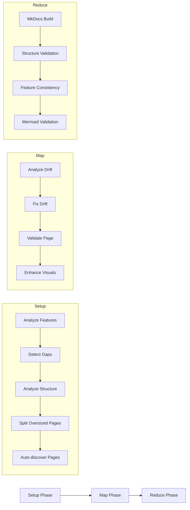

# Getting Started

This guide covers the basics of running the MkDocs documentation workflow, including quick start instructions and configuration options.

## Overview

This workflow is designed for projects using **MkDocs Material** as their documentation system. It provides the same capabilities as the mdbook workflow but targets MkDocs-specific features and structure.

**Key Features:**

- Automatic gap detection for undocumented features
- Drift analysis comparing docs against source code
- Intelligent fixes with source attribution
- MkDocs build validation with `--strict` mode
- Navigation completeness checking
- Broken link detection
- Visual enhancement with diagrams and admonitions

## Quick Start

### 1. Run the Workflow

```bash
prodigy run workflows/mkdocs-drift.yml
```

### 2. Review Generated Documentation

After completion, check:

- **Generated pages:** New markdown files in your docs directory
- **Validation report:** `.prodigy/mkdocs-analysis/validation.json`
- **Structure report:** `.prodigy/mkdocs-analysis/structure-report.json`

### 3. Merge Changes

The workflow runs in an isolated git worktree. When complete, you'll be prompted:

```
Merge session-abc123 to mkdocs? [y/N]
```

Review the changes and merge when satisfied.

## Workflow Phases

The workflow executes in three phases: setup, map, and reduce.



### Setup Phase

The setup phase prepares the documentation for processing:

| Step | Command | Description |
|------|---------|-------------|
| 1 | `/prodigy-analyze-features-for-mkdocs` | Analyzes codebase for workflow features, command types, and configuration |
| 2 | `/prodigy-detect-mkdocs-gaps` | Detects documentation gaps and creates stub pages for missing features |
| 3 | `/prodigy-analyze-mkdocs-structure` | Analyzes page sizes and structural complexity, generates recommendations |
| 4 | `/prodigy-split-oversized-mkdocs-pages` | Automatically splits oversized pages into subpages |
| 5 | Auto-discovery | Finds all `.md` files in docs directory for processing |

!!! info "Why Auto-Discovery?"
    The auto-discovery step ensures all pages are processed, including newly created subpages from step 4. This guarantees complete coverage without relying solely on the curated chapter definitions.

### Map Phase

Each documentation page is processed in parallel with these steps:

| Step | Command | Description |
|------|---------|-------------|
| 1 | `/prodigy-analyze-mkdocs-drift` | Analyzes page for outdated content, missing features, and broken links |
| 2 | `/prodigy-fix-mkdocs-drift` | Fixes identified drift issues with source attribution |
| 3 | `/prodigy-validate-mkdocs-page` | Validates page meets 100% quality standards |
| 4 | `/prodigy-enhance-mkdocs-page` | Adds visual features: diagrams, admonitions, annotations |

!!! note "Quality Validation"
    Each page must meet 100% quality standards. If validation fails, the `/prodigy-complete-mkdocs-fix` command attempts up to 3 retries to address gaps.

### Reduce Phase

After all pages are processed, the reduce phase validates the complete documentation:

| Step | Command | Description |
|------|---------|-------------|
| 1 | `mkdocs build --strict` | Builds docs with strict mode to catch broken links and warnings |
| 2 | `/prodigy-validate-mkdocs-structure` | Validates cross-cutting organizational issues |
| 3 | `/prodigy-validate-feature-consistency` | Verifies consistent feature usage across pages |
| 4 | `mermaid-sonar` | Validates all Mermaid diagrams have correct syntax |

!!! tip "Automatic Error Recovery"
    If `mkdocs build` fails, the workflow automatically runs `/prodigy-fix-mkdocs-build-errors` to resolve broken links and other issues.

## Configuration Options

### Environment Variables

All configuration is done through environment variables in the workflow YAML:

```yaml
# Source: workflows/mkdocs-drift.yml:9-22
env:
  # Project Configuration
  PROJECT_NAME: "Prodigy"              # Your project name
  PROJECT_CONFIG: ".prodigy/mkdocs-config.json"  # MkDocs-specific config
  FEATURES_PATH: ".prodigy/mkdocs-analysis/features.json"  # Feature inventory

  # MkDocs-Specific Settings
  DOCS_DIR: "docs"                     # Documentation source directory (default)
  MKDOCS_CONFIG: "mkdocs.yml"          # MkDocs configuration file
  ANALYSIS_DIR: ".prodigy/mkdocs-analysis"  # Analysis output directory
  CHAPTERS_FILE: "workflows/data/mkdocs-chapters.json"  # Chapter definitions

  # Workflow Settings
  MAX_PARALLEL: "3"                    # Number of parallel agents
```

### Configuring Documentation Directory

The workflow supports flexible documentation directory configuration through the `DOCS_DIR` variable:

#### Option 1: Standard MkDocs Directory (Default)

```yaml
env:
  DOCS_DIR: "docs"
  CHAPTERS_FILE: "workflows/data/mkdocs-chapters.json"
```

**Use this when:**

- You have a standard MkDocs project structure
- You want MkDocs-specific documentation separate from mdbook
- You need a curated subset of documentation for MkDocs

**Structure:**

```
docs/
├── index.md
├── workflow-basics/
│   ├── variables.md
│   └── environment.md
└── mapreduce/
    └── overview.md
mkdocs.yml (docs_dir: docs)
```

#### Option 2: Shared Source with mdbook

```yaml
env:
  DOCS_DIR: "book/src"
  CHAPTERS_FILE: "workflows/data/prodigy-chapters.json"
```

**Use this when:**

- You want a single source of truth for both mdbook and MkDocs
- You're migrating from mdbook to MkDocs
- You want complete documentation in both formats

**Structure:**

```
book/src/
├── index.md
├── SUMMARY.md (for mdbook)
├── workflow-basics/
│   ├── index.md
│   └── *.md
└── mapreduce/
    ├── index.md
    └── *.md
mkdocs.yml (docs_dir: book/src, exclude: SUMMARY.md)
```

!!! warning "MkDocs Configuration Required"
    When using `book/src`, update your `mkdocs.yml` to exclude mdbook-specific files:

    ```yaml
    docs_dir: book/src
    exclude_docs: |
      SUMMARY.md
    ```

### Chapter Definitions

Chapter definitions are stored in JSON files that define the documentation structure:

**For separate MkDocs docs:**

```json
// workflows/data/mkdocs-chapters.json
[
  {
    "id": "workflow-basics",
    "title": "Workflow Basics",
    "pages": [
      {"id": "variables", "title": "Variables"},
      {"id": "environment", "title": "Environment"}
    ]
  }
]
```

**For shared book/src:**

```json
// workflows/data/prodigy-chapters.json
// (More comprehensive structure matching mdbook SUMMARY.md)
```

### Parallelism Configuration

Control how many documentation pages are processed simultaneously:

```yaml
# Source: workflows/mkdocs-drift.yml:22,94
env:
  MAX_PARALLEL: "3"  # Process 3 pages at once

map:
  max_parallel: ${MAX_PARALLEL}
```

**Guidelines:**

| Setting | Use Case |
|---------|----------|
| `1-3` | Conservative, good for development |
| `4-6` | Balanced, recommended for most projects |
| `7-10` | Aggressive, faster but higher resource usage |

## Error Handling

The workflow includes robust error handling to ensure documentation quality while allowing recovery from failures.

```yaml
# Source: workflows/mkdocs-drift.yml:127-131
error_policy:
  on_item_failure: dlq      # Failed items go to Dead Letter Queue
  continue_on_failure: true # Continue processing other pages
  max_failures: 2           # Allow up to 2 failures before stopping
  error_collection: aggregate
```

!!! info "Dead Letter Queue (DLQ)"
    Failed pages are routed to the DLQ for later inspection and retry. Use `prodigy dlq show <job_id>` to view failed items and `prodigy dlq retry <job_id>` to reprocess them.

### Recovery Commands

```bash
# View failed items
prodigy dlq show <job_id>

# Retry failed items
prodigy dlq retry <job_id> --max-parallel 2

# Resume an interrupted workflow
prodigy resume <session_id>
```

## Next Steps

- [Workflow Phases](workflow-phases.md) - Detailed documentation of each phase
- [Advanced Usage](advanced-usage.md) - Custom configurations and optimization
