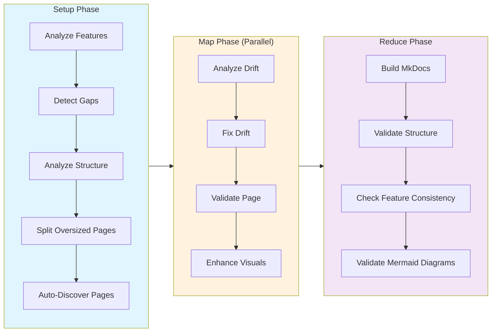

# MkDocs Documentation Workflow

The `mkdocs-drift.yml` workflow automatically generates and maintains MkDocs Material documentation by detecting gaps, analyzing drift, and fixing documentation to stay synchronized with your codebase.

This workflow is designed for projects using **MkDocs Material** as their documentation system. It provides the same capabilities as the mdbook workflow but targets MkDocs-specific features and structure.

## Workflow Overview

**Figure**: Complete MkDocs workflow showing all phases from feature analysis through final validation.

## Key Features

!!! tip "Production-Ready Automation"
    All features work together to maintain documentation quality with minimal manual intervention.

- **Automatic gap detection** - Identifies undocumented features and creates stub pages
- **Drift analysis** - Compares documentation against source code for accuracy
- **Intelligent fixes** - Updates content with source attribution for traceability
- **Structure analysis** - Identifies oversized pages and recommends splitting
- **Page splitting** - Automatically splits large pages into subpages for readability
- **Visual enhancement** - Adds diagrams, admonitions, tabs, and annotations
- **MkDocs build validation** - Validates with `--strict` mode for broken links
- **Navigation completeness** - Ensures all pages are accessible in navigation
- **Mermaid diagram validation** - Verifies all diagrams have valid syntax
- **Feature consistency checks** - Ensures uniform styling across all pages

## Documentation Sections

### [Getting Started](getting-started.md)

Learn the basics of running the MkDocs workflow:

- **Overview** - Understanding the workflow purpose and capabilities
- **Quick Start** - Run your first documentation workflow
- **Configuration Options** - Environment variables, directories, and parallelism settings

### [Workflow Phases](workflow-phases.md)

Deep dive into each phase of the workflow:

- **Setup Phase** - Feature analysis, gap detection, structure analysis, and page splitting
- **Map Phase** - Parallel drift analysis, fixing, validation, and visual enhancement
- **Reduce Phase** - Build validation, structure validation, feature consistency, and Mermaid checks
- **Workflow Commands Reference** - All available commands with parameters

### [Advanced Usage](advanced-usage.md)

Advanced configuration and best practices:

- **Advanced Configuration** - Custom project config, validation thresholds, error handling
- **Using with Existing MkDocs Projects** - Migration and CI/CD integration
- **Troubleshooting** - Common issues and solutions
- **Best Practices** - Recommendations for effective usage
- **Examples** - Complete workflow configurations for different scenarios
