# Workflow Phases

This page describes each phase of the MkDocs documentation workflow and provides a reference for all available workflow commands.

## Workflow Overview


## Setup Phase

The setup phase prepares the documentation for processing by analyzing features, detecting gaps, and organizing page structure.

**Step 1: Analyze Features**
```yaml
# Source: workflows/mkdocs-drift.yml:30
- claude: "/prodigy-analyze-features-for-mkdocs --project $PROJECT_NAME --config $PROJECT_CONFIG"
```

Scans your codebase to build a feature inventory including:

- Command types and syntax
- Configuration options
- Workflow features
- MapReduce capabilities

**Output:** `.prodigy/mkdocs-analysis/features.json`

**Step 2: Detect Gaps**
```yaml
# Source: workflows/mkdocs-drift.yml:35-36
- claude: "/prodigy-detect-mkdocs-gaps --project $PROJECT_NAME --config $PROJECT_CONFIG --features $FEATURES_PATH --chapters $CHAPTERS_FILE --docs-dir $DOCS_DIR"
  commit_required: true
```

Compares feature inventory against existing documentation to find:

- Missing pages for undocumented features
- Incomplete pages missing key information
- Structural gaps in navigation

**Outputs:**

- `.prodigy/mkdocs-analysis/gap-report.json`
- `.prodigy/mkdocs-analysis/flattened-items.json` (for map phase)
- New stub markdown files (if gaps found)

**Step 3: Analyze Structure**
```yaml
# Source: workflows/mkdocs-drift.yml:41
- claude: "/prodigy-analyze-mkdocs-structure --project $PROJECT_NAME --docs-dir $DOCS_DIR --pages $CHAPTERS_FILE --output $ANALYSIS_DIR/structure-report.json"
```

Analyzes page sizes and structural complexity to identify:

- Oversized pages exceeding size thresholds
- Pages with too many sections that should be split
- Structural recommendations for better organization

**Output:** `.prodigy/mkdocs-analysis/structure-report.json`

**Step 4: Split Oversized Pages**
```yaml
# Source: workflows/mkdocs-drift.yml:46-47
- claude: "/prodigy-split-oversized-mkdocs-pages --project $PROJECT_NAME --pages $CHAPTERS_FILE --docs-dir $DOCS_DIR --structure-report $ANALYSIS_DIR/structure-report.json"
  commit_required: false
```

Automatically splits all oversized pages into subpages before the map phase. This ensures agents process optimally-sized pages for better quality results.

!!! tip "Why Split Before Map Phase?"
    Splitting oversized pages before map phase processing ensures each agent works with focused, manageable content. This improves drift detection accuracy and results in higher quality documentation updates.

**Step 5: Auto-Discover Pages**
```yaml
# Source: workflows/mkdocs-drift.yml:51-64
- shell: |
    find $DOCS_DIR -name "*.md" -type f -not -path "*/.prodigy/*" | sort | jq -R -s '
      split("\n") |
      map(select(length > 0)) |
      map({
        id: (split("/")[-1] | split(".md")[0]),
        title: (split("/")[-1] | split(".md")[0] | gsub("-|_"; " ")),
        file: .,
        type: "auto-discovered",
        topics: [],
        validation: "Auto-discovered page - check for drift and enhance with visual features"
      })
    ' > $ANALYSIS_DIR/flattened-items.json
  commit_required: false
```

Auto-discovers ALL documentation pages including newly created subpages. This ensures the map phase processes every page, not just a curated list.

**Output:** `.prodigy/mkdocs-analysis/flattened-items.json`

## Map Phase

Processes each documentation page in parallel using isolated worktrees:


**Step 1: Analyze Drift**
```yaml
# Source: workflows/mkdocs-drift.yml:73-74
- claude: "/prodigy-analyze-mkdocs-drift --project $PROJECT_NAME --json '${item}' --features $FEATURES_PATH"
  commit_required: true
```

Analyzes each page for:

- Outdated information
- Missing features
- Incorrect examples
- Broken references

**Output:** Drift analysis JSON with severity ratings

**Step 2: Fix Drift**
```yaml
# Source: workflows/mkdocs-drift.yml:77-78
- claude: "/prodigy-fix-mkdocs-drift --project $PROJECT_NAME --json '${item}'"
  commit_required: true
```

Fixes detected drift by:

- Updating documentation to match current implementation
- Adding source code references
- Fixing broken links
- Adding missing examples

**Step 3: Validate Fix**
```yaml
# Source: workflows/mkdocs-drift.yml:79-87
validate:
  claude: "/prodigy-validate-mkdocs-page --project $PROJECT_NAME --json '${item}' --output .prodigy/validation-result.json"
  result_file: ".prodigy/validation-result.json"
  threshold: 100
  on_incomplete:
    claude: "/prodigy-complete-mkdocs-fix --project $PROJECT_NAME --json '${item}' --gaps ${validation.gaps}"
    max_attempts: 3
    fail_workflow: false
    commit_required: true
```

Ensures the fix meets quality standards:

- All required topics covered
- Examples are accurate
- Links are valid
- Source attribution present

!!! note "Validation with on_incomplete Handler"
    If the page doesn't meet the 100% quality threshold, the `on_incomplete` handler runs `/prodigy-complete-mkdocs-fix` to iteratively improve the page up to 3 times. The workflow continues even if the threshold isn't met.

**Step 4: Enhance Page**
```yaml
# Source: workflows/mkdocs-drift.yml:91-92
- claude: "/prodigy-enhance-mkdocs-page --project $PROJECT_NAME --json '${item}' --auto-fix true"
  commit_required: true
```

Enhances each page with MkDocs Material visual features:

- **Mermaid diagrams** for complex flows and architectures
- **Admonitions** (tip, warning, note, example) at strategic locations
- **Code annotations** for complex configuration examples
- **Tabbed content** for platform-specific or alternative approaches

!!! example "Visual Enhancement"
    This step adds context-aware diagrams and admonitions based on what the page actually discusses. For example, a workflow phases page gets flowcharts, while a configuration page gets tabs for platform-specific paths.

## Reduce Phase

Aggregates results and performs holistic validation across all pages:

**Step 1: Build Documentation**
```yaml
# Source: workflows/mkdocs-drift.yml:99-103
- shell: "mkdocs build --strict"
  on_failure:
    claude: "/prodigy-fix-mkdocs-build-errors --project $PROJECT_NAME"
    commit_required: true
```

Runs `mkdocs build --strict` to catch:

- Broken internal links
- Missing files referenced in navigation
- Invalid markdown syntax
- Configuration errors

**Step 2: Structure Validation**
```yaml
# Source: workflows/mkdocs-drift.yml:106-107
- claude: "/prodigy-validate-mkdocs-structure --project $PROJECT_NAME --docs-dir $DOCS_DIR --output $ANALYSIS_DIR/structure-validation.json --auto-fix true"
  commit_required: true
```

Performs cross-cutting structural validation:

- **Missing index.md** - Creates landing page if missing
- **Orphaned files** - Detects files not in navigation
- **Navigation completeness** - Ensures all files are accessible
- **Build validation** - Confirms mkdocs builds successfully
- **Content anti-patterns** - Detects redundant sections, circular references

**Step 3: Feature Consistency**
```yaml
# Source: workflows/mkdocs-drift.yml:112
- claude: "/prodigy-validate-feature-consistency --project $PROJECT_NAME --docs-dir $DOCS_DIR --output $ANALYSIS_DIR/feature-consistency.json"
```

Verifies all pages have consistent feature usage:

- Checks that Mermaid is enabled in mkdocs.yml
- Validates admonition density across pages
- Ensures diagram coverage for complex topics
- Reports pages that may need manual review

**Step 4: Mermaid Diagram Validation**
```yaml
# Source: workflows/mkdocs-drift.yml:115-120
- shell: "mermaid-sonar $DOCS_DIR --strict"
  on_failure:
    claude: "/prodigy-fix-mermaid-diagrams '${shell.stderr}'"
    commit_required: true
```

Validates all Mermaid diagrams have correct syntax:

- Checks for missing diagram type declarations
- Detects unmatched brackets and quotes
- Finds HTML entities that should be quoted strings
- Identifies readability issues (too wide or complex)

!!! warning "Mermaid Syntax Validation"
    The `mermaid-sonar` tool catches common Mermaid syntax issues that would cause rendering failures. If validation fails, the `/prodigy-fix-mermaid-diagrams` command automatically fixes the detected issues.

**Step 5: Cleanup**
```yaml
# Source: workflows/mkdocs-drift.yml:123-124
- shell: "rm -rf ${ANALYSIS_DIR}/features.json ${ANALYSIS_DIR}/flattened-items.json ${ANALYSIS_DIR}/drift-*.json ${ANALYSIS_DIR}/gap-report.json"
- shell: "git add -A && git commit -m 'chore: remove temporary mkdocs analysis files for ${PROJECT_NAME}' || true"
```

Removes temporary analysis files while preserving validation reports:

- Removes features.json, flattened-items.json, drift-*.json, gap-report.json
- Keeps structure-validation.json and feature-consistency.json for review

## Error Handling

The workflow includes an error policy for handling failures:

```mermaid
flowchart LR
    Process["Process Page"] --> Result{Success?}
    Result -->|Yes| NextPage["Next Page"]
    Result -->|No| DLQ["Add to DLQ"]
    DLQ --> Check{"Consecutive
    Failures ≥ 2?"}
    Check -->|No| NextPage
    Check -->|Yes| Stop["Stop Workflow"]
    NextPage --> More{More Pages?}
    More -->|Yes| Process
    More -->|No| Report["Aggregate Error Report"]

    style DLQ fill:#fff3e0
    style Stop fill:#ffebee
    style Report fill:#e1f5ff
```



```yaml
# Source: workflows/mkdocs-drift.yml:127-131
error_policy:
  on_item_failure: dlq        # (1)!
  continue_on_failure: true   # (2)!
  max_failures: 2             # (3)!
  error_collection: aggregate # (4)!
```

1. Failed items are sent to the Dead Letter Queue for later retry
2. Workflow continues even if some pages fail
3. Stops after 2 consecutive failures to prevent runaway issues
4. Collects all errors for a summary report

!!! tip "Retrying Failed Items"
    After the workflow completes, use `prodigy dlq retry <job_id>` to reprocess items that failed. This is useful when failures were due to transient issues like rate limits or network errors.

## Workflow Commands Reference

### Setup Phase Commands

**`/prodigy-analyze-features-for-mkdocs`**

- Scans codebase for features
- Outputs: `.prodigy/mkdocs-analysis/features.json`
- Reuses existing analysis if recent

**`/prodigy-detect-mkdocs-gaps`**

- Compares features against documentation
- Creates missing page stubs
- Outputs: gap report and flattened items for map phase

**`/prodigy-analyze-mkdocs-structure`**

- Analyzes page sizes and structural complexity
- Identifies oversized pages needing splits
- Outputs: `.prodigy/mkdocs-analysis/structure-report.json`

**`/prodigy-split-oversized-mkdocs-pages`**

- Orchestrates splitting of oversized pages
- Creates multi-subpage directory structures
- Updates mkdocs.yml navigation

### Map Phase Commands

**`/prodigy-analyze-mkdocs-drift`**

- Analyzes single page for drift
- Compares against feature inventory
- Outputs: drift analysis JSON

**`/prodigy-fix-mkdocs-drift`**

- Fixes drift in single page
- Adds source attribution
- Updates examples and explanations

**`/prodigy-validate-mkdocs-page`**

- Validates page completeness
- Checks quality standards
- Returns quality score

**`/prodigy-complete-mkdocs-fix`**

- Iteratively improves page to meet threshold
- Addresses validation gaps
- Runs up to `max_attempts` times

**`/prodigy-enhance-mkdocs-page`**

- Adds Mermaid diagrams for complex flows
- Inserts strategic admonitions (tip, warning, note)
- Adds code annotations for complex examples
- Creates tabbed content for alternatives

### Reduce Phase Commands

**`/prodigy-fix-mkdocs-build-errors`**

- Fixes mkdocs build failures
- Repairs broken links
- Fixes navigation issues

**`/prodigy-validate-mkdocs-structure`**

- Cross-cutting structural validation
- Checks navigation completeness
- Validates mkdocs build
- Detects content anti-patterns
- Auto-fixes with `--auto-fix true`

**`/prodigy-validate-feature-consistency`**

- Checks Mermaid enablement in mkdocs.yml
- Validates admonition density across pages
- Reports pages needing manual review

**`/prodigy-fix-mermaid-diagrams`**

- Finds and fixes invalid Mermaid syntax
- Corrects HTML entities and line breaks
- Fixes readability issues (layout direction, complexity)
