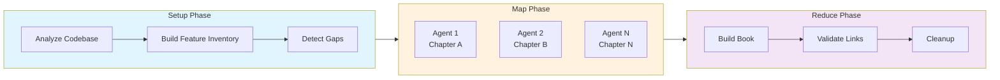

## Quick Start

This guide walks you through setting up your first automated documentation workflow. You'll create a basic mdBook structure, configure Prodigy to analyze your codebase, and run the workflow to generate up-to-date documentation.

**Time Required**: 15-20 minutes

!!! info "Prerequisites"
    Ensure you have [installed Prodigy](../installation.md) before proceeding.

---

## Step 1: Initialize Your Book Structure

First, create the basic mdBook directory structure for your documentation:

```bash
# Create and initialize the book
mdbook init book
cd book

# View the generated structure
ls -la
# Expected output:
# book.toml      - mdBook configuration
# src/           - Markdown source files
#   SUMMARY.md   - Book navigation/table of contents
#   chapter_1.md - Example chapter
```

**What this creates:**

- `book.toml`: Configuration file for mdBook (title, authors, build settings)
- `src/SUMMARY.md`: Defines your book's structure and navigation
- `src/chapter_1.md`: Example chapter (you can delete or modify this)

---

## Step 2: Configure Your Book

Edit `book/book.toml` to customize your book settings:

```toml title="book/book.toml"
[book]
title = "My Project Documentation"
authors = ["Your Name <you@example.com>"]
description = "Automated documentation for My Project"
src = "src"
language = "en"

[build]
build-dir = "book"
create-missing = false

[output.html]
default-theme = "rust"
preferred-dark-theme = "navy"
git-repository-url = "https://github.com/youruser/yourproject"
git-repository-icon = "fa-github"

[output.html.search]
enable = true
```

!!! tip "Key Settings"
    - `title`: Your documentation title
    - `git-repository-url`: Link to your source repository
    - `create-missing = false`: Prevents mdBook from auto-creating missing chapters (Prodigy will manage this)

---

## Step 3: Define Your Documentation Structure

Edit `book/src/SUMMARY.md` to define your book's chapters:

```markdown title="book/src/SUMMARY.md"
# Summary

[Introduction](intro.md)

# User Guide

- [Getting Started](getting-started.md)
- [Configuration](configuration.md)
- [Commands](commands.md)

# Reference

- [API Reference](api-reference.md)
- [Troubleshooting](troubleshooting.md)
```

!!! tip "Best Practices"
    - Start with 3-5 core chapters
    - Use simple, descriptive chapter names
    - Group related topics under section headers
    - You can add more chapters later

---

## Step 4: Create Prodigy Configuration Files

Now create the configuration files that tell Prodigy how to analyze your codebase.

### 4a. Create Book Configuration

Create `.prodigy/book-config.json`:

```bash
mkdir -p .prodigy
cat > .prodigy/book-config.json << 'EOF'
{
  "project_name": "MyProject",
  "project_type": "cli_tool",
  "book_dir": "book",
  "book_src": "book/src",
  "book_build_dir": "book/book",
  "analysis_targets": [
    {
      "area": "getting_started",
      "source_files": [
        "README.md",
        "examples/"
      ],
      "feature_categories": [
        "installation",
        "basic_usage",
        "first_steps"
      ]
    },
    {
      "area": "configuration",
      "source_files": [
        "src/config/"
      ],
      "feature_categories": [
        "config_files",
        "settings",
        "environment"
      ]
    }
  ],
  "chapter_file": "workflows/data/book-chapters.json",
  "custom_analysis": {
    "include_examples": true,
    "include_best_practices": true,
    "include_troubleshooting": true
  }
}
EOF
```

**Configuration Explained:**

| Field | Description |
|-------|-------------|
| `analysis_targets` | Defines which source files to analyze and what features to extract |
| `area` | Name for this analysis area (maps to documentation chapters) |
| `source_files` | Paths to analyze (can be files or directories) |
| `feature_categories` | What types of features to document |

### 4b. Create Chapter Definitions

Create `workflows/data/book-chapters.json`:

```bash
mkdir -p workflows/data
cat > workflows/data/book-chapters.json << 'EOF'
{
  "chapters": [
    {
      "id": "intro",
      "title": "Introduction",
      "type": "single-file",
      "file": "book/src/intro.md",
      "topics": ["Project Overview", "Goals"],
      "validation": "Check introduction explains project purpose and value"
    },
    {
      "id": "getting-started",
      "title": "Getting Started",
      "type": "single-file",
      "file": "book/src/getting-started.md",
      "topics": ["Installation", "First Steps", "Quick Example"],
      "validation": "Verify installation steps and first example work"
    },
    {
      "id": "configuration",
      "title": "Configuration",
      "type": "single-file",
      "file": "book/src/configuration.md",
      "topics": ["Config Files", "Settings", "Environment"],
      "validation": "Check all config options are documented"
    }
  ]
}
EOF
```

**Chapter Definition Explained:**

| Field | Description |
|-------|-------------|
| `id` | Unique identifier for the chapter |
| `type` | `single-file` (one markdown file) or `multi-subsection` (chapter with subsections) |
| `file` | Path to the markdown file |
| `topics` | What this chapter should cover |
| `validation` | Instructions for verifying documentation quality |

---

## Step 5: Create the Documentation Workflow

Create `workflows/book-docs-drift.yml`:

```bash
mkdir -p workflows
cat > workflows/book-docs-drift.yml << 'EOF'
name: book-docs-drift-detection
mode: mapreduce

# Environment variables
env:
  PROJECT_NAME: "MyProject"
  PROJECT_CONFIG: ".prodigy/book-config.json"
  FEATURES_PATH: ".prodigy/book-analysis/features.json"
  BOOK_DIR: "book"
  ANALYSIS_DIR: ".prodigy/book-analysis"
  CHAPTERS_FILE: "workflows/data/book-chapters.json"
  MAX_PARALLEL: "3"

# Setup phase: Analyze codebase
setup:
  - shell: "mkdir -p $ANALYSIS_DIR"
  - claude: "/prodigy-analyze-features-for-book --project $PROJECT_NAME --config $PROJECT_CONFIG"
  - claude: "/prodigy-detect-documentation-gaps --project $PROJECT_NAME --config $PROJECT_CONFIG --features $FEATURES_PATH --chapters $CHAPTERS_FILE --book-dir $BOOK_DIR"

# Map phase: Fix each chapter in parallel
map:
  input: "${ANALYSIS_DIR}/flattened-items.json"
  json_path: "$[*]"

  agent_template:
    - claude: "/prodigy-analyze-subsection-drift --project $PROJECT_NAME --json '${item}' --features $FEATURES_PATH"
      commit_required: true
    - claude: "/prodigy-fix-subsection-drift --project $PROJECT_NAME --json '${item}'"
      commit_required: true

  max_parallel: ${MAX_PARALLEL}

# Reduce phase: Build and validate
reduce:
  - shell: "cd book && mdbook build"
    on_failure:
      claude: "/prodigy-fix-book-build-errors --project $PROJECT_NAME"
      commit_required: true
  - shell: "rm -rf ${ANALYSIS_DIR}"
  - shell: "git add -A && git commit -m 'chore: clean up analysis files' || true"

# Error handling
error_policy:
  on_item_failure: dlq
  continue_on_failure: true
EOF
```

**Workflow Structure:**



| Phase | Purpose |
|-------|---------|
| **Setup** | Analyzes your codebase and detects documentation gaps |
| **Map** | Processes each chapter in parallel to fix drift |
| **Reduce** | Builds the complete book and validates |

!!! note "Advanced Workflow Features"
    The actual Prodigy workflow includes additional steps for automatic chapter splitting and structure optimization. These steps (`/prodigy-analyze-chapter-structure` and `/prodigy-split-oversized-chapters`) are useful for large documentation projects where chapters may grow too long. See [Advanced Configuration](advanced-configuration.md) for details.

---

## Step 6: Initialize Prodigy Commands

Initialize the Claude commands that Prodigy uses for documentation generation:

```bash
prodigy init
```

**Expected output:**

```
Initializing Prodigy commands...
✓ Created .claude/commands/prodigy-analyze-features-for-book.md
✓ Created .claude/commands/prodigy-detect-documentation-gaps.md
✓ Created .claude/commands/prodigy-analyze-subsection-drift.md
✓ Created .claude/commands/prodigy-fix-subsection-drift.md
✓ Created .claude/commands/prodigy-fix-book-build-errors.md
...
✓ Initialized 15 Prodigy commands
```

**Verify commands were created:**

```bash
ls -la .claude/commands/ | grep "prodigy-"
```

!!! tip "Required Commands for Book Workflow"
    The book documentation workflow requires these core commands:

    - `/prodigy-analyze-features-for-book` - Analyzes codebase for features
    - `/prodigy-detect-documentation-gaps` - Finds missing documentation
    - `/prodigy-analyze-subsection-drift` - Detects outdated content
    - `/prodigy-fix-subsection-drift` - Fixes outdated documentation
    - `/prodigy-fix-book-build-errors` - Resolves build issues

---

## Step 7: Run Your First Documentation Workflow

Now run the workflow to generate your documentation:

```bash
prodigy run workflows/book-docs-drift.yml
```

**What happens:**

=== "Setup Phase (~2-5 min)"
    - Analyzes your source code
    - Builds feature inventory
    - Detects documentation gaps
    - Creates stub files for missing chapters

=== "Map Phase (~5-10 min)"
    - Processes each chapter in parallel
    - Fixes documentation drift
    - Adds code examples from your source
    - Validates quality

=== "Reduce Phase (~1-2 min)"
    - Builds complete book with `mdbook build`
    - Validates all links work
    - Cleans up temporary files

=== "Merge Prompt"
    - Asks if you want to merge changes to your branch
    - Type `y` to accept, `n` to review first

**Example output:**

```
🔧 Setup Phase
✓ Created .prodigy/book-analysis/
✓ Analyzed codebase features
✓ Detected 3 documentation gaps

🗺️  Map Phase (3 parallel agents)
✓ Fixed getting-started.md
✓ Fixed configuration.md
✓ Fixed api-reference.md

🔻 Reduce Phase
✓ Built book successfully
✓ Cleaned up analysis files

📊 Summary:
   3/3 chapters updated
   12 commits created

Merge to main? [y/N]
```

---

## Step 8: Review and Build Your Documentation

After the workflow completes, review the generated documentation:

```bash
# View the built book locally
cd book
mdbook serve

# Open in browser: http://localhost:3000
```

!!! warning "Review Before Merging"
    Always review the generated documentation before merging to your main branch. Check that:

    - All chapters have appropriate content
    - Code examples are accurate and tested
    - Links between chapters work
    - Examples match your actual codebase

**If you need to make changes:**

```bash
# Edit any chapter
vim book/src/getting-started.md

# Rebuild the book
mdbook build

# Or use watch mode for live reload
mdbook serve
```

---

## Next Steps

Congratulations! You've created your first automated documentation workflow. Here's what to do next:

### Keep Documentation Updated

Run the workflow regularly to keep docs in sync with code:

```bash
# After adding new features
prodigy run workflows/book-docs-drift.yml

# Schedule in CI/CD (see GitHub Actions Integration)
```

!!! tip "Recommended Frequency"
    Run documentation drift detection after significant feature additions or refactoring. For active projects, weekly runs or CI integration on the main branch works well.

### Expand Your Documentation

Add more chapters to `workflows/data/book-chapters.json`:

1. Add new `analysis_targets` in `.prodigy/book-config.json`
2. Define new chapters in `book-chapters.json`
3. Update `book/src/SUMMARY.md` with new chapters
4. Re-run the workflow

### Customize the Workflow

- Adjust `MAX_PARALLEL` for faster/slower processing
- Add validation steps in the reduce phase
- Customize error handling with `error_policy`

### Integrate with CI/CD

Automate documentation updates in your CI/CD pipeline:

- See [GitHub Actions Integration](github-actions-integration.md)
- Run on every PR or nightly
- Deploy to GitHub Pages or docs hosting

---

## Troubleshooting

### Workflow fails in setup phase

!!! failure "Symptoms"
    Error during feature analysis

**Fixes:**

- Verify `analysis_targets` in `.prodigy/book-config.json` point to existing files
- Check that source files exist and are readable
- Ensure Claude Code CLI is authenticated

### mdBook build fails

!!! failure "Symptoms"
    Error in reduce phase when building book

**Fixes:**

- Verify `book/book.toml` is valid TOML
- Check `book/src/SUMMARY.md` references only existing files
- Ensure all linked chapters exist
- Run `cd book && mdbook build` manually to see detailed error

### No chapters were updated

!!! failure "Symptoms"
    Workflow completes but no changes made

**Fixes:**

- Check that chapters in `book-chapters.json` exist in your repo
- Verify `analysis_targets` match your project structure
- Ensure chapters actually need updates (no drift = no changes)

### Agent failures in map phase

!!! failure "Symptoms"
    Some chapters fail to update, sent to DLQ

**Fixes:**

- Review DLQ: `prodigy dlq show <job_id>`
- Check Claude JSON logs for detailed errors
- Retry failed items: `prodigy dlq retry <job_id>`
- See [Troubleshooting](troubleshooting.md) for common issues

---

## Summary

You've learned how to:

- [x] Initialize an mdBook structure
- [x] Configure Prodigy to analyze your codebase
- [x] Define documentation chapters and structure
- [x] Create a MapReduce workflow for documentation
- [x] Run the workflow to generate docs automatically
- [x] Review and build your documentation

Your documentation is now linked to your code and can be kept up-to-date automatically!

---

## Related Topics

- [Understanding the Workflow](understanding-the-workflow.md) - Deep dive into how it works
- [GitHub Actions Integration](github-actions-integration.md) - Automate in CI/CD
- [Troubleshooting](troubleshooting.md) - Solutions to common issues
