## Real-World Example: Prodigy's Own Documentation

This documentation you're reading is maintained by the same workflow described in this chapter. This is a complete, production-ready workflow that demonstrates:

```mermaid
graph LR
    subgraph Setup["Setup Phase"]
        direction LR
        S1[Analyze Features] --> S2[Detect Gaps]
        S2 --> S3[Analyze Structure]
        S3 --> S4[Split Oversized]
        S4 --> S5[Auto-Discover Pages]
    end

    subgraph Map["Map Phase (Parallel)"]
        direction LR
        M1[Analyze Drift] --> M2[Fix Drift]
        M2 --> M3{Validate}
        M3 -->|Pass| M4[Enhance Visuals]
        M3 -->|Fail| M5[Complete Fix]
        M5 --> M3
    end

    subgraph Reduce["Reduce Phase"]
        direction LR
        R1[Build Docs] --> R2[Validate Structure]
        R2 --> R3[Check Consistency]
        R3 --> R4[Validate Diagrams]
    end

    Setup --> Map
    Map --> Reduce

    style Setup fill:#e1f5ff
    style Map fill:#fff3e0
    style Reduce fill:#f3e5f5
```



**Figure**: The MkDocs drift workflow showing how pages flow through setup, parallel processing in the map phase, and final validation in reduce.

- **MapReduce parallelism** for processing multiple documentation pages concurrently
- **Validation with thresholds** to ensure documentation meets quality standards
- **Automatic gap-filling** to complete incomplete documentation
- **Auto-discovery** to find all markdown files in the docs directory
- **Visual enhancement** to add MkDocs Material features (admonitions, tabs, diagrams)
- **Mermaid diagram validation** to ensure all diagrams compile correctly
- **Error handling with DLQ** for robust failure recovery

You can examine the actual configuration files used to maintain this documentation:

### MkDocs Configuration

**File**: `.prodigy/mkdocs-config.json`

```json
{
  "project_name": "Prodigy",
  "project_type": "cli_tool",
  "docs_dir": "docs",
  "mkdocs_config": "mkdocs.yml",
  "analysis_dir": ".prodigy/mkdocs-analysis",
  "theme": "material",
  "features": {
    "navigation.tabs": true,
    "navigation.sections": true,
    "navigation.expand": true,
    "navigation.top": true,
    "search.suggest": true,
    "search.highlight": true,
    "content.code.copy": true,
    "content.tabs.link": true
  },
  "plugins": ["search", "tags"],
  "markdown_extensions": [
    "admonition",
    "pymdownx.details",
    "pymdownx.superfences",
    "pymdownx.tabbed",
    "pymdownx.highlight",
    "pymdownx.inlinehilite",
    "pymdownx.snippets",
    "def_list",
    "attr_list",
    "md_in_html"
  ]
}
```

**Source**: `.prodigy/mkdocs-config.json:1-33`

!!! info "MkDocs Material Features"
    The configuration enables rich documentation features:

    - **Admonitions** - Note, warning, tip, and example boxes
    - **Content tabs** - Tabbed sections for alternative content
    - **Code highlighting** - Syntax highlighting with copy button
    - **Superfences** - Enhanced code blocks with Mermaid diagram support

### Page Structure

**File**: `workflows/data/mkdocs-chapters.json`

This file defines the documentation structure with **sections** (groups of related pages) and **single-file pages**:

```json
{
  "pages": [
    {
      "id": "index",
      "title": "Home",
      "file": "docs/index.md",
      "type": "single-file",
      "topics": ["Introduction", "Getting started", "Quick start"],
      "validation": "Check that home page provides clear introduction and navigation"
    },
    {
      "id": "workflow-basics",
      "title": "Workflow Basics",
      "type": "section",
      "pages": [
        {
          "id": "workflow-structure",
          "title": "Workflow Structure",
          "file": "docs/workflow-basics/workflow-structure.md",
          "topics": ["Basic structure", "Command execution", "Available fields"],
          "validation": "Check basic workflow syntax and structure documentation"
        }
      ]
    }
  ]
}
```

**Source**: `workflows/data/mkdocs-chapters.json:1-40`

The setup phase uses `/prodigy-detect-mkdocs-gaps` to create a `flattened-items.json` file containing all pages with parent metadata. This enables the map phase to process each page independently with full awareness of its section context.

### Workflow Configuration

**File**: `workflows/mkdocs-drift.yml`

This MapReduce workflow orchestrates the entire documentation maintenance process:

**Source**: `workflows/mkdocs-drift.yml:1-132`

#### Key Features Demonstrated

**1. Setup Phase** (lines 25-64):

```yaml
# Source: workflows/mkdocs-drift.yml:25-64
setup:
  - shell: "mkdir -p $ANALYSIS_DIR"

  # Step 1: Analyze codebase for workflow features
  - claude: "/prodigy-analyze-features-for-mkdocs --project $PROJECT_NAME --config $PROJECT_CONFIG"

  # Step 2: Detect documentation gaps for missing features
  - claude: "/prodigy-detect-mkdocs-gaps --project $PROJECT_NAME --config $PROJECT_CONFIG --features $FEATURES_PATH --chapters $CHAPTERS_FILE --docs-dir $DOCS_DIR"
    commit_required: true

  # Step 3: Analyze page sizes and structural complexity
  - claude: "/prodigy-analyze-mkdocs-structure --project $PROJECT_NAME --docs-dir $DOCS_DIR --pages $CHAPTERS_FILE --output $ANALYSIS_DIR/structure-report.json"

  # Step 4: Automatically split oversized pages
  - claude: "/prodigy-split-oversized-mkdocs-pages --project $PROJECT_NAME --pages $CHAPTERS_FILE --docs-dir $DOCS_DIR --structure-report $ANALYSIS_DIR/structure-report.json"

  # Step 5: Auto-discover ALL documentation pages
  - shell: |
      find $DOCS_DIR -name "*.md" -type f -not -path "*/.prodigy/*" | sort | jq -R -s '
        split("\n") |
        map(select(length > 0)) |
        map({
          id: (split("/")[-1] | split(".md")[0]),
          title: (split("/")[-1] | split(".md")[0] | gsub("-|_"; " ")),
          file: .,
          type: "auto-discovered",
          topics: [],
          validation: "Auto-discovered page - check for drift and enhance with visual features"
        })
      ' > $ANALYSIS_DIR/flattened-items.json
```

!!! tip "Auto-Discovery"
    The workflow auto-discovers all `.md` files in the `docs/` directory, not just those listed in `mkdocs-chapters.json`. This ensures newly created pages and subpages are always processed.

**2. Map Phase** (lines 67-93):

```yaml
# Source: workflows/mkdocs-drift.yml:67-93
map:
  input: "${ANALYSIS_DIR}/flattened-items.json"
  json_path: "$[*]"

  agent_template:
    # Step 1: Analyze the page for drift
    - claude: "/prodigy-analyze-mkdocs-drift --project $PROJECT_NAME --json '${item}' --features $FEATURES_PATH"
      commit_required: true

    # Step 2: Fix the drift in this page
    - claude: "/prodigy-fix-mkdocs-drift --project $PROJECT_NAME --json '${item}'"
      commit_required: true
      validate:
        claude: "/prodigy-validate-mkdocs-page --project $PROJECT_NAME --json '${item}' --output .prodigy/validation-result.json"
        result_file: ".prodigy/validation-result.json"
        threshold: 100
        on_incomplete:
          claude: "/prodigy-complete-mkdocs-fix --project $PROJECT_NAME --json '${item}' --gaps ${validation.gaps}"
          max_attempts: 3
          fail_workflow: false
          commit_required: true

    # Step 3: Enhance page with visual features
    - claude: "/prodigy-enhance-mkdocs-page --project $PROJECT_NAME --json '${item}' --auto-fix true"
      commit_required: true

  max_parallel: ${MAX_PARALLEL}
```

The map phase processes each page in parallel with three steps:

1. **Analyze drift** - Compare documentation against feature inventory
2. **Fix drift** - Update content to match current implementation
3. **Enhance visually** - Add MkDocs Material features (diagrams, admonitions, tabs)

**3. Validation with Threshold** (lines 79-87):

```yaml
# Source: workflows/mkdocs-drift.yml:79-87
validate:
  claude: "/prodigy-validate-mkdocs-page --project $PROJECT_NAME --json '${item}' --output .prodigy/validation-result.json"
  result_file: ".prodigy/validation-result.json"
  threshold: 100  # Documentation must meet 100% quality standards
  on_incomplete:
    claude: "/prodigy-complete-mkdocs-fix --project $PROJECT_NAME --json '${item}' --gaps ${validation.gaps}"
    max_attempts: 3
    fail_workflow: false  # Continue even if we can't reach 100%
    commit_required: true  # Require commit to verify improvements were made
```

The validation step ensures documentation quality by checking against a score threshold. If the score is below 100, the `on_incomplete` handler attempts to fill gaps with up to 3 attempts.

**4. Reduce Phase with Mermaid Validation** (lines 97-124):

```yaml
# Source: workflows/mkdocs-drift.yml:97-124
reduce:
  # Rebuild the docs to ensure all pages compile together
  - shell: "mkdocs build --strict"
    on_failure:
      claude: "/prodigy-fix-mkdocs-build-errors --project $PROJECT_NAME"
      commit_required: true

  # Structural validation - detect cross-cutting organizational issues
  - claude: "/prodigy-validate-mkdocs-structure --project $PROJECT_NAME --docs-dir $DOCS_DIR --output $ANALYSIS_DIR/structure-validation.json --auto-fix true"
    commit_required: true

  # Feature consistency check
  - claude: "/prodigy-validate-feature-consistency --project $PROJECT_NAME --docs-dir $DOCS_DIR --output $ANALYSIS_DIR/feature-consistency.json"

  # Mermaid diagram validation
  - shell: "mermaid-sonar $DOCS_DIR --strict"
    on_failure:
      claude: "/prodigy-fix-mermaid-diagrams '${shell.stderr}'"
      commit_required: true
```

!!! warning "Mermaid Validation"
    The reduce phase validates all Mermaid diagrams using `mermaid-sonar`. Invalid diagrams are automatically fixed by `/prodigy-fix-mermaid-diagrams` which has access to the error output.

**5. Error Handling** (lines 126-131):

```yaml
# Source: workflows/mkdocs-drift.yml:126-131
error_policy:
  on_item_failure: dlq
  continue_on_failure: true
  max_failures: 2
  error_collection: aggregate
```

Failed items are sent to the Dead Letter Queue (DLQ) for later retry, allowing the workflow to continue processing other items.

### MkDocs Material Features

The workflow automatically enhances documentation pages with MkDocs Material features:

=== "Admonitions"

    ```markdown
    !!! note
        Important information for users

    !!! warning
        Common pitfall or gotcha

    !!! tip
        Best practice or optimization

    !!! example
        Practical usage example
    ```

=== "Content Tabs"

    ```markdown
    === "YAML"
        ```yaml
        name: example-workflow
        mode: mapreduce
        ```

    === "JSON"
        ```json
        {
          "name": "example-workflow",
          "mode": "mapreduce"
        }
        ```
    ```

=== "Code Annotations"

    ```markdown
    ```yaml
    name: workflow  # (1)!
    ```

    1. The workflow name used for logging and identification
    ```

### Study These Files

To understand the complete implementation:

- **Configuration**: `.prodigy/mkdocs-config.json` - MkDocs and analysis configuration
- **Page Structure**: `workflows/data/mkdocs-chapters.json` - Section and page definitions
- **Workflow**: `workflows/mkdocs-drift.yml` - Complete MapReduce workflow
- **Commands**: `.claude/commands/prodigy-analyze-mkdocs-drift.md` - MkDocs-aware drift analysis
- **Commands**: `.claude/commands/prodigy-fix-mkdocs-drift.md` - MkDocs-aware drift fixing
- **Commands**: `.claude/commands/prodigy-enhance-mkdocs-page.md` - Visual enhancement with Material features
