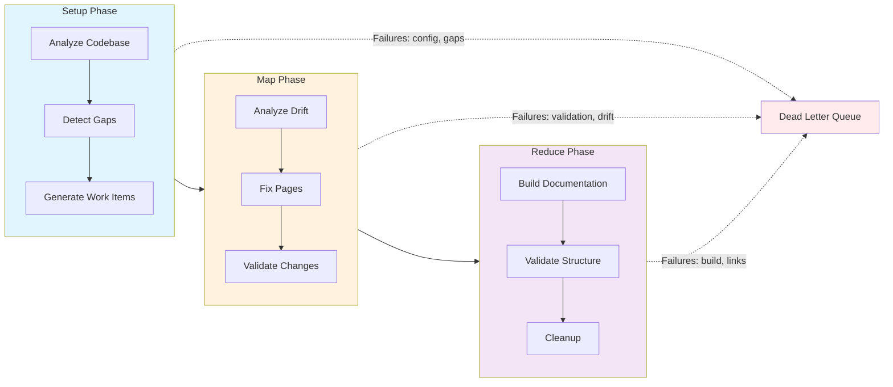
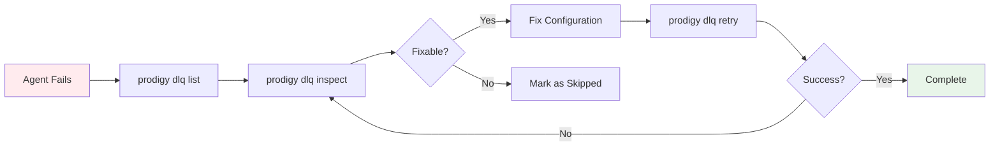

## Troubleshooting

This guide helps you diagnose and fix issues when running automated MkDocs documentation workflows. The workflow executes in three phases (setup, map, reduce), and each phase has specific failure modes and debugging techniques.

**Source**: Based on `workflows/mkdocs-drift.yml` MapReduce workflow implementation and command definitions in `.claude/commands/prodigy-*-mkdocs*.md`



**Figure**: Workflow phases and their failure points. Failed items go to the DLQ for retry.

## Common Issues by Phase

### Setup Phase Issues

The setup phase analyzes your codebase and detects documentation gaps. Common failures:

#### Issue: "features.json not generated"

!!! failure "Symptoms"
    Setup completes but `.prodigy/mkdocs-analysis/features.json` doesn't exist

**Causes**:

- Invalid `mkdocs-config.json` configuration
- Missing or incorrect `analysis_targets` paths
- Source files specified in config don't exist

**Solution**:
```bash
# 1. Verify mkdocs-config.json is valid JSON
cat .prodigy/mkdocs-config.json | jq .

# 2. Check that source files exist
cat .prodigy/mkdocs-config.json | jq -r '.analysis_targets[].source_files[]' | while read f; do
  [ -f "$f" ] || echo "Missing: $f"
done

# 3. Re-run feature analysis manually
prodigy run workflows/mkdocs-drift.yml --stop-after setup
```

**Source**: Configuration structure from `.prodigy/mkdocs-config.json:39-191`

#### Issue: "No gaps detected when gaps should exist"

!!! failure "Symptoms"
    `/prodigy-detect-mkdocs-gaps` reports no gaps but documentation is clearly incomplete

**Causes**:

- `chapters_file` path is incorrect in workflow
- Chapter definitions JSON is malformed
- Features not properly mapped to pages

**Solution**:
```bash
# 1. Verify chapters file exists and is valid
cat workflows/data/mkdocs-chapters.json | jq .

# 2. Check gap detection output
cat .prodigy/mkdocs-analysis/gaps.json | jq .

# 3. Validate flattened items were generated
cat .prodigy/mkdocs-analysis/flattened-items.json | jq 'length'
```

**Source**: Gap detection logic from `.claude/commands/prodigy-detect-mkdocs-gaps.md`

#### Issue: "Setup phase commits nothing"

!!! info "Not Always an Error"
    Setup commands use `commit_required: false` by default and only commit when:

    - Features have changed since last analysis
    - New documentation gaps are detected
    - New stub files are created

**No action needed** if this occurs - the workflow will continue to map phase with existing analysis files.

**Source**: Setup phase design from `workflows/mkdocs-drift.yml:24-64`

### Map Phase Issues

The map phase processes each documentation page in parallel. Each runs in its own agent worktree.

#### Issue: "Agent failed with validation error"

!!! failure "Symptoms"
    Agent completes but fails validation threshold (100% required)

**Causes**:

- Documentation fix was incomplete
- Examples don't match codebase implementation
- Required sections are missing

**Solution**:
```bash
# 1. List failed items in the DLQ
prodigy dlq list --job-id <job_id>

# 2. Inspect a specific failed item
prodigy dlq inspect <item_id> --job-id <job_id>

# 3. Find the drift report for the failed item
ls -la .prodigy/mkdocs-analysis/drift-*.json

# 4. Review what issues were identified
cat .prodigy/mkdocs-analysis/drift-<page-id>.json | jq '.issues'

# 5. Retry failed items
prodigy dlq retry <job_id>
```

**Source**: Validation configuration from `workflows/mkdocs-drift.yml:79-87`

#### Issue: "Drift analysis creates empty report"

!!! failure "Symptoms"
    `/prodigy-analyze-mkdocs-drift` commits but drift report shows no issues when drift clearly exists

**Causes**:

- Feature mappings are incorrect for the page
- Source files referenced in feature analysis are empty
- Page metadata doesn't match actual file

**Solution**:
```bash
# 1. Inspect the drift report
cat .prodigy/mkdocs-analysis/drift-<page-id>.json | jq .

# 2. Verify feature mappings for this item
cat .prodigy/mkdocs-analysis/flattened-items.json | jq '.[] | select(.id=="<page-id>")'

# 3. Check that features.json has content for this area
cat .prodigy/mkdocs-analysis/features.json | jq 'keys'
```

**Source**: Drift analysis command from `.claude/commands/prodigy-analyze-mkdocs-drift.md`

#### Issue: "Multiple agents fail with same error"

!!! failure "Symptoms"
    Several parallel agents all fail with identical error messages

**Causes**:

- Shared resource conflict (rare with worktree isolation)
- Configuration error affecting all agents
- System resource exhaustion (disk space, memory)

**Solution**:

=== "Linux"
    ```bash
    # Check system resources
    df -h       # Disk space
    free -h     # Memory usage
    top -b -n1  # CPU and processes
    ```

=== "macOS"
    ```bash
    # Check system resources
    df -h       # Disk space
    vm_stat     # Memory usage
    top -l 1    # CPU and processes
    ```

```bash
# 2. Review error collection
prodigy events ls --job-id <job_id> --event-type AgentFailed

# 3. Reduce parallelism and retry
# Edit workflow: max_parallel: 1
prodigy run workflows/mkdocs-drift.yml
```

**Source**: Error handling policy from `workflows/mkdocs-drift.yml:127-131`

### Reduce Phase Issues

The reduce phase validates the documentation and cleans up analysis files.

#### Issue: "mkdocs build fails with validation errors"

!!! failure "Symptoms"
    `mkdocs build --strict` exits with error listing broken links or navigation issues

**Causes**:

- Cross-references to non-existent pages
- Relative paths calculated incorrectly
- `mkdocs.yml` nav structure out of sync with actual files

**Solution**:
The workflow automatically handles this:
```yaml
# Source: workflows/mkdocs-drift.yml:99-103
- shell: "mkdocs build --strict"
  on_failure:
    claude: "/prodigy-fix-mkdocs-build-errors --project $PROJECT_NAME"
    commit_required: true
```

If manual fix needed:
```bash
# 1. See the exact errors
mkdocs build --strict 2>&1

# 2. Check navigation structure
cat mkdocs.yml | yq '.nav'

# 3. Verify page files exist
find docs -name "*.md" -type f | sort

# 4. Serve locally to test links
mkdocs serve
```

**Source**: Reduce phase from `workflows/mkdocs-drift.yml:97-103`

#### Issue: "Analysis files not cleaned up"

!!! info "Cosmetic Issue"
    `.prodigy/mkdocs-analysis/` directory still exists after workflow completion

**Causes**:

- Reduce phase didn't complete
- Cleanup command failed silently (uses `|| true`)

**Solution**:
```bash
# Manual cleanup is safe
rm -rf .prodigy/mkdocs-analysis

# Check if this was part of incomplete workflow
prodigy sessions list
```

This is cosmetic - analysis files are regenerated on each run.

**Source**: Cleanup step from `workflows/mkdocs-drift.yml:123-124`

### MkDocs-Specific Issues

#### Issue: "Material theme not rendering correctly"

!!! failure "Symptoms"
    Admonitions, tabs, or code annotations don't render properly

**Causes**:

- Missing markdown extensions in `mkdocs.yml`
- Incorrect extension configuration
- CSS/JavaScript not loading

**Solution**:
```bash
# 1. Verify required extensions are configured
cat mkdocs.yml | yq '.markdown_extensions'

# Required extensions for Material features:
# - admonition
# - pymdownx.details
# - pymdownx.superfences
# - pymdownx.tabbed
# - pymdownx.highlight

# 2. Check theme configuration
cat mkdocs.yml | yq '.theme'

# 3. Serve locally to debug
mkdocs serve --verbose
```

**Source**: MkDocs Material configuration from `.prodigy/mkdocs-config.json:22-33`

#### Issue: "Navigation structure validation fails"

!!! failure "Symptoms"
    `/prodigy-validate-mkdocs-structure` reports navigation issues

**Causes**:

- Pages not listed in `mkdocs.yml` nav
- Orphaned pages without navigation entry
- Duplicate page entries

**Solution**:
```bash
# 1. Check structure validation output
cat .prodigy/mkdocs-analysis/structure-validation.json | jq .

# 2. Compare nav to actual files
# List pages in nav
cat mkdocs.yml | yq '.nav' | grep -o 'docs/.*\.md'

# List actual files
find docs -name "*.md" -type f | sort

# 3. Use validation command
claude /prodigy-validate-mkdocs-structure --project Prodigy --docs-dir docs --auto-fix true
```

**Source**: Structure validation from `workflows/mkdocs-drift.yml:105-107`

#### Issue: "Mermaid diagrams not rendering"

!!! failure "Symptoms"
    Diagrams show as code blocks instead of rendered graphics

**Causes**:

- Mermaid plugin not configured
- Invalid diagram syntax
- JavaScript not loaded

**Solution**:
```bash
# 1. Verify mermaid is configured in mkdocs.yml
cat mkdocs.yml | yq '.markdown_extensions[] | select(. == "pymdownx.superfences")'

# 2. Validate diagram syntax
mermaid-sonar docs --strict

# 3. Fix invalid diagrams
claude /prodigy-fix-mermaid-diagrams --project Prodigy
```

**Source**: Mermaid validation from `workflows/mkdocs-drift.yml:115-120`

## Debugging Techniques

### Inspecting Analysis Artifacts

All intermediate analysis files are stored in `.prodigy/mkdocs-analysis/`:

```bash
# Feature inventory from codebase analysis
cat .prodigy/mkdocs-analysis/features.json | jq .

# Documentation gaps detected
cat .prodigy/mkdocs-analysis/gaps.json | jq .

# Flattened items for map phase (all pages)
cat .prodigy/mkdocs-analysis/flattened-items.json | jq .

# Drift reports (one per page)
ls -la .prodigy/mkdocs-analysis/drift-*.json
cat .prodigy/mkdocs-analysis/drift-<page-id>.json | jq .

# Structure analysis report
cat .prodigy/mkdocs-analysis/structure-report.json | jq .
```

**Source**: File locations from `workflows/mkdocs-drift.yml:9-23` and setup phase commands

### Reviewing Event Logs

MapReduce workflows generate detailed event logs:

```bash
# List all events for a job
prodigy events ls --job-id <job_id>

# Filter to agent failures
prodigy events ls --job-id <job_id> --event-type AgentFailed

# See what items completed successfully
prodigy events ls --job-id <job_id> --event-type AgentCompleted

# Follow events in real-time
prodigy events follow --job-id <job_id>

# Search events by pattern
prodigy events search "error" --job-id <job_id>
```

**Source**: Event tracking implementation from `src/cli/args.rs:414-478` (EventCommands enum)

### Checking Dead Letter Queue (DLQ)

Failed work items are sent to the DLQ for review and retry:



```bash
# List all failed items for a job
prodigy dlq list --job-id <job_id>

# Inspect a specific failed item with full details
prodigy dlq inspect <item_id> --job-id <job_id>

# Analyze failure patterns
prodigy dlq analyze --job-id <job_id>

# See DLQ statistics
prodigy dlq stats --workflow-id <job_id>

# Retry all failed items
prodigy dlq retry <job_id>

# Retry with custom parallelism
prodigy dlq retry <job_id> --parallel 10

# Export failed items for external analysis
prodigy dlq export failed-items.json --job-id <job_id>
```

**Source**: DLQ implementation from `src/cli/args.rs:534-629` (DlqCommands enum)

### Examining Claude Command Logs

Each Claude command execution creates a JSON log file with complete conversation history:

```bash
# Find the log location from workflow output (with -v flag)
prodigy run workflows/mkdocs-drift.yml -v

# Or from DLQ item failure details
prodigy dlq inspect <item_id> --job-id <job_id>
# Look for json_log_location in the output

# View the full conversation
cat "$LOG_PATH" | jq .

# Extract tool invocations
cat "$LOG_PATH" | jq '.messages[] | select(.role=="assistant") | .content[] | select(.type=="tool_use")'

# Check for errors
cat "$LOG_PATH" | jq '.messages[] | select(.type=="error")'
```

**Source**: Claude log tracking from Spec 121 (JSON Log Location Tracking) and `src/cook/execution/mapreduce/agent_result.rs`

### Testing Individual Commands

You can run workflow commands individually for debugging:

```bash
# Run feature analysis only
claude /prodigy-analyze-features-for-mkdocs --project Prodigy --config .prodigy/mkdocs-config.json

# Run gap detection only (requires features.json first)
claude /prodigy-detect-mkdocs-gaps --project Prodigy \
  --config .prodigy/mkdocs-config.json \
  --features .prodigy/mkdocs-analysis/features.json \
  --chapters workflows/data/mkdocs-chapters.json \
  --docs-dir docs

# Analyze specific page for drift (requires features.json)
claude /prodigy-analyze-mkdocs-drift --project Prodigy \
  --json '{"type":"auto-discovered","id":"troubleshooting","file":"docs/automated-documentation/troubleshooting.md"}' \
  --features .prodigy/mkdocs-analysis/features.json

# Fix specific page drift (requires drift report)
claude /prodigy-fix-mkdocs-drift --project Prodigy \
  --json '{"type":"auto-discovered","id":"troubleshooting","file":"docs/automated-documentation/troubleshooting.md"}'

# Validate a specific page
claude /prodigy-validate-mkdocs-page --project Prodigy \
  --json '{"id":"troubleshooting","file":"docs/automated-documentation/troubleshooting.md"}' \
  --output .prodigy/validation-result.json
```

**Source**: Command definitions from `.claude/commands/prodigy-*-mkdocs*.md`

### Previewing Documentation Locally

Use MkDocs built-in server to preview changes:

```bash
# Start local preview server
mkdocs serve

# Server runs at http://127.0.0.1:8000
# Auto-reloads on file changes

# Build static site for inspection
mkdocs build --strict

# Output in site/ directory
```

## Resume and Recovery

### Resuming Interrupted Workflows

MapReduce workflows support checkpoint-based resume. See the [Checkpoint and Resume](../mapreduce/checkpoint-and-resume.md) documentation for details.

```bash
# Resume using session ID
prodigy resume session-mapreduce-1234567890

# Resume using job ID
prodigy resume-job mapreduce-1234567890

# Unified resume (auto-detects ID type)
prodigy resume mapreduce-1234567890
```

**Source**: Resume functionality from Spec 134 (MapReduce Checkpoint and Resume)

### Retrying Failed Items from DLQ

After a workflow completes with failures:

```bash
# 1. Review what failed
prodigy dlq list --job-id <job_id>

# 2. Inspect specific failures for details
prodigy dlq inspect <item_id> --job-id <job_id>

# 3. Retry all failed items
prodigy dlq retry <job_id>

# 4. Monitor progress
prodigy events follow --job-id <job_id>
```

The DLQ retry creates a new execution context but preserves correlation IDs for tracking.

**Source**: DLQ retry implementation from `src/cook/execution/dlq_reprocessor.rs`

## File Locations Reference

Key files and directories for troubleshooting:

| Location | Description | Phase |
|----------|-------------|-------|
| `.prodigy/mkdocs-config.json` | Project configuration for documentation | Setup input |
| `workflows/data/mkdocs-chapters.json` | Page structure definitions | Setup input |
| `mkdocs.yml` | MkDocs configuration file | All phases |
| `.prodigy/mkdocs-analysis/features.json` | Extracted codebase features | Setup output |
| `.prodigy/mkdocs-analysis/gaps.json` | Detected documentation gaps | Setup output |
| `.prodigy/mkdocs-analysis/flattened-items.json` | Work items for map phase | Setup output |
| `.prodigy/mkdocs-analysis/structure-report.json` | Page structure analysis | Setup output |
| `.prodigy/mkdocs-analysis/drift-*.json` | Per-page drift reports | Map output |
| `docs/` | MkDocs documentation source | All phases |
| `~/.prodigy/events/<repo>/<job_id>/` | Event logs (global storage) | All phases |
| `~/.prodigy/dlq/<repo>/<job_id>/` | Dead letter queue items | Map phase |
| `~/.prodigy/state/<repo>/mapreduce/jobs/<job_id>/` | Checkpoint files | All phases |
| `~/.local/state/claude/logs/session-*.json` | Claude command logs | All phases |

**Source**: Storage locations from global storage architecture (Spec 127) and workflow environment variables in `workflows/mkdocs-drift.yml:9-23`

## Performance Tips

### Adjusting Parallelism

The workflow uses `max_parallel: 3` by default. Adjust based on your system:

```yaml
# Source: workflows/mkdocs-drift.yml:22,94
env:
  MAX_PARALLEL: "5"  # Process 5 pages concurrently

map:
  max_parallel: ${MAX_PARALLEL}
```

!!! tip "Trade-offs"
    - **Higher parallelism** = faster completion, more system resources
    - **Lower parallelism** = slower completion, fewer failures from resource contention

### Processing Subset of Pages

Use JSONPath filters to target specific documentation:

```yaml
map:
  input: "${ANALYSIS_DIR}/flattened-items.json"
  json_path: "$[*]"
  filter: "item.file.startsWith('docs/mapreduce/')"  # Only MapReduce pages
```

Or manually edit `flattened-items.json` to include only desired items.

**Source**: Filter syntax from MapReduce workflow specification

### Skipping Validation for Drafts

For faster iteration during development, reduce validation threshold:

```yaml
map:
  agent_template:
    - claude: "/prodigy-fix-mkdocs-drift --project $PROJECT_NAME --json '${item}'"
      commit_required: true
      validate:
        threshold: 70  # Accept 70% quality instead of 100%
```

!!! warning
    This may result in lower quality documentation.

**Source**: Validation configuration from `workflows/mkdocs-drift.yml:79-87`

## Configuration Issues

### Invalid mkdocs-config.json

!!! failure "Symptoms"
    Setup phase fails immediately or generates no features

**Solution**:
```bash
# Validate JSON syntax
cat .prodigy/mkdocs-config.json | jq empty

# Check required fields exist
cat .prodigy/mkdocs-config.json | jq '{project_name, analysis_targets, chapter_file}'
```

**Required fields**:

- `project_name` - Project display name
- `analysis_targets` - Array of areas with source files
- `chapter_file` - Path to chapter definitions

**Source**: Configuration structure from `.prodigy/mkdocs-config.json:1-198`

### Missing Source Files in analysis_targets

!!! failure "Symptoms"
    Features not extracted for certain areas

**Solution**:
```bash
# Check all referenced source files exist
cat .prodigy/mkdocs-config.json | jq -r '.analysis_targets[].source_files[]' | while read file; do
  if [ ! -e "$file" ]; then
    echo "Missing: $file"
  fi
done
```

Update paths in `mkdocs-config.json` to match actual source file locations.

**Source**: Analysis targets from `.prodigy/mkdocs-config.json:39-191`

### Incorrect Page Definitions

!!! failure "Symptoms"
    Gaps detected for pages that already exist, or no gaps when pages are missing

**Solution**:
```bash
# Verify page definitions match actual docs structure
diff <(cat workflows/data/mkdocs-chapters.json | jq -r '.pages[].file' | sort) \
     <(find docs -name "*.md" -type f | sort)
```

Update `workflows/data/mkdocs-chapters.json` to match your documentation structure.

**Source**: Page definitions referenced in `workflows/mkdocs-drift.yml:19`

## FAQ

**Q: Why does setup phase show "No changes" even though I modified source code?**

A: Feature analysis only commits when features **change**. Code changes don't always mean feature changes (e.g., bug fixes, refactoring). This is expected behavior.

---

**Q: Can I run the workflow on a subset of pages?**

A: Yes. Either:

1. Use `filter` in map phase to select specific items
2. Manually edit `.prodigy/mkdocs-analysis/flattened-items.json` after setup
3. Modify page definitions to exclude certain pages

---

**Q: What happens if I interrupt the workflow?**

A: Use `prodigy resume <job_id>` to continue from the last checkpoint. See [Checkpoint and Resume](../mapreduce/checkpoint-and-resume.md) for details.

---

**Q: How do I debug why a specific page failed validation?**

A:
```bash
# 1. Find the validation result
cat .prodigy/validation-result.json | jq .

# 2. Check the drift report for this page
cat .prodigy/mkdocs-analysis/drift-<page-id>.json | jq .

# 3. Inspect the failed item in DLQ
prodigy dlq list --job-id <job_id>
prodigy dlq inspect <item_id> --job-id <job_id>
```

---

**Q: Can I customize what gets analyzed?**

A: Yes. Edit `.prodigy/mkdocs-config.json` to:

- Add/remove `analysis_targets` areas
- Change which source files are analyzed per area
- Adjust `feature_categories` to extract different information
- Enable/disable examples, best practices, troubleshooting in `custom_analysis`

---

**Q: The workflow is too slow. How can I speed it up?**

A:

1. Increase `max_parallel` (default: 3)
2. Process fewer pages using filters
3. Use `--stop-after setup` to only regenerate analysis files
4. Reduce validation threshold for draft iterations

---

**Q: How do I preview documentation changes locally?**

A:
```bash
# Start the MkDocs development server
mkdocs serve

# Opens http://127.0.0.1:8000 with live reload
```
