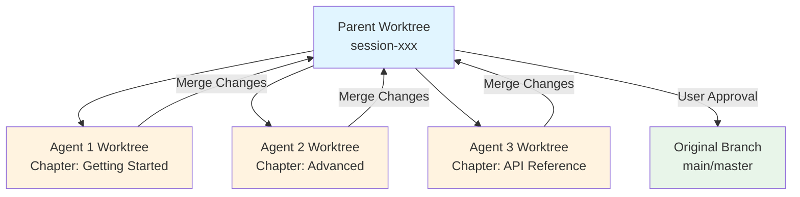

## Tutorial: Complete Documentation Workflow (30 Minutes)

This comprehensive tutorial walks you through setting up and running your first automated documentation workflow. By the end, you'll have a complete understanding of how Prodigy maintains documentation automatically.

### What You'll Accomplish

By the end of this tutorial, you'll have:

- Configured the automated documentation system for your project
- Run the workflow to detect and fix documentation drift
- Generated or updated an mdBook with accurate, code-grounded documentation
- Understood all three phases: setup, map, and reduce

!!! note "Prerequisites"
    Before starting, ensure you have [installed Prodigy](../installation.md) and the required tools:

    - Prodigy (via `cargo install prodigy`)
    - Claude Code CLI
    - mdBook (for building documentation)
    - Git (initialized repository)

    If you haven't installed these yet, visit the [Installation guide](../installation.md) first.

### Step 1: Initialize Your Book Structure

If you don't already have an mdBook, create one:

```bash
# Create book directory and initialize
mkdir book
cd book
mdbook init

# This creates:
# book/
#   ├── book.toml
#   └── src/
#       ├── SUMMARY.md
#       └── chapter_1.md
```

**Source**: Standard mdBook initialization pattern

### Step 2: Create Book Configuration

Create `.prodigy/book-config.json` at your project root with your project details:

```json
{
  "project_name": "YourProject",
  "project_type": "cli_tool",
  "book_dir": "book",
  "book_src": "book/src",
  "book_build_dir": "book/book",
  "analysis_targets": [
    {
      "area": "workflow_basics",
      "source_files": [
        "src/config/workflow.rs",
        "src/cook/workflow/executor.rs"
      ],
      "feature_categories": [
        "structure",
        "execution_model",
        "commit_tracking"
      ]
    }
  ],
  "chapter_file": "workflows/data/your-project-chapters.json",
  "custom_analysis": {
    "include_examples": true,
    "include_best_practices": true,
    "include_troubleshooting": true
  }
}
```

**Source**: Extracted from `.prodigy/book-config.json` structure (lines 1-219)

**Key Fields Explained**:
- `project_name` - Display name for your project
- `book_dir` - Root directory for your mdBook
- `analysis_targets` - Areas of your codebase to analyze for documentation
  - `area` - Logical grouping name
  - `source_files` - Files to analyze for this area
  - `feature_categories` - Types of features to extract
- `chapter_file` - Path to chapter definitions JSON

### Step 3: Define Chapter Structure

Create `workflows/data/your-project-chapters.json` to define your documentation structure:

```json
{
  "chapters": [
    {
      "id": "getting-started",
      "title": "Getting Started",
      "file": "getting-started.md",
      "topics": ["Installation", "Quick Start"],
      "feature_mapping": ["installation", "basic_usage"],
      "validation": "Check getting started guide matches current setup"
    },
    {
      "id": "advanced",
      "title": "Advanced Features",
      "file": "advanced/index.md",
      "topics": ["Configuration", "API Reference"],
      "feature_mapping": ["configuration", "api"],
      "validation": "Verify advanced features are documented"
    }
  ]
}
```

**Source**: Based on `workflows/data/prodigy-chapters.json` structure pattern

### Step 4: Create the Workflow File

Create `workflows/book-docs-drift.yml`:

```yaml title="workflows/book-docs-drift.yml"
# Source: workflows/book-docs-drift.yml
name: your-project-book-docs-drift-detection
mode: mapreduce

env:
  PROJECT_NAME: "YourProject"
  PROJECT_CONFIG: ".prodigy/book-config.json"
  FEATURES_PATH: ".prodigy/book-analysis/features.json"
  BOOK_DIR: "book"
  ANALYSIS_DIR: ".prodigy/book-analysis"
  CHAPTERS_FILE: "workflows/data/your-project-chapters.json"
  MAX_PARALLEL: "3"

# Setup phase: Analyze codebase for feature coverage
setup:
  # Step 1: Create analysis directory
  - shell: "mkdir -p $ANALYSIS_DIR"

  # Step 2: Analyze codebase for workflow features
  - claude: "/prodigy-analyze-features-for-book --project $PROJECT_NAME --config $PROJECT_CONFIG"

  # Step 3: Detect documentation gaps and create missing chapters
  - claude: "/prodigy-detect-documentation-gaps --project $PROJECT_NAME --config $PROJECT_CONFIG --features $FEATURES_PATH --chapters $CHAPTERS_FILE --book-dir $BOOK_DIR"

  # Step 4: Analyze chapter sizes and structural complexity
  - claude: "/prodigy-analyze-chapter-structure --project $PROJECT_NAME --book-dir $BOOK_DIR --chapters $CHAPTERS_FILE --output $ANALYSIS_DIR/structure-report.json"

  # Step 5: Automatically split oversized chapters into subsections
  - claude: "/prodigy-split-oversized-chapters --project $PROJECT_NAME --chapters $CHAPTERS_FILE --book-dir $BOOK_DIR --structure-report $ANALYSIS_DIR/structure-report.json"
    commit_required: true

  # Step 6: Regenerate work items after structure changes
  - claude: "/prodigy-detect-documentation-gaps --project $PROJECT_NAME --config $PROJECT_CONFIG --features $FEATURES_PATH --chapters $CHAPTERS_FILE --book-dir $BOOK_DIR"

map:
  input: "${ANALYSIS_DIR}/flattened-items.json"
  json_path: "$[*]"

  agent_template:
    - claude: "/prodigy-analyze-subsection-drift --project $PROJECT_NAME --json '${item}' --features $FEATURES_PATH"
      commit_required: true

    - claude: "/prodigy-fix-subsection-drift --project $PROJECT_NAME --json '${item}'"
      commit_required: true
      validate:
        claude: "/prodigy-validate-doc-fix --project $PROJECT_NAME --json '${item}' --output .prodigy/validation-result.json"
        result_file: ".prodigy/validation-result.json"
        threshold: 100
        on_incomplete:
          claude: "/prodigy-complete-doc-fix --project $PROJECT_NAME --json '${item}' --gaps ${validation.gaps}"
          max_attempts: 3
          fail_workflow: false
          commit_required: true

  max_parallel: ${MAX_PARALLEL}

reduce:
  # Build the book to catch broken links or formatting errors
  - shell: "cd book && mdbook build"
    on_failure:
      claude: "/prodigy-fix-book-build-errors --project $PROJECT_NAME"
      commit_required: true

  # Holistic validation - detect cross-cutting issues map phase can't see
  - claude: "/prodigy-validate-book-holistically --project $PROJECT_NAME --book-dir $BOOK_DIR --output $ANALYSIS_DIR/validation.json --auto-fix true"
    commit_required: true

  # Clean up temporary analysis files
  - shell: "rm -rf ${ANALYSIS_DIR}/features.json ${ANALYSIS_DIR}/flattened-items.json ${ANALYSIS_DIR}/drift-*.json"
  - shell: "git add -A && git commit -m 'chore: remove temporary book analysis files' || true"

error_policy:
  on_item_failure: dlq
  continue_on_failure: true
  max_failures: 2
  error_collection: aggregate
```

!!! tip "Optional Merge Configuration"
    The workflow above relies on Prodigy's default merge behavior, which prompts you to merge changes back to your original branch. For custom merge workflows with validation and testing, you can add an optional `merge:` section:

    ```yaml
    merge:
      commands:
        - shell: "git fetch origin"
        - claude: "/prodigy-merge-master --project ${PROJECT_NAME}"
        - claude: "/prodigy-merge-worktree ${merge.source_branch} ${merge.target_branch}"
    ```

**Source**: Adapted from `workflows/book-docs-drift.yml`

### Step 5: Run the Workflow

Execute the documentation workflow:

```bash
# Run with verbose output to see progress
prodigy run workflows/book-docs-drift.yml -v
```

**What Happens During Execution**:

=== "Setup Phase"

    Runs in parent worktree to analyze codebase and prepare work items:

    ```
    ✓ Creating analysis directory
    ✓ Analyzing codebase features → .prodigy/book-analysis/features.json
    ✓ Detecting documentation gaps → .prodigy/book-analysis/flattened-items.json
    ✓ Analyzing chapter structure → .prodigy/book-analysis/structure-report.json
    ✓ Splitting oversized chapters into subsections
    ✓ Regenerating work items after structure changes
    ```

=== "Map Phase"

    Parallel agents, each in isolated worktree:

    ```
    Agent 1: Analyzing chapter 'Getting Started'
      ✓ Drift analysis complete → drift report
      ✓ Fixing outdated examples
      ✓ Validation: 100% complete
      ✓ Merged to parent worktree

    Agent 2: Analyzing chapter 'Advanced Features'
      ✓ Drift analysis complete → drift report
      ✓ Adding missing configuration docs
      ✓ Validation: 100% complete
      ✓ Merged to parent worktree
    ```

=== "Reduce Phase"

    Runs in parent worktree for final validation:

    ```
    ✓ Building book with mdbook
    ✓ Holistic validation of entire book
    ✓ Auto-fixing cross-cutting issues
    ✓ Cleaning up temporary files
    ✓ Ready to merge to original branch
    ```

**Source**: Execution flow based on MapReduce workflow phases in `workflows/book-docs-drift.yml`

### Step 6: Review and Merge Changes

After the workflow completes, you'll see:

```
Workflow completed successfully!

Merge session-abc123 to master? [Y/n]
```

Before merging, review the changes:

```bash
# Check what was modified
cd ~/.prodigy/worktrees/your-project/session-abc123/
git log --oneline
git diff master

# Review specific chapter changes
git show HEAD:book/src/getting-started.md
```

Type `Y` to merge changes back to your original branch.

### Step 7: Verify the Updated Documentation

After merging, view your updated documentation:

```bash
# Build and serve locally
cd book
mdbook serve --open

# Your browser opens to http://localhost:3000
# Navigate through chapters to see updated content
```

**Expected Results**:
- ✓ All code examples reference actual source files
- ✓ Configuration examples match your codebase types
- ✓ API documentation reflects current function signatures
- ✓ Outdated sections updated or removed
- ✓ Cross-references between chapters are valid

### Understanding the Workflow Phases

The automated documentation workflow uses Prodigy's MapReduce pattern with three phases:

```mermaid
graph LR
    subgraph Setup["Setup Phase"]
        direction LR
        S1[Analyze Codebase] --> S2[Detect Gaps]
        S2 --> S3[Split Chapters]
        S3 --> S4[Generate Work Items]
    end

    subgraph Map["Map Phase (Parallel)"]
        direction TB
        M1["Agent 1<br/>Chapter A"]
        M2["Agent 2<br/>Chapter B"]
        M3["Agent N<br/>Chapter N"]
    end

    subgraph Reduce["Reduce Phase"]
        direction LR
        R1[Build Book] --> R2[Holistic Validation]
        R2 --> R3[Cleanup]
    end

    Setup --> Map
    Map --> Reduce
    Reduce --> Complete[Ready to Merge]

    style Setup fill:#e1f5ff
    style Map fill:#fff3e0
    style Reduce fill:#f3e5f5
    style Complete fill:#e8f5e9
```



**Figure**: The three-phase documentation workflow—setup prepares work items, map processes chapters in parallel, reduce validates the complete book.

#### Setup Phase

**Purpose**: Analyze your codebase, optimize chapter structure, and prepare work items

**Commands**:

1. `mkdir -p $ANALYSIS_DIR` - Create temporary analysis directory
2. `/prodigy-analyze-features-for-book` - Extract features from source files into features.json
3. `/prodigy-detect-documentation-gaps` - Compare features to chapters, create initial flattened-items.json
4. `/prodigy-analyze-chapter-structure` - Analyze chapter sizes and structural complexity, generate structure-report.json with recommendations
5. `/prodigy-split-oversized-chapters` - Automatically split large chapters into manageable subsections (runs before map phase so agents process optimally-sized chapters)
6. `/prodigy-detect-documentation-gaps` - Regenerate flattened-items.json to include newly created subsections

!!! info "Why Split Chapters?"
    Large chapters are harder for individual agents to process effectively. By splitting them into focused subsections during setup, each agent handles a smaller, well-defined scope. This improves both quality and parallelism.

**Output**: JSON file with list of chapters/subsections to process

**Source**: Setup phase from `workflows/book-docs-drift.yml:24-49`

#### Map Phase

**Purpose**: Process each chapter/subsection in parallel to detect and fix drift

**For each chapter**:

1. `/prodigy-analyze-subsection-drift` - Compare chapter to codebase, identify outdated/missing content
2. `/prodigy-fix-subsection-drift` - Update markdown file with accurate, grounded examples
3. Validation - Ensure documentation meets quality standards (100% threshold)
4. Gap filling - If validation fails, run completion attempts (max 3)

!!! example "Validation Flow"
    Each chapter goes through: **Analyze → Fix → Validate → Complete (if needed)**

    If validation fails, the `on_incomplete` handler runs up to 3 times to address gaps before moving on.

**Parallelism**: Configured via `max_parallel: 3` - three chapters processed simultaneously

**Isolation**: Each chapter processed in its own git worktree, merged back to parent automatically



**Figure**: Worktree isolation—each agent works in its own worktree, merging changes back to the parent before final user-approved merge.

**Source**: Map phase from `workflows/book-docs-drift.yml:51-74`

#### Reduce Phase

**Purpose**: Validate the complete book holistically and clean up

**Commands**:

1. `mdbook build` - Compile the book to catch broken links or formatting errors
2. `/prodigy-fix-book-build-errors` - Fix any build errors (only runs if build fails)
3. `/prodigy-validate-book-holistically` - Detect and auto-fix cross-cutting issues that individual agents can't see (e.g., inconsistent terminology, duplicate content, broken cross-references)
4. Cleanup temporary analysis files (features.json, flattened-items.json, drift reports)

!!! tip "Holistic Validation"
    The map phase processes chapters in isolation, so some issues only become visible when viewing the book as a whole. The holistic validation step catches:

    - Inconsistent terminology across chapters
    - Duplicate explanations of the same concept
    - Missing or broken cross-references
    - Navigation structure issues

**Source**: Reduce phase from `workflows/book-docs-drift.yml:77-91`

### Customization Tips

**Adjust Parallelism**:
```yaml
env:
  MAX_PARALLEL: "5"  # Process 5 chapters at once (default: 3)
```

**Focus on Specific Areas**:
Edit `.prodigy/book-config.json` to analyze only certain parts of your codebase:
```json
{
  "analysis_targets": [
    {
      "area": "api",
      "source_files": ["src/api/**/*.rs"],
      "feature_categories": ["endpoints", "authentication"]
    }
  ]
}
```

**Change Validation Threshold**:
```yaml
validate:
  threshold: 95  # Allow 95% instead of 100%
```

### Troubleshooting

??? warning "Claude command not found"
    **Cause**: Claude Code CLI is not installed or not in your PATH.

    **Solution**:
    ```bash
    # Verify Claude CLI is installed
    claude --version

    # If not found, install it following Claude Code documentation
    ```

??? warning "features.json not generated"
    **Cause**: Setup phase failed to analyze codebase.

    **Solution**:

    1. Check that `source_files` in book-config.json exist and are valid paths
    2. Run with `-vv` for detailed logs: `prodigy run workflows/book-docs-drift.yml -vv`
    3. Review the output for specific file access errors

??? warning "mdbook build fails with broken links"
    **Cause**: Cross-references to non-existent chapters.

    **Solution**: The workflow automatically fixes this in the reduce phase via `/prodigy-fix-book-build-errors`.

    For manual debugging:
    ```bash
    # Check SUMMARY.md for invalid links
    cat book/src/SUMMARY.md | grep -E '\[.*\]\(.*\.md\)'
    ```

??? warning "Validation threshold not met"
    **Cause**: Documentation doesn't meet 100% quality standard after all attempts.

    **Solution**:

    1. The `on_incomplete` handler automatically attempts to complete gaps (max 3 attempts)
    2. If still incomplete, review the validation results:
       ```bash
       cat .prodigy/validation-result.json | jq '.gaps'
       ```
    3. Consider lowering the threshold temporarily or manually addressing complex gaps

### Next Steps

Now that you have automated documentation working, explore:

- **[Understanding the Workflow](understanding-the-workflow.md)** - Deep dive into how the workflow operates
- **[GitHub Actions Integration](github-actions-integration.md)** - Automate documentation updates on every commit
- **[Troubleshooting](troubleshooting.md)** - Solutions to common problems

### What You've Learned

✓ How to configure automated documentation for any project
✓ The structure of a MapReduce documentation workflow
✓ How setup/map/reduce phases process your codebase
✓ How to review and merge documentation updates
✓ Basic troubleshooting techniques

### Time Investment Breakdown

- Prerequisites setup: 5-10 minutes (one-time)
- Configuration files: 10 minutes
- First workflow run: 5-10 minutes (depending on project size)
- Review and merge: 5 minutes

**Total: 25-35 minutes** for your first complete run
