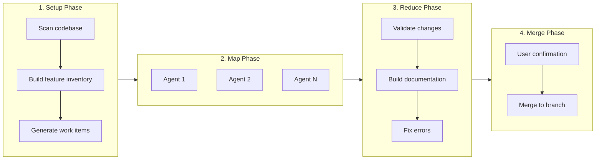
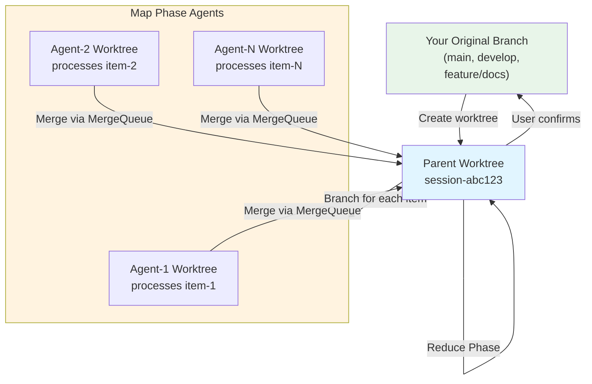
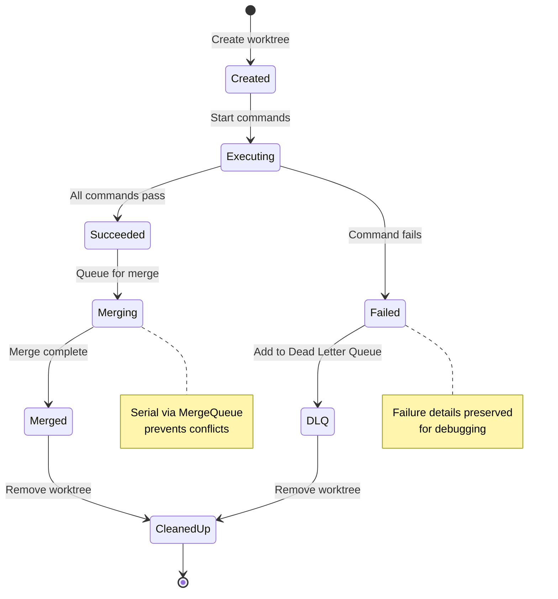

## Understanding the Workflow

The automated documentation workflow uses a MapReduce architecture to process documentation in parallel, ensuring efficiency and isolation. This section explains how the workflow phases execute, how worktrees provide isolation, and how the system ensures quality.

### Four-Phase Execution Model

The documentation workflow consists of four sequential phases, each with a specific responsibility:



#### 1. Setup Phase (Feature Analysis)

**Purpose**: Analyze the codebase and prepare work items for parallel processing.

**What it does**:
- Scans source code to build a complete feature inventory
- Compares existing documentation against implementation to detect gaps
- Creates missing chapter and subsection placeholder files
- Generates a JSON file containing work items for the map phase

**Source**: `workflows/book-docs-drift.yml:24-34`

**Example output**: `.prodigy/book-analysis/doc-items.json` containing:
```json
[
  {
    "type": "subsection",
    "id": "checkpoint-and-resume",
    "parent_chapter_id": "mapreduce",
    "file": "book/src/mapreduce/checkpoint-and-resume.md",
    "feature_mapping": ["mapreduce.checkpoint", "mapreduce.resume"],
    "topics": ["Checkpoint behavior", "Resume strategies"]
  }
]
```

#### 2. Map Phase (Parallel Processing)

**Purpose**: Process each documentation item concurrently in isolated environments.

**What it does**:
- Distributes work items across multiple parallel agents (default: 3 concurrent)
- Each agent runs in an isolated git worktree (child of the parent worktree)
- For each documentation item:
  - Analyzes drift between documentation and implementation
  - Searches codebase for real examples and type definitions
  - Fixes identified issues with validated, code-grounded content
  - Commits changes to the agent's worktree
- Failed items automatically added to Dead Letter Queue (DLQ) for retry
- Successful agents merge their changes back to the parent worktree

**Source**: `workflows/book-docs-drift.yml:37-59`

!!! tip "Tuning Parallelism"
    Start with 3-5 concurrent agents and monitor system resources. Higher parallelism (`max_parallel: 10+`) can speed up processing but may exhaust memory or file handles on constrained systems.

**Parallel execution control** (from `src/cook/execution/mapreduce/coordination/executor.rs:877-920`):
```rust
// Source: src/cook/execution/mapreduce/coordination/executor.rs:900
// Create semaphore for parallel control
let semaphore = Arc::new(Semaphore::new(max_parallel));

// Spawn parallel agents for each work item
let agent_futures: Vec<_> = work_items
    .into_iter()
    .enumerate()
    .map(|(index, item)| {
        let sem = Arc::clone(&semaphore);
        tokio::spawn(async move {
            let _permit = sem.acquire().await?;  // Wait for slot
            execute_agent_for_item(...).await
        })
    })
    .collect();
```

#### 3. Reduce Phase (Validation)

**Purpose**: Validate that all documentation changes work together correctly.

**What it does**:
- Rebuilds the entire book using `mdbook build`
- Checks for broken links between chapters and subsections
- Detects any compilation errors or missing references
- Fixes build errors if found (using Claude)
- Cleans up temporary analysis files

**Source**: `workflows/book-docs-drift.yml:62-82`

**Variable context** (from `src/cook/execution/mapreduce/coordination/executor.rs:1537-1565`):
```rust
// Source: src/cook/execution/mapreduce/coordination/executor.rs:1552-1562
// Reduce phase has access to map results
context.set("map.successful", serde_json::json!(summary.successful));
context.set("map.failed", serde_json::json!(summary.failed));
context.set("map.total", serde_json::json!(summary.total));
context.set("map.results", results_value);  // Full agent results
```

#### 4. Merge Phase (Integration)

**Purpose**: Integrate validated changes back to your original branch.

**What it does**:
- Prompts user for confirmation to merge
- Merges parent worktree changes to the branch you started from
- Uses Claude to resolve any merge conflicts
- Preserves your working tree state throughout

**Source**: `workflows/book-docs-drift.yml:93-100`

!!! note "Worktree Isolation"
    All workflow phases execute in isolated git worktrees using a parent/child architecture. A single parent worktree hosts setup, reduce, and merge phases, while each map agent runs in a child worktree branched from the parent. Agents automatically merge back to the parent upon completion. The parent is merged to the original branch only with user confirmation at the end. This isolation ensures the main repository remains untouched during execution (Spec 127).

### Worktree Architecture

The workflow uses a sophisticated parent/child worktree hierarchy to achieve complete isolation:



**Source**: `src/worktree/manager.rs`, `src/cook/execution/mapreduce/resources/worktree.rs`

#### Isolation Guarantees

1. **Setup Phase Isolation**:
   - Executes in parent worktree
   - All file modifications occur in worktree, not main repo
   - Git commits created in worktree context

2. **Map Phase Isolation**:
   - Each agent runs in its own child worktree branched from parent
   - No cross-contamination between agents
   - Independent failure isolation (agent failures don't affect siblings)
   - Automatic merge back to parent worktree after success

3. **Reduce Phase Isolation**:
   - Executes in parent worktree with aggregated agent results
   - Continues isolation guarantee from setup

4. **Final Merge**:
   - User confirmation required before merging to original branch
   - Main repository never modified until user approves
   - Custom merge workflows supported (Spec 117)

**Branch tracking** (Spec 110): The parent worktree tracks whatever branch you were on when you started the workflow. This is stored as `original_branch` in the worktree state, ensuring the final merge targets the correct branch.

### Execution Model

The MapReduce coordinator orchestrates parallel execution with precise control over resources and failures.

**Source**: `src/cook/execution/mapreduce/coordination/executor.rs:210-275`

#### Work Item Distribution

Work items are loaded from the setup phase output and distributed to agents:

```rust
pub async fn execute_map_phase_internal(
    &self,
    map_phase: MapPhase,
    work_items: Vec<Value>,
    env: &ExecutionEnvironment,
) -> MapReduceResult<Vec<AgentResult>> {
    let total_items = work_items.len();
    let max_parallel = map_phase.config.max_parallel.min(total_items);

    // Create semaphore to control concurrency
    let semaphore = Arc::new(Semaphore::new(max_parallel));

    // Process items in parallel...
}
```

**Key features**:
- Semaphore-based concurrency control prevents resource exhaustion
- Tokio async tasks enable efficient parallel execution
- Automatic retry count tracking for failed items
- DLQ integration for failure recovery

#### Agent Lifecycle

Each agent follows a strict lifecycle managed by the `AgentLifecycleManager`:

**Source**: `src/cook/execution/mapreduce/agent/lifecycle.rs`

```rust
#[async_trait]
pub trait AgentLifecycleManager: Send + Sync {
    async fn create_agent(&self, config: AgentConfig, commands: Vec<WorkflowStep>)
        -> LifecycleResult<AgentHandle>;

    async fn cleanup_agent(&self, handle: AgentHandle)
        -> LifecycleResult<()>;

    async fn merge_agent_to_parent(&self, agent_branch: &str, env: &ExecutionEnvironment)
        -> LifecycleResult<()>;
}
```

**Lifecycle stages**:



1. **Create**: Agent worktree created from parent worktree
2. **Execute**: Commands run in agent worktree with variable interpolation
3. **Merge**: Successful agents merge to parent via `MergeQueue` (serial)
4. **Cleanup**: Worktree removed (failures tracked in orphaned registry, Spec 136)

#### Result Collection and Aggregation

Agent results are collected and aggregated for the reduce phase:

**Source**: `src/cook/execution/mapreduce/agent/types.rs:45-79`

```rust
// Source: src/cook/execution/mapreduce/agent/types.rs:45-79
pub struct AgentResult {
    pub item_id: String,
    pub status: AgentStatus,
    pub output: Option<String>,
    pub commits: Vec<String>,
    pub files_modified: Vec<String>,
    pub duration: Duration,
    pub error: Option<String>,
    pub worktree_path: Option<PathBuf>,
    pub branch_name: Option<String>,
    pub worktree_session_id: Option<String>,  // Worktree session ID for cleanup tracking
    pub json_log_location: Option<String>,
    pub cleanup_status: Option<CleanupStatus>,
}
```

**Aggregation summary** (`src/cook/execution/mapreduce/aggregation/mod.rs`):
```rust
pub struct AggregationSummary {
    pub successful: usize,
    pub failed: usize,
    pub total: usize,
    pub avg_duration_secs: f64,
    pub total_duration_secs: f64,
}
```

#### Error Handling and Recovery

!!! warning "Check DLQ After Execution"
    Always check the Dead Letter Queue after MapReduce workflows complete. Failed items contain diagnostic information (including Claude JSON logs) essential for debugging.

**Dead Letter Queue (DLQ)**: Failed work items are automatically added to the DLQ for later retry.

**Orphaned Worktree Tracking** (Spec 136): If agent cleanup fails, the worktree path is registered as orphaned. Use `prodigy worktree clean-orphaned <job_id>` to clean up after resolving issues.

**On-Failure Handlers**: Workflows can define custom error recovery commands that execute when agents fail.

**Source**: `src/cook/execution/mapreduce/coordination/executor.rs:1567-1650`

### Quality Guarantees

The workflow ensures documentation quality through multiple validation mechanisms:

#### Code-Grounded Examples

**All examples are extracted from actual implementation**:
- Type definitions verified from source files
- Field names match struct/class definitions exactly
- Enum variants validated against source code
- CLI syntax verified from argument parser definitions
- Examples include source file references (e.g., `src/config/retry.rs:45`)

**Source**: Documented in parent chapter at `index.md:126-134`

#### Validation Checkpoints

**Each phase includes validation**:
- Setup: Verifies feature inventory is complete
- Map: Each agent validates fixes meet minimum content requirements
- Reduce: Full book build ensures no broken references
- Merge: User confirmation before final integration

!!! example "Automatic Retry"
    ```bash
    # Retry all failed items for a job
    prodigy dlq retry <job_id>

    # Retry with custom parallelism
    prodigy dlq retry <job_id> --max-parallel 5
    ```

#### Build Verification

The reduce phase rebuilds the entire book:
```yaml
reduce:
  - shell: "mdbook build book"
  - claude: "/fix-build-errors"
```

This catches:
- Broken links between chapters
- Missing cross-references
- Invalid markdown syntax
- Compilation errors

**Source**: DLQ retry implementation in `src/cook/execution/mapreduce/dlq/`

### Variable Interpolation

The workflow uses variable interpolation to pass data between phases:

#### Setup Phase Variables
- Output captured to files (e.g., `doc-items.json`)
- Variables available to map phase

#### Map Phase Variables
- `${item.field}` - Access work item fields
- `${item.id}` - Work item identifier
- `${item.file}` - Documentation file path
- Environment variables from workflow `env:` block

**Source**: `src/cook/execution/mapreduce/coordination/executor.rs:1132-1158`

#### Reduce Phase Variables
- `${map.successful}` - Count of successful agents
- `${map.failed}` - Count of failed agents
- `${map.total}` - Total work items
- `${map.results}` - Full agent results as JSON

**Source**: `src/cook/execution/mapreduce/coordination/executor.rs:1537-1565`

### Performance Characteristics

**Parallel execution**: The map phase processes multiple items concurrently:
- Default: 3 concurrent agents
- Configurable via `max_parallel` in workflow YAML
- Optimal parallelism calculated based on work item count

**Resource management**:
- Semaphore prevents resource exhaustion
- Each agent isolated in separate worktree
- Serial merge queue prevents conflicts

**Scalability**: Successfully processes large documentation sets (tested with 50+ chapters).
