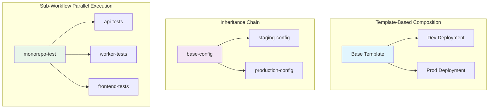
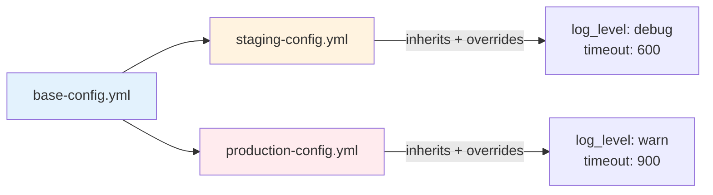
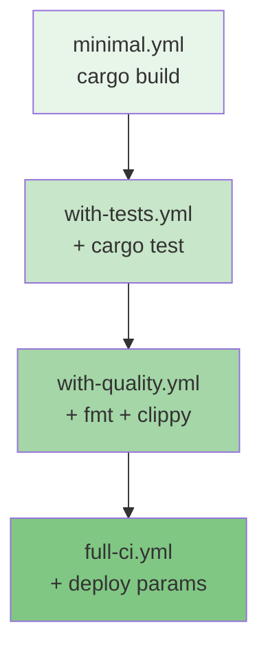

## Complete Examples

This section provides end-to-end examples demonstrating multiple composition features working together.



!!! info "Template Syntax Requirements"
    The `WorkflowTemplate` struct requires both `name` and `source` fields. The `name` identifies the template instance in logs and debugging, while `source` specifies where to load the template from (registry name or file path).

    **Source**: `WorkflowTemplate` struct definition in `src/cook/workflow/composition/mod.rs:69-83`

### Example 1: Multi-Environment CI/CD Pipeline

This example uses templates, parameters, and inheritance for environment-specific deployments.

=== "Template Definition"

    **base-ci-template.yml** (template in registry):
    ```yaml title="base-ci-template.yml"
    # Source: Template definition structure from src/cook/workflow/composition/mod.rs:75-129
    name: ci-pipeline-template
    mode: standard

    parameters:
      required:
        - name: environment
          type: string
          description: "Deployment environment"
          validation: "matches('^(dev|staging|prod)$')"

      optional:
        - name: replicas
          type: number
          description: "Number of service replicas"
          default: 1

        - name: run_tests
          type: boolean
          description: "Whether to run test suite"
          default: true

    defaults:
      timeout: 600
      log_level: "info"

    commands:
      - shell: "echo Deploying to ${environment} with ${replicas} replicas"
      - shell: "cargo build --release"
      - shell: |
          if [ "${run_tests}" = "true" ]; then
            cargo test --release
          fi
      - shell: "kubectl apply -f k8s/${environment}/deployment.yml"
      - shell: "kubectl scale deployment app --replicas=${replicas}"
    ```

=== "Dev Deployment"

    **dev-deployment.yml**:
    ```yaml title="dev-deployment.yml"
    # Source: Template usage pattern from src/cook/workflow/composition/mod.rs:67-83
    name: dev-deployment
    mode: standard

    template:
      name: dev-ci-instance  # Required: Identifies this template instance
      source: "ci-pipeline-template"  # Registry name lookup
      with:
        environment: "dev"
        replicas: 1
        run_tests: false  # Skip tests in dev for speed
    ```

=== "Prod Deployment"

    **prod-deployment.yml**:
    ```yaml title="prod-deployment.yml"
    name: prod-deployment
    mode: standard

    template:
      name: prod-ci-instance
      source: "ci-pipeline-template"  # Registry name
      with:
        environment: "prod"
        replicas: 5
        run_tests: true  # Always test before prod

    # Add production-specific safeguards
    commands:
      - shell: "verify-release-notes.sh"
      - shell: "notify-team 'Production deployment starting'"
    ```

!!! tip "Template Source Types"
    The `source` field accepts:

    - **Registry name** (string): `"ci-pipeline-template"` - Looks up in `~/.prodigy/templates/` or `.prodigy/templates/`
    - **File path**: `{ file: "templates/workflow.yml" }` - Loads from specified path
    - **URL** (planned): `"https://example.com/template.yml"` - Not yet implemented

    **Source**: `TemplateSource` enum in `src/cook/workflow/composition/mod.rs:86-95`

### Example 2: Modular Monorepo Testing

Uses sub-workflows and imports for testing multiple services in parallel.

**shared/common-setup.yml**:
```yaml title="shared/common-setup.yml"
name: common-setup

commands:
  - shell: "git fetch origin"
  - shell: "npm install"
  - shell: "cargo build"
```

**monorepo-test.yml**:
```yaml title="monorepo-test.yml"
# Source: Sub-workflows use HashMap, not array
# See src/cook/workflow/composition/mod.rs:49 and
# src/cook/workflow/composition/sub_workflow.rs:14-45
name: monorepo-test
mode: standard

imports:
  - path: "shared/common-setup.yml"

workflows:
  # Test all services in parallel using workflow map (not array)
  api-tests:
    source: "services/api/test.yml"
    working_dir: "./services/api"
    parallel: true
    outputs:
      - "coverage"
      - "test_count"

  worker-tests:
    source: "services/worker/test.yml"
    working_dir: "./services/worker"
    parallel: true
    outputs:
      - "coverage"
      - "test_count"

  frontend-tests:
    source: "apps/frontend/test.yml"
    working_dir: "./apps/frontend"
    parallel: true
    outputs:
      - "coverage"
      - "test_count"

commands:
  - shell: |
      echo "Test Results:"
      echo "  API: ${api-tests.test_count} tests, ${api-tests.coverage}% coverage"
      echo "  Worker: ${worker-tests.test_count} tests, ${worker-tests.coverage}% coverage"
      echo "  Frontend: ${frontend-tests.test_count} tests, ${frontend-tests.coverage}% coverage"
  - shell: "generate-combined-report.sh"
```

!!! warning "Sub-Workflow Status"
    Sub-workflow execution is not yet implemented (executor is a placeholder). The types are defined and parsing works, but actual parallel execution requires implementation.

    See `src/cook/workflow/composition/sub_workflow.rs:233-239` for the placeholder.

### Example 3: Layered Configuration with Extends

Uses inheritance to create environment-specific variations of a base workflow.



=== "Base Config"

    **base-config.yml**:
    ```yaml title="base-config.yml"
    name: base-config
    mode: standard

    defaults:
      log_level: "info"
      timeout: 300

    env:
      APP_NAME: "my-service"
      DATABASE_POOL_SIZE: "10"

    commands:
      - shell: "cargo fmt --check"
      - shell: "cargo clippy"
      - shell: "cargo test"
      - shell: "cargo build"
    ```

=== "Staging Config"

    **staging-config.yml**:
    ```yaml title="staging-config.yml"
    name: staging-config
    extends: "base-config.yml"

    defaults:
      log_level: "debug"
      timeout: 600

    env:
      DATABASE_POOL_SIZE: "20"
      ENABLE_DEBUG_ENDPOINTS: "true"

    # Inherits all commands from base, adds staging-specific
    commands:
      - shell: "run-integration-tests.sh"
      - shell: "deploy-to-staging.sh"
    ```

=== "Production Config"

    **production-config.yml**:
    ```yaml title="production-config.yml"
    name: production-config
    extends: "base-config.yml"

    defaults:
      log_level: "warn"
      timeout: 900

    env:
      DATABASE_POOL_SIZE: "50"
      ENABLE_MONITORING: "true"
      RATE_LIMIT_ENABLED: "true"

    commands:
      - shell: "verify-security-scan.sh"
      - shell: "cargo build --release"
      - shell: "run-smoke-tests.sh"
      - shell: "deploy-to-production.sh"
      - shell: "notify-deployment-complete.sh"
    ```

### Example 4: Complex Composition with Multiple Features

Combines imports, extends, template, parameters, and sub-workflows.

!!! note "Variable Interpolation in Sub-Workflow Paths"
    Sub-workflow source paths with variable interpolation (e.g., `workflows/${language}/lint.yml`) are validated at composition time. Paths starting with `${` skip validation to allow runtime resolution.

    **Source**: Validation logic in `src/cook/workflow/composition/registry.rs:199-208`

**templates/microservice-ci.yml**:
```yaml title="templates/microservice-ci.yml"
# Source: Complex template combining multiple composition features
name: microservice-ci-template
mode: standard

parameters:
  required:
    - name: service_name
      type: string
      description: "Name of the microservice"

    - name: language
      type: string
      description: "Programming language"
      validation: "matches('^(rust|typescript|python)$')"

  optional:
    - name: test_timeout
      type: number
      description: "Test timeout in seconds"
      default: 300

defaults:
  coverage_threshold: "80"

workflows:
  lint:
    source: "workflows/${language}/lint.yml"  # Variable paths skip validation
    working_dir: "./services/${service_name}"

  test:
    source: "workflows/${language}/test.yml"
    working_dir: "./services/${service_name}"
    timeout: "${test_timeout}"
    outputs:
      - "coverage"

commands:
  - shell: "echo Testing ${service_name} (${language})"
  - shell: |
      if [ "${test.coverage}" -lt "${coverage_threshold}" ]; then
        echo "Coverage ${test.coverage}% below threshold ${coverage_threshold}%"
        exit 1
      fi
```

**service-api-ci.yml** (uses the template):
```yaml title="service-api-ci.yml"
name: api-service-ci
mode: standard

imports:
  - path: "shared/docker-utils.yml"

template:
  name: api-microservice-ci  # Required instance name
  source: "templates/microservice-ci.yml"  # File path source
  with:
    service_name: "api"
    language: "rust"
    test_timeout: 600

commands:
  - shell: "docker build -t api:latest ./services/api"
  - shell: "docker push api:latest"
```

### Example 5: Workflow Registry Pattern

Demonstrates using a template registry for standardized workflows across teams.

**Setup Registry**:

Templates can be stored in two locations:

| Location | Path | Scope |
|----------|------|-------|
| Global | `~/.prodigy/templates/` | Available to all projects |
| Local | `.prodigy/templates/` | Project-specific |

```bash
# Global templates (one-time setup)
mkdir -p ~/.prodigy/templates
cp standard-ci.yml ~/.prodigy/templates/
cp security-scan.yml ~/.prodigy/templates/

# Or use project-local templates
mkdir -p .prodigy/templates
cp deployment.yml .prodigy/templates/
```

**Source**: `TemplateRegistry` and `FileTemplateStorage` in `src/cook/workflow/composition/registry.rs`

**team-workflow.yml**:
```yaml title="team-workflow.yml"
name: team-workflow
mode: standard

# Use registry template with required name field
template:
  name: team-standard-ci
  source: "standard-ci"  # Registry name lookup
  with:
    project_type: "rust"

# Import additional registry workflows
imports:
  - path: "~/.prodigy/templates/security-scan.yml"

# Extend with team-specific configuration
commands:
  - shell: "run-team-specific-tests.sh"
```

### Example 6: Progressive Composition

Builds complexity through layers of composition.



=== "Layer 1 - Base"

    **minimal.yml**:
    ```yaml title="minimal.yml"
    name: minimal
    mode: standard
    defaults:
      timeout: 300
    commands:
      - shell: "cargo build"
    ```

=== "Layer 2 - Add Testing"

    **with-tests.yml**:
    ```yaml title="with-tests.yml"
    name: with-tests
    mode: standard
    extends: "minimal.yml"
    commands:
      - shell: "cargo test"
    ```

=== "Layer 3 - Add Linting"

    **with-quality.yml**:
    ```yaml title="with-quality.yml"
    name: with-quality
    mode: standard
    extends: "with-tests.yml"
    commands:
      - shell: "cargo fmt --check"
      - shell: "cargo clippy"
    ```

=== "Layer 4 - Full CI"

    **full-ci.yml**:
    ```yaml title="full-ci.yml"
    name: full-ci
    mode: standard
    extends: "with-quality.yml"

    parameters:
      required:
        - name: deploy_env
          type: string
          description: "Deployment environment"

    commands:
      - shell: "cargo build --release"
      - shell: "deploy-to-${deploy_env}.sh"
    ```

### Running the Examples

```bash
# Example 1: Template-based deployment
prodigy run dev-deployment.yml
prodigy run prod-deployment.yml --param replicas=10

# Example 2: Monorepo testing
prodigy run monorepo-test.yml

# Example 3: Environment-specific configs
prodigy run staging-config.yml
prodigy run production-config.yml

# Example 4: Complex composition
prodigy run service-api-ci.yml

# Example 5: Registry templates
prodigy run team-workflow.yml

# Example 6: Progressive composition
prodigy run full-ci.yml --param deploy_env=staging
```

!!! example "Expected Output"
    ```
    $ prodigy run dev-deployment.yml
    Loading template 'ci-pipeline-template' from registry...
    Applying parameters: environment=dev, replicas=1, run_tests=false
    Executing: echo Deploying to dev with 1 replicas
    Deploying to dev with 1 replicas
    Executing: cargo build --release
    ...
    ```
