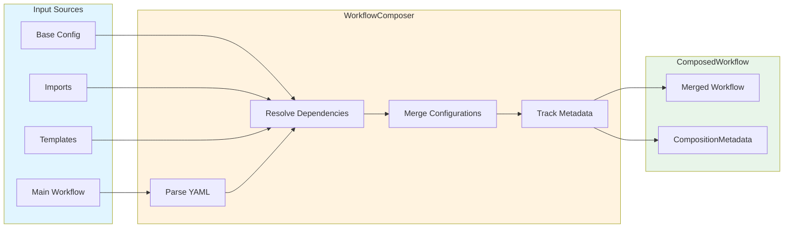
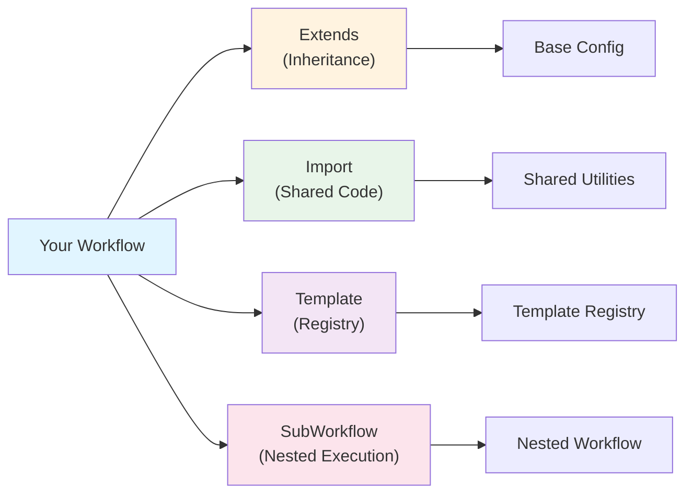

## Composition Metadata

Prodigy tracks metadata about workflow composition for debugging and dependency analysis. This metadata provides visibility into how workflows are composed, what dependencies exist, and when composition occurred.



**Figure**: Composition metadata is generated as the WorkflowComposer processes input sources, resolves dependencies, and merges configurations.

!!! info "Implementation Status"
    The composition metadata types and dependency tracking are fully implemented in the core composition system. These features are accessible programmatically via the WorkflowComposer API. CLI integration for viewing composition metadata in workflows is under development (Spec 131-133).

### CompositionMetadata Structure

Every composed workflow includes metadata tracking all composition operations:

**Source**: `src/cook/workflow/composition/mod.rs:153-170`

```rust
/// Metadata about workflow composition
#[derive(Debug, Clone, Serialize, Deserialize)]
pub struct CompositionMetadata {
    /// Source files involved in composition
    pub sources: Vec<PathBuf>, // (1)!

    /// Templates used
    pub templates: Vec<String>, // (2)!

    /// Parameters applied
    pub parameters: HashMap<String, Value>, // (3)!

    /// Composition timestamp
    pub composed_at: chrono::DateTime<chrono::Utc>, // (4)!

    /// Dependency graph
    pub dependencies: Vec<DependencyInfo>, // (5)!
}
```

1. File paths of all workflow files involved in composition (as `PathBuf` objects)
2. Template names/sources used during composition
3. Final parameter values applied to the workflow (as `serde_json::Value`)
4. ISO 8601 timestamp when composition occurred (UTC timezone)
5. Complete dependency graph with all imports, extends, templates, and sub-workflows

### Dependency Tracking

Each dependency includes detailed information:

**Source**: `src/cook/workflow/composition/mod.rs:172-183`

```rust
/// Information about workflow dependencies
#[derive(Debug, Clone, Serialize, Deserialize)]
pub struct DependencyInfo {
    /// Source of the dependency
    pub source: PathBuf, // (1)!

    /// Type of dependency
    pub dep_type: DependencyType, // (2)!

    /// Resolved path or name
    pub resolved: String, // (3)!
}
```

1. Source file path of the dependency (as `PathBuf`)
2. Type of dependency (Import, Extends, Template, or SubWorkflow)
3. Resolved file path or template name (as `String`)

### Dependency Types

Prodigy tracks four types of dependencies:



**Figure**: The four dependency types represent different ways workflows can reference external resources.

**Source**: `src/cook/workflow/composition/mod.rs:185-193`

```rust
/// Type of workflow dependency
#[derive(Debug, Clone, Serialize, Deserialize)]
#[serde(rename_all = "snake_case")]
pub enum DependencyType {
    Import,
    Extends,
    Template,
    SubWorkflow,
}
```

**Import Dependencies:**
```yaml
imports:
  - path: "shared/utilities.yml"

# Creates DependencyInfo:
# dep_type: DependencyType::Import
# source: PathBuf::from("shared/utilities.yml")
# resolved: "/full/path/to/shared/utilities.yml"
```

**Extends Dependencies:**
```yaml
extends: "base-config.yml"

# Creates DependencyInfo:
# dep_type: DependencyType::Extends
# source: PathBuf::from("base-config.yml")
# resolved: "/full/path/to/base-config.yml"
```

**Template Dependencies:**
```yaml
template:
  source:
    registry: "ci-pipeline"

# Creates DependencyInfo:
# dep_type: DependencyType::Template
# source: PathBuf::from("registry:ci-pipeline")
# resolved: "~/.prodigy/templates/ci-pipeline.yml"
```

**SubWorkflow Dependencies:**
```yaml
sub_workflows:
  - name: "tests"
    source: "workflows/test.yml"

# Creates DependencyInfo:
# dep_type: DependencyType::SubWorkflow
# source: PathBuf::from("workflows/test.yml")
# resolved: "/full/path/to/workflows/test.yml"
```

### Composition Example

This example shows a complete workflow with multiple dependencies and the resulting composition metadata:

=== "Workflow YAML"

    ```yaml title="main-workflow.yml"
    # Main workflow with composition features
    name: ci-pipeline

    extends: "base-config.yml"

    imports:
      - path: "shared/utilities.yml"

    template:
      source:
        registry: "ci-pipeline"

    parameters:
      definitions:
        environment:
          type: string
          required: true
        timeout:
          type: integer
          default: 600

    setup:
      - shell: "npm install"

    commands:
      - claude: "/run-tests"
    ```

=== "Resulting Metadata JSON"

    ```json
    {
      "sources": [
        "/path/to/main-workflow.yml",
        "/path/to/base-config.yml",
        "/path/to/shared/utilities.yml"
      ],
      "templates": [
        "registry:ci-pipeline"
      ],
      "parameters": {
        "environment": "production",
        "timeout": 600
      },
      "composed_at": "2025-01-11T20:00:00Z",
      "dependencies": [
        {
          "source": "base-config.yml",
          "dep_type": "extends",
          "resolved": "/path/to/base-config.yml"
        },
        {
          "source": "shared/utilities.yml",
          "dep_type": "import",
          "resolved": "/path/to/shared/utilities.yml"
        },
        {
          "source": "registry:ci-pipeline",
          "dep_type": "template",
          "resolved": "~/.prodigy/templates/ci-pipeline.yml"
        }
      ]
    }
    ```

=== "Rust Inspection"

    ```rust
    // Access the composed metadata
    let composed = composer.compose(
        Path::new("main-workflow.yml"),
        params
    ).await?;

    // Print summary
    println!("Workflow: {}", composed.workflow.name);
    println!("Composed at: {}", composed.metadata.composed_at);
    println!("Dependencies: {}", composed.metadata.dependencies.len());

    // Iterate dependencies
    for dep in &composed.metadata.dependencies {
        println!("  [{:?}] {} -> {}",
            dep.dep_type,
            dep.source.display(),
            dep.resolved
        );
    }
    ```

### Viewing Composition Metadata

!!! note "CLI Under Development"
    CLI commands for viewing composition metadata in workflow execution are under development. Currently, metadata can be accessed programmatically via the WorkflowComposer API (see [Programmatic Access](#programmatic-access) below).

**Future CLI Usage** (planned):
```bash
# Show composition metadata (planned feature)
prodigy run workflow.yml --dry-run --show-composition
```

**Expected Output:**
```
Composition Metadata:
  Composed at: 2025-01-11T20:00:00Z

  Sources (3):
    - /path/to/workflow.yml
    - /path/to/base-config.yml
    - /path/to/shared/utilities.yml

  Templates (1):
    - registry:ci-pipeline

  Dependencies (3):
    [Import] shared/utilities.yml -> /path/to/shared/utilities.yml
    [Extends] base-config.yml -> /path/to/base-config.yml
    [Template] registry:ci-pipeline -> ~/.prodigy/templates/ci-pipeline.yml

  Parameters (2):
    environment: "production"
    timeout: 600
```

### Programmatic Access

Access metadata in code using the WorkflowComposer API:

**Source**: `src/cook/workflow/composition/composer.rs:21-37`

```rust
use prodigy::cook::workflow::composition::{WorkflowComposer, TemplateRegistry};
use std::collections::HashMap;
use std::sync::Arc;
use std::path::Path;

// Create composer with template registry
let registry = Arc::new(TemplateRegistry::new());
let composer = WorkflowComposer::new(registry);

// Compose workflow with parameters
let params = HashMap::new();
let composed = composer.compose(Path::new("workflow.yml"), params).await?;

// Access metadata
let metadata = &composed.metadata;

// Inspect dependencies
for dep in &metadata.dependencies {
    println!("{:?}: {} -> {}",
        dep.dep_type,
        dep.source.display(),
        dep.resolved
    );
}

// Check composition timestamp
println!("Composed at: {}", metadata.composed_at);

// View final parameters
for (name, value) in &metadata.parameters {
    println!("Parameter {}: {:?}", name, value);
}

// List source files
println!("Sources:");
for source in &metadata.sources {
    println!("  - {}", source.display());
}

// List templates used
println!("Templates:");
for template in &metadata.templates {
    println!("  - {}", template);
}
```

**Real-World Example** (from `src/cook/workflow/composition/composer.rs:45-51`):

```rust
// Metadata is created during composition
let mut metadata = CompositionMetadata {
    sources: vec![source.to_path_buf()],
    templates: Vec::new(),
    parameters: params.clone(),
    composed_at: chrono::Utc::now(),
    dependencies: Vec::new(),
};
```

### Dependency Graph Visualization

Metadata enables dependency visualization:

```
workflow.yml
├─ [Extends] base-config.yml
│  └─ [Import] shared/setup.yml
├─ [Import] shared/utilities.yml
└─ [Template] registry:ci-pipeline
   └─ [SubWorkflow] workflows/test.yml
```

### Use Cases

!!! tip "When Metadata Is Most Valuable"
    Composition metadata is essential when debugging complex workflows with multiple inheritance levels or when auditing which configurations were applied during production runs.

**Debugging Composition Issues:**

- Verify which files were loaded
- Check parameter resolution order
- Identify circular dependencies
- Trace inheritance chains

**Dependency Analysis:**
- Find all workflows using a template
- Identify shared imports
- Map workflow relationships
- Audit composition complexity

**Change Impact Assessment:**
```bash
# Before changing base-config.yml, find all dependents
grep -r "extends.*base-config" workflows/

# View composition metadata programmatically
# (CLI integration for --show-composition is under development)
```

**Compliance and Auditing:**
- Track template versions used
- Record composition timestamps
- Document parameter sources
- Verify configuration origins

### Metadata in Composed Workflows

Composed workflows carry metadata through the composition process:

**Source**: `src/cook/workflow/composition/mod.rs:143-151`

```rust
// ComposedWorkflow structure
pub struct ComposedWorkflow {
    /// The composed workflow
    pub workflow: ComposableWorkflow,

    /// Metadata about the composition
    pub metadata: CompositionMetadata,
}

// Access metadata from composed workflow
let composed = composer.compose(source, params).await?;
println!("This workflow was composed from {} sources",
    composed.metadata.sources.len());
```

### Circular Dependency Detection

Metadata enables circular dependency detection across all dependency types:

=== "Simple Cycle"

    ```yaml
    # workflow-a.yml
    extends: "workflow-b.yml"

    # workflow-b.yml
    extends: "workflow-a.yml"
    ```

    **Error output:**
    ```
    Error: Circular dependency detected
      workflow-a.yml -> workflow-b.yml -> workflow-a.yml

    Dependency chain:
      1. workflow-a.yml (extends workflow-b.yml)
      2. workflow-b.yml (extends workflow-a.yml) <- Circular!
    ```

=== "Multi-File Cycle"

    ```yaml
    # main.yml
    extends: "base.yml"
    imports:
      - path: "shared/utils.yml"

    # base.yml
    imports:
      - path: "shared/config.yml"

    # shared/config.yml
    extends: "../main.yml"  # Creates cycle!
    ```

    **Error output:**
    ```
    Error: Circular dependency detected
      main.yml -> base.yml -> shared/config.yml -> main.yml

    Dependency chain:
      1. main.yml (extends base.yml)
      2. base.yml (imports shared/config.yml)
      3. shared/config.yml (extends ../main.yml) <- Circular!

    Suggestion: Remove the 'extends' in shared/config.yml
    ```

=== "Template Cycle"

    ```yaml
    # template-a.yml (in registry)
    template:
      source:
        registry: "template-b"

    # template-b.yml (in registry)
    template:
      source:
        registry: "template-a"
    ```

    **Error output:**
    ```
    Error: Circular dependency detected in template registry
      template-a -> template-b -> template-a

    Dependency chain:
      1. template-a (template template-b)
      2. template-b (template template-a) <- Circular!

    Note: Template cycles prevent registry loading
    ```

!!! warning "Diamond Dependencies"
    Diamond dependencies (where two paths lead to the same file) are allowed and handled correctly. Only true cycles cause errors:

    ```
    main.yml
    ├─ [Extends] base-a.yml ──┐
    │                         ├→ [Import] shared.yml  ✓ OK (not a cycle)
    └─ [Extends] base-b.yml ──┘
    ```

### Parameter Tracking

Metadata tracks final parameter values applied during composition:

```yaml
# workflow.yml
parameters:
  definitions:
    environment:
      type: string
      required: true
    timeout:
      type: integer
      default: 600
```

**Metadata captures:**
```rust
metadata.parameters = {
    "environment": "production",
    "timeout": 600,
}
```

The `parameters` field in `CompositionMetadata` stores the final resolved parameter values as a `HashMap<String, Value>`. This enables reproducibility and debugging of composed workflows.

### Caching and Performance

Composition metadata enables future caching optimizations:

- `composed_at` timestamp can be used for cache invalidation
- `sources` list enables dependency-based cache busting
- `dependencies` graph supports incremental composition
- `parameters` hash can detect identical compositions

!!! note "Planned Feature"
    Workflow caching is a planned feature. Currently, metadata is generated fresh on each composition.

### Data Structure Properties

CompositionMetadata uses standard Rust types for broad compatibility:

```rust
#[derive(Debug, Clone, Serialize, Deserialize)]
pub struct CompositionMetadata {
    // All fields use standard types
    pub sources: Vec<PathBuf>,           // Cloneable
    pub templates: Vec<String>,          // Cloneable
    pub parameters: HashMap<String, Value>,  // Cloneable
    pub composed_at: chrono::DateTime<chrono::Utc>,  // Copy
    pub dependencies: Vec<DependencyInfo>,   // Cloneable
}
```

The struct derives `Clone`, making it easy to share metadata across components without requiring explicit synchronization primitives.

### Related Topics

- [Template System](template-system.md) - Template caching and loading
- [Workflow Extension](workflow-extension-inheritance.md) - Inheritance tracking
