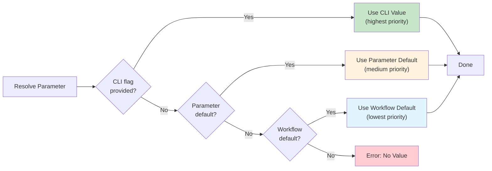

## Default Values

Set default parameter values and environment variables at the workflow level. Defaults reduce required parameters and simplify workflow usage by providing sensible fallback values.

!!! tip "When to Use Defaults"
    Use defaults for values that work in most cases but may need occasional overrides:

    - Development environment settings (`environment: "development"`)
    - Reasonable timeouts (`timeout: 300`)
    - Common log levels (`log_level: "info"`)
    - Standard retry counts (`retry_count: 3`)

### Basic Syntax

```yaml
name: my-workflow
mode: standard

defaults:
  timeout: 300
  retry_count: 3
  verbose: false
  environment: "development"
  log_level: "info"
```

### Defaults Field Structure

The `defaults` field is a HashMap<String, Value> that accepts any JSON-compatible values:

```yaml
defaults:
  # String values
  environment: "staging"        # (1)!
  log_level: "debug"

  # Number values
  timeout: 600                  # (2)!
  max_retries: 5

  # Boolean values
  dry_run: false                # (3)!
  enable_cache: true

  # Array values
  allowed_regions: ["us-west-2", "us-east-1"]  # (4)!

  # Object values
  database_config:              # (5)!
    host: "localhost"
    port: 5432
    pool_size: 10
```

1. **String values** - Used for configuration names, modes, and text settings
2. **Number values** - Used for timeouts, counts, and numeric thresholds
3. **Boolean values** - Enable/disable features and flags
4. **Array values** - Lists of allowed values, regions, or options
5. **Object values** - Nested configuration with multiple related settings

### Parameter Precedence

When multiple sources provide values for the same parameter, they are resolved in this order:



| Priority | Source | Description |
|----------|--------|-------------|
| 1 (highest) | CLI `--param` flags | Always override all other sources |
| 2 | Parameter `default` values | Defined in parameter definitions |
| 3 (lowest) | Workflow `defaults` values | Only used if parameter has no default |

!!! info "Precedence Rule"
    CLI flags always win. Parameter defaults override workflow defaults. Workflow defaults are the fallback when no other value is provided.

**Source**: Parameter precedence implemented in `src/cook/workflow/composition/composer.rs:245-254` and `src/cook/workflow/composer_integration.rs:68-72`

### Example with Precedence

```yaml
# workflow.yml
defaults:
  environment: "development"
  timeout: 300
  log_level: "info"

parameters:
  definitions:
    environment:
      type: String
      # No parameter default - uses workflow default "development"

    timeout:
      type: Number
      default: 600  # Parameter default overrides workflow default (600, not 300)

    log_level:
      type: String
      # No parameter default - uses workflow default "info"
```

**Behavior without CLI flags:**
```bash
# Uses: environment="development", timeout=600, log_level="info"
# Note: timeout uses parameter default (600), others use workflow defaults
prodigy run workflow.yml
```

**CLI override:**
```bash
# Final values: environment="production", timeout=900, log_level="debug"
# CLI flags override all defaults
prodigy run workflow.yml \
  --param environment=production \
  --param timeout=900 \
  --param log_level=debug
```

**Partial CLI override:**
```bash
# environment="production" (CLI), timeout=600 (param default), log_level="info" (workflow default)
prodigy run workflow.yml --param environment=production
```

### CLI Parameter Overrides

Defaults can be overridden using CLI `--param` flags, providing flexibility for different execution contexts:

```yaml
# workflow.yml
defaults:
  timeout: 300
  environment: "development"
  log_level: "info"
```

**Override specific defaults:**
```bash
# Override timeout to 900 seconds for long-running operation
prodigy run workflow.yml --param timeout=900

# Change environment to production
prodigy run workflow.yml --param environment=production

# Override multiple defaults
prodigy run workflow.yml \
  --param environment=staging \
  --param log_level=debug
```

**Source**: CLI parameter handling in src/cook/workflow/composer_integration.rs:68-72 shows that CLI params are merged with workflow defaults, with CLI params taking precedence.

### Defaults with Parameters

!!! example "Simplifying Workflow Usage"
    Defaults dramatically reduce the required parameters users must provide, making workflows easier to use while still allowing full customization when needed.

Defaults simplify parameter requirements:

**Without defaults:**
```yaml
parameters:
  required:
    - environment
    - timeout
    - log_level
    - retry_count

# Users must provide all 4 parameters
prodigy run workflow.yml \
  --param environment=staging \
  --param timeout=600 \
  --param log_level=info \
  --param retry_count=3
```

**With defaults:**
```yaml
defaults:
  environment: "development"
  timeout: 300
  log_level: "info"
  retry_count: 3

parameters:
  required:
    - environment  # Still required but has default

# Users can run without parameters (uses defaults)
prodigy run workflow.yml

# Or override specific values
prodigy run workflow.yml --param environment=production
```

### Defaults for Environment Variables

Use defaults to set common environment variables:

```yaml
defaults:
  RUST_BACKTRACE: "1"
  CARGO_INCREMENTAL: "0"
  DATABASE_URL: "postgres://localhost/dev"
  REDIS_URL: "redis://localhost:6379"

commands:
  # Commands use default environment variables
  - shell: "cargo test"
  - shell: "redis-cli -u $REDIS_URL ping"
```

### Template Integration

Templates can use defaults for parameterization. See [Template System](template-system.md) for complete template documentation.

```yaml
# template.yml
name: deployment-template

defaults:
  replicas: "3"
  environment: "staging"

parameters:
  required:
    - app_name

commands:
  - shell: "kubectl scale deployment ${app_name} --replicas=${replicas}"
  - shell: "kubectl set env deployment/${app_name} ENV=${environment}"
```

**Using template:**
```yaml
template:
  source:
    file: "template.yml"
  with:
    app_name: "my-service"
    # Uses defaults: replicas=3, environment=staging
```

!!! note "Template Defaults vs Workflow Defaults"
    When using templates, defaults defined in the template are inherited by the consuming workflow. The consuming workflow can override template defaults using the `with:` block.

### Implementation Status

All default value features are fully implemented and functional:

- ✅ Defaults field parsing and storage
- ✅ Defaults validation during composition
- ✅ Integration into composition flow
- ✅ Merge logic with environment variables (composer.rs:230-242)
- ✅ Merge logic with parameter definitions (composer.rs:245-254)
- ✅ CLI parameter override support (composer_integration.rs:68-72)

The `apply_defaults` function at `src/cook/workflow/composition/composer.rs:217-257` handles:

1. Applying defaults to environment variables (only if not already set)
2. Applying defaults to parameter definitions (only if parameter has no default value)
3. Type conversion for environment variable values (strings, numbers, booleans)

!!! warning "Common Gotcha"
    If a parameter definition has its own `default` value, the workflow-level `defaults` value for that parameter is ignored. This can cause confusion when you expect the workflow default to be used.

    ```yaml
    defaults:
      timeout: 300  # This is IGNORED for 'timeout' parameter

    parameters:
      definitions:
        timeout:
          type: Number
          default: 600  # This value is used, not 300
    ```

---

## See Also

- [Parameter Definitions](parameter-definitions.md) - Define parameter types, validation, and defaults
- [Template System](template-system.md) - Create reusable workflow templates with defaults
- [Workflow Extension & Inheritance](workflow-extension-inheritance.md) - Extend workflows and inherit defaults
