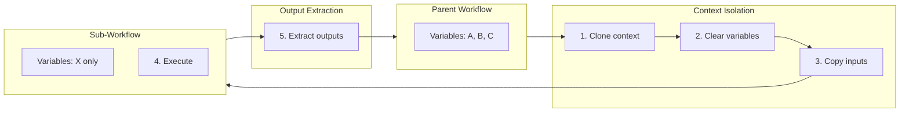

## :material-folder-multiple: Sub-Workflows

Execute child workflows as part of a parent workflow. Sub-workflows can run in parallel and have their own parameters and outputs, enabling modular workflow design and reusable validation/test pipelines.

!!! abstract "Overview"
    Sub-workflows provide **modular composition** for complex pipelines:

    - **Isolation**: Each sub-workflow runs in its own context
    - **Parallelism**: Run multiple sub-workflows concurrently
    - **Reusability**: Share common validation/test workflows across projects
    - **Composability**: Chain outputs between sub-workflows

### Basic Sub-Workflow Syntax

```yaml
name: deployment-pipeline
mode: standard

sub_workflows:
  lint-and-test:
    source: "workflows/quality-checks.yml"

  build:
    source: "workflows/build.yml"
    parameters:
      environment: "production"

  deploy:
    source: "workflows/deploy.yml"
    inputs:
      build_artifact: "${build.artifact_path}"
```

### :material-cog: Sub-Workflow Configuration

Each sub-workflow is defined as a key-value pair in a HashMap, where the key is the sub-workflow name (defined in `SubWorkflow` struct, src/cook/workflow/composition/sub_workflow.rs:14-46):

```yaml
sub_workflows:
  validation:  # Key is the sub-workflow name
    source: "path/to/workflow.yml"  # Required: workflow file path

    parameters:                       # Optional: parameter values
      env: "staging"
      timeout: 600

    inputs:                           # Optional: input from parent context
      commit_sha: "${git.commit}"
      branch: "${git.branch}"

    outputs:                          # Optional: extract values from sub-workflow
      - "test_coverage"
      - "artifact_url"

    parallel: false                   # Optional: run in parallel (default: false)

    continue_on_error: false          # Optional: continue if sub-workflow fails

    timeout: 1800                     # Optional: sub-workflow timeout (seconds)

    working_dir: "./sub-project"      # Optional: working directory for sub-workflow
                                       # Note: Parsed but not yet applied (implementation in progress)
```

**Source**: `SubWorkflow` struct in src/cook/workflow/composition/sub_workflow.rs:14-46
**Validation**: Sub-workflow validation in src/cook/workflow/composition/composer.rs:627-642
**Test example**: tests/workflow_composition_test.rs:152-173 demonstrates sub-workflow configuration

### :material-shield-lock: Parent-Child Context Isolation

Sub-workflows execute in isolated contexts with clean variable scopes (src/cook/workflow/composition/sub_workflow.rs:242-262):

- **Empty variable scope**: Sub-workflow starts with cleared variables (`sub_context.variables.clear()`)
- **Explicit input passing**: Use `inputs` to copy specific parent variables to child context
- **No variable leakage**: Sub-workflow variables don't leak back to parent
- **Output extraction**: Use `outputs` to explicitly capture child results
- **Independent git state**: Sub-workflows can operate in different directories



The isolation process:
1. Clone parent context
2. Clear all variables in cloned context
3. Copy only specified `inputs` from parent to child
4. Execute sub-workflow in isolated context
5. Extract only specified `outputs` back to parent

### :material-export: Output Variable Extraction

Capture values from sub-workflow execution:

```yaml
# parent-workflow.yml
sub_workflows:
  build:  # Sub-workflow name
    source: "workflows/build.yml"
    outputs:
      - "docker_image_tag"
      - "artifact_sha256"

commands:
  # Access outputs using ${sub-workflow-name.output-variable}
  - shell: "echo Deploying ${build.docker_image_tag}"
  - shell: "verify-checksum ${build.artifact_sha256}"
```

### :material-run-fast: Parallel Execution

Run multiple sub-workflows concurrently using `tokio::spawn` for concurrent task execution (src/cook/workflow/composition/sub_workflow.rs:179-226):

```yaml
sub_workflows:
  # These run in parallel
  unit-tests:
    source: "workflows/unit-tests.yml"
    parallel: true

  integration-tests:
    source: "workflows/integration-tests.yml"
    parallel: true

  e2e-tests:
    source: "workflows/e2e-tests.yml"
    parallel: true

# Parent waits for all parallel sub-workflows before continuing
commands:
  - shell: "echo All tests completed"
```

**Execution behavior:**
- Each parallel sub-workflow spawns as a separate async task (`tokio::spawn`)
- Parent workflow waits for all parallel tasks to complete via `join`
- All outputs are merged back to parent context after completion
- If any parallel sub-workflow fails, execution stops (unless `continue_on_error: true`)

### :material-alert-circle: Error Handling

Control behavior when sub-workflows fail:

```yaml
sub_workflows:
  # Critical step - fail parent if this fails
  security-scan:
    source: "workflows/security-scan.yml"
    continue_on_error: false  # Default behavior

  # Optional step - parent continues even if this fails
  performance-test:
    source: "workflows/perf-test.yml"
    continue_on_error: true
```

#### Error Propagation

When a sub-workflow fails, error context is preserved through the `SubWorkflowResult` (src/cook/workflow/composition/sub_workflow.rs:158-176):

=== "Default Behavior (continue_on_error: false)"

    ```
    Sub-workflow fails → Error propagated → Parent workflow fails
    Result: error field contains failure details, success = false
    ```

=== "continue_on_error: true"

    ```
    Sub-workflow fails → Warning logged → Parent continues
    Result: error field contains details, success = false, but parent proceeds
    ```

!!! warning "Error Context Preservation"
    The `SubWorkflowResult.error` field captures the full error message including context chain. When debugging failed sub-workflows, check this field for root cause analysis.

### :material-pipe: Modular Pipeline Example

**parent-pipeline.yml:**
```yaml
name: ci-cd-pipeline
mode: standard

sub_workflows:
  # Step 1: Validation (sequential)
  validate:
    source: "workflows/validation.yml"
    outputs:
      - "validation_passed"

  # Step 2: Tests (parallel)
  unit-tests:
    source: "workflows/unit-tests.yml"
    parallel: true

  integration-tests:
    source: "workflows/integration-tests.yml"
    parallel: true

  # Step 3: Build (sequential, after tests)
  build:
    source: "workflows/build.yml"
    parameters:
      optimization_level: "3"
    outputs:
      - "artifact_path"

  # Step 4: Deploy (sequential, uses build output)
  deploy:
    source: "workflows/deploy.yml"
    inputs:
      artifact: "${build.artifact_path}"
      environment: "production"
```

**validation.yml** (reusable sub-workflow):
```yaml
name: validation
mode: standard

commands:
  - shell: "cargo fmt --check"
  - shell: "cargo clippy -- -D warnings"
  - shell: "echo validation_passed=true >> $PRODIGY_OUTPUT"
```

### :material-folder-cog: Working Directory Isolation

Sub-workflows can specify different working directories (parsed but not yet applied - see implementation note in src/cook/workflow/composition/sub_workflow.rs:104-107):

```yaml
sub_workflows:
  # Backend tests in backend/
  backend-tests:
    source: "workflows/rust-tests.yml"
    working_dir: "./backend"  # Parsed but not yet applied

  # Frontend tests in frontend/
  frontend-tests:
    source: "workflows/js-tests.yml"
    working_dir: "./frontend"  # Parsed but not yet applied
```

!!! info "Implementation Note"
    The `working_dir` field is parsed and validated but not yet applied during execution. The `WorkflowContext` struct needs a `working_directory` field to enable this feature. Currently, all sub-workflows execute in the parent's working directory.

### :material-timer-outline: Timeout Configuration

Set execution time limits:

```yaml
sub_workflows:
  quick-tests:
    source: "workflows/smoke-tests.yml"
    timeout: 120  # 2 minutes

  comprehensive-tests:
    source: "workflows/full-suite.yml"
    timeout: 3600  # 1 hour
```

### :material-lightbulb: Use Cases

=== "Modular Testing"

    - Separate unit, integration, and e2e tests into sub-workflows
    - Run test suites in parallel for faster feedback
    - Reuse test workflows across multiple projects

=== "Multi-Language Projects"

    - Separate workflows for each language/component
    - Independent validation for microservices
    - Coordinated deployment of multiple services

=== "Reusable Validation"

    - Shared linting/formatting workflows
    - Common security scanning workflows
    - Standardized compliance checks

**Environment-Specific Pipelines:**
```yaml
sub_workflows:
  # Different deployment sub-workflows per environment
  deploy-staging:
    source: "workflows/deploy.yml"
    parameters:
      environment: "staging"
      replicas: "2"

  deploy-production:
    source: "workflows/deploy.yml"
    parameters:
      environment: "production"
      replicas: "5"
```

### :material-file-document-multiple: Complete Example

```yaml
name: monorepo-ci
mode: standard

sub_workflows:
  # Validate everything first
  validate:
    source: "shared/validate.yml"

  # Test all services in parallel
  api-tests:
    source: "services/api/test.yml"
    working_dir: "./services/api"
    parallel: true
    outputs:
      - "coverage"

  worker-tests:
    source: "services/worker/test.yml"
    working_dir: "./services/worker"
    parallel: true
    outputs:
      - "coverage"

  frontend-tests:
    source: "apps/frontend/test.yml"
    working_dir: "./apps/frontend"
    parallel: true
    outputs:
      - "coverage"

# After all sub-workflows complete
commands:
  - shell: "echo API coverage: ${api-tests.coverage}%"
  - shell: "echo Worker coverage: ${worker-tests.coverage}%"
  - shell: "echo Frontend coverage: ${frontend-tests.coverage}%"
  - shell: "generate-combined-coverage-report.sh"
```

### :material-format-list-checks: Sub-Workflow Result

Each sub-workflow execution produces a `SubWorkflowResult` (src/cook/workflow/composition/sub_workflow.rs:48-65):

```rust
// Source: src/cook/workflow/composition/sub_workflow.rs:48-65
SubWorkflowResult {
    success: bool,                   // Execution success
    outputs: HashMap<String, Value>, // Extracted output variables
    duration: Duration,              // Execution time
    error: Option<String>,           // Error message if failed
    logs: Vec<String>,               // Sub-workflow execution logs
}
```

!!! note "Name Tracking"
    The sub-workflow name is tracked separately as the HashMap key in the parent workflow's `sub_workflows` field, not as a field within `SubWorkflowResult`.

### :material-progress-check: Implementation Status

!!! success "Completed Features"
    - [x] Sub-workflow configuration parsing
    - [x] Sub-workflow validation (`validate_sub_workflows`)
    - [x] Parameter and input definitions
    - [x] Output extraction structure
    - [x] Parallel execution configuration
    - [x] Error handling options (continue_on_error)
    - [x] Timeout and working directory settings
    - [x] SubWorkflowExecutor structure

!!! warning "In Progress"
    - [ ] Executor integration with main workflow runtime

    Sub-workflow definitions are fully validated and composed, but execution integration with the main workflow orchestrator is currently in development.

### Related Topics

- [Workflow Imports](index.md#workflow-imports) - Import shared configurations
- [Template System](template-system.md) - Parameterized workflows
- [Parameter Definitions](parameter-definitions.md) - Define sub-workflow parameters

