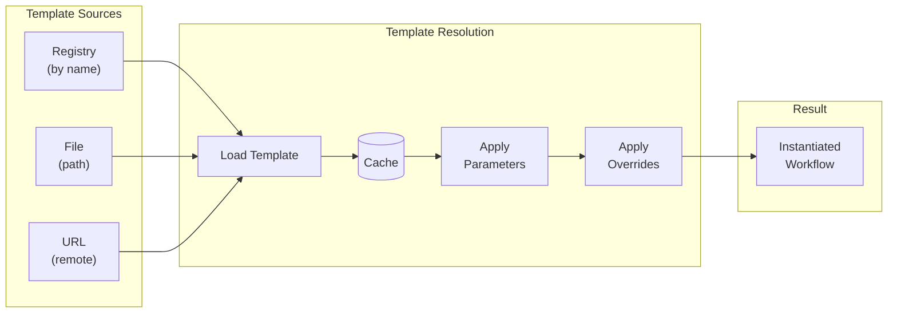
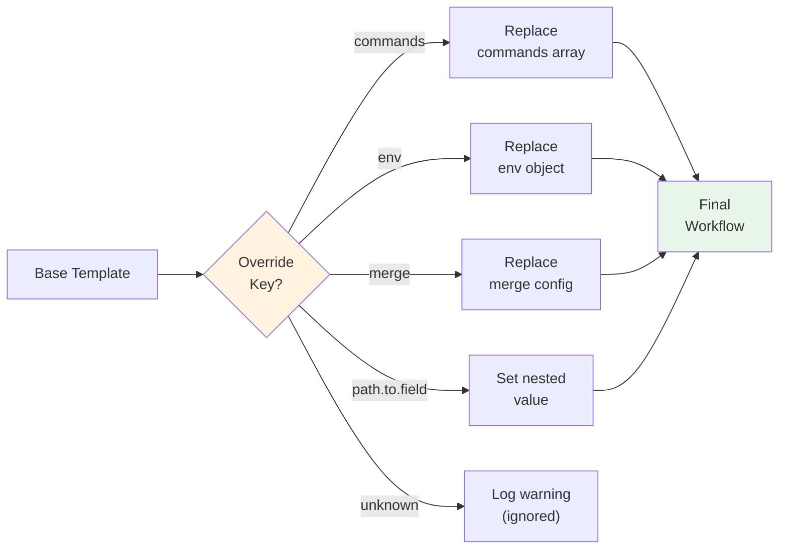

## Template System

Templates provide reusable workflow patterns that can be instantiated with different parameters. Templates can be stored in a registry or loaded from files, enabling standardized workflows across teams and projects.

!!! info "Source"
    Implemented in `src/cook/workflow/composition/mod.rs` and `src/cook/workflow/composition/registry.rs`

### Template Basics

A template is a reusable workflow definition that can be parameterized and instantiated multiple times with different values. Templates support:
- Registry-based or file-based storage
- Parameter substitution
- Field overrides
- Metadata and versioning



**Figure**: Template resolution flow showing how templates are loaded from sources, cached, and instantiated with parameters and overrides.

### Template Configuration

Templates are defined using the `WorkflowTemplate` struct:

```yaml title="Template definition" hl_lines="9-12"
# Source: src/cook/workflow/composition/mod.rs:67-83
template:
  name: "standard-ci"  # (1)!

  source: "template-name"  # (2)!

  with:  # (3)!
    param1: "value1"
    param2: "value2"

  override:  # (4)!
    timeout: 600
    max_parallel: 5
```

1. **Template name** - Identifier for logging and debugging
2. **Source** - Registry name (string), file path (`{ file: "path.yml" }`), or URL
3. **Parameters** - Values substituted into `${param}` placeholders in the template
4. **Overrides** - Replace specific template fields without modifying the source

### Template Sources

Prodigy uses an untagged enum for `TemplateSource`, which means the YAML format varies based on the source type:

=== "Registry Lookup"

    Load a template by name from the template registry:

    ```yaml
    # Source: src/cook/workflow/composition/mod.rs:92
    template:
      name: "ci-pipeline"
      source: "standard-ci"  # Simple string = registry lookup
      with:
        project_name: "my-project"
    ```

    When the source is a plain string, Prodigy looks up the template in the configured registry directory.

=== "File Path"

    Load a template from a file:

    ```yaml
    # Source: src/cook/workflow/composition/mod.rs:90
    template:
      name: "deployment"
      source:
        file: "templates/k8s-deploy.yml"  # File path in struct format
      with:
        environment: "production"
    ```

    Paths can be relative (to workflow file) or absolute.

=== "URL (Planned)"

    Load a template from a remote URL:

    ```yaml
    # Source: src/cook/workflow/composition/mod.rs:94
    template:
      name: "remote-template"
      source: "https://templates.example.com/ci.yml"
      with:
        config: "production"
    ```

    !!! warning "Not Yet Implemented"
        URL-based template loading currently returns an error. Planned for future implementation.

### Template Registry

The template registry stores reusable workflow templates with configurable storage locations.

!!! tip "Choosing a Registry Location"
    Use **project-local** (`.prodigy/templates/`) for project-specific templates that should be version-controlled with your code. Use **global** (`~/.prodigy/templates/`) for personal or organization-wide templates shared across projects.

!!! note "Default Storage Path"
    The default `TemplateRegistry::new()` uses `templates/` as the base directory. Custom paths like `.prodigy/templates/` or `~/.prodigy/templates/` are conventions that can be configured via `FileTemplateStorage::new(base_dir)`.

**Conventional Registry Locations:**
```
# Local (project-specific) - configure with custom storage
.prodigy/templates/
├── project-ci.yml
├── custom-deployment.yml
└── ...

# Global (user-wide) - configure with custom storage
~/.prodigy/templates/
├── standard-ci.yml
├── deployment-pipeline.yml
├── test-suite.yml
└── ...
```

**Custom Storage Configuration:**
```rust
// Source: src/cook/workflow/composition/registry.rs:26-29
use prodigy::cook::workflow::composition::registry::{TemplateRegistry, FileTemplateStorage};

// Default: uses "templates" directory
let registry = TemplateRegistry::new();

// Custom path: use project-specific location
let storage = FileTemplateStorage::new(PathBuf::from(".prodigy/templates"));
let registry = TemplateRegistry::with_storage(Box::new(storage));
```

#### Programmatic Registration

Register templates using the API:

```rust title="Template registration"
// Source: src/cook/workflow/composition/registry.rs:41-73
use prodigy::cook::workflow::composition::registry::TemplateRegistry;

let registry = TemplateRegistry::new();

// Basic registration
registry
    .register_template("ci-pipeline".to_string(), template)
    .await?;

// Registration with metadata
registry
    .register_template_with_metadata(
        "deployment".to_string(),
        template,
        metadata
    )
    .await?;
```

#### Manual Registry Management

```bash
# Copy template to local registry
cp my-template.yml .prodigy/templates/my-template.yml

# Copy to global registry (user-wide)
cp my-template.yml ~/.prodigy/templates/my-template.yml

# Templates are automatically discovered by filename
```

### Template Parameters

Templates can define parameters that are substituted when the template is instantiated. See [Parameter Definitions](parameter-definitions.md) for detailed parameter syntax and validation.

=== "Template Definition"

    ```yaml title="templates/deployment.yml"
    name: deployment-template

    parameters:
      required:
        - environment
        - version
      optional:
        - timeout

    commands:
      - shell: "deploy --env ${environment} --version ${version}"
      - shell: "verify-deployment ${environment}"
    ```

=== "Template Usage"

    ```yaml title="workflow.yml"
    template:
      source:
        file: "templates/deployment.yml"
      with:
        environment: "staging"
        version: "2.0.0"
        timeout: "300"
    ```

### Template Metadata

Templates can include metadata for better organization and discovery.

| Field | Description |
|-------|-------------|
| `description` | Human-readable description |
| `author` | Template author |
| `version` | Semantic version string |
| `tags` | List of categorization tags |
| `created_at` | Creation timestamp |
| `updated_at` | Last modification timestamp |

!!! info "Metadata Storage"
    Templates registered with metadata store an additional `.meta.json` file alongside the template YAML. For example, `standard-ci.yml` has metadata in `standard-ci.yml.meta.json`.

    Source: `TemplateMetadata` struct in `src/cook/workflow/composition/registry.rs:475-508`

### Template Discovery

The registry provides search and listing capabilities:

```rust title="Template discovery API"
// Source: src/cook/workflow/composition/registry.rs:156-168

// List all templates
let templates = registry.list().await?;

// Search by tags
let ci_templates = registry
    .search_by_tags(&["ci".to_string(), "testing".to_string()])
    .await?;

// Get specific template
let template = registry.get("standard-ci").await?;

// Delete template
registry.delete("old-template").await?;
```

### Template Caching

Prodigy caches loaded templates to improve performance:

- Templates are loaded once and reused across workflow executions
- Registry templates are cached until the registry is updated
- In-memory cache stored in `Arc<RwLock<HashMap>>` (`src/cook/workflow/composition/registry.rs:14`)

!!! warning "File Change Detection"
    Templates are cached for the lifetime of the registry instance. File-based templates are **not** automatically reloaded when the source file changes. Restart the registry or create a new instance to pick up template changes.

### Template Override

The `override` field allows you to override specific template fields without modifying the template file. Template overrides are fully implemented and applied during workflow composition.



**Figure**: Override application logic showing how different override keys are processed.

```yaml title="Basic override example"
template:
  source: "standard-workflow"
  override:
    timeout: 1200  # Override default timeout
    max_parallel: 10  # Override concurrency limit
```

#### Supported Override Keys

The `apply_overrides()` function supports the following keys:

| Key | Description | Value Type |
|-----|-------------|------------|
| `commands` | Replace the entire commands array | Array of command objects |
| `env` | Replace environment variables | Object with key-value pairs |
| `merge` | Replace merge workflow configuration | Merge config object |
| `path.to.field` | Override nested values using dot notation | Any value |

=== "Commands Override"

    Replace the entire commands array:

    ```yaml
    # Source: src/cook/workflow/composition/composer.rs:539-543
    template:
      source: "base-workflow"
      override:
        commands:
          - shell: "custom-build.sh"
          - claude: "/deploy production"
    ```

=== "Environment Override"

    Replace environment variables:

    ```yaml
    # Source: src/cook/workflow/composition/composer.rs:546-554
    template:
      source: "deployment-pipeline"
      override:
        env:
          NODE_ENV: "production"
          API_URL: "https://api.example.com"
    ```

=== "Merge Override"

    Replace merge workflow configuration:

    ```yaml
    # Source: src/cook/workflow/composition/composer.rs:557-561
    template:
      source: "feature-workflow"
      override:
        merge:
          commands:
            - shell: "cargo test"
            - shell: "cargo clippy"
    ```

=== "Nested Override"

    Override specific nested values using dot notation:

    ```yaml
    # Source: src/cook/workflow/composition/composer.rs:564-567
    template:
      source: "standard-ci"
      override:
        commands.0.timeout: 600
        map.max_parallel: 20
    ```

!!! tip "Unknown Override Keys"
    Unknown override keys are logged as warnings but don't cause errors, allowing forward compatibility with future override options.

### Use Cases

=== "CI/CD Pipelines"

    Use company-wide CI template for standardization:

    ```yaml title="Standardized CI workflow"
    template:
      source: "company-ci-pipeline"
      with:
        project_type: "rust"
        test_coverage: "80"
        deploy_targets: ["staging", "production"]
    ```

=== "Environment Deployments"

    Reuse deployment template with different parameters:

    ```yaml title="Environment-specific deployment"
    template:
      source:
        file: "templates/k8s-deploy.yml"
      with:
        cluster: "us-west-2"
        namespace: "production"
        replicas: "5"
    ```

=== "Test Configurations"

    Test different configurations using the same template:

    ```yaml title="Integration test variations"
    template:
      source:
        file: "templates/integration-tests.yml"
      with:
        database: "postgres"
        cache: "redis"
        message_queue: "rabbitmq"
    ```

### Implementation Status

| Feature | Status | Notes |
|---------|--------|-------|
| File-based template loading | :white_check_mark: | Fully implemented |
| Registry template storage | :white_check_mark: | Fully implemented |
| Template parameter validation | :white_check_mark: | Fully implemented |
| Template caching (in-memory) | :white_check_mark: | Fully implemented |
| Template metadata and versioning | :white_check_mark: | Fully implemented |
| Template search and discovery | :white_check_mark: | Fully implemented |
| Programmatic registration API | :white_check_mark: | Fully implemented |
| Template override application | :white_check_mark: | Supports `commands`, `env`, `merge`, and nested paths |
| URL-based template loading | :material-clock-outline: | Returns error, planned for future |
| File modification detection | :material-clock-outline: | Cache invalidation planned |

### Related Topics

- [Parameter Definitions](parameter-definitions.md) - Define and validate template parameters
- [Workflow Extension](workflow-extension-inheritance.md) - Inherit from base workflows
- [Default Values](default-values.md) - Set default parameter values
