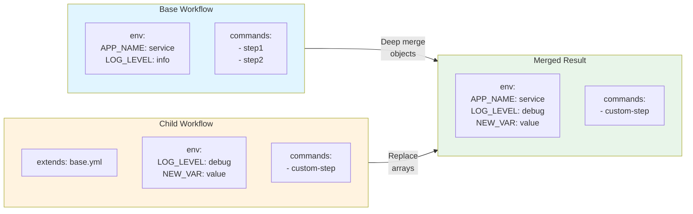
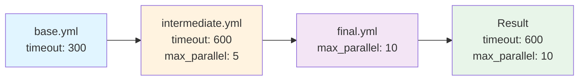
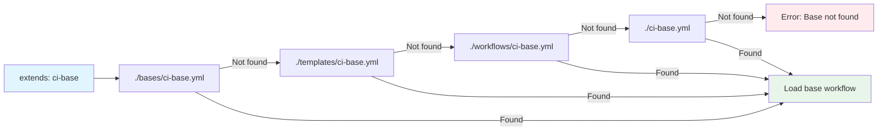

## Workflow Extension (Inheritance)

Extend a base workflow to inherit its configuration. Child workflows override parent values, allowing you to customize specific aspects while maintaining common configuration. This enables environment-specific variations and layered configuration management.

!!! info "When to Use Extension vs Imports"
    Use **extension** when you need environment-specific variations of the same workflow (dev/staging/prod). Use **imports** when composing independent, reusable workflow components.

### Basic Extension Syntax

```yaml
# production.yml
name: production-deployment
mode: standard

# Inherit from base workflow
extends: "base-deployment.yml"

# Override specific values
env:
  ENVIRONMENT: "production"
  REPLICAS: "5"
```

### How Extension Works

When a workflow extends a base workflow:

1. **Base workflow is loaded** from the specified path
2. **Child values override parent** for matching keys
3. **Parent values are preserved** where child doesn't override
4. **Merging is deep** - nested objects merge recursively
5. **Arrays are replaced** - child arrays replace parent arrays entirely



**Figure**: Extension merge behavior - objects merge deeply while arrays are replaced entirely.

!!! warning "Array Replacement Behavior"
    Unlike imports which *extend* arrays, extension *replaces* them entirely. If your child workflow specifies any commands, all parent commands are replaced.

### Extension vs Imports

| Feature | Extension (`extends`) | Imports |
|---------|----------------------|---------|
| **Purpose** | Inherit and customize base workflow | Reuse workflow components |
| **Relationship** | Parent-child hierarchy | Modular composition |
| **Override behavior** | Child overrides parent | Imports merge with main |
| **Use case** | Environment variations | Shared utilities |

### Multi-Environment Example

=== "Base Workflow"

    ```yaml title="base-deployment.yml"
    # Source: Shared configuration inherited by all environments
    name: base-deployment
    mode: standard

    env:
      APP_NAME: "my-service"
      REPLICAS: "1"
      LOG_LEVEL: "info"

    commands:
      - shell: "docker build -t ${APP_NAME}:${VERSION} ."
      - shell: "kubectl apply -f k8s/${ENVIRONMENT}/deployment.yml"
      - shell: "kubectl scale deployment ${APP_NAME} --replicas=${REPLICAS}"
    ```

=== "Development"

    ```yaml title="dev.yml"
    name: dev-deployment
    extends: "base-deployment.yml"

    env:
      ENVIRONMENT: "dev"
      REPLICAS: "1"
      LOG_LEVEL: "debug"

    # Inherits all commands from base
    ```

=== "Staging"

    ```yaml title="staging.yml"
    name: staging-deployment
    extends: "base-deployment.yml"

    env:
      ENVIRONMENT: "staging"
      REPLICAS: "3"
      LOG_LEVEL: "info"

    # Replaces base commands with staging-specific workflow
    commands:
      - shell: "run-smoke-tests.sh"
    ```

=== "Production"

    ```yaml title="production.yml"
    name: production-deployment
    extends: "base-deployment.yml"

    env:
      ENVIRONMENT: "production"
      REPLICAS: "5"
      LOG_LEVEL: "warn"
      ENABLE_MONITORING: "true"

    # Replaces base commands with production safeguards
    commands:
      - shell: "verify-release-notes.sh"
      - shell: "notify-team 'Deploying to production'"
    ```

### Merge Behavior

The following table summarizes how different value types are merged during extension:

| Type | Behavior | Example |
|------|----------|---------|
| **Scalars** | Child replaces parent | `timeout: 600` overrides `timeout: 300` |
| **Objects** | Deep merge (recursive) | Child env vars added/override parent |
| **Arrays** | Child replaces entirely | Child commands replace all parent commands |

**Scalar Values** - Child replaces parent:
```yaml
# base.yml
timeout: 300

# child.yml
extends: "base.yml"
timeout: 600  # Replaces 300 with 600
```

**Objects** - Deep merge:
```yaml
# base.yml
env:
  APP_NAME: "service"
  LOG_LEVEL: "info"

# child.yml
extends: "base.yml"
env:
  LOG_LEVEL: "debug"  # Overrides
  NEW_VAR: "value"     # Adds

# Result:
env:
  APP_NAME: "service"     # From base
  LOG_LEVEL: "debug"      # Overridden
  NEW_VAR: "value"        # Added
```

**Environment Variables** - Deep merge with selective override:
```yaml
# base.yml
env:
  APP_NAME: "service"
  LOG_LEVEL: "info"
  REPLICAS: "3"

# child.yml
extends: "base.yml"
env:
  LOG_LEVEL: "debug"  # Overrides parent value
  NEW_VAR: "value"     # Adds new variable

# Result:
env:
  APP_NAME: "service"     # Preserved from parent
  LOG_LEVEL: "debug"      # Overridden by child
  REPLICAS: "3"           # Preserved from parent
  NEW_VAR: "value"        # Added by child
```

**Source**: Environment variables inherit the object deep merge behavior (src/cook/workflow/composition/composer.rs:326-356)

**Arrays (Commands)** - Child replaces parent:
```yaml
# base.yml
commands:
  - shell: "step1"
  - shell: "step2"

# child.yml
extends: "base.yml"
commands:
  - shell: "custom-step"  # Completely replaces base commands

# Result: Only custom-step runs
```

**Source**: In inheritance mode (`extends`), non-empty child command arrays replace parent arrays entirely (src/cook/workflow/composition/composer.rs:336-338)

**Note**: This behavior differs from imports, where `merge_workflows` extends arrays instead of replacing them (src/cook/workflow/composition/composer.rs:276-323). See [Workflow Imports](index.md#workflow-imports) for comparison.

### Layered Extension

Workflows can extend workflows that themselves extend other workflows:



**Figure**: Layered extension chain - each level can override values from its parent.

```yaml
# base.yml
name: base-config
timeout: 300

# intermediate.yml
extends: "base.yml"
timeout: 600
max_parallel: 5

# final.yml
extends: "intermediate.yml"
max_parallel: 10

# Result: timeout=600 (from intermediate), max_parallel=10 (from final)
```

!!! tip "Layered Configuration Pattern"
    Use layered extension to separate concerns: base config → environment type → specific instance. This keeps each layer focused and maintainable.

### Path Resolution

When resolving base workflow paths, Prodigy searches the following locations in order:



**Figure**: Path resolution search order - first match wins.

1. `./bases/{name}.yml`
2. `./templates/{name}.yml`
3. `./workflows/{name}.yml`
4. `./{name}.yml` (current directory)

**Source**: Path resolution implementation in src/cook/workflow/composition/composer.rs:612-625

Extension paths can be:
- **Relative**: Resolved from workflow file's directory
- **Absolute**: Full filesystem path
- **Registry**: Future support for template registry paths

```yaml
# Name-based lookup (searches standard directories)
extends: "base-deployment"  # Searches bases/, templates/, workflows/, ./

# Relative path
extends: "../shared/base.yml"

# Absolute path
extends: "/etc/prodigy/workflows/base.yml"
```

**Search Order Example:**
```bash
# For extends: "ci-base"
# Prodigy searches:
./bases/ci-base.yml       # First
./templates/ci-base.yml   # Second
./workflows/ci-base.yml   # Third
./ci-base.yml             # Fourth (current directory)
# Error if not found in any location
```

### Use Cases

**Environment-Specific Deployments:**
- Share common deployment steps
- Override environment variables per environment
- Customize resource limits (replicas, memory, CPU)

**Testing Variations:**
```yaml
# base-test.yml
name: base-test
commands:
  - shell: "cargo build"
  - shell: "cargo test"

# integration-test.yml
extends: "base-test.yml"
env:
  DATABASE_URL: "postgres://localhost/test"
commands:
  - shell: "setup-test-db.sh"
  # Runs instead of base commands

# unit-test.yml
extends: "base-test.yml"
env:
  RUST_TEST_THREADS: "1"
```

**Progressive Configuration:**
- Start with minimal base config
- Add complexity in child workflows
- Keep each layer focused on specific concerns

### Circular Dependency Protection

Prodigy detects and prevents circular dependencies:

```yaml
# workflow-a.yml
extends: "workflow-b.yml"

# workflow-b.yml
extends: "workflow-a.yml"

# Error: Circular dependency detected
```

!!! danger "Circular Dependencies"
    Circular dependencies are detected at composition time and cause an immediate error. Check your inheritance chain if you encounter this error.

### Complete Example

**base-ci.yml:**
```yaml
name: base-ci
mode: standard

env:
  RUST_BACKTRACE: "1"

commands:
  - shell: "cargo fmt --check"
  - shell: "cargo clippy"
  - shell: "cargo test"
```

**pr-ci.yml** (runs on pull requests):
```yaml
name: pr-ci
extends: "base-ci.yml"

env:
  CARGO_INCREMENTAL: "0"  # Faster CI builds

# Inherits format, clippy, test from base
```

**release-ci.yml** (runs on release):
```yaml
name: release-ci
extends: "base-ci.yml"

env:
  CARGO_INCREMENTAL: "0"

commands:
  - shell: "cargo build --release"
  - shell: "cargo test --release"
  - shell: "cargo publish --dry-run"
```

### Debugging Extensions

**Current Method** - Enable verbose logging to see composition details:

```bash
# Use -vvv for trace-level logging showing composition process
prodigy run workflow.yml -vvv

# Combine with --dry-run to preview without execution
prodigy run workflow.yml --dry-run -vvv
```

Verbose logging output includes:
- Base workflow loading events
- Inheritance chain resolution
- Merge operations for each configuration section
- Circular dependency checks
- Path resolution steps

**Source**: Composition events logged via `tracing::debug!()` macros throughout src/cook/workflow/composition/composer.rs

**Planned Feature** - Dedicated composition inspection flag (not yet implemented):

```bash
# Future: --show-composition flag (Spec 131-133)
prodigy run workflow.yml --dry-run --show-composition
```

This will display structured composition metadata including:
- Sources and dependency types
- Complete inheritance chain
- Applied parameters and templates
- Resolved paths for all dependencies

See [Composition Metadata](composition-metadata.md) for details on the metadata structure.

### Implementation Status

- ✅ Base workflow loading
- ✅ Deep merge of child and parent configurations
- ✅ Circular dependency detection
- ✅ Path resolution (relative and absolute)
- ✅ Composition metadata tracking
- ✅ Workflow caching - Files are cached during composition to improve performance and avoid redundant file system reads (src/cook/workflow/composition/composer.rs:646-681)

### Related Topics

- [Workflow Imports](index.md#workflow-imports) - Modular composition
- [Template System](template-system.md) - Parameterized workflows
- [Composition Metadata](composition-metadata.md) - Inspect composition details

