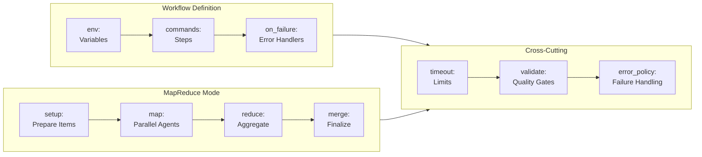
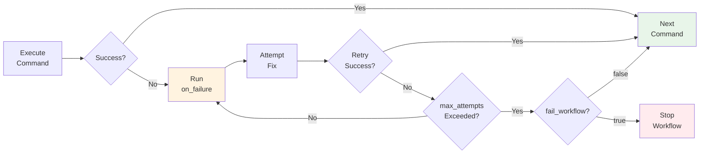
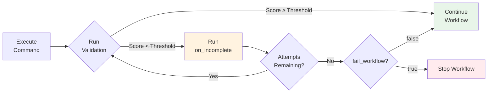
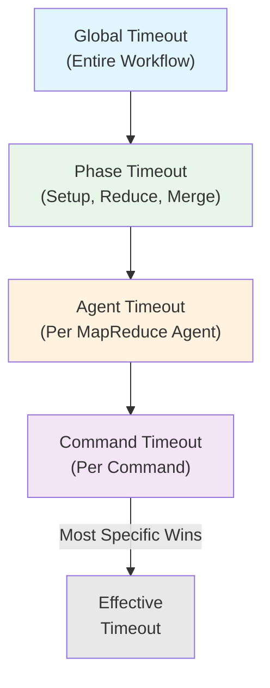

## Complete Configuration Examples

This subsection provides comprehensive, production-ready workflow examples demonstrating all major Prodigy configuration features. Each example is extracted from real workflows in the repository and includes detailed annotations explaining configuration choices.

!!! tip "Using These Examples"
    Copy and adapt these examples for your workflows. Each example includes source references pointing to actual implementation code for verification.

### Configuration Architecture Overview

The following diagram shows how configuration elements relate in Prodigy workflows:



### Quick Reference

Complete workflow configurations include:

| Feature | Standard Workflow | MapReduce Workflow |
|---------|------------------|-------------------|
| **Basic Structure** | `commands: []` | `mode: mapreduce` with `setup`, `map`, `reduce` |
| **Environment Variables** | `env:`, `secrets:`, `profiles:` | Same + phase-specific overrides |
| **Command Types** | `claude:`, `shell:`, `foreach:`, `write_file:`, `validate:` | Same + `agent_template` |
| **Error Handling** | `on_failure:`, `on_success:`, `retry:` | Same + `error_policy:`, `on_item_failure:` |
| **Validation** | `validate:` with `threshold`, `on_incomplete` | Per-step validation + gap filling |
| **Output Capture** | `capture_output:`, `outputs:` | `capture_outputs:` in setup phase |
| **Timeouts** | `timeout:` per command | `timeout:` per phase + `agent_timeout_secs` |
| **Merge Workflow** | `merge:` with custom commands | Same with `${merge.*}` variables |

---

### 1. Complete Standard Workflow Example

This example demonstrates a full standard workflow with all major configuration options.

```yaml title="workflows/debtmap.yml"
# Source: workflows/debtmap.yml
# Sequential workflow for technical debt analysis and remediation
# Demonstrates: validation, error handlers, output capture

# Phase 1: Generate coverage data
- shell: "just coverage-lcov"
  timeout: 300

# Phase 2: Analyze tech debt and capture baseline
- shell: "debtmap analyze . --lcov target/coverage/lcov.info --output .prodigy/debtmap-before.json --format json"
  capture_output: true

# Phase 3: Create implementation plan with validation
- claude: "/prodigy-debtmap-plan --before .prodigy/debtmap-before.json --output .prodigy/IMPLEMENTATION_PLAN.md"
  commit_required: true
  validate:
    commands:
      - claude: "/prodigy-validate-debtmap-plan --before .prodigy/debtmap-before.json --plan .prodigy/IMPLEMENTATION_PLAN.md --output .prodigy/plan-validation.json"
    result_file: ".prodigy/plan-validation.json"
    threshold: 75  # Must achieve 75% completeness
    on_incomplete:
      commands:
        - claude: "/prodigy-revise-debtmap-plan --gaps ${validation.gaps} --plan .prodigy/IMPLEMENTATION_PLAN.md"
      max_attempts: 3
      fail_workflow: false

# Phase 4: Execute the plan with comprehensive validation
- claude: "/prodigy-debtmap-implement --plan .prodigy/IMPLEMENTATION_PLAN.md"
  commit_required: true
  validate:
    commands:
      - shell: "just coverage-lcov"
      - shell: "debtmap analyze . --lcov target/coverage/lcov.info --output .prodigy/debtmap-after.json --format json"
      - shell: "debtmap compare --before .prodigy/debtmap-before.json --after .prodigy/debtmap-after.json --plan .prodigy/IMPLEMENTATION_PLAN.md --output .prodigy/comparison.json --format json"
      - claude: "/prodigy-validate-debtmap-improvement --comparison .prodigy/comparison.json --output .prodigy/debtmap-validation.json"
    result_file: ".prodigy/debtmap-validation.json"
    threshold: 75
    on_incomplete:
      commands:
        - claude: "/prodigy-complete-debtmap-fix --plan .prodigy/IMPLEMENTATION_PLAN.md --validation .prodigy/debtmap-validation.json --attempt ${validation.attempt_number}"
          commit_required: true
        - shell: "just coverage-lcov"
        - shell: "debtmap analyze . --lcov target/coverage/lcov.info --output .prodigy/debtmap-after.json --format json"
        - shell: "debtmap compare --before .prodigy/debtmap-before.json --after .prodigy/debtmap-after.json --plan .prodigy/IMPLEMENTATION_PLAN.md --output .prodigy/comparison.json --format json"
      max_attempts: 5
      fail_workflow: true

# Phase 5: Verify tests pass with error recovery
- shell: "just test"
  on_failure:
    claude: "/prodigy-debug-test-failure --output ${shell.output}"
    max_attempts: 5
    fail_workflow: true

# Phase 6: Enforce code quality standards
- shell: "just fmt-check && just lint"
  on_failure:
    claude: "/prodigy-lint ${shell.output}"
    max_attempts: 5
    fail_workflow: true
```

!!! note "Key Features Demonstrated"
    - **Validation with gap filling**: `validate:` block with `threshold` and `on_incomplete` handler
    - **Error recovery**: `on_failure:` handlers with `max_attempts` for automatic fixing
    - **Output capture**: Shell output captured and passed to Claude for debugging
    - **Commit control**: `commit_required: true` ensures changes are tracked
    - **Timeouts**: Per-command timeout to prevent hanging
    - **Sequential orchestration**: Each phase builds on previous results

**Configuration Details** (from `src/config/command.rs:WorkflowStepCommand`):

| Field | Type | Description |
|-------|------|-------------|
| `commit_required` | `bool` | Whether step must create a git commit (default: `false`) |
| `timeout` | `u64` | Maximum execution time in seconds |
| `validate` | `ValidationConfig` | Validation specification with threshold and handlers |
| `on_failure` | `TestDebugConfig` | Error handler with `max_attempts` and `fail_workflow` |
| `capture_output` | `bool` | Capture command output for use in subsequent steps |

---

### 2. Complete MapReduce Workflow Example

This example demonstrates a production MapReduce workflow with all phases and configuration options.

```yaml title="workflows/book-docs-drift.yml"
# Source: workflows/book-docs-drift.yml
name: prodigy-book-docs-drift-detection
mode: mapreduce

# Global environment configuration
env:
  # Project configuration
  PROJECT_NAME: "Prodigy"
  PROJECT_CONFIG: ".prodigy/book-config.json"
  FEATURES_PATH: ".prodigy/book-analysis/features.json"

  # Book-specific settings
  BOOK_DIR: "book"
  ANALYSIS_DIR: ".prodigy/book-analysis"
  CHAPTERS_FILE: "workflows/data/prodigy-chapters.json"

  # Workflow settings
  MAX_PARALLEL: "3"

# Setup phase: Analyze codebase and prepare work items
setup:
  - shell: "mkdir -p $ANALYSIS_DIR"

  # Step 1: Analyze codebase features
  - claude: "/prodigy-analyze-features-for-book --project $PROJECT_NAME --config $PROJECT_CONFIG"

  # Step 2: Detect gaps and generate work items
  - claude: "/prodigy-detect-documentation-gaps --project $PROJECT_NAME --config $PROJECT_CONFIG --features $FEATURES_PATH --chapters $CHAPTERS_FILE --book-dir $BOOK_DIR"

# Map phase: Process each documentation subsection in parallel
map:
  input: "${ANALYSIS_DIR}/flattened-items.json"
  json_path: "$[*]"

  agent_template:
    # Step 1: Analyze subsection for drift
    - claude: "/prodigy-analyze-subsection-drift --project $PROJECT_NAME --json '${item}' --features $FEATURES_PATH"
      commit_required: true

    # Step 2: Fix drift with validation
    - claude: "/prodigy-fix-subsection-drift --project $PROJECT_NAME --json '${item}'"
      commit_required: true
      validate:
        claude: "/prodigy-validate-doc-fix --project $PROJECT_NAME --json '${item}' --output .prodigy/validation-result.json"
        result_file: ".prodigy/validation-result.json"
        threshold: 100  # Documentation must meet 100% quality standards
        on_incomplete:
          claude: "/prodigy-complete-doc-fix --project $PROJECT_NAME --json '${item}' --gaps ${validation.gaps}"
          max_attempts: 3
          fail_workflow: false
          commit_required: true

  max_parallel: ${MAX_PARALLEL}

# Reduce phase: Aggregate results and validate build
reduce:
  # Rebuild the book to ensure all chapters compile
  - shell: "cd book && mdbook build"
    on_failure:
      claude: "/prodigy-fix-book-build-errors --project $PROJECT_NAME"
      commit_required: true

  # Clean up temporary analysis files
  - shell: "rm -rf ${ANALYSIS_DIR}"
  - shell: "git add -A && git commit -m 'chore: remove temporary book analysis files for ${PROJECT_NAME}' || true"

# Error handling policy  # (1)!
error_policy:
  on_item_failure: dlq          # (2)!
  continue_on_failure: true     # (3)!
  max_failures: 2               # (4)!
  error_collection: aggregate   # (5)!

# Custom merge workflow
merge:
  commands:
    - shell: "git fetch origin"
    - claude: "/prodigy-merge-master --project ${PROJECT_NAME}"
    - claude: "/prodigy-merge-worktree ${merge.source_branch} ${merge.target_branch}"
```

1. Defines how to handle failures across all map agents
2. Send failed items to DLQ for later retry with `prodigy dlq retry`
3. Continue processing remaining items even when some fail
4. Stop workflow if more than 2 items fail (prevents runaway failures)
5. Collect all errors for a single batch report at the end

!!! note "Key Features Demonstrated"
    - **Environment parameterization**: All paths and settings in `env:` block for easy customization
    - **Setup phase**: Generate work items before parallel processing
    - **Agent template**: Commands execute in isolation per work item
    - **Work item access**: `${item}` variable provides access to current item fields
    - **Parallel execution**: `max_parallel` controls concurrency (can reference env vars)
    - **Validation with gap filling**: Automatic quality improvement until threshold met
    - **Error policy**: Comprehensive failure handling with DLQ and thresholds
    - **Merge workflow**: Custom merge process with branch variables

#### MapReduce Configuration Details

=== "SetupPhaseConfig"

    | Field | Type | Description |
    |-------|------|-------------|
    | `commands` | `Vec<WorkflowStep>` | Commands to execute during setup |
    | `timeout` | `Option<String>` | Phase timeout (supports env var references like `"$TIMEOUT"`) |
    | `capture_outputs` | `HashMap<String, CaptureConfig>` | Variables to capture from setup |

    Source: `src/config/mapreduce.rs`

=== "MapPhaseYaml"

    | Field | Type | Description |
    |-------|------|-------------|
    | `input` | `String` | Path to work items JSON or command to generate items |
    | `json_path` | `String` | JSONPath expression to extract items (default: `""` for array root) |
    | `agent_template` | `AgentTemplate` | Commands to execute per item |
    | `max_parallel` | `String` | Concurrency limit (supports env vars like `"${MAX_PARALLEL}"`) |
    | `filter` | `Option<String>` | Filter expression (e.g., `"item.priority >= 5"`) |
    | `sort_by` | `Option<String>` | Sort field with direction (`"item.priority DESC"`) |
    | `max_items` | `Option<usize>` | Limit number of items to process |
    | `offset` | `Option<usize>` | Skip first N items |
    | `agent_timeout_secs` | `Option<String>` | Per-agent timeout (supports env vars) |

    Source: `src/config/mapreduce.rs`

=== "Error Policy"

    | Field | Type | Description |
    |-------|------|-------------|
    | `on_item_failure` | `ItemFailureAction` | Action on failure: `dlq`, `retry`, `skip`, `stop` (default: `dlq`) |
    | `continue_on_failure` | `bool` | Continue processing after failures (default: `true`) |
    | `max_failures` | `Option<usize>` | Stop after N failures |
    | `failure_threshold` | `Option<f64>` | Stop if failure rate exceeds threshold (0.0 to 1.0) |
    | `error_collection` | `ErrorCollectionStrategy` | Collection mode: `aggregate`, `immediate`, `batched` (default: `aggregate`) |

    Source: `src/cook/workflow/error_policy.rs:WorkflowErrorPolicy`

**Merge Workflow Variables**:

| Variable | Description |
|----------|-------------|
| `${merge.worktree}` | Worktree name being merged |
| `${merge.source_branch}` | Source branch (worktree branch) |
| `${merge.target_branch}` | Target branch (original branch) |
| `${merge.session_id}` | Session ID for correlation |

---

### 3. Environment Variables and Secrets Example

This example demonstrates comprehensive environment configuration with static variables, dynamic values, secrets, and profiles.

```yaml title="workflows/environment-example.yml"
# Source: workflows/environment-example.yml
# Global environment configuration
env:
  # Static environment variables
  NODE_ENV: production
  API_URL: https://api.example.com

  # Dynamic environment variable (computed from command)
  WORKERS:
    command: "nproc 2>/dev/null || echo 4"
    cache: true  # Cache the result for workflow duration

  # Conditional environment variable (based on git branch)
  DEPLOY_ENV:
    condition: "${branch} == 'main'"
    when_true: "production"
    when_false: "staging"

# Secret environment variables (masked in logs)
secrets:  # (1)!
  # Reference to environment variable
  API_KEY: "${env:SECRET_API_KEY}"

# Environment files to load (.env format)
env_files:
  - .env.production

# Environment profiles for different contexts
profiles:
  development:
    NODE_ENV: development
    API_URL: http://localhost:3000
    DEBUG: "true"

  testing:
    NODE_ENV: test
    API_URL: http://localhost:4000
    COVERAGE: "true"

# Workflow steps demonstrating environment features
commands:
  - name: "Show environment"
    shell: "echo NODE_ENV=$NODE_ENV API_URL=$API_URL WORKERS=$WORKERS"
    capture_output: true

  - name: "Build frontend"
    shell: "echo 'Building frontend with NODE_ENV='$NODE_ENV"
    env:
      BUILD_TARGET: production  # Step-specific environment override
      OPTIMIZE: "true"
    working_dir: ./frontend

  - name: "Run tests"
    shell: "echo 'Running tests in test environment'"
    env:
      PYTHONPATH: "./src:./tests"
      TEST_ENV: "true"
    working_dir: ./backend
    temporary: true  # Environment restored after this step

  - name: "Deploy application"
    shell: "echo 'Deploying to '$DEPLOY_ENV' environment'"
    working_dir: "${env.DEPLOY_DIR}"

  - name: "Cleanup"
    shell: "echo 'Cleaning up temporary files'"
    clear_env: true  # Clear all environment variables except step-specific
    env:
      CLEANUP_MODE: "full"
```

1. Secrets are automatically masked in all logs, error messages, and event streams - never exposed in output

!!! warning "Secret Security"
    Always use `secrets:` for sensitive values like API keys, tokens, and passwords. These values are masked in logs and checkpoints. Never put secrets directly in `env:` blocks.

#### Environment Configuration Details

=== "EnvValue Types"

    | Type | Description | Example |
    |------|-------------|---------|
    | **Static** | Simple string value | `NODE_ENV: production` |
    | **Dynamic** | Computed from command with optional caching | `command: "nproc"` with `cache: true` |
    | **Conditional** | Value based on expression evaluation | `condition:`, `when_true:`, `when_false:` |

    Source: `src/cook/environment/config.rs`

=== "Secret Management"

    - Marked with `secret: true` or defined in `secrets:` block
    - Automatically masked in logs, error messages, and event streams
    - Supports environment variable references: `"${env:VAR_NAME}"`

=== "Profile Usage"

    ```bash
    # Activate a profile at runtime
    prodigy run workflow.yml --profile development
    prodigy run workflow.yml --profile testing
    ```

**Step-Level Environment** (from `src/config/command.rs:WorkflowStepCommand`):

| Field | Type | Description |
|-------|------|-------------|
| `env` | `HashMap<String, String>` | Step-specific environment variables |
| `working_dir` | `Option<PathBuf>` | Working directory for this step |
| `temporary` | `bool` | Restore environment after step (default: `false`) |
| `clear_env` | `bool` | Clear parent environment before applying step env (default: `false`) |

---

### 4. Error Handling and Retry Strategies Example

This example demonstrates comprehensive error handling patterns including retry strategies, backoff configurations, and circuit breakers.



```yaml title="workflows/implement-with-tests.yml"
# Source: workflows/implement-with-tests.yml and workflows/debtmap.yml
# Nested error handling with automatic recovery
commands:
  # Step 1: Implement specification
  - claude: "/prodigy-implement-spec $ARG"
    analysis:
      max_cache_age: 300

  # Step 2: Run tests with nested error recovery
  - shell: "cargo test"
    capture_output: "test_output"
    commit_required: false
    on_failure:
      # First attempt: Debug test failures
      claude: "/prodigy-debug-test-failures '${test_output}'"
      commit_required: true
      on_success:
        # Verify fixes work
        shell: "cargo test"
        commit_required: false
        on_failure:
          # Second attempt: Deep analysis if still failing
          claude: "/prodigy-fix-test-failures '${shell.output}' --deep-analysis"
          commit_required: true

  # Step 3: Run linting
  - claude: "/prodigy-lint"
    commit_required: false

  # Step 4: Run benchmarks (non-critical)
  - shell: "cargo bench --no-run"
    commit_required: false
    on_failure:
      shell: "echo 'Skipping benchmarks due to compilation issues'"
      commit_required: false

  # Step 5: Final verification with status reporting
  - shell: "cargo test --release"
    capture_output: "final_test_results"
    commit_required: false
    on_failure:
      # Report persistent failures
      claude: "/prodigy-report-test-status failed '${final_test_results}' --notify"
      commit_required: false
    on_success:
      shell: "echo '✅ All tests passing! Implementation complete.'"
      commit_required: false
```

**Error Handler Configuration** (from `src/config/command.rs:TestDebugConfig`):

| Field | Type | Description |
|-------|------|-------------|
| `claude` | `String` | Command to run on failure |
| `max_attempts` | `u32` | Maximum retry attempts (default: `3`) |
| `fail_workflow` | `bool` | Stop workflow if max attempts exceeded (default: `false`) |
| `commit_required` | `bool` | Whether handler must create commits (default: `true`) |

#### Backoff Strategy Types

!!! info "Duration Format"
    Backoff strategies use Rust's `Duration` type with serde deserialization. Durations can be specified as seconds (e.g., `5`) or with units using the humantime format (e.g., `"5s"`, `"1m"`, `"500ms"`).

=== "Fixed"

    Fixed delay between retries:
    ```yaml
    retry:
      backoff:
        fixed:
          delay: 5  # 5 seconds
    ```

=== "Linear"

    Linear increase in delay:
    ```yaml
    retry:
      backoff:
        linear:
          initial: 1   # Start at 1 second
          increment: 2 # Add 2 seconds each retry
    ```

=== "Exponential"

    Exponential backoff (default: 2x multiplier):
    ```yaml
    retry:
      backoff:
        exponential:
          initial: 1      # Start at 1 second
          multiplier: 2.0 # Double each retry
    ```

=== "Fibonacci"

    Fibonacci sequence delays:
    ```yaml
    retry:
      backoff:
        fibonacci:
          initial: 1  # Start at 1 second
    ```

Source: `src/cook/workflow/error_policy.rs:BackoffStrategy` (lines 105-120)

#### Circuit Breaker Configuration

```yaml
error_policy:
  circuit_breaker:
    failure_threshold: 5       # Open circuit after 5 failures
    success_threshold: 3       # Close after 3 successes
    timeout: 30s              # Time before attempting to close
    half_open_requests: 3     # Requests allowed in half-open state
```

Source: `src/cook/workflow/error_policy.rs:CircuitBreakerConfig`

---

### 5. Validation with Gap Filling Examples

This example demonstrates validation with automatic gap filling using the `validate:` command with `on_incomplete` handlers.



=== "Specification Implementation"

    ```yaml
    # Example 1: Specification Implementation with Validation
    - claude: "/implement-spec $ARG"
      commit_required: true
      validate:
        claude: "/validate-spec $ARG --output .prodigy/validation-result.json"
        result_file: ".prodigy/validation-result.json"
        threshold: 95
        on_incomplete:
          claude: "/complete-spec $ARG --gaps ${validation.gaps}"
          commit_required: true
          max_attempts: 3
          fail_workflow: false
    ```

=== "Multi-step Validation"

    ```yaml
    # Example 2: Multi-step Validation Pipeline
    - claude: "/implement-feature auth"
      commit_required: true
      validate:
        commands:
          - shell: "cargo test auth"
          - shell: "cargo clippy -- -D warnings"
          - claude: "/validate-implementation --output validation.json"
        result_file: "validation.json"
        threshold: 90
        on_incomplete:
          claude: "/complete-gaps ${validation.gaps}"
          commit_required: true
          max_attempts: 2
    ```

=== "Code Quality Validation"

    ```yaml
    # Example 3: Code Quality Validation
    - claude: "/fix-clippy-warnings"
      commit_required: true
      validate:
        shell: "cargo clippy 2>&1 | grep -c warning | xargs -I {} bash -c 'if [ {} -eq 0 ]; then echo \"score: 100\"; else echo \"score: $((100 - {} * 5))\"; fi'"
        threshold: 95
        on_incomplete:
          claude: "/fix-remaining-warnings"
          commit_required: true
          max_attempts: 3
    ```

Source: `workflows/implement.yml` and `workflows/debtmap.yml`

**Validation Configuration** (from `src/cook/workflow/validation.rs`):

| Field | Type | Description |
|-------|------|-------------|
| `shell` or `claude` | `String` | Command that returns validation score |
| `commands` | `Vec<WorkflowStep>` | Array of commands for multi-step validation |
| `result_file` | `String` | JSON file with validation results |
| `threshold` | `u8` | Minimum score required (0-100) |
| `on_incomplete` | `OnIncompleteConfig` | Commands to run if threshold not met |

**Validation Output Format**:

The validation command should output JSON with a score:

```json
{
  "score": 85,
  "gaps": ["Missing test for edge case", "Documentation incomplete"]
}
```

---

### 6. Foreach Parallel Iteration Example

This example demonstrates parallel iteration over work items with different input sources and concurrency controls.

!!! note "YAML Mapping"
    In YAML, you write `do:` for the commands block. Internally, this maps to the `do_block` field in the `ForeachConfig` struct (since `do` is a reserved keyword in Rust).

=== "Static List Input"

    ```yaml
    # Static list input with parallel execution
    - foreach:
        input: ["file1.rs", "file2.rs", "file3.rs"]
        parallel: 3  # Process 3 files concurrently
        do:
          - claude: "/lint ${item}"
          - shell: "rustfmt ${item}"
        continue_on_error: true  # Don't stop on individual item failures
    ```

=== "Command Input"

    ```yaml
    # Command input (output becomes items)
    - foreach:
        input:
          command: "find src -name '*.rs' -type f"
        parallel: 5
        do:
          - claude: "/analyze ${item}"
          - shell: "cargo check --file ${item}"
        max_items: 50  # Limit to first 50 files
    ```

=== "Sequential Execution"

    ```yaml
    # Sequential execution (no parallelism)
    - foreach:
        input: ["step1", "step2", "step3"]
        parallel: false  # Execute sequentially
        do:
          - claude: "/execute-step ${item}"
    ```

**ForeachConfig Structure** (from `src/config/command.rs:189-211`):

| Field | Type | Description |
|-------|------|-------------|
| `input` | `ForeachInput` | Source of items (command or static list) |
| `parallel` | `ParallelConfig` | Concurrency control |
| `do` | `Vec<WorkflowStepCommand>` | Commands to execute per item (maps to `do_block` internally) |
| `continue_on_error` | `bool` | Continue if individual item fails (default: `false`) |
| `max_items` | `Option<usize>` | Limit number of items to process |

**ForeachInput Types**:

| Type | Description |
|------|-------------|
| `command: String` | Command whose output (one item per line) becomes items |
| `list: Vec<String>` | Static list of items |

**ParallelConfig**:

| Value | Description |
|-------|-------------|
| `true` | Enable parallelism with default count |
| `false` | Execute sequentially |
| `<number>` | Specific number of concurrent items |

**Item Access**: Use `${item}` to reference the current item in commands. Each iteration runs in a clean environment with failures isolated to individual items.

---

### 7. Write File Command Example

This example demonstrates the `write_file` command for generating files during workflow execution.

=== "Plain Text"

    ```yaml
    # Write plain text file
    - write_file:
        path: "reports/summary.txt"
        content: |
          Workflow Summary
          ================
          Project: ${PROJECT_NAME}
          Completed: ${map.successful}/${map.total} items
          Duration: ${workflow.duration}
        format: text
        create_dirs: true  # Create parent directories if needed
    ```

=== "JSON"

    ```yaml
    # Write JSON file with validation
    - write_file:
        path: "config/generated.json"
        content: |
          {
            "version": "${VERSION}",
            "timestamp": "${timestamp}",
            "items_processed": ${map.total}
          }
        format: json  # Validates JSON syntax and pretty-prints
        mode: "0644"
    ```

=== "YAML"

    ```yaml
    # Write YAML configuration
    - write_file:
        path: "config/deploy.yml"
        content: |
          environment: ${DEPLOY_ENV}
          version: ${VERSION}
          features:
            - feature1
            - feature2
        format: yaml  # Validates YAML syntax and formats
        create_dirs: true
    ```

**WriteFileConfig Structure** (from `src/config/command.rs`):

| Field | Type | Description |
|-------|------|-------------|
| `path` | `String` | File path (supports variable interpolation) |
| `content` | `String` | Content to write (supports variable interpolation) |
| `format` | `WriteFileFormat` | Output format (default: `text`) |
| `mode` | `String` | File permissions in octal format (default: `"0644"`) |
| `create_dirs` | `bool` | Create parent directories (default: `false`) |

**WriteFileFormat Options**:

| Format | Description |
|--------|-------------|
| `text` | Plain text (no processing) |
| `json` | JSON with validation and pretty-printing |
| `yaml` | YAML with validation and formatting |

---

### 8. Advanced Timeout Configuration Example

This example demonstrates timeout configuration at multiple levels.

!!! warning "Timeout Hierarchy"
    The most specific timeout wins. Command-level timeouts override agent-level timeouts, which override phase-level timeouts.



```yaml title="Timeout Configuration Example"
# Global timeout for workflow
timeout: 3600  # 1 hour for entire workflow

commands:
  # Command-level timeout
  - shell: "long-running-task.sh"
    timeout: 600  # 10 minutes for this command

# MapReduce with phase-specific timeouts
setup:
  - shell: "setup-task.sh"
  timeout: 300  # 5 minutes for setup phase

map:
  agent_template:
    - claude: "/process ${item}"
      timeout: 180  # 3 minutes per command
  agent_timeout_secs: 600  # 10 minutes total per agent

merge:
  commands:
    - claude: "/merge"
  timeout: 600  # 10 minutes for merge phase
```

**TimeoutConfig Structure** (from `src/cook/execution/mapreduce/timeout.rs`):

| Field | Type | Description |
|-------|------|-------------|
| `agent_timeout_secs` | `Option<u64>` | Global agent timeout in seconds (default: `600`) |
| `command_timeouts` | `HashMap<String, u64>` | Per-command timeout overrides |
| `timeout_policy` | `TimeoutPolicy` | `PerAgent` (entire execution) or `PerCommand` |
| `cleanup_grace_period_secs` | `u64` | Grace period for cleanup after timeout (default: `30`) |
| `timeout_action` | `TimeoutAction` | Action on timeout: `Dlq`, `Retry`, `Skip` (default: `Dlq`) |
| `enable_monitoring` | `bool` | Enable timeout monitoring and metrics (default: `true`) |

**Timeout Hierarchy** (most specific wins):

1. **Command-level** `timeout:` - Per command
2. **Agent-level** `agent_timeout_secs:` - Per MapReduce agent
3. **Phase-level** `timeout:` - Per workflow phase (setup, reduce, merge)
4. **Global-level** `timeout:` - Entire workflow

---

### Cross-References

For more detailed information on specific features:

- **Workflow Structure**: See [../workflow-basics/full-workflow-structure.md](../workflow-basics/full-workflow-structure.md)
- **Environment Variables**: See [environment-variables.md](environment-variables.md)
- **Error Handling**: See [../workflow-basics/error-handling.md](../workflow-basics/error-handling.md)
- **MapReduce Basics**: See [../mapreduce/index.md](../mapreduce/index.md)
- **Validation**: See [../advanced/implementation-validation.md](../advanced/implementation-validation.md)

---
