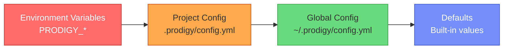

## Configuration Precedence Rules

Prodigy loads configuration from multiple sources with a clear precedence hierarchy. Understanding how configuration is merged helps you control which settings take effect.

### Precedence Hierarchy

From highest to lowest priority:



1. **Environment Variables** (`PRODIGY_*`) - Highest priority
   - Override all file-based configuration
   - Useful for CI/CD and containerized environments
   - Both legacy (`PRODIGY_CLAUDE_API_KEY`) and structured (`PRODIGY__LOG_LEVEL`) formats supported

2. **Project Config** (`.prodigy/config.yml`) - High priority
   - Project-specific settings in your repository
   - Located at `.prodigy/config.yml` in your project directory
   - Overrides global config and defaults
   - Committed to version control (be careful with secrets)

3. **Global Config** (`~/.prodigy/config.yml`) - Medium priority
   - User-level defaults across all projects
   - Located in your home directory
   - Overrides built-in defaults

4. **Defaults** - Lowest priority
   - Built-in default values defined in code
   - Used when no other source provides a value

!!! tip "ProdigyConfig vs Legacy Config"
    Prodigy supports two configuration systems:

    - **`ProdigyConfig`** (recommended): Modern system with Stillwater validation, error accumulation, and full 4-level precedence
    - **Legacy `Config`/`GlobalConfig`**: Original system with project config and defaults only

    New code should use `load_prodigy_config()` from `prodigy::config`.

### How Settings Are Loaded

When Prodigy starts, it builds the final configuration using layered source loading:

=== "ProdigyConfig (Recommended)"

    ```rust
    // Source: src/config/builder.rs:68-70
    use prodigy::config::load_prodigy_config;

    let config = load_prodigy_config().expect("config errors");
    println!("Max concurrent specs: {}", config.max_concurrent_specs);
    ```

    **Loading Process:**

    1. **Initialize with defaults** - Create `ProdigyConfig::default()`
    2. **Load global config** - Read `~/.prodigy/config.yml` (optional)
    3. **Load project config** - Read `.prodigy/config.yml` (optional)
    4. **Apply environment variables** - Override with `PRODIGY_*` vars
    5. **Validate** - Accumulate and report all validation errors

=== "Legacy Config"

    ```rust
    // Source: src/config/mod.rs:174-181
    let config = Config::new();  // Creates Config with GlobalConfig defaults
    ```

    **Loading Process:**

    1. **Initialize with defaults** - Create `GlobalConfig::default()` (lines 108-120)
    2. **Load project config** - Read `.prodigy/config.yml` from project directory
    3. **Merge at field level** - Project config values override defaults per-field

### Examples

#### Example 1: Using Defaults

```yaml
# No configuration files exist
```

**Result with ProdigyConfig** (recommended):

- `log_level: "info"`
- `auto_commit: true`
- `max_concurrent_specs: 4`

**Result with Legacy Config:**

- `log_level: "info"`
- `auto_commit: true`
- `max_concurrent_specs: 1`

!!! warning "Default Value Difference"
    The default for `max_concurrent_specs` differs between configuration systems:

    - **ProdigyConfig**: `4` (optimized for parallel workflows)
    - **Legacy GlobalConfig**: `1` (conservative default)

#### Example 2: Project Config Override

```yaml
# .prodigy/config.yml (project config)
project:
  name: my-project
  claude_api_key: "sk-project-key"
  auto_commit: false
```

**Result:**

- `claude_api_key: "sk-project-key"` (from project config)
- `auto_commit: false` (from project config)
- `log_level: "info"` (from defaults - not specified in project)
- `max_concurrent_specs: 4` (from defaults - not specified in project)

#### Example 3: Environment Variable Override

```bash
# Environment variables take highest precedence
export PRODIGY_CLAUDE_API_KEY="sk-env-key"
export PRODIGY_LOG_LEVEL="debug"
```

```yaml
# .prodigy/config.yml
log_level: info
```

**Result:**

- `claude_api_key: "sk-env-key"` (from environment - highest priority)
- `log_level: "debug"` (from environment - overrides project config)

#### Example 4: Full Layered Configuration

```yaml
# ~/.prodigy/config.yml (global config)
log_level: warn
max_concurrent_specs: 8
auto_commit: true
```

```yaml
# .prodigy/config.yml (project config)
log_level: info
```

```bash
# Environment
export PRODIGY__LOG_LEVEL="debug"
```

**Result:**

- `log_level: "debug"` (from environment - highest priority)
- `max_concurrent_specs: 8` (from global - project didn't override)
- `auto_commit: true` (from global)

### Field-Level Precedence

Precedence is applied **per field**, not per file. Each configuration field is resolved independently using the precedence rules.

```rust
// Source: src/config/prodigy_config.rs:222-227
pub fn effective_api_key(&self) -> Option<&str> {
    self.project
        .as_ref()
        .and_then(|p| p.claude_api_key.as_deref())
        .or(self.claude_api_key.as_deref())
}
```

**Precedence Logic:**

1. Check if environment variable is set → use it
2. Check if project config has the field → use it
3. Check if global config has the field → use it
4. Otherwise, use the default value

This allows fine-grained configuration: override only what you need, inherit the rest.

### Environment Variable Formats

Prodigy supports two environment variable formats:

=== "Structured Format (Recommended)"

    Use double underscore (`__`) as separator:

    | Environment Variable | Config Field |
    |---------------------|--------------|
    | `PRODIGY__LOG_LEVEL` | `log_level` |
    | `PRODIGY__MAX_CONCURRENT_SPECS` | `max_concurrent_specs` |
    | `PRODIGY__AUTO_COMMIT` | `auto_commit` |
    | `PRODIGY__STORAGE__BACKEND` | `storage.backend` |
    | `PRODIGY__PROJECT__NAME` | `project.name` |

=== "Legacy Format"

    Use single underscore with explicit mappings:

    | Environment Variable | Config Field |
    |---------------------|--------------|
    | `PRODIGY_CLAUDE_API_KEY` | `claude_api_key` |
    | `PRODIGY_LOG_LEVEL` | `log_level` |
    | `PRODIGY_AUTO_COMMIT` | `auto_commit` |
    | `PRODIGY_EDITOR` | `default_editor` |
    | `PRODIGY_MAX_CONCURRENT` | `max_concurrent_specs` |

### Default Values

=== "ProdigyConfig (Recommended)"

    ```rust
    // Source: src/config/prodigy_config.rs:171-185
    impl Default for ProdigyConfig {
        fn default() -> Self {
            Self {
                log_level: "info".to_string(),
                claude_api_key: None,
                max_concurrent_specs: 4,  // Optimized for parallel workflows
                auto_commit: true,
                default_editor: None,
                prodigy_home: None,
                project: None,
                storage: StorageSettings::default(),
                plugins: PluginConfig::default(),
            }
        }
    }
    ```

=== "Legacy GlobalConfig"

    ```rust
    // Source: src/config/mod.rs:108-120
    impl Default for GlobalConfig {
        fn default() -> Self {
            Self {
                prodigy_home: get_global_prodigy_dir()
                    .unwrap_or_else(|_| PathBuf::from("~/.prodigy")),
                default_editor: None,
                log_level: Some("info".to_string()),
                claude_api_key: None,
                max_concurrent_specs: Some(1),  // Conservative default
                auto_commit: Some(true),
                plugins: None,
            }
        }
    }
    ```

### Configuration Loading with Validation

ProdigyConfig uses Stillwater's `Validation` for comprehensive error accumulation:

```rust
// Source: src/config/prodigy_config.rs:284-357
use prodigy::config::load_prodigy_config;

match load_prodigy_config() {
    Ok(config) => {
        // All validation passed
        println!("Loaded config: {:?}", config);
    }
    Err(errors) => {
        // ALL validation errors reported at once
        for error in errors.iter() {
            eprintln!("Config error: {}", error);
        }
    }
}
```

!!! note "Error Accumulation"
    Unlike traditional fail-fast validation, ProdigyConfig collects ALL validation errors
    before reporting. This allows users to fix multiple issues in a single iteration.

### Configuration Tracing

For debugging configuration issues, use traced loading to see where each value originated:

```rust
// Source: src/config/builder.rs:170-172
use prodigy::config::load_prodigy_config_traced;

let traced = load_prodigy_config_traced().expect("failed to load");

// See where a value came from
if let Some(trace) = traced.trace("max_concurrent_specs") {
    println!("Value: {:?}", trace.final_value.value);
    println!("Source: {:?}", trace.final_value.source);
    println!("Was overridden: {}", trace.was_overridden());
}

// Get the actual config
let config = traced.into_inner();
```

### Test Coverage

Configuration precedence behavior is validated through comprehensive tests:

**ProdigyConfig Tests** (recommended system):

```rust
// Source: src/config/builder.rs:441-469
#[test]
fn test_layered_precedence() {
    let env = MockEnv::new()
        .with_file(global_path, "log_level: debug\nmax_concurrent_specs: 8")
        .with_file(project_path, "log_level: warn")
        .with_env("PRODIGY__LOG_LEVEL", "error");

    let config = load_prodigy_config_with(&env).unwrap();

    // env > project > global > defaults
    assert_eq!(config.log_level, "error");           // from env
    assert_eq!(config.max_concurrent_specs, 8);      // from global
}
```

**Legacy Config Tests:**

```rust
// Source: src/config/mod.rs:476-497
#[test]
fn test_get_claude_api_key_precedence() {
    let mut config = Config::new();

    config.global.claude_api_key = Some("global-key".to_string());
    assert_eq!(config.get_claude_api_key(), Some("global-key"));

    // Project API key takes precedence
    config.project = Some(ProjectConfig {
        claude_api_key: Some("project-key".to_string()),
        // ...
    });
    assert_eq!(config.get_claude_api_key(), Some("project-key"));
}
```
