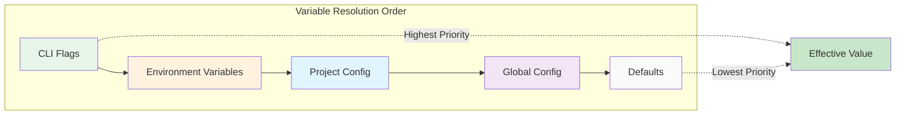

## Environment Variables

Prodigy supports two types of environment variables:

1. **System Environment Variables**: Standard Unix environment variables that control Prodigy's behavior globally
2. **Workflow Environment Variables**: Variables defined in workflow YAML files that are available during workflow execution

This page documents both types. For details on how environment variables interact with other configuration sources, see [Configuration Precedence Rules](configuration-precedence-rules.md).

??? abstract "Quick Reference: System Environment Variables"
    | Variable | Purpose | Default |
    |----------|---------|---------|
    | `PRODIGY_CLAUDE_API_KEY` | Claude API key | None |
    | `PRODIGY_LOG_LEVEL` | Logging verbosity | `info` |
    | `PRODIGY_HOME` | Base storage directory | `~/.prodigy` |
    | `PRODIGY_AUTO_COMMIT` | Auto-commit behavior | `true` |
    | `PRODIGY_EDITOR` | Default editor | None |
    | `PRODIGY_AUTO_CLEANUP` | Auto worktree cleanup | `false` |
    | `PRODIGY_RETENTION_DAYS` | Worktree retention | `7` |
    | `PRODIGY_AUTO_MERGE` | Auto-merge agents | Not set |
    | `PRODIGY_AUTO_CONFIRM` | Skip confirmations | Not set |
    | `PRODIGY_AUTOMATION` | Automated mode flag | Not set |
    | `PRODIGY_VALIDATION` | Validation mode flag | Not set |

---

## Workflow Environment Variables

Workflows can define custom environment variables using the `env:` block. These variables are available to all commands within the workflow and support advanced features like secrets, profiles, and interpolation.

### Basic Syntax

```yaml
name: my-workflow

env:
  # Plain variables
  PROJECT_NAME: "prodigy"
  VERSION: "1.0.0"
  BUILD_DIR: "target/release"

commands:
  - shell: "echo Building $PROJECT_NAME version $VERSION"
  - shell: "cargo build --release --target-dir $BUILD_DIR"
```

### Variable Interpolation

Workflow environment variables can be referenced using two syntaxes:

- **`$VAR`** - Simple variable reference (shell-style)
- **`${VAR}`** - Bracketed reference (recommended for clarity and complex expressions)

```yaml
env:
  API_URL: "https://api.example.com"
  API_VERSION: "v2"
  ENDPOINT: "${API_URL}/${API_VERSION}"

commands:
  - shell: "curl ${ENDPOINT}/status"
  - claude: "/deploy --url $API_URL --version $API_VERSION"
```

### Secrets and Sensitive Data

Mark sensitive values as secrets to automatically mask them in logs and output:

```yaml
env:
  # Public configuration
  DATABASE_HOST: "db.example.com"

  # Secret configuration (masked in logs)
  DATABASE_PASSWORD:
    secret: true
    value: "super-secret-password"

  API_KEY:
    secret: true
    value: "sk-abc123..."

commands:
  - shell: "psql -h $DATABASE_HOST -p $DATABASE_PASSWORD"
  # Output: psql -h db.example.com -p ***
```

**Security Best Practices**:
- Always mark API keys, passwords, and tokens as secrets
- Never commit secret values to version control
- Use environment variable references for secrets: `value: "${PROD_API_KEY}"`
- Rotate secrets regularly

### Profiles for Multiple Environments

Profiles allow different values for different environments (dev, staging, prod):

```yaml
env:
  # API endpoints vary by environment
  API_URL:
    default: "http://localhost:3000"
    staging: "https://staging.api.com"
    prod: "https://api.com"

  # Credentials vary by environment
  API_KEY:
    secret: true
    default: "dev-key-123"
    staging:
      secret: true
      value: "${STAGING_API_KEY}"  # From system env
    prod:
      secret: true
      value: "${PROD_API_KEY}"

# Activate the profile in the workflow
active_profile: staging

commands:
  - shell: "curl -H 'Authorization: Bearer ${API_KEY}' ${API_URL}/health"
```

**Activate a profile**:

Set the `active_profile` field in your workflow YAML:

```yaml
# workflow.yml
name: my-workflow
active_profile: prod  # Use prod profile values

env:
  API_URL:
    default: "http://localhost:3000"
    prod: "https://api.com"
```

!!! note "Profile Activation"
    Profiles are currently activated via the `active_profile` field in the workflow YAML configuration. CLI flag (`--profile`) and environment variable (`PRODIGY_PROFILE`) support is planned for a future release.

### Step-Level Environment Overrides

Individual commands can override workflow environment variables:

```yaml
env:
  NODE_ENV: "development"
  LOG_LEVEL: "info"

commands:
  # Uses workflow-level NODE_ENV
  - shell: "npm test"

  # Override for this command only
  - shell: "npm run build"
    env:
      NODE_ENV: "production"
      LOG_LEVEL: "warn"

  # Back to workflow-level NODE_ENV
  - shell: "npm start"
```

**Precedence**: Step env > Profile env > Workflow env > System env

### MapReduce Environment Variables

Environment variables work across all MapReduce phases (setup, map, reduce, merge):

```yaml
name: parallel-processing
mode: mapreduce

env:
  TIMEOUT: "300"
  OUTPUT_DIR: "/tmp/results"

setup:
  - shell: "mkdir -p $OUTPUT_DIR"
  - shell: "generate-work-items.sh > items.json"

map:
  input: "items.json"
  json_path: "$[*]"
  max_parallel: 10  # Use integer values directly for config fields

  agent_template:
    - claude: "/process ${item.file} --timeout $TIMEOUT"
    - shell: "cp result.json ${OUTPUT_DIR}/${item.name}.json"

reduce:
  - shell: "echo Processed ${map.total} items to $OUTPUT_DIR"
```

!!! warning "Variable Interpolation Scope"
    Environment variable interpolation (`${VAR}` or `$VAR`) works in **command strings** (shell, claude commands) but not in **YAML configuration fields** like `max_parallel`, `timeout`, or `agent_timeout_secs`. Use integer values directly for these fields.

**Environment Variables in Commands**:
- Available in shell command strings
- Available in claude command arguments
- Reference with `$VAR` or `${VAR}` syntax

### Environment Files (`.env`)

Load variables from dotenv-format files. Variables from `.env` files are loaded in order, with later files overriding earlier ones:

```yaml
# Source: src/cook/environment/config.rs:21-23
env:
  env_files:
    - ".env"           # Base environment
    - ".env.local"     # Local overrides (gitignored)
    - ".env.${active_profile}"  # Profile-specific

# .env file format:
# PROJECT_NAME=prodigy
# VERSION=1.0.0
# API_KEY=sk-abc123
```

!!! tip "Env File Loading"
    - Files are loaded in order; later files override earlier ones
    - Missing files are silently skipped (no error)
    - Standard dotenv format: `KEY=value`, comments with `#`
    - Quoted values (single or double) are unquoted automatically

### Complete Workflow Example

```yaml
name: deployment-workflow

env:
  # Project configuration
  PROJECT_NAME: "my-app"  # (1)!
  VERSION: "2.1.0"

  # Environment-specific settings
  DEPLOY_TARGET:  # (2)!
    default: "dev-server"
    staging: "staging-cluster"
    prod: "prod-cluster"

  # Secrets (masked in logs)
  DEPLOY_TOKEN:  # (3)!
    secret: true
    default: "${DEV_TOKEN}"
    prod:
      secret: true
      value: "${PROD_TOKEN}"  # (4)!

commands:
  - shell: "echo Deploying $PROJECT_NAME v$VERSION to $DEPLOY_TARGET"
  - shell: "docker build -t ${PROJECT_NAME}:${VERSION} ."
  - shell: "deploy --target $DEPLOY_TARGET --token $DEPLOY_TOKEN"
  # Output: deploy --target prod-cluster --token ***
```

1. Plain variables are available in all commands via `$VAR` or `${VAR}` syntax
2. Profile-aware variables select value based on `active_profile` setting
3. Secret values are automatically masked as `***` in logs and error messages
4. Reference system environment variables for production secrets

Run with:

```bash
# Development deployment (uses default profile)
prodigy run deploy.yml

# Production deployment (set active_profile in workflow YAML)
export PROD_TOKEN="secret-prod-token"
prodigy run deploy-prod.yml  # workflow with active_profile: prod
```

### Dynamic and Conditional Values

Environment values can be computed dynamically or conditionally:

=== "Dynamic (Command-Based)"

    ```yaml
    # Source: src/cook/environment/config.rs:62-70
    env:
      GIT_COMMIT:
        command: "git rev-parse --short HEAD"
        cache: true  # Cache the result for the workflow duration

      CURRENT_TIME:
        command: "date +%Y%m%d_%H%M%S"
        cache: false  # Re-evaluate each time
    ```

=== "Conditional (Expression-Based)"

    ```yaml
    # Source: src/cook/environment/config.rs:72-81
    env:
      LOG_LEVEL:
        condition: "${CI:-false}"
        when_true: "warn"
        when_false: "debug"

      DEPLOY_HOST:
        condition: "${PRODUCTION:-false}"
        when_true: "prod.example.com"
        when_false: "dev.example.com"
    ```

---

## System Environment Variables

System environment variables control Prodigy's global behavior and configuration.

### Environment Variable Naming

Prodigy supports two patterns for environment variable naming:

=== "Legacy Single Underscore"

    Explicit mappings for common settings:

    | Environment Variable | Config Field |
    |---------------------|--------------|
    | `PRODIGY_CLAUDE_API_KEY` | `claude_api_key` |
    | `PRODIGY_LOG_LEVEL` | `log_level` |
    | `PRODIGY_AUTO_COMMIT` | `auto_commit` |
    | `PRODIGY_EDITOR` | `default_editor` |
    | `PRODIGY_MAX_CONCURRENT` | `max_concurrent_specs` |

=== "Double Underscore Path Mapping"

    Use `PRODIGY__` prefix with double underscores for nested config fields:

    ```bash
    # Source: src/config/builder.rs:90-92
    # Pattern: PRODIGY__SECTION__FIELD -> section.field

    export PRODIGY__PROJECT__NAME="my-project"      # -> project.name
    export PRODIGY__STORAGE__BACKEND="file"         # -> storage.backend
    export PRODIGY__STORAGE__COMPRESSION_LEVEL="5"  # -> storage.compression_level
    ```

!!! tip "Choosing a Pattern"
    - Use **single underscore** (`PRODIGY_LOG_LEVEL`) for well-known settings
    - Use **double underscore** (`PRODIGY__STORAGE__BACKEND`) for nested or custom config fields

### Claude API Configuration

#### `PRODIGY_CLAUDE_API_KEY`

**Purpose**: Claude API key for AI-powered commands
**Default**: None
**Overrides**: Global and project `claude_api_key` settings

```bash
export PRODIGY_CLAUDE_API_KEY="sk-ant-api03-..."
```

This is the **recommended** way to provide API keys (more secure than storing in config files).

#### `PRODIGY_CLAUDE_STREAMING`

**Purpose**: Control Claude JSON streaming output
**Default**: `true` (streaming enabled by default)
**Valid values**: `true`, `false`

```bash
export PRODIGY_CLAUDE_STREAMING=false  # Disable streaming
```

When `false`, uses legacy print mode instead of JSON streaming.

### General Configuration

#### `PRODIGY_LOG_LEVEL`

**Purpose**: Logging verbosity
**Default**: `info`
**Valid values**: `trace`, `debug`, `info`, `warn`, `error`
**Overrides**: Global and project `log_level` settings

```bash
export PRODIGY_LOG_LEVEL=debug
```

#### `PRODIGY_EDITOR`

**Purpose**: Default text editor for interactive operations
**Default**: None
**Overrides**: Global `default_editor` setting
**Fallback**: `EDITOR` environment variable

```bash
export PRODIGY_EDITOR=vim
```

If neither `PRODIGY_EDITOR` nor `EDITOR` is set, Prodigy uses system defaults.

#### `EDITOR`

**Purpose**: Standard Unix editor variable (fallback)
**Default**: None
**Fallback for**: `PRODIGY_EDITOR`

```bash
export EDITOR=nano
```

**Precedence**: `PRODIGY_EDITOR` takes precedence over `EDITOR` if both are set.

#### `PRODIGY_AUTO_COMMIT`

**Purpose**: Automatic commit after successful commands
**Default**: `true`
**Valid values**: `true`, `false`
**Overrides**: Global and project `auto_commit` settings

```bash
export PRODIGY_AUTO_COMMIT=false
```

### Storage Configuration

#### `PRODIGY_STORAGE_TYPE`

**Purpose**: Storage backend type
**Default**: `file`
**Valid values**: `file`, `memory`
**Overrides**: Storage `backend` setting

```bash
export PRODIGY_STORAGE_TYPE=file
```

#### `PRODIGY_STORAGE_BASE_PATH`

**Purpose**: Base directory for file storage
**Default**: `~/.prodigy`
**Overrides**: Storage `backend_config.base_dir` setting

```bash
export PRODIGY_STORAGE_BASE_PATH=/custom/storage/path
```

**Alternative names** (deprecated, use `PRODIGY_STORAGE_BASE_PATH`):
- `PRODIGY_STORAGE_DIR`
- `PRODIGY_STORAGE_PATH`

#### `PRODIGY_HOME`

**Purpose**: Override base directory for all Prodigy storage
**Default**: `~/.prodigy`
**Overrides**: All storage paths

```bash
# Source: src/storage/mod.rs:63-78
export PRODIGY_HOME=/custom/prodigy/home
```

This is the primary way to redirect all Prodigy storage (sessions, worktrees, DLQ, events) to a custom location. Useful for testing or running multiple isolated Prodigy instances.

### Worktree Management

#### `PRODIGY_AUTO_CLEANUP`

**Purpose**: Enable automatic worktree cleanup after workflow completion
**Default**: `false`
**Valid values**: `true`, `false`

```bash
# Source: src/worktree/manager_queries.rs:278-280
export PRODIGY_AUTO_CLEANUP=true
```

#### `PRODIGY_CONFIRM_CLEANUP`

**Purpose**: Require confirmation before cleaning up worktrees
**Default**: `true`
**Valid values**: `true`, `false`

```bash
# Source: src/worktree/manager_queries.rs:281-283
export PRODIGY_CONFIRM_CLEANUP=false  # Skip confirmation prompts
```

#### `PRODIGY_RETENTION_DAYS`

**Purpose**: Number of days to retain completed worktrees before cleanup
**Default**: `7`
**Valid values**: Any positive integer

```bash
# Source: src/worktree/manager_queries.rs:284-287
export PRODIGY_RETENTION_DAYS=14
```

#### `PRODIGY_DRY_RUN`

**Purpose**: Preview worktree operations without executing them
**Default**: `false`
**Valid values**: `true`, `false`

```bash
# Source: src/worktree/manager_queries.rs:288-290
export PRODIGY_DRY_RUN=true  # Show what would be done without doing it
```

### Workflow Execution

#### `PRODIGY_AUTOMATION`

**Purpose**: Signal automated execution mode
**Default**: Not set
**Set by**: Prodigy when executing workflows

```bash
export PRODIGY_AUTOMATION=true
```

This variable is **set automatically** by Prodigy during workflow execution. It signals to Claude and other tools that execution is automated (not interactive).

#### `PRODIGY_CLAUDE_CONSOLE_OUTPUT`

**Purpose**: Force Claude streaming output regardless of verbosity
**Default**: Not set
**Valid values**: `true`, `false`

```bash
export PRODIGY_CLAUDE_CONSOLE_OUTPUT=true
```

When set to `true`, forces JSON streaming output even when verbosity is 0. Useful for debugging specific runs without changing command flags.

#### `PRODIGY_VALIDATION`

**Purpose**: Signal validation execution mode
**Default**: Not set
**Set by**: Prodigy during validation workflows

```bash
# Source: src/cook/workflow/executor/validation.rs:752
export PRODIGY_VALIDATION=true
```

This variable is **set automatically** by Prodigy when running validation commands. Used to detect automated validation context.

#### `PRODIGY_AUTO_MERGE`

**Purpose**: Control automatic merge behavior after agent completion
**Default**: Not set
**Valid values**: `true`, `false`

```bash
# Source: src/cook/orchestrator/execution_pipeline.rs:973
export PRODIGY_AUTO_MERGE=true  # Automatically merge successful agents
```

#### `PRODIGY_AUTO_CONFIRM`

**Purpose**: Skip confirmation prompts in automated contexts
**Default**: Not set
**Valid values**: `true`, `false`

```bash
# Source: src/cook/orchestrator/execution_pipeline.rs:977
export PRODIGY_AUTO_CONFIRM=true  # Skip all confirmation prompts
```

!!! warning "Use with Caution"
    `PRODIGY_AUTO_CONFIRM=true` bypasses safety prompts. Only use in fully automated CI/CD pipelines where you trust all operations.

#### `PRODIGY_TEST_MODE`

**Purpose**: Internal testing mode flag
**Default**: Not set
**Valid values**: `true`, `false`

```bash
# Source: src/cook/orchestrator/session_ops.rs:114
export PRODIGY_TEST_MODE=true
```

!!! note "Internal Use"
    This variable is primarily for internal testing. It modifies certain behaviors to facilitate automated tests.

### Complete Example

Set up a complete Prodigy environment:

```bash
# API key (recommended method)
export PRODIGY_CLAUDE_API_KEY="sk-ant-api03-..."

# Logging
export PRODIGY_LOG_LEVEL=info

# Editor
export PRODIGY_EDITOR=code

# Behavior
export PRODIGY_AUTO_COMMIT=true

# Storage
export PRODIGY_STORAGE_TYPE=file
export PRODIGY_STORAGE_BASE_PATH=/Users/username/.prodigy

# Development/debugging
export PRODIGY_CLAUDE_STREAMING=true
export PRODIGY_CLAUDE_CONSOLE_OUTPUT=false
```

### Environment Files

You can use `.env` files (not committed to version control) to manage environment variables:

```bash
# .env (add to .gitignore)
PRODIGY_CLAUDE_API_KEY=sk-ant-api03-...
PRODIGY_LOG_LEVEL=debug
PRODIGY_AUTO_COMMIT=false
```

Load with:

```bash
# Using direnv
eval "$(cat .env)"

# Using dotenv tool
dotenv run prodigy run workflow.yml

# Manually
export $(cat .env | xargs)
```

### Security Best Practices

!!! danger "Secret Handling"
    API keys and tokens exposed in version control are immediately compromised. Automated scanners continuously search public repositories for secrets.

1. **Never commit API keys** to version control
2. **Use environment variables** for secrets (not config files)
3. **Use `.env` files** (gitignored) for local development
4. **Use secret managers** (AWS Secrets Manager, Vault) in production
5. **Rotate keys regularly** and use project-specific keys when possible

**Example `.gitignore`**:

```
.env
.env.*
!.env.example
.prodigy/config.local.yml
```

### Precedence Summary

For any given setting, the effective value comes from (highest to lowest):

1. **CLI flags** (if applicable)
2. **Environment variables** ← This level
3. **Project config** (`.prodigy/config.yml`)
4. **Global config** (`~/.prodigy/config.yml`)
5. **Defaults** (built-in values)



**Figure**: Configuration sources are checked in order from left to right. The first source with a value wins.

Example:

```yaml
# ~/.prodigy/config.yml
log_level: info
```

```yaml
# .prodigy/config.yml
log_level: warn
```

```bash
export PRODIGY_LOG_LEVEL=debug  # This wins
```

**Result**: `log_level: debug`

### Checking Environment Variables

To see which environment variables are active:

```bash
# List all PRODIGY_* variables
env | grep PRODIGY_

# Check effective configuration (merges all sources)
prodigy config show
```
